# Module 1 — GenAI Foundations · Study Notes

**Programme:** Advanced Certification in Agentic and Generative AI
**Institution:** IISc Bengaluru / TalentSprint · Batch `IISC-AC-GENAI-02`
**Instructor:** Prof. Sashikumaar Ganesan
**Module duration:** 6 hours (Weeks 1–2) · **Assignment 1 due:** Sun 1 Mar 2026, 11:00 PM

---

## Table of Contents

1. [How Module 1 fits the programme](#0-how-module-1-fits-the-programme)
2. [🗺️ Visual atlas — mind map & correlation diagrams](#-visual-atlas--mind-map--correlation-diagrams)
3. [Lecture 1.1 — What is Generative AI?](#lecture-11--what-is-generative-ai)
3. [Lecture 1.2.1 — What is a Language Model?](#lecture-121--what-is-a-language-model)
4. [Lecture 1.2.2 — Probability and Token Prediction](#lecture-122--probability-and-token-prediction)
5. [Lecture 1.2.3 — Autoregressive Generation](#lecture-123--autoregressive-generation)
6. [Lecture 1.2.4 — Model Sizing and Scaling Laws](#lecture-124--model-sizing-and-scaling-laws)
7. [Lecture 1.2.5 — Foundation Models Overview](#lecture-125--foundation-models-overview)
8. [Lab — Foundation Model Comparison (GPT / Llama / TinyLlama)](#lab--foundation-model-comparison)
9. [Lecture 1.3 — The Progressive Skill Stack](#lecture-13--the-progressive-skill-stack)
10. [Practical — Four Ways to Access LLMs](#practical--four-ways-to-access-llms)
11. [Assignment 1 — API-based LLM Access](#assignment-1--api-based-llm-access)
12. [Master list of misconceptions](#master-list-of-misconceptions)
13. [Glossary](#glossary)
14. [References and further study](#references-and-further-study)
15. [Self-check question bank](#self-check-question-bank)

---

## 0. How Module 1 fits the programme

The programme runs **27 weeks / 105 hours** across 10 modules, in five phases:

| Phase | Weeks | Focus |
|---|---|---|
| 1 — Understanding | 1–4 | GenAI foundations, prompt engineering |
| 2 — Architecture | 5–6 | Transformer internals, LLM APIs |
| 3 — Retrieval & Agents | 7–12 | RAG, agentic systems, scientific ML |
| 4 — Model Building | 13–16 | Fine-tuning, pre-training |
| 5 — Production | 17–27 | LLMOps, deployment, capstone |

**Module 1 is the root node.** It assumes nothing and unlocks everything. Its job is to replace vague intuitions about "AI that writes things" with a precise, computational model of what an LLM does — because you cannot debug, tune, or deploy a system you can only describe in marketing language.

### Files in this folder → what they are

| File | Concept ID | Content |
|---|---|---|
| `AI-genai_lecture_intro.pdf` | — | Course overview, all 10 modules |
| `01-genai-reference.pdf` | — | Recommended reading list |
| `AI-GN-FN-TH-000001.pdf` | `AIGNFNTH000001` | **1.1** What is Generative AI? |
| `AI-LM-FN-TH-000001.pdf` | `AILMFNTH000001` | **1.2.1** What is a Language Model? |
| `AI-LM-FN-TH-000002.pdf` | `AILMFNTH000002` | **1.2.2** Probability & Token Prediction |
| `AI-LM-FN-TH-000003.pdf` | `AILMFNTH000003` | **1.2.3** Autoregressive Generation |
| `AI-LM-FN-TH-000004.pdf` | `AILMFNTH000004` | **1.2.4** Model Sizing & Scaling Laws |
| `AI-LM-FN-TH-000005.pdf` | `AILMFNTH000005` | **1.2.5** Foundation Models Overview |
| `AI-LM-FN-TH-000006.pdf` | — | ⚠️ Byte-identical duplicate of `000005` |
| `AI-LM-FN-TH-000007.pdf` | `AIGNFNTH000007` | **1.3** Progressive Skill Stack |
| `AI-LM-FN-AI-000001.pdf` | `AILMFNAI000001` | **Lab** Foundation Model Comparison |
| `Step-by-Step_Guide...pdf` | — | Hands-on: 4 ways to access LLMs |
| `M1_AST_01_...ipynb` | — | **Graded assignment** (5 points) |
| `_Ungraded_ In-session Activity.pdf` | — | Industry problem research (no submission) |

### The dependency chain

```
1.1 What is GenAI?
      │
      ▼
1.2.1 What is a Language Model?     ← probability over token sequences
      │
      ▼
1.2.2 Probability & Token Prediction ← logits, softmax, temperature
      │
      ▼
1.2.3 Autoregressive Generation      ← run 1.2.2 in a loop
      │
      ▼
1.2.4 Model Sizing & Scaling Laws    ← what happens when you make it big
      │
      ▼
1.2.5 Foundation Models Overview     ← the resulting landscape
      │
      ▼
Lab: GPT vs Llama vs TinyLlama       ← choosing between them
      │
      ▼
1.3 Progressive Skill Stack          ← where you are, where you're going
```

Each arrow is a genuine dependency, not a syllabus convenience. You cannot understand temperature (1.2.2) without knowing the model outputs a distribution (1.2.1).

---

# 🗺️ Visual atlas — mind map & correlation diagrams

> **Rendering note:** these are Mermaid diagrams. They render automatically in **GitHub**, **VS Code** (with the Markdown Preview Mermaid extension), **Obsidian**, and **Notion**. In a plain text editor you'll see the source.

## A. Module 1 mind map — everything at a glance

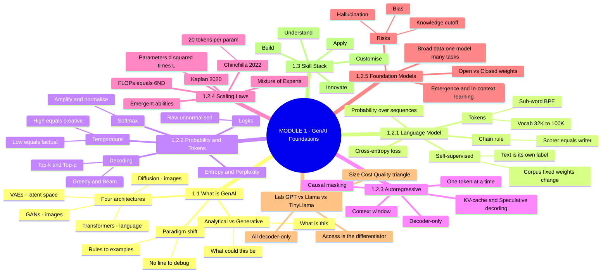

## B. Concept dependency graph — what unlocks what

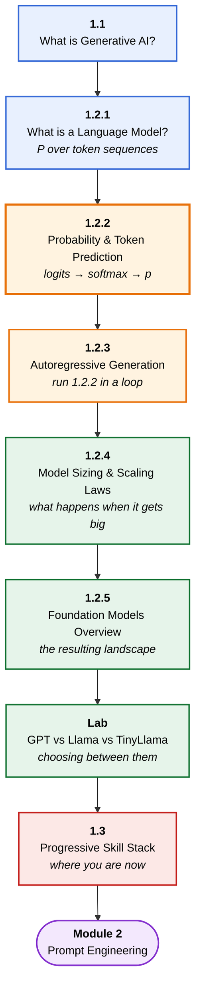

## C. The decision test — analytical or generative?

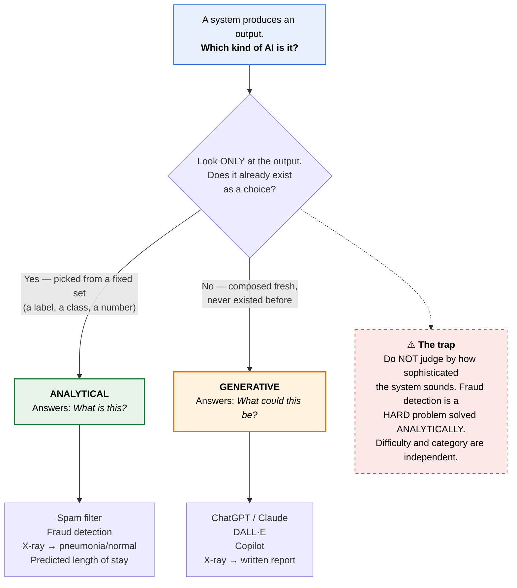

## D. ⭐ The master pipeline — how 1.2.1, 1.2.2 and 1.2.3 are one machine

> **This is the single most important diagram in Module 1.** Three separate lectures describe three slices of *one* process. Trace a token through it once and the whole module locks together.

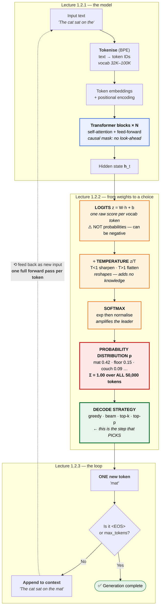

**Three things to read off this diagram:**

| Observation | Why it matters |
|---|---|
| The **model** stops at `p` — it never picks | Picking is *your* configuration (temperature, top-p), not the model's opinion |
| **Temperature acts before softmax**, on logits | This is why it reshapes rather than adds — a common exam point |
| One arrow back = **one forward pass per token** | The whole cost model of LLMs, and why the sequential bottleneck exists |

## E. Where the chain rule sits

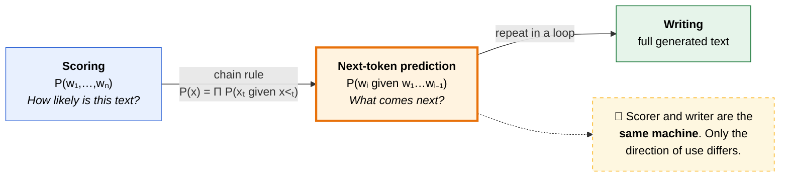

## F. Tokenisation trade-off

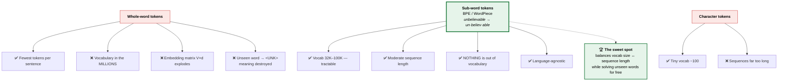

⚠️ **The inversion people make:** whole words give *fewer* tokens per sentence but *explode the vocabulary*. Don't swap those.

## G. Scaling laws — Kaplan vs Chinchilla

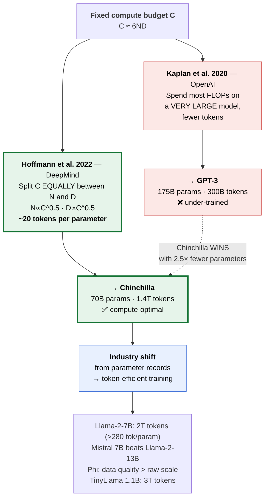

> **Rule of thumb to carry forward:** prefer a **smaller model trained on more data** over a large model trained on fewer tokens.

## H. Model selection decision tree

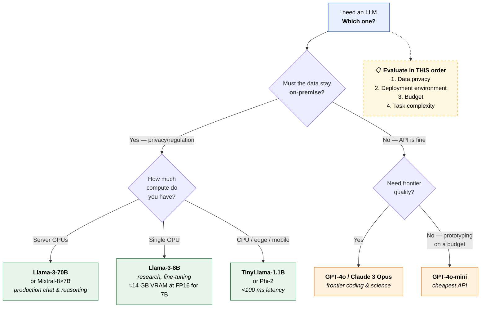

## I. The Progressive Skill Stack → modules → job titles

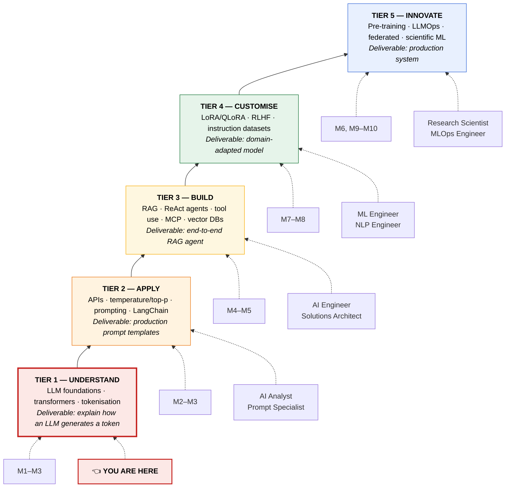

> **The dependency logic:** Tier 2 needs Tier 1 (you can't tune temperature without knowing how tokens are sampled) · Tier 3 needs Tier 2 (RAG calls APIs inside retrieval loops) · Tier 4 needs Tier 3 · Tier 5 needs Tier 4.
> **No single tier is sufficient for production. The stack is the product.**

## J. ⭐ Master correlation — every M1 concept is a seed for a later module

> The payoff diagram. Nothing in Module 1 is standalone trivia; each idea is the root of an entire later module.

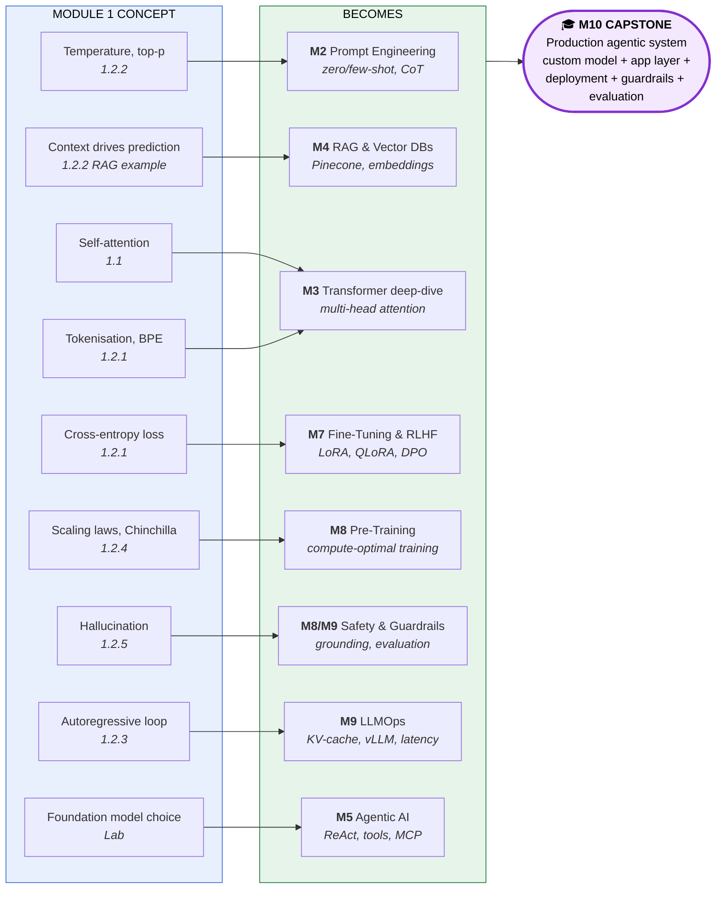

## K. Four ways to access an LLM

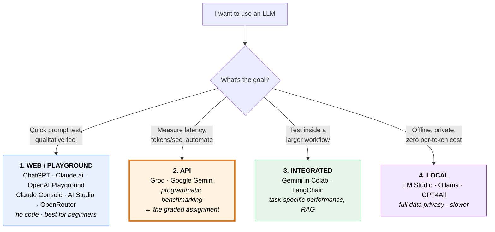

---

## Lecture 1.1 — What is Generative AI?

> **Concept ID:** `AIGNFNTH000001` · Bloom **B2 (Understand)** · Difficulty **L2** · Prereqs: **none**

### 1.1.1 Definition

> **Generative AI** = AI systems that **create new content** — text, images, audio, video, code — by learning patterns and structures from existing data.

The operative word is **generative**. These systems do not retrieve and do not search. They **produce content that did not previously exist**, guided by patterns learned during training.

### 1.1.2 The core distinction

| | **Traditional AI (Analytical)** | **Generative AI (Creative)** |
|---|---|---|
| **Function** | Classifies into categories | Creates new text, images, code |
| | Predicts numerical values | Generates realistic content |
| | Detects anomalies / patterns | Transforms across formats |
| **The question it answers** | **"What is this?"** | **"What could this be?"** |
| **Examples** | Spam filter, fraud detection | ChatGPT, DALL·E, Copilot |

#### 🔑 The test to apply

> **Does the output already exist as a choice, or is it being composed fresh?**
> **Picking from a set → analytical. Producing something new → generative.**

**Common trap:** judging by sophistication instead of output type. Fraud detection *feels* like the impressive one and drafting an email *feels* mundane — but fraud detection outputs a **label** (`fraud`/`not fraud`) chosen from a fixed set, so it is analytical. Difficulty and category are **independent axes**. A very hard problem can be solved analytically; a trivial problem can be solved generatively.

**Worked examples:**

| System | Output | Category |
|---|---|---|
| Flags suspicious transactions | `fraud` / `not fraud` | Analytical |
| Drafts a customer apology email | Novel paragraph | **Generative** |
| Reads chest X-ray → `pneumonia`/`normal` | Label | Analytical |
| Reads chest X-ray → writes the report | Novel paragraph | **Generative** |
| Predicts length of hospital stay in days | Number | Analytical |

Note the third and fourth rows: **same input, different output type, different category.** The category is determined by the output, never by the input.

### 1.1.3 How it works — three stages

1. **Training** — the model ingests vast data (text, images, code) and learns the statistical patterns, structures and relationships within it
2. **Learning representations** — it builds internal representations capturing the *rules* of the data: grammar, visual features, logical structure
3. **Generation** — given a prompt, it uses those representations to produce new content consistent with the learned patterns

**Deck's analogy:** learning a language by reading millions of books — you internalise the patterns, then write sentences you have never seen before.

### 1.1.4 What GenAI can create

| Text & Language | Visual & Media |
|---|---|
| Articles, essays, reports | Photorealistic images from text |
| Code in any language | Video clips, animations |
| Translations | Music and audio |
| Summaries, paraphrases | 3D models and designs |

| Structured Data | Scientific & Technical |
|---|---|
| Synthetic training datasets | Molecular structures (drug discovery) |
| DB queries from natural language | Protein folding predictions |
| Structured reports, tables | Mathematical proofs |
| API schemas, configurations | Engineering design alternatives |

### 1.1.5 The four architecture families

| Family | What it does | Where it dominates |
|---|---|---|
| **Transformers** | Self-attention over sequences; generates **token by token** | **Language** — GPT, BERT, T5 ← *your entire course* |
| **Diffusion Models** | Gradually **denoise random noise** into coherent output | Images — Stable Diffusion, DALL·E 3 |
| **GANs** | Generator vs discriminator **compete**; generator learns to fool the judge | Pioneered realistic image synthesis |
| **VAEs** | Learn compressed **latent representations**, sample new points from that space | Latent-space modelling |

#### 🔑 Quick map to memorise

> **Text / code → Transformers.** Images → Diffusion (modern) or GANs (pioneers). Compressed latents → VAEs.
>
> Every model named in this programme — GPT-4, Claude, Gemini, Llama, Mistral, TinyLlama — **is a Transformer.**

### 1.1.6 Why Transformers won

- Introduced in the 2017 paper **"Attention Is All You Need"**
- **Self-attention** lets the model consider **all parts of the input simultaneously**, not sequentially one word at a time
- Scales efficiently to **billions of parameters**
- Made it possible to train on **internet-scale data**

This single architecture underlies most of what we call "Generative AI" today. Learn it once, it pays off in every remaining module.

### 1.1.7 Why this is a paradigm shift

| | |
|---|---|
| **Before GenAI** | Software followed **explicit rules written by programmers**. Outputs deterministic and predictable. |
| **With GenAI** | Models learn **implicit rules from data**. Outputs probabilistic — creative, surprising, **or incorrect**. |
| **The shift** | From **programming instructions** → to **providing examples** |

Consequence: anyone who can describe what they want in natural language can now "program" a system.

#### 🔑 The debugging consequence — why the syllabus looks the way it does

A traditional program gives a wrong answer → **you read the code.** A human wrote an explicit rule, the rule was wrong, you find the line and fix it. **There is a line.**

An LLM gives a wrong answer → **there is no line.** The behaviour lives in billions of learned weights. Nobody wrote a rule stating any particular fact, so you cannot go read it and cannot go fix it.

What you do instead — and note this **is** the rest of the programme:

| Your move | Where it's taught |
|---|---|
| Change the **input** — better prompting | **M2** Prompt Engineering |
| Change the **context** — feed it real documents (RAG) | **M4** RAG & Retrieval |
| Change the **weights** — fine-tune on your data | **M7** Fine-Tuning & RLHF |
| Change the **guardrails** — constrain and monitor | **M9** LLMOps & Safety |

Debugging a probabilistic system requires four different toolkits than debugging a deterministic one. **Modules 2, 4, 7 and 9 are those four toolkits.**

### 1.1.8 GenAI in production today

- **LLMs** — GPT-4/4o (ChatGPT, Microsoft Copilot), Claude (constitutional AI, long context), Gemini (across Google products), Llama 3 (open weights, on-prem)
- **Image** — Midjourney, DALL·E 3, Stable Diffusion (open-source, local), Adobe Firefly (licensed training data → commercially safe)
- **Code** — GitHub Copilot, Claude Code (CLI agentic coding), Cursor / Windsurf (AI-native editors), Amazon CodeWhisperer. *Studies show AI-assisted developers complete tasks 30–55% faster.*
- **Multimodal** — GPT-4 Vision, Gemini (natively multimodal), Sora (text→video), ElevenLabs (speech synthesis)
- **Enterprise / RAG** — vector DBs (Pinecone, Weaviate, Qdrant) + orchestration (LangChain, LlamaIndex) + enterprise copilots
- **Agentic** — ReAct loop (Thought → Action → Observation), tool use, OpenAI Assistants API, LangGraph, CrewAI

### ✅ 1.1 Key takeaways

1. GenAI **creates new content** rather than analysing or classifying existing data
2. The **Transformer** is the dominant engine behind modern LLMs
3. Outputs span **text, images, code, audio, video, structured data**
4. It is a **paradigm shift** from rule-based programming to learning from examples
5. Already in production across every major technology company and industry

---

## Lecture 1.2.1 — What is a Language Model?

> **Concept ID:** `AILMFNTH000001` · Bloom **B1–B2** · Prereqs: 1.1, basic probability

Lecture 1.1 gave a marketing-grade definition ("creates new content"). True but not computable. This lecture replaces it with something precise.

### 1.2.1.1 The real definition

> A **language model** is a **probabilistic system that assigns a probability to sequences of words (or tokens)**.

Formally it defines a probability distribution over token sequences:

$$P(w_1, w_2, \ldots, w_n)$$

Given a piece of text, an LM answers exactly one question: **how likely is this text?**

```
P("The cat sat")     = 0.0031
P("The cat purple")  = 0.000001
```

**Language models score text plausibility.** They are not judging truth or meaning — they score plausibility against patterns in their training corpus. *(This is precisely why a false statement can score as highly as a true one — the seed of hallucination.)*

### 1.2.1.2 The chain rule — how a scorer becomes a writer

A scoring machine seems useless for writing. The chain rule of probability dissolves that problem:

$$P(w_1, \ldots, w_n) = \prod_{i=1}^{n} P(w_i \mid w_1, \ldots, w_{i-1})$$

Expanded:

$$P(\text{“The cat sat on the mat”}) = P(\text{The}) \cdot P(\text{cat} \mid \text{The}) \cdot P(\text{sat} \mid \text{The cat}) \cdots$$

#### 🔑 The move that makes LLMs possible

> Scoring a whole sentence **decomposes into** predicting one next token at a time.
> A model that can answer *"what's next?"* repeatedly **is** a model that can write.
>
> **Scorer and writer are the same machine** — only the direction of use differs.

At each step the model predicts the next token given all previous tokens. This is the mechanism behind **autoregressive generation** (Lecture 1.2.3).

### 1.2.1.3 Evolution: N-grams → neural LMs

| **Traditional N-gram** | **Neural LM** |
|---|---|
| Count word co-occurrences in a corpus | Learn continuous representations (**embeddings**) |
| Estimate $P(w_i \mid w_{i-n+1}, \ldots, w_{i-1})$ | Model long-range context via **attention** |
| Simple, fast, interpretable | Generalises far beyond seen examples |
| ❌ Struggle with long-range dependencies | Scales to billions of parameters |
| ❌ Huge memory for large $n$ | Powers GPT, Llama, Claude |

The fatal N-gram limitation: to condition on 10 words back you need a 10-gram table, and the table size explodes exponentially with $n$. Attention solves this by *learning* what to attend to instead of enumerating everything.

### 1.2.1.4 What a language model actually learns

Trained on raw text, it implicitly acquires:

- **Syntax** — grammatical structure, word ordering
- **Semantics** — word meanings, synonyms, analogies
- **World knowledge** — facts, relationships, common sense
- **Style and tone** — formal vs informal, domain-specific register

#### 🔑 The remarkable property: self-supervised learning

> **No human labels needed — the training signal is the text itself.**

Hide the next word, ask the model to guess it, compare against the word that was actually there. **The corpus supplies both the question and the answer key.**

**Critical clarification:** the corpus is **fixed** and never grows. The model does **not** generate its own training data. What changes during training is **the weights** ($\boldsymbol{\theta}$), never the data. The same trillion tokens are passed over repeatedly; each pass shifts the weights so the true next word receives higher probability.

**Contrast with supervised learning:** a fraud detector needs humans to label thousands of transactions first. A language model needs nobody — which is the only reason training on trillions of internet tokens was ever affordable.

⚠️ **Do not confuse two independent things:**
- **Transformer** = the **architecture** (the wiring diagram) — *what the model is built from*
- **Self-supervised learning** = the **training method** — *how it learns*

You could train a Transformer with human labels; you could train a non-Transformer self-supervised. Modern LLMs happen to use both.

### 1.2.1.5 Architecture at a glance

```
        Output: probability distribution over vocabulary
                            ▲
        Transformer Block × N  (self-attention + feed-forward)
                            ▲
        Token embeddings + positional encoding
                            ▲
                Input: tokenised text
```

Each layer learns increasingly abstract representations — from raw tokens to rich semantic structure. **Module 2 opens this box.** For now, note the top line: the output is a **distribution over the vocabulary**, not a word.

### 1.2.1.6 Tokens — the basic unit

> A **token** is a chunk of text: a word, sub-word, or character.

Modern LLMs use **sub-word tokenisation** (BPE, WordPiece):

```
"unbelievable"  →  ["un", "believ", "able"]
```

**Vocabulary sizes:** 32K (Llama) to 100K (GPT-4).

**Why sub-words rather than whole words:**

| Advantage | Explanation |
|---|---|
| **Handles rare and unseen words** ⭐ | With whole-word vocabularies, any unknown word — a name, `COVID-19`, a typo, a new product — becomes `<UNK>` and its meaning is destroyed. Sub-words simply decompose it. **Nothing is ever out of vocabulary.** |
| **Balances vocab size vs sequence length** | The core trade-off (see below) |
| **Language-agnostic** | Works across scripts and languages |
| **Efficient for neural computation** | Keeps matrix dimensions tractable |

**The trade-off, stated precisely:**

| | Whole-word tokens | Sub-word tokens | Character tokens |
|---|---|---|---|
| Vocabulary size | ❌ Millions | ✅ 32K–100K | ✅ ~100 |
| Tokens per sentence | ✅ Fewest | ✅ Moderate | ❌ Most |
| Unseen words | ❌ Fails (`<UNK>`) | ✅ Decomposes | ✅ Fine |

⚠️ **Common inversion:** whole-word tokens produce **fewer** tokens per sentence (`"unbelievable"` = 1 token, not 3) but **explode the vocabulary**. Since the embedding matrix is $V \times d_{\text{model}}$ and the output layer maps $d_{\text{model}} \to |\mathcal{V}|$, a vocabulary in the millions makes both matrices enormous. Sub-words sit at the sweet spot.

**Practical stake:** tokens are what APIs bill for and what context windows are measured in. This is not academic.

### 1.2.1.7 Training objective — next-token prediction

Given tokens $w_1, \ldots, w_{t-1}$, predict $w_t$. Minimise **cross-entropy loss** (equivalently, maximise log-likelihood):

$$\mathcal{L} = -\sum_{t=1}^{T} \log P(w_t \mid w_1, \ldots, w_{t-1}; \boldsymbol{\theta})$$

**Plain English:** penalise the model whenever it assigned low probability to the word that actually came next. Gradient descent nudges $\boldsymbol{\theta}$ to reduce that penalty. Repeat a few trillion times.

### 1.2.1.8 From LM to **L**LM

| Axis | Scale |
|---|---|
| **Parameters** | Billions to trillions of learnable weights |
| **Data** | Hundreds of billions to trillions of training tokens |
| **Compute** | Thousands of GPUs/TPUs for weeks or months |
| **Capabilities** | **Emergent** — in-context learning, reasoning, instruction following |

**Scaling laws** (Kaplan et al. 2020; refined by Chinchilla, Hoffmann et al. 2022) describe how performance improves predictably with parameters, data and compute. Scaling is the core driver behind GPT-4, Llama 3, Gemini and Claude. → **Lecture 1.2.4**

### 1.2.1.9 Applications

| Domain | How LMs power it |
|---|---|
| **Conversational AI** | Pre-trained LM → instruction tuning → RLHF → served via API. Multi-turn dialogue managed entirely via the **context window** |
| **Code generation** | Code is highly structured text; LMs capture syntax and semantics naturally. Trained on billions of lines from GitHub |
| **Document intelligence** | Summarise contracts, clinical notes, papers; extract structured data. Legal (Harvey AI, CoCounsel), healthcare, finance |
| **Semantic search** | LM encodes *meaning* into dense vectors. Finds conceptually related content, not exact keyword matches. Handles paraphrase, synonyms, cross-lingual |
| **Multimodal** | The LM is the **reasoning backbone**; images and audio are "translated" into token-like representations the LM can process |

### ✅ 1.2.1 Key takeaways

1. A language model assigns **probability distributions over sequences of tokens**
2. It learns from raw text via **self-supervised next-token prediction** — no labels
3. Neural LMs use **embeddings + transformer layers** to capture deep linguistic structure
4. **Scaling** parameters, data and compute yields Large Language Models
5. LMs underpin conversational AI, code generation, document intelligence and semantic search

---

## Lecture 1.2.2 — Probability and Token Prediction

> **Concept ID:** `AILMFNTH000002` · Prereqs: 1.2.1, basic probability
> **This is where every API parameter you will ever tune comes from.**

We established the model emits a distribution over the vocabulary. Now: **where does that distribution come from, and how do you control it?**

### 1.2.2.1 What the model actually outputs

For every forward pass the model produces a probability vector $\boldsymbol{p} \in \mathbb{R}^{|\mathcal{V}|}$:

$$p_i = P(x_{t+1} = v_i \mid \boldsymbol{x}_{1:t}), \qquad p_i \geq 0, \qquad \sum_{i=1}^{|\mathcal{V}|} p_i = 1$$

#### 🔑 The model ranks the **entire vocabulary**, every single step

For input `"The cat sat on the"`, the model does **not** hand you `"mat"`. It hands you a number for **every one of its ~50,000 tokens**, all summing to exactly 1:

| token | probability |
|---|---|
| `mat` | 0.42 |
| `floor` | 0.15 |
| `couch` | 0.09 |
| `roof` | 0.04 |
| … | … |
| `banana` | 0.0000001 |
| **total** | **1.00** |

> **The model never picks a word. Picking is a separate step that you control** — and that step is where `temperature`, `top_p` and `top_k` live.

### 1.2.2.2 Step 1 — Logits (raw scores)

Before probabilities, the model computes **logits** $\boldsymbol{z} \in \mathbb{R}^{|\mathcal{V}|}$ — unnormalised real-valued scores from the final linear projection layer:

$$\boldsymbol{z} = W_{\text{lm}} \cdot \boldsymbol{h}_t + \boldsymbol{b}$$

where $\boldsymbol{h}_t$ is the hidden state at position $t$ and $W_{\text{lm}}$ is the language-model head, mapping $d_{\text{model}} \to |\mathcal{V}|$.

**Properties:**
- Logits can be **any real number** (positive or negative)
- A higher logit means the model "prefers" that token
- ⚠️ **Logits are NOT probabilities** — they do not sum to 1 and can be negative. They must be normalised first.

### 1.2.2.3 Step 2 — Softmax (logits → probabilities)

$$p_i = \text{softmax}(\boldsymbol{z})_i = \frac{e^{z_i}}{\sum_{j=1}^{|\mathcal{V}|} e^{z_j}}$$

Two jobs: **exponentiating amplifies differences**; **dividing by the sum normalises to $[0,1]$**.

**Worked example** — 4-token vocabulary $\mathcal{V} = \{\texttt{cat}, \texttt{dog}, \texttt{sat}, \texttt{the}\}$, logits $\boldsymbol{z} = [2.0,\ 1.0,\ 0.1,\ -1.0]$:

| token | logit $z_i$ | $e^{z_i}$ | probability $p_i$ |
|---|---|---|---|
| `cat` | 2.0 | 7.39 | **0.638** |
| `dog` | 1.0 | 2.72 | 0.235 |
| `sat` | 0.1 | 1.10 | 0.095 |
| `the` | −1.0 | 0.37 | 0.032 |
| | | **Σ = 11.58** | **Σ = 1.000** |

**Observations:**
- `cat` wins with **63.8%** — the highest logit dominates *after exponentiation*
- `cat` had **2×** the logit of `dog` but takes **2.7×** the probability — **softmax exaggerates the leader**
- `the` at 3.2% is contextually implausible
- All values positive, sum to 1.0 → a valid distribution

### 1.2.2.4 Step 3 — Temperature (the dial you control)

A temperature parameter $T > 0$ is applied to the logits **before** softmax:

$$p_i = \frac{e^{z_i/T}}{\sum_j e^{z_j/T}}$$

| | **$T < 1$ (sharper)** | **$T > 1$ (softer)** |
|---|---|---|
| Effect on logits | Amplifies differences | Flattens toward uniform |
| High-probability tokens | Become even more dominant | Lose their monopoly |
| Low-probability tokens | Effectively excluded | Get a chance |
| Output character | Deterministic, repetitive | Diverse, creative |
| **Use for** | **Factual Q&A, code generation** | **Creative writing, brainstorming** |

- **Typical production range:** `0.2` to `1.2`
- $T \to 0$: nearly **greedy** (deterministic)
- $T = 1$: the model's **raw, untouched** distribution

> ⚠️ **Temperature adds no knowledge.** It reshapes a distribution the model already computed. A hotter model is not smarter — it is *less predictable*.

**Applied rule of thumb:** anything where a wrong answer has a real cost — a bank quoting interest rates, medical information, code, structured JSON output — belongs at **low temperature (≈0.1–0.3)**. You want the highest-probability, most consistent continuation and no invented specifics. Creative or ideation tasks belong at **0.8–1.2**.

### 1.2.2.5 Step 4 — Decoding strategies (actually choosing a token)

You have a distribution. Something must now pick from it.

**Deterministic**

| Strategy | Behaviour | Trade-off |
|---|---|---|
| **Greedy** | Always take $\arg\max_i p_i$ | Consistent; can be repetitive and dull |
| **Beam search** | Track the top-$k$ *partial sequences*, keep the best overall | Better global sequences; more compute. Good for translation |

**Stochastic**

| Strategy | Behaviour | Trade-off |
|---|---|---|
| **Top-$k$** | Sample from the $k$ highest-probability tokens only | Fixed pool regardless of confidence |
| **Nucleus (Top-$p$)** | Sample from the *smallest set of tokens whose probabilities sum to ≥ $p$* | **Adaptive** — confident step → tiny pool; uncertain step → wide pool |

Top-$p$ generally wins in practice precisely because it adapts to the shape of the distribution rather than imposing a fixed cutoff.

### 1.2.2.6 Entropy — how confident is the model?

$$H(\boldsymbol{p}) = -\sum_{i=1}^{|\mathcal{V}|} p_i \log p_i$$

- **Low entropy** → peaked distribution → **confident** prediction
- **High entropy** → flat distribution → **uncertain**, near random guessing
- Peaked ($p_1 = 0.99$): entropy ≈ 0
- Uniform (all $p_i = 1/|\mathcal{V}|$): **maximum** entropy
- Links to **perplexity**: $\text{PPL} = e^{H}$ — a standard LLM quality metric
- A well-trained model achieves **low entropy on in-distribution text**

### 1.2.2.7 Autoregressive pipeline (preview of 1.2.3)

```
Context tokens → LLM forward pass → softmax → p → decode strategy → new token
        ▲                                                              │
        └──────────────────── append & repeat ─────────────────────────┘
```

Generation stops at a special `<EOS>` token or at `max_tokens`.

### 1.2.2.8 How this shows up in real systems

| System | The mechanism |
|---|---|
| **ChatGPT / Claude** | User message + system prompt = context. Softmax at every step. Temperature controls creativity vs precision. Billions of such predictions per second |
| **GitHub Copilot** | Source code tokenised exactly like prose. **Low temperature** favours correct, deterministic completions. Nucleus sampling generates the multiple suggestions you see |
| **DeepL / Google Translate** | Target tokens predicted conditioned on source + previously generated target. **Beam search** explores multiple high-probability translation paths; output is the highest joint probability $\prod_t P(x_t \mid \cdots)$ |
| **Summarisation** | Whole source document is the context. Low temperature → factual fidelity. **RLHF steers probability mass toward human-preferred summaries** |
| **RAG** | Retrieved documents are **prepended to the context**, shifting probability mass toward accurate tokens. *Without retrieval:* $P(\text{“1969”} \mid \text{“Moon landing year?”}) \approx 0.6$. *With NASA doc:* $\approx 0.97$. **RAG does not change the weights — it changes the context that drives prediction.** |

That last row is worth re-reading. It is the entire conceptual basis of Module 4.

### ✅ 1.2.2 Key takeaways

1. The model outputs a probability distribution over the **entire vocabulary** at each step
2. **Logits** are raw unnormalised scores; **softmax** converts them to valid probabilities
3. Joint sequence probability uses the **chain rule**: $P(\boldsymbol{x}) = \prod_t P(x_t \mid \boldsymbol{x}_{<t})$
4. **Temperature** scales logits to control sharpness vs diversity
5. **Sampling strategies** (greedy, top-$k$, nucleus) determine how a token is chosen
6. Training minimises **cross-entropy loss** $= -\log P(\text{true token})$

---

## Lecture 1.2.3 — Autoregressive Generation

> **Concept ID:** `AILMFNTH000003` · Prereqs: 1.2.1, 1.2.2

### 1.2.3.1 Definition

> **Autoregressive generation** is a process in which a model produces output **one token at a time**, where each new token is predicted based on **all previously generated tokens**.

- **"Auto"** = self-referential — the model uses its **own prior outputs**
- **"Regressive"** = it conditions on past values to predict the next
- The model **consumes its own output as new input** at every step

### 1.2.3.2 The loop

```
Input prompt → LLM → predict next token → append to output
      ▲                                          │
      └──── new input context (repeat until EOS) ─┘
```

1. Feed prompt into the model
2. Model predicts the most likely next token
3. Append the token; use the **full sequence** as the next input
4. Repeat until `<EOS>` or `max_tokens`

### 1.2.3.3 The mathematics

$$P(x_1, x_2, \ldots, x_T) = \prod_{t=1}^{T} P(x_t \mid x_1, x_2, \ldots, x_{t-1})$$

- Each factor $P(x_t \mid x_{<t})$ is **one forward pass** of the LLM
- The model outputs a distribution over the entire vocabulary
- A sampling strategy selects the actual token from that distribution

Training minimises cross-entropy between predicted $P(x_t \mid x_{<t})$ and the true next token — **making this probability chain the heart of both training and inference.**

### 1.2.3.4 Token-by-token example

Prompt: `"The cat sat on"`

| Step | Context (input) | Top candidates | Chosen |
|---|---|---|---|
| 1 | `The cat sat on` | the / a / my / … | `the` |
| 2 | `The cat sat on the` | mat / floor / roof / … | `mat` |
| 3 | `The cat sat on the mat` | . / and / , / … | `.` |
| 4 | `The cat sat on the mat.` | `<EOS>` / The / … | `<EOS>` |

**Observations:**
- **Longer context → more constrained** next-token distribution
- The model retains all prior tokens via the **attention mechanism**
- `<EOS>` signals the model to stop

### 1.2.3.5 Left-to-right / causal language models

| Why left-to-right | Decoder-only models |
|---|---|
| Future tokens are unknown at prediction time | GPT, GPT-2, GPT-4 are **decoder-only** |
| **Causal masking** enforces this constraint | Llama, Mistral, Falcon — all decoder-only |
| Token $x_t$ can only attend to $x_1 \ldots x_{t-1}$ | Masked self-attention enforces causal order |
| Prevents look-ahead during training | ⚠️ **Contrast: BERT is bidirectional, not generative** |

### 1.2.3.6 Context windows in production

| Model | Context window |
|---|---|
| GPT-4 Turbo | 128K tokens |
| Claude 3.5 | 200K tokens — entire books as context |

**Multi-turn memory is achieved purely through context, not persistent state.** The entire conversation history is concatenated into one long prompt each turn. Longer context = more autoregressive steps = **higher compute cost**.

### 1.2.3.7 Autoregressive vs alternatives

| Property | **Autoregressive** | Masked LM | Diffusion (text) |
|---|---|---|---|
| Direction | Left-to-right | Bidirectional | Iterative denoising |
| Training target | Next-token pred. | Masked token pred. | Noise reversal |
| Best for | **Generation** | Classification | Structured output |
| Inference speed | Sequential | Parallel | Iterative |
| Examples | GPT-4, Llama | BERT, RoBERTa | MDLM, PLAID |
| Context used | Causal only | Full context | Full context |

AR models dominate general-purpose LLM applications (2024–2025) due to flexibility in open-ended generation.

### 1.2.3.8 Limitations and mitigations

| Known limitation | Active mitigation |
|---|---|
| **Sequential bottleneck** — each token needs the prior ones | **Speculative decoding** — draft and verify tokens in parallel |
| **Error propagation** — a wrong token corrupts future output | — |
| **Context window limits** how far back it can see | Longer-context models |
| **Slow inference** for long outputs (no parallelism) | **KV-cache** (reuse attention computations), **Flash Attention** (memory-efficient attention) |

### ✅ 1.2.3 Key takeaways

1. LLMs generate **one token at a time** using all preceding context
2. The process follows the **chain rule of probability**
3. **Causal left-to-right masking** ensures no future-token leakage
4. **Sampling strategies** control output diversity
5. This mechanism underpins **every major LLM in production today**

---

## Lecture 1.2.4 — Model Sizing and Scaling Laws

> **Concept ID:** `AILMFNTH000004` · Prereqs: 1.2.1–1.2.3

### 1.2.4.1 What is a parameter?

> A **parameter** is a learnable numerical value (weight or bias) stored inside the model. During training, parameters are adjusted to minimise prediction loss. **At inference they are frozen.**

**Where parameters live in a Transformer:**
- **Embedding matrices** — convert tokens to dense vectors
- **Attention projections** — $W_Q, W_K, W_V, W_O$ per head per layer
- **Feed-forward layers** — two large linear projections per layer
- **Layer-norm scales and biases** — small but present in every sub-layer

### 1.2.4.2 Where the numbers come from

| Component | Size | Example ($V$=50K, $d$=768) |
|---|---|---|
| Embedding matrix | $V \times d_{\text{model}}$ | ≈ 38 M |
| Attention projections / layer | $4 \times d_{\text{model}}^2$ | ≈ 2.4 M |
| Feed-forward network / layer | $8 \times d_{\text{model}}^2$ | ≈ 4.7 M |
| Layer norms (all layers) | $\approx 2 \times 2 \times d_{\text{model}} \times L$ | < 1 M |

$$\text{Total} \approx Vd + L(12d^2) \implies \text{scales as } O(d^2 \cdot L)$$

where $V$ = vocab size, $d$ = model dimension, $L$ = number of layers.

⚠️ **Doubling $d$ quadruples cost.** Parameters grow as $d^2 \times L$.

### 1.2.4.3 Common LLM sizes

| Model | Params | Layers | $d_{\text{model}}$ | Typical use |
|---|---|---|---|---|
| TinyLlama-1.1B | 1.1B | 22 | 2048 | Edge, mobile, experiments |
| Llama-3-8B | 8B | 32 | 4096 | Research, fine-tuning |
| Llama-3-70B | 70B | 80 | 8192 | Production chat, reasoning |
| GPT-3 | 175B | 96 | 12288 | Broad NLP, generation |
| GPT-4 (est.) | ~1T | — | — | Frontier reasoning |

### 1.2.4.4 Kaplan et al. (2020) — the original scaling laws

> OpenAI showed language model loss follows **smooth power laws** with respect to three independent axes: parameters ($N$), training tokens ($D$), and compute budget ($C$).

$$L(N) \propto N^{-\alpha_N} \qquad L(D) \propto D^{-\alpha_D} \qquad L(C) \propto C^{-\alpha_C}$$

Exponents are consistent across architectures and tasks.

**The Kaplan implication:** with fixed compute, spend most FLOPs on a **very large model** trained on **fewer tokens** than optimal. *This turned out to be wrong.*

### 1.2.4.5 Chinchilla (Hoffmann et al., 2022) — the correction

> DeepMind trained **400 models** across a wide range of sizes and token budgets, and found the Kaplan recipe was wrong: models were being trained with **too many parameters and too few tokens**.

**The Chinchilla optimal rule:**
- For fixed compute budget $C$, allocate **equally** between $N$ and $D$
- $N_{\text{opt}} \propto C^{0.5}$, $D_{\text{opt}} \propto C^{0.5}$
- **Empirical rule: ~20 tokens per parameter**
- **Chinchilla (70B, 1.4T tokens) outperformed GPT-3 (175B, 300B tokens)** — less than half the parameters, better results

| | **Kaplan et al. 2020** | **Hoffmann et al. 2022** |
|---|---|---|
| Lab | OpenAI | DeepMind |
| Recipe | Fix compute ⇒ scale $N$ aggressively | Fix compute ⇒ **balance $N$ and $D$** |
| Tokens | Fewer than optimal | ~20 tokens per parameter |
| Produced | GPT-3 (175B, 300B tokens) | Chinchilla (70B, 1.4T tokens) |
| Result | ❌ Under-trained large models | ✅ Smaller but compute-optimal |

### 1.2.4.6 What Chinchilla changed in practice

> The field moved from **chasing parameter records** to **chasing token-efficient training**.

- **Llama family** — Llama-2-7B trained on 2T tokens (**>280 tokens/param**, far beyond Chinchilla)
- **Mistral 7B** — beats Llama-2-13B despite **half the parameters**
- **Phi models** — Microsoft showed **high-quality data beats raw scale**
- **Inference cost** — smaller, well-trained models are cheaper to serve

### 1.2.4.7 Compute budget

> Training a dense transformer for one step on one token costs approximately **$6N$** floating-point operations.

$$C \approx 6ND$$

| Model | Params × tokens | Total FLOPs |
|---|---|---|
| GPT-3 | 175B × 300B | $\approx 3.1 \times 10^{23}$ |
| Chinchilla | 70B × 1.4T | $\approx 5.8 \times 10^{23}$ |
| Llama-3-8B | 8B × 15T | $\approx 7.2 \times 10^{23}$ |

**Reference point:** $10^{23}$ FLOPs ≈ one A100 GPU running for **~3 years**.

⚠️ The factor of **6** is the most commonly forgotten part of this formula.

### 1.2.4.8 Choosing a model size

| Requirement | Choose |
|---|---|
| Edge / real-time (<100 ms latency) | TinyLlama-1.1B, Phi-2 (2.7B) |
| Research / fine-tuning | Llama-3-8B — well-trained, open weights |
| Production chat & reasoning | Llama-3-70B, Mixtral-8×7B (MoE) |
| Frontier tasks (coding, science) | GPT-4, Claude 3 Opus, Gemini Ultra |

> **Rule of thumb: prefer a smaller model trained on more data over a large model trained on fewer tokens.**

**Fine-tuning corollary:** more fine-tuning data can compensate for a smaller base model — the basis of PEFT methods (LoRA, QLoRA).
- Healthcare: Llama-3-8B fine-tuned on 100K clinical notes often outperforms GPT-3 on domain tasks
- Legal: 7B + LoRA matches 70B zero-shot on court documents
- Code: DeepSeek-Coder-6.7B fine-tuned beats GPT-3.5 on HumanEval
- **Domain data quality > raw parameter count**

### 1.2.4.9 Emergent abilities

> Certain capabilities appear **discontinuously** above a threshold model size and **cannot be predicted by smooth power-law extrapolation**.

| Capability | Approximate threshold |
|---|---|
| In-context few-shot learning | above ~7B params |
| Multi-step math | above ~50B params (or CoT prompting) |
| Code generation (usable) | above ~6B code-specialised params |
| Instruction following | requires **RLHF/SFT alignment**, not just scale |

**Implication:** the target task determines the minimum viable model size.

### 1.2.4.10 Mixture of Experts (MoE)

> MoE architectures **decouple total parameter count from active parameters per token** — a new axis along which to scale.

- **Mixtral-8×7B**: 46.7B total params, **12.9B active per token**
- **GPT-4**: rumoured ~8 experts of ~110B each
- MoE models have **lower inference FLOPs** than their parameter count implies
- ⚠️ Trade-off: higher memory footprint; expert routing adds complexity
- Scaling law research for MoE is an **active open problem**

### ✅ 1.2.4 Key takeaways

1. Parameters are learnable weights; count scales as $O(d^2 \cdot L)$
2. **Kaplan (2020)** identified power-law loss scaling with $N$, $D$, $C$
3. **Chinchilla (2022)** corrected the recipe: balance parameters and tokens
4. **~20 tokens per parameter** for compute-optimal training
5. Prefer **smaller, data-rich** models over large, data-starved ones

---

## Lecture 1.2.5 — Foundation Models Overview

> **Concept ID:** `AILMFNTH000005` · Bloom **B2** · Difficulty **L1** · Prereqs: 1.2.1–1.2.4

### 1.2.5.1 Definition

> A **foundation model** is a large AI model **trained on broad data at scale** that can be **adapted to a wide range of downstream tasks** through fine-tuning, prompting, or integration with external tools.

- Term coined by **Stanford CRFM in 2021**
- **Scale:** billions to trillions of parameters
- **Breadth:** trained on diverse, internet-scale corpora
- **Adaptability:** one model, many tasks
- **Emergent abilities:** capabilities that arise only at large scale

```
Broad training data → Pre-training (self-supervised) → Foundation Model
                                                             │
                        ┌────────────────────────────────────┼───────────────────┐
                        ▼                                    ▼                   ▼
                 Text generation                    Code completion      Question answering
```

### 1.2.5.2 Task-specific vs foundation models

| Property | **Classical ML / Task-Specific** | **Foundation Model** |
|---|---|---|
| Training data | Narrow, **labelled** | Broad, largely **unlabelled** |
| Parameters | Thousands – millions | Billions – trillions |
| Tasks supported | **One** | **Hundreds** |
| Adaptation method | Retrain from scratch | **Fine-tune or prompt** |
| Emergent abilities | Rare / none | Demonstrated at scale |
| Examples | ResNet, SVM | GPT-4, Llama 3, Claude |

### 1.2.5.3 Core characteristics

**Scale, self-supervision, emergence**
- **Massive scale** — GPT-4 estimated ~1 trillion parameters; training costs millions of USD
- **Self-supervised pre-training** — no manual labels
- **Transfer learning** — pre-trained weights carry general knowledge reusable across tasks
- **Emergent abilities** — chain-of-thought reasoning, few-shot learning appear only at scale
- **In-context learning** — tasks solved by examples in the prompt, **without weight updates**

**Multimodality, alignment, limitations**
- **Multimodal potential** — text, images, audio, code
- **RLHF alignment** — steers behaviour safely
- ⚠️ **Hallucination** — confident but factually wrong outputs
- ⚠️ **Knowledge cutoff** — static training data; world knowledge stops at a fixed date
- ⚠️ **Compute cost** — significant GPU/TPU infrastructure

### 1.2.5.4 Major text foundation models

| Model | Organisation | Released | Notable feature |
|---|---|---|---|
| GPT-4o | OpenAI | 2024 | Multimodal (text + image + audio) |
| Claude 3.5 | Anthropic | 2024 | Long context (200K tokens) |
| Gemini 1.5 | Google DeepMind | 2024 | **1M token** context window |
| Llama 3 | Meta | 2024 | Open weights, 8B–70B |
| Mistral 7B | Mistral AI | 2023 | Efficient open model |
| TinyLlama | Community | 2024 | 1.1B — edge deployment |

### 1.2.5.5 Beyond text

| Modality | Models |
|---|---|
| **Vision** | CLIP (aligns images and text), DALL·E 3 |
| **Audio** | Whisper (transcription), AudioLM |
| **Code** | Codex, StarCoder, DeepSeek-Coder |
| **Science** | AlphaFold 2/3 (protein structure), Genie (climate) |
| **Video** | Sora |

### 1.2.5.6 The pre-training pipeline

```
Raw web data → Clean & deduplicate → Tokenise → Train on next token → Foundation Model
```

- **Raw data** — Common Crawl, books, code, scientific papers — trillions of tokens
- **Clean & deduplicate** — remove duplicates, toxic content, low-quality pages
- **Tokenise** — convert text to integer IDs (BPE, SentencePiece)
- **Train** — minimise cross-entropy loss over billions of steps on GPUs/TPUs

### 1.2.5.7 Open vs closed models

| Dimension | **Open weights** | **Closed / proprietary** |
|---|---|---|
| Access | Download and run locally | API only |
| Cost | Compute only | Per-token pricing |
| Privacy | **Data stays on-premise** | Data sent to provider |
| Customisation | Full fine-tuning freedom | Limited |
| Performance | Increasingly competitive | Generally frontier |
| Examples | Llama 3, Mistral, Falcon | GPT-4, Claude, Gemini |

### 1.2.5.8 Limitations and risks ⚠️

| Risk | Detail |
|---|---|
| **Hallucination** | Confident generation of false facts; requires grounding or verification |
| **Bias** | Training data biases propagate into outputs and decisions |
| **Privacy leakage** | Models may memorise and reproduce training data |
| **Environmental cost** | GPT-3 training emitted ~**552 tonnes CO₂ equivalent** |
| **Safety alignment** | Without RLHF, models can produce harmful or deceptive content |

### ✅ 1.2.5 Key takeaways

1. A foundation model is trained at scale on broad data and adapted to many tasks
2. Self-supervised pre-training on trillions of tokens yields **general-purpose representations**
3. **Emergent abilities** appear only at large scale
4. Major models: GPT-4o, Claude 3.5, Gemini 1.5, Llama 3, Mistral
5. Limitations: hallucination, bias, knowledge cutoff, compute cost

---

## Lab — Foundation Model Comparison

> **Concept ID:** `AILMFNAI000001` — GPT, Llama, and TinyLlama

### GPT family (OpenAI — proprietary API)

**Architecture:** decoder-only Transformer · autoregressive next-token prediction · RLHF alignment · context windows up to 128K (GPT-4o)

| Model | Parameters | Year | Key innovation |
|---|---|---|---|
| GPT-1 | 117M | 2018 | Unsupervised pre-training |
| GPT-2 | 1.5B | 2019 | Zero-shot task transfer |
| GPT-3 | 175B | 2020 | **In-context few-shot learning** |
| InstructGPT | 1.3B–175B | 2022 | **RLHF alignment introduced** |
| GPT-4 | Undisclosed | 2023 | Multimodal, reasoning leap |
| GPT-4o | Undisclosed | 2024 | Omni: text, audio, vision |

### Llama family (Meta — open weights)

**Architecture improvements over base GPT-style:**
- **GQA** (Grouped Query Attention) — from Llama 2
- **RoPE** (Rotary Position Embedding)
- **RMSNorm** instead of LayerNorm
- **SwiGLU** activation function

| Model | Sizes | Context | Key feature |
|---|---|---|---|
| Llama 1 | 7B–65B | 2K | First open research release |
| Llama 2 | 7B–70B | 4K | Commercial license, RLHF chat |
| Llama 3 | 8B–70B | 8K | Improved tokenizer (128K vocab) |
| Llama 3.1 | 8B–405B | 128K | Tool use, multilingual |

### TinyLlama (community — edge)

- **1.1B parameters**, trained on **3 trillion tokens** (note: ~2700 tokens/param — extremely data-rich)
- Same architecture as Llama 2 · context 2048 · **Apache 2.0** license
- Runs on **CPU, Raspberry Pi, mobile devices**
- Entry point for custom LLM training; demonstrates data-efficient scaling

### Feature comparison

| Feature | **GPT (OpenAI)** | **Llama (Meta)** | **TinyLlama** |
|---|---|---|---|
| Access model | Proprietary API | Open weights | Open weights |
| Smallest size | 1.3B (GPT-3.5) | 7B | 1.1B |
| Largest size | Undisclosed | 405B (Llama 3.1) | 1.1B |
| Local deployment | ❌ No | ✅ Yes | ✅ Yes |
| Commercial use | Via API terms | Llama 2/3 license | Apache 2.0 |
| Instruction tuning | ✅ InstructGPT | ✅ Llama 2 Chat | Via fine-tuning |
| Multimodal | ✅ GPT-4V, 4o | Llama 3.2 Vision | ❌ No |
| Cost model | Per-token billing | Compute cost only | Minimal |

### Model selection decision guide

| Requirement | Choice |
|---|---|
| Best performance, no local deployment needed | **GPT-4o** (OpenAI API) |
| Data must stay on-premise, large scale | **Llama 3** (self-hosted) |
| Resource-constrained / edge device | **TinyLlama** (local CPU/GPU) |
| Research or open experimentation | **Llama family** (open weights) |
| Rapid prototyping, no infra budget | **GPT-4o-mini** (cheapest API) |

> **Evaluate in this order: data privacy → deployment environment → budget → task complexity.**

### The Size–Cost–Quality triangle

- **Capacity** — more parameters → more knowledge stored
- **Reasoning** — larger models generalise better to novel prompts
- **Compute cost** — inference FLOPs scale roughly linearly with size
- **Memory** — a 7B model in FP16 requires **≈14 GB VRAM**
- **Latency** — models ≤1B respond in milliseconds on CPU

> **No model wins on all three simultaneously.** Practitioners navigate this triangle based on application constraints.

### ✅ Lab key takeaways

1. GPT, Llama, TinyLlama represent three distinct **access and scale philosophies**
2. **All three are decoder-only Transformers** — same core architecture
3. **Access model** (proprietary API vs open weights) is the primary differentiator
4. Model size governs capability, memory, cost and latency simultaneously
5. **Task requirements — not marketing — should drive model selection**

---

## Lecture 1.3 — The Progressive Skill Stack

> **Concept ID:** `AIGNFNTH000007`

> A **Progressive Skill Stack** is a layered framework in which each level of competency builds directly upon mastery of the level below. Skills are **cumulative** — earlier layers are never discarded.

```
┌──────────────────────────────────────────────────────────────┐
│ Tier 5 — INNOVATE   Research, novel architectures            │  M6, M9–M10
├──────────────────────────────────────────────────────────────┤
│ Tier 4 — CUSTOMISE  Fine-tuning, RLHF, domain adaptation     │  M7–M8
├──────────────────────────────────────────────────────────────┤
│ Tier 3 — BUILD      Agentic systems, RAG, multimodal         │  M4–M5
├──────────────────────────────────────────────────────────────┤
│ Tier 2 — APPLY      APIs, prompt engineering, LangChain      │  M2–M3
├──────────────────────────────────────────────────────────────┤
│ Tier 1 — UNDERSTAND LLM foundations, transformers, tokens    │  M1–M3  ← YOU ARE HERE
└──────────────────────────────────────────────────────────────┘
```

| Tier | You learn | Deliverable | Job titles |
|---|---|---|---|
| **1 Understand** | How LMs work internally, transformers, tokenisation, autoregression | Explain how an LLM generates a token | AI Analyst |
| **2 Apply** | LLM APIs, temperature/top-p/top-k, zero/few-shot & CoT prompting, LangChain | Production prompt templates, working API integration | Prompt Specialist |
| **3 Build** | RAG pipelines, ReAct agents, planning, tool use, MCP, vector DBs | End-to-end RAG agent | AI Engineer, Solutions Architect |
| **4 Customise** | Full vs parameter-efficient fine-tuning, LoRA/QLoRA, RLHF, LLM-as-judge | Domain-adapted fine-tuned model | ML Engineer, NLP Engineer |
| **5 Innovate** | Pre-training from scratch, LLMOps, federated training, scientific ML | Production-grade AI system | Research Scientist, MLOps Engineer |

### The dependency logic

- **Tier 2 requires Tier 1** — you cannot tune temperature without understanding how tokens are sampled
- **Tier 3 requires Tier 2** — RAG pipelines call LLM APIs inside retrieval loops
- **Tier 4 requires Tier 3** — fine-tuning objectives build on inference-time behaviour
- **Tier 5 requires Tier 4** — pre-training at scale requires mastery of all adaptation techniques

### Vertical vs horizontal growth

| **Vertical (depth)** | **Horizontal (breadth)** |
|---|---|
| Moving up to the next tier | Expanding coverage *within* a tier |
| New conceptual frameworks | Applying the tier to new domains |
| e.g. prompt engineering → building a ReAct agent | e.g. applying Tier 2 skills to audio and vision models |
| Requires prerequisites | Trained by module mini-projects |

**Both are required for professional practice.**

### Worked example — enterprise bank support bot needs all five tiers

- **Tier 1** — engineers must understand *why* the LLM hallucinates account details
- **Tier 2** — prompt templates enforce response format; API parameters control verbosity
- **Tier 3** — RAG retrieves live policy documents; agents escalate to humans
- **Tier 4** — fine-tuning on internal ticket data improves domain accuracy
- **Tier 5** — LLMOps monitors latency, drift and compliance at scale

> **No single tier is sufficient for production. The stack is the product.**

---

## Practical — Four Ways to Access LLMs

| # | Method | Examples | When to use |
|---|---|---|---|
| **1** | **Web / Playground** | ChatGPT, Claude.ai, OpenAI Playground, Claude Console (Workbench), Google AI Studio, OpenRouter | Quick prompt testing; qualitative comparison; no code needed. **Best for beginners** |
| **2** | **API-based** | Groq API, Google Gemini API | **Programmatic benchmarking** — capture latency, tokens/sec, response length automatically. Integrate into applications and evaluation pipelines |
| **3** | **Integrated / frameworks** | Gemini inside Google Colab, LangChain pipelines | Testing an LLM as part of a **larger workflow** (data querying, summarisation, RAG). Evaluates task-specific performance |
| **4** | **Local / self-hosted** | LM Studio, Ollama, GPT4All | **Full offline control and data privacy.** Compare local vs cloud quality/speed. Explore cost-efficiency |

**Note on #4:** running an LLM locally requires high compute — output will be **noticeably slower** than a hosted API.

**OpenRouter** is worth knowing specifically: it acts as a **single API gateway to all providers** (OpenAI, Anthropic, Mistral, Cohere…), which is useful for cross-model comparison without managing multiple accounts.

---

## Assignment 1 — API-based LLM Access

**File:** `M1_AST_01_API_based_LLM_Access.ipynb` · **Worth:** 5 points · **Due:** Sun 1 Mar 2026, 11:00 PM

### Submission checklist

- [ ] Download the notebook from the LMS dashboard, open in **Google Colab**
- [ ] Complete the *Setup Steps* — **ID** = Registration ID, **Password** = registered mobile number
- [ ] Create a free Groq account → https://console.groq.com/ → generate key at `/keys`
- [ ] Store as Colab **Secret** named `GROQ_API_KEY` (key icon, left panel — **not** hardcoded in a cell)
- [ ] Get a Gemini key → https://ai.google.dev/gemini-api/docs → store as `GEMINI_API_KEY`
- [ ] Run all code cells and **understand** them
- [ ] Answer the technical + feedback questions at the end, run the cells
- [ ] Confirm you see the **"submitted"** message

> ⚠️ **Only the technical question is auto-evaluated** (5 points). The feedback questions are not scored but must be completed for submission to register.

### The code patterns

**Groq — OpenAI-compatible model**
```python
import os
from google.colab import userdata
os.environ['GROQ_API_KEY'] = userdata.get('GROQ_API_KEY')

from groq import Groq
groq_client = Groq()

response = groq_client.chat.completions.create(
    model="openai/gpt-oss-120b",
    messages=[{"role": "user", "content": prompt}]
)
print(response.choices[0].message.content)
```

**Groq — Llama model** (same client, one line changes)
```python
response = groq_client.chat.completions.create(
    model="meta-llama/llama-4-scout-17b-16e-instruct",
    messages=[{"role": "user", "content": prompt}]
)
```

**Google Gemini**
```python
import os
from google.colab import userdata
os.environ['GEMINI_API_KEY'] = userdata.get('GEMINI_API_KEY')

from google import genai
gemini_client = genai.Client()

gemini_response = gemini_client.models.generate_content(
    model="gemini-2.5-flash",
    contents=prompt,
)
print(gemini_response.text)
```

### 💡 Connect the code to the theory

- `messages=[{"role": "user", "content": prompt}]` — this **list is the context** $\boldsymbol{x}_{1:t}$ from Lecture 1.2.2. Multi-turn chat = appending to this list. There is **no server-side memory**.
- `response.choices[0]` — `choices` is a **list** because the API can return several independently sampled completions. Each one is a different walk through the probability distribution.
- Switching `model=` between the OpenAI and Llama strings while keeping everything else identical is a **controlled experiment** — same prompt, same decoding defaults, different weights. This is the Lab (`AILMFNAI000001`) done empirically.
- The assignment prompt asks the model to self-report tokens/sec and quality scores in JSON. Note from Lecture 1.2.2 that **the model has no access to its own timing or logits** — treat those numbers as generated text, not measurement. Genuine latency must be measured in Python around the call.

### Ungraded in-session activity

Industry Problem Research & GenAI Opportunity Assessment — pick one org type (healthcare / e-commerce / financial services / manufacturing / education / government / media), then document: **2+ pain points**, **stakeholders**, **current tech stack + limitations**, **comparable GenAI implementations**, and **2+ use cases** each with problem statement, proposed solution, quantified benefits, and required capabilities — finally **ranked by an Impact × Feasibility scoring matrix**. No submission required.

---

## Master list of misconceptions

Consolidated from every deck in Module 1 — these are the ones the course explicitly flags.

| ❌ Myth | ✅ Reality |
|---|---|
| "LLMs understand language like humans do" | They perform **sophisticated pattern matching over statistical distributions**, not cognition |
| "A language model retrieves stored answers" | It **generates** from learned distributions — nothing is looked up. *This is why hallucination looks identical to truth* |
| "Language models are deterministic" | **Sampling temperature** introduces controlled randomness |
| "The model always picks the highest-probability token" | Greedy is just **one** decoding option among several |
| "Higher temperature makes the model smarter" | It only **broadens the distribution** — it adds no knowledge or reasoning |
| "Probabilities close to 1.0 mean the model is correct" | A **high-confidence wrong prediction** (hallucination) is still wrong |
| "The model plans the whole sentence before writing it" | Each token is sampled from $P(x_t \mid x_{<t})$ — **there is no look-ahead** |
| "The model looks at future tokens during generation" | **Causal masking** strictly prevents this |
| "BERT generates text autoregressively" | BERT is a **masked LM** — it is not a generative model |
| "Bigger is always better" | **Chinchilla**: data efficiency matters as much as size. Small fine-tuned models often beat large general ones |
| "Parameter count = model quality" | Training data, data quality, and alignment matter equally |
| "Scaling laws predict emergent abilities" | **Emergence is not captured** by smooth power laws |
| "FLOPs = tokens × params" | Correct formula is $C \approx 6ND$ — **the factor of 6 is often forgotten** |
| "Open = worse quality" | Llama 3 70B matches GPT-3.5 on many benchmarks |
| "GPT and Llama are architecturally different" | **Both are decoder-only Transformers** |
| "Free models have no cost" | Open weights still require **compute infrastructure** |
| "Open models are always safe to deploy" | Open weights still require **alignment fine-tuning and safety evaluation** |
| "One model fits all use-cases" | Model selection is **always context-dependent** |
| "I can skip Tier 1 because I already use ChatGPT" | Using a model ≠ understanding it. API and prompt failures **require Tier 1 diagnosis skills** |
| "Fine-tuning is always better than prompting" | Tier 4 is expensive; skilled Tier 2 prompting often matches it at a fraction of the cost |
| "Agentic AI replaces prompt engineering" | Agents are **built on top of** prompts |

---

## Glossary

| Term | Definition |
|---|---|
| **Autoregressive** | Generating one token at a time, each conditioned on all previous tokens |
| **Beam search** | Decoding that tracks the top-$k$ partial sequences and returns the best overall |
| **BPE** | Byte-Pair Encoding — a sub-word tokenisation algorithm |
| **Causal masking** | Attention mask preventing a token from attending to future positions |
| **Chain rule** | $P(x_1..x_n) = \prod_i P(x_i \mid x_{<i})$ — decomposes sequence probability into next-token predictions |
| **Chinchilla** | DeepMind 2022 result: balance parameters and tokens; ~20 tokens/param |
| **Context window** | Maximum tokens the model can attend to at once |
| **Cross-entropy loss** | $-\log P(\text{true token})$ — the training objective |
| **Decoder-only** | Transformer variant using only masked self-attention; the standard for generative LLMs |
| **Diffusion model** | Generative family that denoises random noise into output; dominant for images |
| **Embedding** | Dense vector representation of a token |
| **Emergent ability** | Capability appearing discontinuously above a scale threshold |
| **Entropy** | $H(p) = -\sum p_i \log p_i$ — uncertainty of the prediction |
| **`<EOS>`** | End-of-sequence token; signals generation to stop |
| **Few-shot / in-context learning** | Solving a task from examples in the prompt, **without weight updates** |
| **FLOPs** | Floating-point operations; training cost $\approx 6ND$ |
| **Foundation model** | Large model trained on broad data, adaptable to many downstream tasks |
| **GAN** | Generative Adversarial Network — competing generator and discriminator |
| **Greedy decoding** | Always select $\arg\max p_i$ |
| **GQA** | Grouped Query Attention — efficiency improvement in Llama 2+ |
| **Hallucination** | Confident generation of factually false content |
| **KV-cache** | Reusing attention key/value computations across generation steps |
| **Knowledge cutoff** | Date beyond which the model has no training data |
| **Logits** | Raw unnormalised scores from the final layer; **not** probabilities |
| **LoRA / QLoRA** | Parameter-efficient fine-tuning methods |
| **MoE** | Mixture of Experts — decouples total from active parameters per token |
| **N-gram model** | Classical LM estimating probability from fixed-window word counts |
| **Nucleus / Top-$p$** | Sample from the smallest token set whose probabilities sum to ≥ $p$ |
| **Parameter** | A learnable weight or bias; frozen at inference |
| **Perplexity** | $e^H$ — standard LLM quality metric; lower is better |
| **RAG** | Retrieval-Augmented Generation — prepend retrieved docs to the context |
| **RLHF** | Reinforcement Learning from Human Feedback — alignment technique |
| **RMSNorm / RoPE / SwiGLU** | Llama architectural components (normalisation, positional encoding, activation) |
| **Self-attention** | Mechanism letting each token attend to all others in the sequence |
| **Self-supervised learning** | Training where the data supplies its own labels (next word = answer key) |
| **Softmax** | $e^{z_i} / \sum_j e^{z_j}$ — converts logits to a probability distribution |
| **Temperature** | $T$ divides logits before softmax; <1 sharpens, >1 flattens |
| **Token** | Atomic text unit — word, sub-word, or character |
| **Top-$k$** | Sample from the $k$ highest-probability tokens |
| **Transformer** | Self-attention architecture from "Attention Is All You Need" (2017) |
| **VAE** | Variational Autoencoder — learns a latent space and samples from it |
| **Vocabulary ($\mathcal{V}$)** | The fixed set of all tokens a model knows (32K–100K typical) |

---

## References and further study

*Curated from `01-genai-reference.pdf` — filtered and ordered for **Module 1 relevance**.*

### 📕 Tier 1 core books — read concurrently from Week 1

> These form a complete system: **Build an LLM** teaches you to *code it*, **Hands-On LLMs** teaches you to *see it*, **Speech and Language Processing** teaches you to *understand it*. Treat them as live references for all six months, not one-time reads.

| Book | Authors / Year | Role | Module 1 relevance |
|---|---|---|---|
| **Build a Large Language Model (From Scratch)** — Manning, 2024 | Sebastian Raschka | **Implementation** — builds a GPT-style LLM end-to-end in PyTorch | ⭐ **Read Ch. 1–4 alongside M1–M2.** Tokenizer, attention, pre-training from first principles. Free code: [github.com/rasbt/LLMs-from-scratch](https://github.com/rasbt/LLMs-from-scratch) |
| **Hands-On Large Language Models** — O'Reilly, 2024 | Jay Alammar & Maarten Grootendorst | **Visual companion** — diagram-first, then code | ⭐ Best for M1 intuition. From the *Illustrated Transformer* author. [github.com/HandsOnLLM/Hands-On-Large-Language-Models](https://github.com/HandsOnLLM/Hands-On-Large-Language-Models) |
| **Speech and Language Processing (3rd ed. draft)** — Stanford, 2025 | Jurafsky & Martin | **Academic foundation** — theory and formalism | ⭐ **Ch. 3 (N-gram LMs) maps directly to Lecture 1.2.1.** Ch. 7–9 for M2–M3. **Free:** [web.stanford.edu/~jurafsky/slp3](https://web.stanford.edu/~jurafsky/slp3) |

### 📗 Reference books relevant to M1 concepts

| Book | Year | Use for |
|---|---|---|
| **Foundations of Large Language Models** — Xiao & Zhu (open access) | 2024 | Clearest **mathematical** treatment of training objectives; strong on **scaling laws**, in-context learning, CoT formalisms. Deepens Lecture 1.2.4 |
| **AI Engineering** — Chip Huyen, O'Reilly | 2025 | Application/production layer of foundation models; prompt engineering, RAG, agentic patterns, evaluation, safety. Deepens Lecture 1.2.5 |
| **Building LLMs for Production** — Bouchard & Peters | 2024 | Broadest single-volume coverage M2–M9; useful as a module-by-module lookup |

### 🔗 Online resources — mapped to Module 1 lectures

| Resource | Link | Which lecture it supports |
|---|---|---|
| **The Illustrated Transformer** | [jalammar.github.io/illustrated-transformer](https://jalammar.github.io/illustrated-transformer/) | **1.1** (why Transformers) → and all of M2. Most-cited visual walkthrough |
| **LLM Visualization** (interactive 3D) | [bbycroft.net/llm](https://bbycroft.net/llm) | ⭐ **1.2.1–1.2.3.** Watch the forward pass and token generation happen step by step. Best single tool for making autoregression concrete |
| **Let's Build GPT** — Karpathy, 4h video | [youtube.com/watch?v=kCc8FmEb1nY](https://www.youtube.com/watch?v=kCc8FmEb1nY) | **1.2.1–1.2.3.** Builds a character-level GPT from scratch in pure PyTorch |
| **The Annotated Transformer** | [nlp.seas.harvard.edu/annotated-transformer](https://nlp.seas.harvard.edu/annotated-transformer/) | Line-by-line PyTorch implementation of *Attention Is All You Need*. For M2 |
| **Neural Networks: Zero to Hero** — Karpathy | YouTube series | **M1–M3.** Backprop → GPT. Best intuition builder |
| **Hugging Face NLP Course** | [huggingface.co/learn/nlp-course](https://huggingface.co/learn/nlp-course) | Free, code-first. **Tokenizers chapter directly supports Lecture 1.2.1** |
| **Hugging Face Model Hub** | [huggingface.co/models](https://huggingface.co/models) | **1.2.4 exercise** — browse model cards, compare parameter counts vs training tokens |
| **Anthropic Prompt Engineering Guide** | [docs.anthropic.com](https://docs.anthropic.com/en/docs/build-with-claude/prompt-engineering) | M2 preparation |
| **fast.ai Practical Deep Learning** | [fast.ai](https://www.fast.ai/) | **M1–M2.** Top-down, code-first intuition before the mathematics |

### 📄 Seminal papers — Module 1 foundations

| Paper | Link | Why it matters here |
|---|---|---|
| **Attention Is All You Need** (Vaswani et al., 2017) | [arxiv.org/abs/1706.03762](https://arxiv.org/abs/1706.03762) | ⭐ **The** Transformer paper. Lecture 1.1 tells you to read at least the abstract |
| **Scaling Laws for Neural Language Models** (Kaplan et al., 2020) | [arxiv.org/abs/2001.08361](https://arxiv.org/abs/2001.08361) | **Lecture 1.2.4** — the original power-law result |
| **Training Compute-Optimal LLMs** / Chinchilla (Hoffmann et al., 2022) | [arxiv.org/abs/2203.15556](https://arxiv.org/abs/2203.15556) | ⭐ **Lecture 1.2.4** — the correction. Read the abstract at minimum |
| **InstructGPT** (Ouyang et al., 2022) | [arxiv.org/abs/2203.02155](https://arxiv.org/abs/2203.02155) | Formalised RLHF for instruction following — the "alignment" in the Lab's GPT timeline |

### 🛠️ Tools to install / try during Module 1

| Tool | Purpose |
|---|---|
| **Google Colab** | Required for the graded assignment |
| **Groq Console** — [console.groq.com](https://console.groq.com/) | Free-tier API access to OpenAI-compatible and Llama models |
| **Google AI Studio** — [aistudio.google.com](https://aistudio.google.com/) | Gemini API keys and playground |
| **Ollama** — [ollama.com](https://ollama.com/) | Run TinyLlama / Llama 3 locally. *Deck explicitly suggests running TinyLlama via Ollama after Lecture 1.2.5* |
| **LM Studio** — [lmstudio.ai](https://lmstudio.ai/) | GUI for local models (Windows/Mac) |
| **OpenRouter** — [openrouter.ai](https://openrouter.ai/) | Single gateway to all providers — ideal for cross-model comparison |

### 📌 Recommended reading strategy for Weeks 1–2

1. **Build a Large Language Model From Scratch**, Ch. 1–4 — alongside these lectures
2. **Speech and Language Processing**, Ch. 3 (N-gram LMs) — directly deepens Lecture 1.2.1
3. Play with **bbycroft.net/llm** for 20 minutes — it will make 1.2.2 and 1.2.3 click faster than any text
4. Read the **Chinchilla abstract** — one page, reframes all of 1.2.4
5. Keep **Hands-On LLMs** open as the visual companion

---

## Self-check question bank

Answer without looking. If you can do all of these, Module 1 is solid.

### Lecture 1.1
1. Define Generative AI in one sentence.
2. Give the one test that distinguishes analytical from generative AI.
3. Name three types of content GenAI can produce.
4. Name the four architecture families and what each dominates.
5. Why do Transformers matter? Name the paper and year.
6. Why can't you debug an LLM the way you debug a normal program — and what are the four alternatives?

### Lecture 1.2.1
7. What does a language model output? *(Not "a word.")*
8. Write the chain rule and explain how it turns a scorer into a writer.
9. What is self-supervised learning, and why did it make internet-scale training possible?
10. Does the training corpus change during training? What does change?
11. Give the strongest argument for sub-word over whole-word tokenisation.
12. What makes an LLM "Large"? Name all four axes.

### Lecture 1.2.2
13. What is a logit? How does it differ from a probability?
14. Write the softmax formula. What are its two jobs?
15. What does temperature do mathematically, and what does it *not* do?
16. Distinguish top-$k$ from top-$p$. Why is top-$p$ usually preferred?
17. What temperature would you pick for a bank's rate-quoting bot, and why?
18. What does low entropy tell you about a prediction?

### Lecture 1.2.3
19. Why must generation be left-to-right? What enforces it?
20. Is BERT autoregressive? Why or why not?
21. How does a chatbot "remember" earlier turns?
22. Name two mitigations for the sequential-inference bottleneck.

### Lecture 1.2.4
23. How do parameter counts scale with $d$ and $L$?
24. State the Chinchilla rule and what it corrected.
25. Write the training-FLOPs formula. What is the constant people forget?
26. What is an emergent ability, and why don't scaling laws predict it?
27. Mixtral-8×7B: total vs active parameters, and why does the difference matter?

### Lecture 1.2.5 & Lab
28. Define a foundation model. Who coined the term and when?
29. Give three ways foundation models differ from classical task-specific ML.
30. List five risks of foundation models.
31. Are GPT and Llama architecturally different?
32. In what order should you evaluate model-selection criteria?
33. How much VRAM does a 7B model need in FP16?

### Lecture 1.3
34. Name the five tiers in order.
35. Which tier are you in now, and what is its deliverable?
36. Why can't you skip Tier 1 if you already use ChatGPT daily?

---

*Study notes compiled from the Module 1 source decks. Concept IDs preserved for cross-referencing against the course knowledge graph.*
