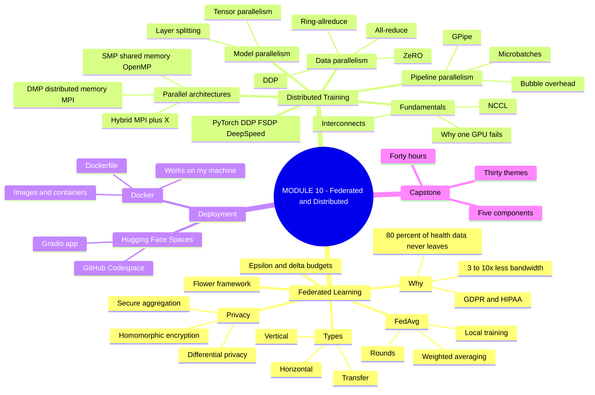
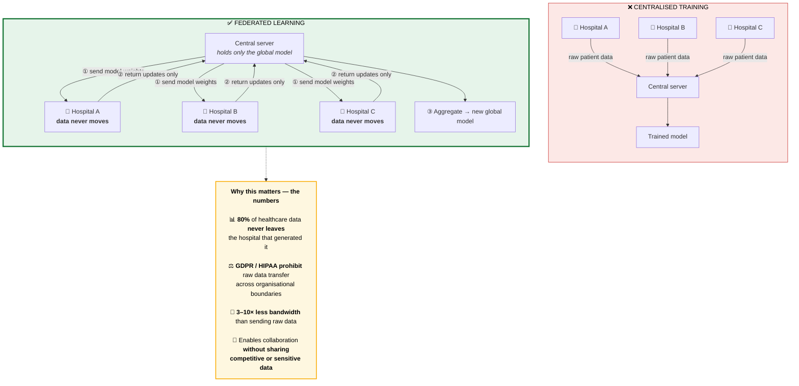
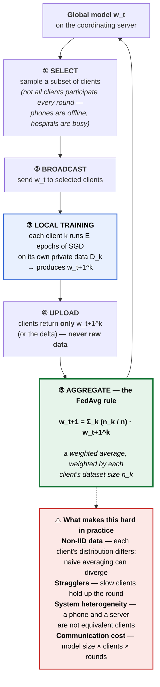
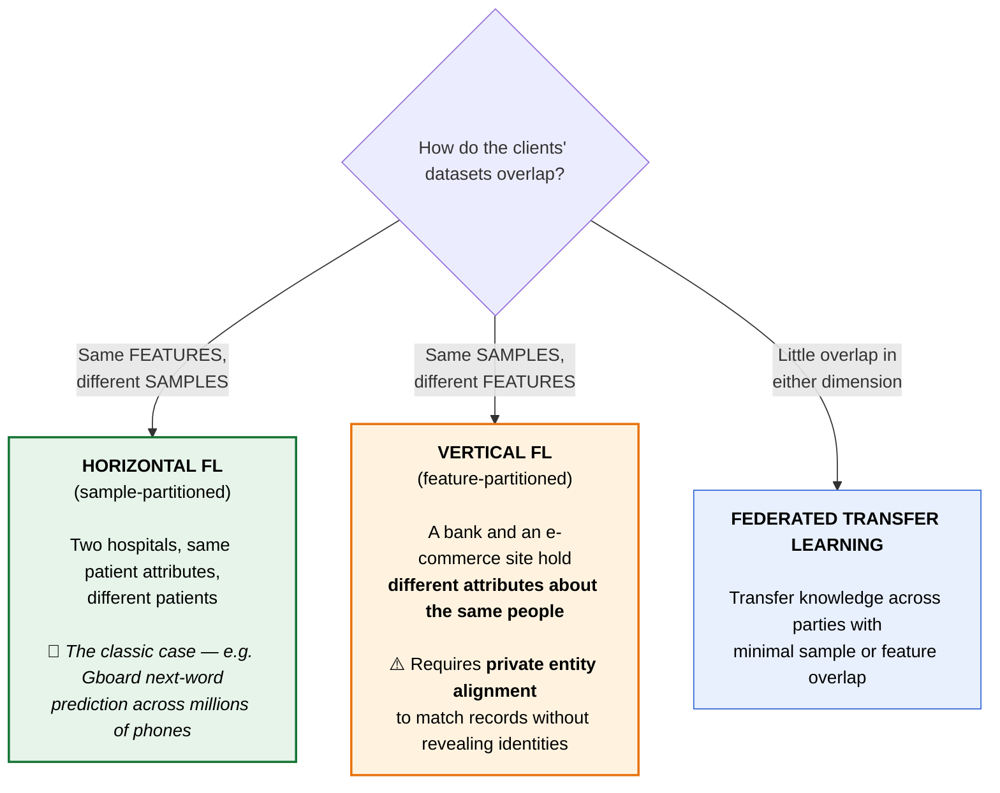
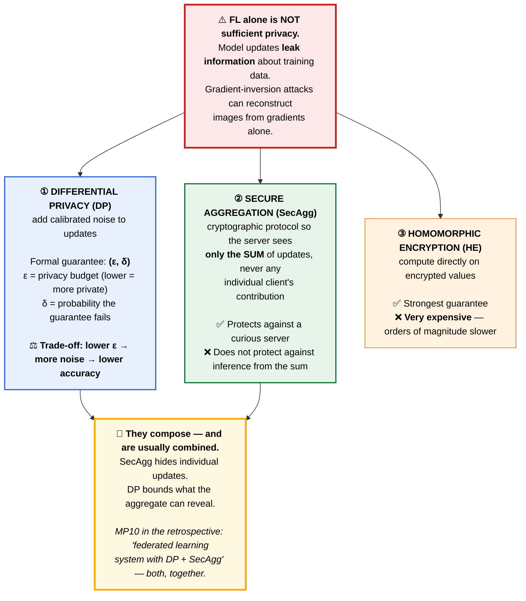
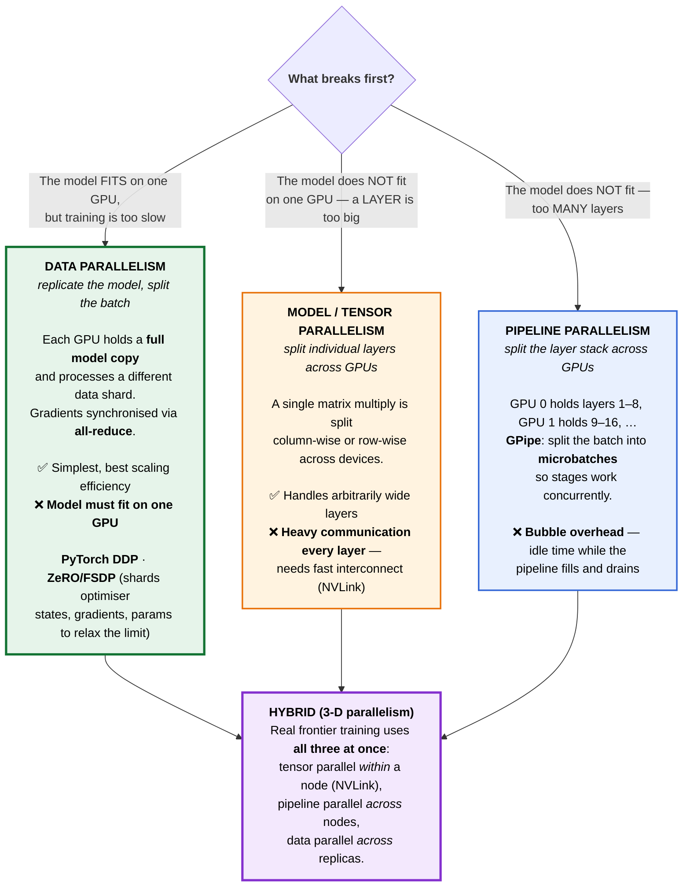
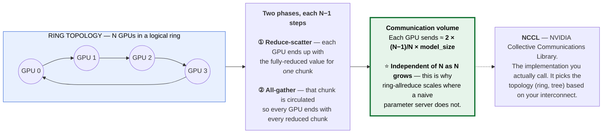
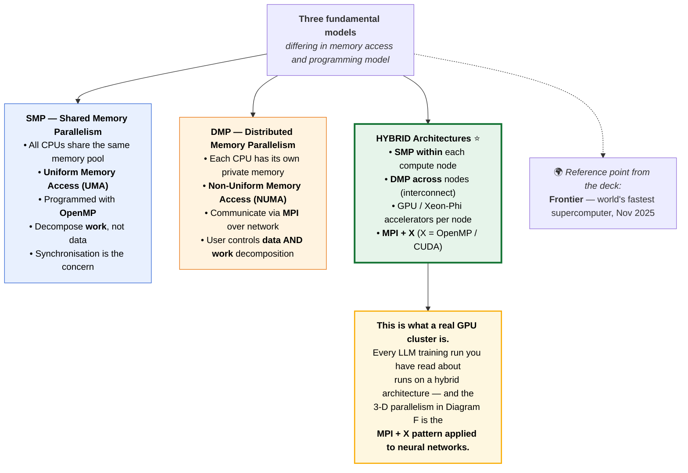
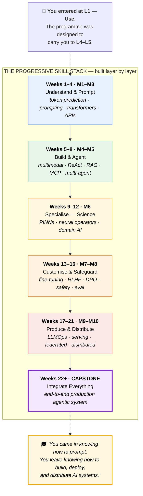
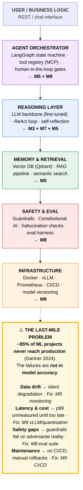

# Module 10 — Federated & Distributed AI, Deployment & Capstone · Study Notes

**Programme:** Advanced Certification in Agentic and Generative AI
**Institution:** IISc Bengaluru / TalentSprint · **Instructor:** Prof. Sashikumaar Ganesan
**Module duration:** Weeks 20–21 + Capstone (40h) · **Prerequisite:** M1–M9

> **What this module is really about.** Module 9 taught you to serve a model on **one machine cluster you control**. Module 10 removes both assumptions:
>
> | | Question | Answer |
> |---|---|---|
> | **Distributed training** | The model doesn't fit on one GPU. Now what? | Data / model / pipeline parallelism |
> | **Federated learning** | The **data** can't leave the hospital / bank / phone. Now what? | **Send the model to the data, not the data to the model** |
>
> ### 🔑 The inversion that defines federated learning
> **Data stays where it is. Only model updates travel.**
>
> And then: **Docker → Hugging Face Spaces → the Capstone.** This is where 21 weeks become one deployed system.

---

## Table of Contents

1. [Module map](#0-module-map)
2. [🗺️ Visual atlas](#-visual-atlas--mind-map--correlation-diagrams)
3. **10.1 Federated Learning**
   - [10.1.1 Why federated learning?](#1011--why-federated-learning)
   - [10.1.2 FedAvg](#1012--fedavg--the-canonical-algorithm)
   - [10.1.3 Types of FL](#1013--types-of-federated-learning)
   - [10.1.4 Privacy techniques](#1014--privacy-techniques)
   - [10.1.5 Differential privacy](#1015--differential-privacy)
   - [10.1.6 Flower implementation (lab)](#1016--fl-implementation-with-flower-lab)
4. **10.2 Distributed Training**
   - [10.2.1 Parallel computer architectures](#1021--parallel-computer-architectures)
   - [10.2.2 Distributed fundamentals](#1022--distributed-fundamentals)
   - [10.2.3 Data parallelism](#1023--data-parallelism)
   - [10.2.4 Model parallelism](#1024--model-parallelism)
   - [10.2.5 Pipeline parallelism](#1025--pipeline-parallelism)
   - [10.2.6 Implementation (lab)](#1026--implementation-ddp--fsdp--deepspeed-lab)
5. **10.3 Deployment**
   - [10.3.1 Docker fundamentals](#1031--docker-fundamentals)
   - [10.3.2 Hugging Face Spaces](#1032--deployment-using-hugging-face-spaces)
6. [**The Final Lecture** — retrospective, field state, careers](#the-final-lecture--27-june-2026)
7. [**The Capstone**](#-the-capstone)
8. [Assignment & Mini-Project 5](#assignment--mini-project-5)
9. [Master list of misconceptions](#master-list-of-misconceptions)
10. [Glossary](#glossary)
11. [References](#references-and-further-study)
12. [Self-check question bank](#self-check-question-bank)

---

## 0. Module map

| File | Concept IDs | Content |
|---|---|---|
| `Module10-1-Federated-Learning-Fundamentals.pdf` | `TH-000001`–`000005`, `CD-000001` | **10.1** Federated Learning |
| `Module10-2-Distributed-Training.pdf` | `TH-000006`–`000009`, `CD-000002` | **10.2** Distributed Training |
| `Parallel-Computer-Architectures.pdf` | — | **10.2.1** SMP · DMP · Hybrid · OpenMP · MPI · GPU |
| `1---Docker-Fundamentals---Slides.pdf` | — | **10.3.1** Docker fundamentals |
| `2---Docker-Setup-and-Basics.pdf` | — | **10.3.1** Docker setup (hands-on) |
| `3---Deployment-using-Hugging-Face-Spaces.pdf` | — | **10.3.2** HF Spaces deployment |
| `The-Final.pdf` | — | ⭐ **Final lecture** — retrospective, field state, careers, **capstone kickoff** |
| `M10-AST-01-Federated-Learning.ipynb` | — | **Graded assignment** |
| `Model-Building-using-PyTorch.ipynb` | — | PyTorch refresher |
| `hotel-assistant.zip` | — | The app deployed in the HF Spaces walkthrough |
| `ReadMe---Mini-Project-5.pdf` | — | **Mini-Project 5** brief |
| `M5-MP1-Instructions.pdf` | — | Additional MP instructions |

### Sub-module concept flow

**10.1 Federated Learning:** `TH-000001` Intro to FL → `TH-000002` **FedAvg** → `TH-000003` Types of FL → `TH-000004` Privacy techniques → `TH-000005` Differential privacy → `CD-000001` **Flower lab (30 min)**

**10.2 Distributed Training:** `TH-000006` Distributed fundamentals → `TH-000007` **Data parallelism** → `TH-000008` Model parallelism → `TH-000009` Pipeline parallelism → `CD-000002` **DDP/FSDP/DeepSpeed lab (30 min)**

---

# 🗺️ Visual atlas — mind map & correlation diagrams

## A. Module 10 mind map

## B. ⭐ The federated inversion

## C. ⭐ The FedAvg round

## D. Three types of federated learning

## E. ⭐ The privacy stack — FL alone is not private

## F. ⭐ The three parallelism strategies

## G. Ring-AllReduce

## H. Parallel computer architectures

## I. ⭐ The whole programme in one picture

## J. ⭐ Production agentic architecture — which module built each layer

---

# 10.1 Federated Learning

## 10.1.1 — Why federated learning?

> **Federated Learning (FL)** is a machine learning paradigm in which a model is trained across **multiple decentralised devices or silos** — **without the raw data ever leaving them**.

### The case, in numbers

| Fact | Implication |
|---|---|
| **80%** of healthcare data **never leaves** the hospital that generated it | The most valuable training data is legally and practically unreachable |
| **GDPR / HIPAA prohibit** raw data transfer across organisational boundaries | Centralising isn't a cost problem, it's a **legality** problem |
| **3–10× less bandwidth** than sending raw data to a central server | It is also **cheaper** |

**What FL enables:** data stays on device — **only model updates (gradients/weights) travel**. Collaboration **without sharing competitive or sensitive data**.

> The lecture's framing question, from the handwritten margin: *"Edge devices do inference — **can we use them for training our models?**"*

---

## 10.1.2 — FedAvg — the canonical algorithm

$$w_{t+1} = \sum_{k=1}^{K} \frac{n_k}{n}\, w_{t+1}^{k}$$

A **weighted average** of client models, weighted by each client's dataset size $n_k$.

### The round, step by step

| Step | What happens |
|---|---|
| **① Select** | Sample a subset of clients — ⚠️ not all participate every round |
| **② Broadcast** | Send the global model $w_t$ to selected clients |
| **③ Local training** | Each client runs $E$ epochs of SGD on its **own private data** |
| **④ Upload** | Clients return **only** the updated weights (or delta) — **never raw data** |
| **⑤ Aggregate** | Server computes the weighted average → new global model |

Repeat for many **rounds**.

### ⚠️ What makes this hard

| Challenge | Why |
|---|---|
| **Non-IID data** | Each client's distribution differs. Naive averaging can **diverge** — this is the central research problem in FL |
| **Stragglers** | Slow or offline clients hold up the round |
| **System heterogeneity** | A phone and a hospital server are not equivalent clients |
| **Communication cost** | model size × clients × rounds — often the binding constraint |

> ⭐ **Note the key efficiency idea in FedAvg:** clients run **multiple local epochs** before uploading. That is what makes it "FedAvg" rather than "FedSGD" — you trade some convergence quality for **far fewer communication rounds**.

---

## 10.1.3 — Types of federated learning

| Type | Partition | Example |
|---|---|---|
| **Horizontal** (sample-partitioned) | **Same features, different samples** | Two hospitals with the same patient attributes but different patients; Gboard next-word prediction across millions of phones |
| **Vertical** (feature-partitioned) | **Same samples, different features** | A bank and an e-commerce site holding **different attributes about the same people**. ⚠️ Requires **private entity alignment** to match records without revealing identities |
| **Federated transfer** | Little overlap in either | Transfer knowledge across parties with minimal sample or feature overlap |

---

## 10.1.4 — Privacy techniques

> ### ⚠️ **Federated learning alone is not sufficient privacy.**
> Model updates **leak information** about the training data. Gradient-inversion attacks can reconstruct training images from gradients alone. FL is a **data-residency** guarantee, not a **privacy** guarantee.

| Technique | Mechanism | Strength | Cost |
|---|---|---|---|
| **Differential privacy (DP)** | Add calibrated noise to updates | Formal **(ε, δ)** guarantee | ⚖️ **Accuracy loss** |
| **Secure aggregation (SecAgg)** | Cryptographic protocol so the server sees **only the sum**, never an individual update | Protects against a curious server | Protocol overhead |
| **Homomorphic encryption (HE)** | Compute directly on **encrypted** values | **Strongest** | ❌ **Orders of magnitude slower** |

> ⭐ **They compose, and in practice are combined.** SecAgg hides individual contributions; DP bounds what the aggregate can reveal. The retrospective's MP10 specifies exactly this: *"federated learning system with **DP + SecAgg**."*

---

## 10.1.5 — Differential privacy

> **DP** provides a formal, mathematical guarantee: the presence or absence of **any single individual's data** changes the output distribution by at most a bounded factor.

$$P[\mathcal{M}(D) \in S] \le e^{\varepsilon} \cdot P[\mathcal{M}(D') \in S] + \delta$$

| Parameter | Meaning |
|---|---|
| **ε (epsilon)** | The **privacy budget**. **Lower = more private.** ε ≈ 1 is strong; ε ≈ 10 is weak |
| **δ (delta)** | The probability the guarantee **fails entirely**. Should be **≪ 1/n** |

**Noise mechanisms:** Gaussian and Laplace, calibrated to the **sensitivity** of the function being computed.

> ### ⚖️ The trade-off you must be able to reason about
> **Lower ε → more noise → lower accuracy.** There is no free privacy. The learning objective explicitly asks you to *"reason about privacy budgets ε and δ and their trade-offs with accuracy."*
>
> **Privacy budgets also compose:** repeated queries consume budget. Over many FL rounds, ε accumulates — which is why **privacy accounting** matters.

---

## 10.1.6 — FL implementation with Flower (lab)

**30-minute lab** building a minimal federated learning loop with the **Flower** framework — the companion library named in the M1 reading list alongside *Federated Learning: Privacy and Incentive* (Yang et al., Springer 2020).

**Flower's structure:** a `Client` implementing `fit()` and `evaluate()`, a `Strategy` (FedAvg by default) on the server, and a simulation harness for running many virtual clients on one machine.

---

# 10.2 Distributed Training

## 10.2.1 — Parallel computer architectures

> Three fundamental models, differing in **memory access** and **programming model**.

| | **SMP** — Shared Memory | **DMP** — Distributed Memory | **Hybrid** ⭐ |
|---|---|---|---|
| Memory | All CPUs **share one pool** | Each CPU has **private memory** |**SMP within** a node, **DMP across** nodes |
| Access | **UMA** (uniform) | **NUMA** (non-uniform) | Both |
| Programmed with | **OpenMP** | **MPI** over network | **MPI + X** (X = OpenMP / CUDA) |
| You decompose | **Work**, not data | **Data AND work** | Both |
| Main concern | Synchronisation | Communication | Everything |
| Accelerators | — | — | **GPU / Xeon-Phi per node** |

> ⭐ **Hybrid is what a real GPU cluster is.** Every LLM training run you've read about runs on this architecture — and the 3-D parallelism below is the **MPI + X pattern applied to neural networks**.

*(The deck uses **Frontier** — world's fastest supercomputer, Nov 2025 — as its scale reference.)*

---

## 10.2.2 — Distributed fundamentals

**Why a single GPU fails, and what breaks first:**

| Constraint | When it binds |
|---|---|
| **Memory** | Weights + gradients + optimizer states + activations exceed VRAM. ⭐ **Usually first** |
| **Compute time** | The run would take months |
| **Batch size** | Can't fit a batch large enough for stable training |

**Interconnects** (ordered by bandwidth): **NVLink** (intra-node) > **PCIe** > **InfiniBand** (inter-node) > Ethernet.

**NCCL** — NVIDIA Collective Communications Library — implements the collective operations (all-reduce, all-gather, broadcast) and selects the topology based on your hardware.

---

## 10.2.3 — Data parallelism

> **Replicate the model, split the batch.** Each GPU holds a **full model copy** and processes a different data shard; gradients are synchronised via **all-reduce**.

### Ring-AllReduce

**Two phases, each $N-1$ steps:**
1. **Reduce-scatter** — each GPU ends with the fully-reduced value for **one chunk**
2. **All-gather** — that chunk circulates so every GPU ends with every reduced chunk

**Communication volume per GPU:** $\approx 2 \times \frac{N-1}{N} \times \text{model\_size}$

> ⭐ **This is essentially independent of $N$ as $N$ grows** — which is exactly why ring-allreduce scales where a naive parameter-server design does not (there, the server becomes a bandwidth bottleneck).

### ZeRO / FSDP — relaxing the "must fit on one GPU" limit

**ZeRO (Zero Redundancy Optimizer)** shards what would otherwise be replicated:

| Stage | Shards |
|---|---|
| **ZeRO-1** | Optimizer states |
| **ZeRO-2** | + gradients |
| **ZeRO-3** | + **parameters** |

**FSDP** (Fully Sharded Data Parallel) is PyTorch's native implementation of the same idea.

> **ZeRO-3 blurs the line between data and model parallelism** — you keep the data-parallel programming model while no single GPU holds the whole model.

---

## 10.2.4 — Model parallelism

> **Split individual layers across GPUs** — tensor parallelism.

A single large matrix multiply is split **column-wise or row-wise** across devices; partial results are combined with a collective.

| ✅ | ❌ |
|---|---|
| Handles **arbitrarily wide** layers | **Heavy communication at every layer** — requires fast interconnect (NVLink) |
| Necessary when one layer exceeds one GPU | Poor scaling **across nodes** |

> **Rule of thumb:** tensor-parallel **within** a node (over NVLink), never across nodes.

---

## 10.2.5 — Pipeline parallelism

> **Split the layer stack across GPUs.** GPU 0 holds layers 1–8, GPU 1 holds 9–16, and so on.

### The bubble problem

Naively, only one GPU works at a time — the rest idle. **GPipe** fixes this by splitting the batch into **microbatches** so stages operate concurrently.

**Bubble overhead** = idle time while the pipeline **fills and drains**. It shrinks as the number of microbatches grows relative to the number of stages.

$$\text{bubble fraction} \approx \frac{P - 1}{M + P - 1}$$

where $P$ = pipeline stages, $M$ = microbatches.

> ⭐ **This is why you want many microbatches** — and why pipeline parallelism interacts with gradient accumulation (M9 §9.2.5). They're the same mechanism viewed from different angles.

---

## 10.2.6 — Implementation: DDP / FSDP / DeepSpeed (lab)

**30-minute lab.**

| Tool | What it gives you |
|---|---|
| **PyTorch DDP** | Standard data parallelism — the baseline |
| **PyTorch FSDP** | Native ZeRO-style sharding |
| **DeepSpeed** | ZeRO stages 1–3, offloading, and the pipeline engine |
| **HuggingFace Accelerate** | A thin abstraction over all of the above |

---

# 10.3 Deployment

## 10.3.1 — Docker fundamentals

### The problem before containers

**The manual process:** set up Python 3.10 → create and activate a venv → install dependencies → copy code files → run the start command. **Repeated on every machine.**

> **The process becomes tedious and is prone to human error.**

**Challenges named in the deck:**

| Challenge | Detail |
|---|---|
| **Environment mismatch** | ⭐ **"Works on my machine"** |
| **OS / library / dependency variation** | The same code behaves differently per host |
| **Setup time** | Developers spend time configuring every new environment |

### Images vs containers — the distinction to get right

| **Image** | **Container** |
|---|---|
| A **read-only template** — code + dependencies + config | A **running instance** of an image |
| Built from a `Dockerfile` | Created with `docker run` |
| Analogy: a **class** | Analogy: an **object** |

**Basic commands:** `docker build` · `docker run` · `docker ps` · `docker images` · `docker stop` · `docker logs` · `docker exec`.

> 🔗 **Ties directly to M9 §9.7.3:** multi-stage builds, CUDA base images, health checks, and **volume-mounted weights** — the LLM-specific refinements of these fundamentals.

---

## 10.3.2 — Deployment using Hugging Face Spaces

> **Hugging Face Spaces** hosts and shares machine learning apps. *"Building a demo is one of the best ways to showcase your work."*

### The procedure in a nutshell

1. Download and unzip the **`hotel-assistant`** folder
2. Create a new **GitHub Codespace** using the Blank template
3. Upload the folder to the Codespace (drag & drop)
4. Build and test locally in the Codespace
5. Push to a Hugging Face Space

**Prerequisites:** a GitHub account and a Hugging Face account.

> 💡 **Why Codespaces rather than local?** It guarantees every student has the same environment — the very problem Docker solves, solved a different way. Worth noticing that the deployment lecture demonstrates *both* answers to the "works on my machine" problem.

The `hotel-assistant` app is the same agentic application built in the M7 supplementary notebook — so the deployment exercise ships something you already understand.

---

# The Final Lecture — 27 June 2026

> *"You came in knowing how to prompt. You leave knowing how to build, deploy, and distribute AI systems."*

**Six sections:** (A) The Journey — M1→M10 retrospective · (B) Where the field stands in June 2026 · (C) Career paths · (D) Future frontiers · (E) **Capstone kickoff** · (F) Send-off.

## Section A — the journey, module by module

| Module | Weeks | Key unlock |
|---|---|---|
| **M1** Practical GenAI Foundations | 1–2 | **GenAI is not magic — it is token prediction over learned probability distributions** |
| **M2** Prompt Engineering | 3–4 | Structured prompting transforms a raw model into a reliable reasoning tool **without touching weights** |
| **M3** Large Language Models | 5–6 | Self-attention, tokenisation, and sampling parameters mean you can **tune model behaviour deliberately** |
| **M4** Multimodal AI Systems | 7–8 | **Language is only one modality** — GenAI is inherently multimodal |
| **M5** Agentic AI | 9–10 | ReAct, MCP, RAG, multi-agent are **the foundation of every production AI product being built today** |
| **M6** Scientific ML & PINNs | 11–12 | PINNs encode conservation laws **directly into the loss** — the model cannot ignore physics |
| **M7** Fine-tuning | 13–14 | LoRA/QLoRA/SFT/DPO **specialise any foundation model without retraining from scratch** |
| **M8** Safety & Evaluation | 15–16 | **Evaluation is not a single metric** — it is a multi-layered framework |
| **M9** LLMOps | 17–19 | vLLM, PagedAttention, Chinchilla, MCP-in-production are **the engineering layer that makes agents real** |
| **M10** Federated & Distributed | 20–21 | Data parallelism, Ring-AllReduce, FedAvg, ZeRO are **the infrastructure of AI at enterprise scale** |

> ⚠️ **Note a discrepancy:** the retrospective describes **ten mini-projects (MP1–MP10)**, one per module. The **delivered course folders contain MP1–MP5**. Treat the retrospective's MP list as the *design intent*; check the LMS for what is actually assessed.

## Section B — the field in June 2026: four defining shifts

| Shift | What changed |
|---|---|
| **Test-time compute scaling** | o1, o3, Gemini Thinking — **reasoning at inference rather than training**. Scale shifts from parameter count to compute-at-inference |
| **Model merging & composition** | **SLERP, TIES, DARE** allow specialists to be merged post-training. **One team trains, many benefit** |
| **MCP as infrastructure standard** | ⭐ MCP became the **de-facto connector standard** — Claude, Gemini, and GPT-4o all support it |
| **Sovereign & edge AI** | Governments and enterprises demand **on-premise, privacy-preserving inference** — which is exactly why M10 exists |

## The last-mile problem

> ⚠️ **~85% of ML projects never reach production (Gartner 2024).** *The failures are not in model accuracy.*

| Failure | Fix |
|---|---|
| **Data drift** — silent degradation as distributions shift | M9 monitoring |
| **Latency & cost** — p99 and per-query cost unmeasured until production | M9 vLLM / quantisation |
| **Safety gaps** — guardrails designed on test sets fail on adversarial reality | M8 evaluation suite |
| **Maintenance** — no CI/CD for models; fixes take weeks, rollbacks manual | M9 CI/CD pipeline |

## Section C — careers: 10 modules → 5 roles

| Role | Strongest modules | What you build | Key tools |
|---|---|---|---|
| **AI / ML Engineer** | M3, M5, M7, M9 | LLM APIs, agent backends, production services | vLLM, FastAPI, LangGraph |
| **Agentic Systems Engineer** | M5, M8, M9 | Multi-agent systems, MCP integrations, human-in-the-loop | LangGraph, MCP, Evals |
| *(plus roles mapping to)* | M6 | Scientific ML / research | PyTorch, DeepXDE |
| | M7, M8 | Model adaptation & safety | PEFT, TRL, guardrails |
| | M9, M10 | MLOps / platform & distributed infra | Docker, K8s, DDP, Flower |

---

# 🎓 The Capstone

**40 hours**, Weeks 22+. **Five required components** (from the M1 course overview):

| # | Component | Modules it draws on |
|---|---|---|
| **1** | **Custom model** — pre-trained or fine-tuned | M7, M8 |
| **2** | **Application layer** — agentic system or RAG pipeline | M4, M5 |
| **3** | **Production deployment** — containerised, API endpoints | M9, M10 |
| **4** | **Safety guardrails and monitoring** | M8, M9 |
| **5** | **Comprehensive evaluation and documentation** | M8 |

**30 capstone themes** are available — from healthcare agents to code-generation assistants to scientific computing pipelines.

**Evaluation:** system testing and benchmarking · technical presentation and demo · **Q&A defence session** · documentation and **model card** review.

### 💡 Reading the components as a checklist

The five components map **exactly** onto the production architecture in Diagram J. If your capstone has an orchestrator, a fine-tuned reasoning layer, retrieval, guardrails, and Docker+monitoring, you have satisfied all five by construction. **Design against that diagram, not against the component list.**

---

## Assignment & Mini-Project 5

| Item | Detail |
|---|---|
| **`M10-AST-01-Federated-Learning.ipynb`** | **Graded assignment** — pairs with §10.1 |
| **Mini-Project 5: AI-Powered Airline Customer Support System — Deployment on Hugging Face Spaces** | **Graded team activity, 10 points.** Released **26 Jun 2026**; session **28 Jun 2026**, 9:00 am–12:30 pm, teams in **separate Zoom breakout rooms** |
| `Model-Building-using-PyTorch.ipynb` | PyTorch refresher |
| `hotel-assistant.zip` | The HF Spaces walkthrough app |

> 💡 **MP5 deploys the MP4 system.** M9's Mini-Project 4 *built* the airline support system; M10's MP5 *ships* it. Do not treat them as separate projects — MP5 is the last mile that §J says 85% of projects never complete.

---

## Master list of misconceptions

| ❌ Myth | ✅ Reality |
|---|---|
| "Federated learning is just distributed training" | ⭐ Different problem. **Distributed training** splits work when the model/data is too big. **FL** keeps data where it legally must stay |
| "FL means the data is private" | ⚠️ **FL alone is NOT sufficient privacy.** Model updates leak information; gradient inversion can reconstruct training images. **You need DP and/or SecAgg on top** |
| "FedAvg is just averaging" | It is a **weighted** average by dataset size — and the multiple **local epochs** before upload are what make it communication-efficient |
| "All clients participate in every round" | A **subset is sampled**. Phones are offline; hospitals are busy |
| "FL works the same as centralised training" | ⚠️ **Non-IID data** across clients can cause divergence — the central research problem in FL |
| "Differential privacy is free" | ⚖️ **Lower ε → more noise → lower accuracy.** And **budgets compose** across rounds |
| "Horizontal and vertical FL are minor variants" | **Vertical FL requires private entity alignment** — a genuinely different and harder protocol |
| "Homomorphic encryption is the obvious choice" | ✅ Strongest guarantee, ❌ **orders of magnitude slower**. Usually impractical at model scale |
| "Data parallelism means splitting the model" | ⚠️ Backwards. **Data parallel replicates the model and splits the batch** |
| "Use model parallelism whenever you have multiple GPUs" | ❌ Only when a **layer doesn't fit**. It has heavy per-layer communication — **use it within a node, not across nodes** |
| "Ring-allreduce is slower because it's a ring" | ⭐ Its per-GPU communication is **~independent of N** — that's exactly why it scales |
| "ZeRO is a kind of model parallelism" | It keeps the **data-parallel programming model** while sharding optimizer states, gradients, and parameters |
| "Pipeline parallelism has no overhead" | ⚠️ **Bubble overhead** while the pipeline fills and drains. Mitigated with **microbatches** |
| "SMP and DMP are historical curiosities" | **Every GPU cluster is a hybrid** — SMP within a node, DMP across. **MPI + X** is what you're actually running |
| "A Docker image and a container are the same" | **Image = read-only template (class). Container = running instance (object)** |
| "Docker solves dependency problems automatically" | It **captures** an environment. You still have to specify it correctly — and for LLMs, **volume-mount the weights** |
| "The capstone is a bigger mini-project" | It requires **all five components** — custom model, application layer, deployment, guardrails, evaluation — plus a **Q&A defence** |
| "Getting the model working is the hard part" | ⚠️ **85% of ML projects fail in production, and not on accuracy.** Drift, latency, safety gaps, and maintenance are the killers |

---

## Glossary

| Term | Definition |
|---|---|
| **All-reduce** | Collective operation summing values across all GPUs and returning the result to all |
| **Bubble overhead** | Idle pipeline time while stages fill and drain |
| **DDP** | PyTorch DistributedDataParallel |
| **DeepSpeed** | Microsoft distributed training library (ZeRO, offload, pipeline) |
| **Differential privacy (DP)** | Formal (ε, δ) guarantee bounding any individual's influence on the output |
| **DMP** | Distributed Memory Parallelism — private memory, MPI, NUMA |
| **δ (delta)** | Probability the DP guarantee fails; should be ≪ 1/n |
| **ε (epsilon)** | DP privacy budget; lower = more private |
| **FedAvg** | Federated Averaging — weighted average of client models by dataset size |
| **Federated transfer learning** | FL with little sample or feature overlap |
| **Flower** | Federated learning framework used in the M10 lab |
| **Frontier** | World's fastest supercomputer (Nov 2025), the deck's scale reference |
| **FSDP** | PyTorch Fully Sharded Data Parallel |
| **GPipe** | Pipeline parallelism with microbatches |
| **Gradient inversion** | Attack reconstructing training data from gradients |
| **Homomorphic encryption (HE)** | Computing on encrypted data |
| **Horizontal FL** | Same features, different samples |
| **Hybrid architecture** | SMP within nodes, DMP across — MPI + X |
| **Image / container** | Read-only template / running instance |
| **MPI** | Message Passing Interface — DMP programming model |
| **NCCL** | NVIDIA Collective Communications Library |
| **Non-IID** | Client data distributions differ — the core FL difficulty |
| **NUMA / UMA** | Non-Uniform / Uniform Memory Access |
| **NVLink** | High-bandwidth intra-node GPU interconnect |
| **OpenMP** | SMP programming model |
| **Pipeline parallelism** | Splitting the layer stack across devices |
| **Privacy accounting** | Tracking cumulative ε across rounds |
| **Reduce-scatter / all-gather** | The two phases of ring-allreduce |
| **Ring-AllReduce** | Bandwidth-optimal gradient synchronisation |
| **SecAgg** | Secure aggregation — server sees only the sum |
| **SLERP / TIES / DARE** | Model merging techniques (field state, June 2026) |
| **SMP** | Shared Memory Parallelism — shared pool, OpenMP, UMA |
| **Straggler** | Slow client delaying an FL round |
| **Tensor parallelism** | Splitting individual layers across devices |
| **Test-time compute scaling** | Reasoning at inference rather than training (o1/o3) |
| **Vertical FL** | Same samples, different features; needs private entity alignment |
| **ZeRO** | Zero Redundancy Optimizer — shards optimizer states / gradients / params |

---

## References and further study

### 📕 Books

| Book | For Module 10 |
|---|---|
| ⭐ **Federated Learning: Privacy and Incentive** — Qiang Yang et al., Springer 2020 | **The course's designated M10 reference** — FedAvg, horizontal/vertical FL, differential privacy, communication efficiency. Healthcare and finance applications map directly to the M10 case studies |
| **LLM Engineer's Handbook** — Iusztin & Labonne | Deployment context |

### 🔗 Essential resources

| Resource | Link | For |
|---|---|---|
| ⭐ **Flower framework** | [flower.ai/docs](https://flower.ai/docs/) | **The course's designated FL companion — 10.1.6** |
| ⭐ **The Ultra-Scale Playbook** | [huggingface.co/spaces/nanotron/ultrascale-playbook](https://huggingface.co/spaces/nanotron/ultrascale-playbook) | **10.2 — data/tensor/pipeline parallelism, ZeRO** |
| ⭐ **How to Scale Your Model** | [jax-ml.github.io/scaling-book](https://jax-ml.github.io/scaling-book/) | Sharding strategies, roofline analysis |
| **PyTorch FSDP tutorial** | [pytorch.org/tutorials](https://pytorch.org/tutorials/intermediate/FSDP_tutorial.html) | 10.2.6 |
| **DeepSpeed** | [deepspeed.ai](https://www.deepspeed.ai/) | 10.2.6 |
| **HuggingFace Accelerate** | [huggingface.co/docs/accelerate](https://huggingface.co/docs/accelerate) | 10.2.6 |
| **NVIDIA FLARE** | [nvflare.readthedocs.io](https://nvflare.readthedocs.io/) | Production FL |
| **Opacus** (DP for PyTorch) | [opacus.ai](https://opacus.ai/) | 10.1.5 |
| **Docker docs** | [docs.docker.com](https://docs.docker.com/) | 10.3.1 |
| **HF Spaces Overview** | [huggingface.co/docs/hub/spaces](https://huggingface.co/docs/hub/spaces) | 10.3.2 |
| **GitHub Codespaces** | [github.com/codespaces](https://github.com/codespaces) | 10.3.2 |

### 📄 Papers

| Paper | Link | Section |
|---|---|---|
| ⭐ **Communication-Efficient Learning from Decentralized Data (FedAvg)** — McMahan 2017 | [arXiv:1602.05629](https://arxiv.org/abs/1602.05629) | **10.1.2 — the paper the reading list names for M10** |
| **Advances and Open Problems in Federated Learning** — Kairouz 2019 | [arXiv:1912.04977](https://arxiv.org/abs/1912.04977) | 10.1 — the survey |
| **Practical Secure Aggregation** — Bonawitz 2017 | [eprint.iacr.org/2017/281](https://eprint.iacr.org/2017/281) | 10.1.4 |
| **Deep Learning with Differential Privacy (DP-SGD)** — Abadi 2016 | [arXiv:1607.00133](https://arxiv.org/abs/1607.00133) | 10.1.5 |
| **Deep Leakage from Gradients** — Zhu 2019 | [arXiv:1906.08935](https://arxiv.org/abs/1906.08935) | ⭐ **10.1.4 — why FL alone isn't private** |
| ⭐ **ZeRO** — Rajbhandari 2019 | [arXiv:1910.02054](https://arxiv.org/abs/1910.02054) | **10.2.3** |
| **GPipe** — Huang 2018 | [arXiv:1811.06965](https://arxiv.org/abs/1811.06965) | 10.2.5 |
| **Megatron-LM (tensor parallelism)** — Shoeybi 2019 | [arXiv:1909.08053](https://arxiv.org/abs/1909.08053) | 10.2.4 |
| **PyTorch Distributed (DDP)** — Li 2020 | [arXiv:2006.15704](https://arxiv.org/abs/2006.15704) | 10.2.3 |
| **Efficient Large-Scale Language Model Training (3-D parallelism)** — Narayanan 2021 | [arXiv:2104.04473](https://arxiv.org/abs/2104.04473) | 10.2 hybrid |

### 📌 Study strategy for Weeks 20–21 + capstone

1. **Run the Flower simulation lab with 10 virtual clients first.** FedAvg becomes obvious in twenty minutes of watching rounds print
2. ⭐ **Then make the client data non-IID** (give each client only two classes) and watch accuracy collapse. That is the whole research field in one experiment
3. **Add DP with Opacus and sweep ε.** Plot accuracy vs ε. You now *own* the trade-off rather than reciting it
4. **Run DDP on two GPUs (or two processes on one).** Then FSDP. Compare peak memory
5. **Compute ring-allreduce communication volume by hand** for N = 4 and N = 64. Confirm it barely changes
6. **Do the Docker + HF Spaces walkthrough before MP5**, not during it
7. ⭐ **Start the capstone by drawing Diagram J for your own system.** Label every layer with the module that built it. Any unlabelled layer is a gap in your plan

---

## Self-check question bank

### 10.1 Federated learning
1. State the federated inversion in one sentence.
2. Give the three numbers justifying FL (healthcare data, regulation, bandwidth).
3. Write the FedAvg aggregation formula. What is the weighting?
4. Walk through one FedAvg round in five steps.
5. Why don't all clients participate in every round?
6. What distinguishes FedAvg from FedSGD, and why does it matter?
7. Name four practical challenges in FL. Which is the central research problem?
8. Define horizontal, vertical, and federated transfer learning by their partition.
9. What extra protocol does vertical FL require, and why?
10. Is FL alone sufficient for privacy? Justify with a named attack.
11. Name the three privacy techniques, with a strength and cost each.
12. What do ε and δ mean? Which direction is more private?
13. State the accuracy trade-off with ε. What happens to ε across many rounds?
14. Which two techniques does MP10 specify combining, and what does each contribute?

### 10.2 Distributed training
15. Compare SMP, DMP, and hybrid on memory, access model, and programming model.
16. What is "MPI + X", and what is a real GPU cluster in these terms?
17. What breaks first when you try to train a large model on one GPU?
18. Rank NVLink, PCIe, and InfiniBand. What is NCCL?
19. In data parallelism, what is replicated and what is split?
20. Name the two phases of ring-allreduce and the steps in each.
21. Write the per-GPU communication volume. Why does this make it scale?
22. Name the three ZeRO stages and what each shards.
23. Is ZeRO data or model parallelism? Justify.
24. When is tensor parallelism necessary, and what is its main cost?
25. Why should tensor parallelism stay within a node?
26. What is bubble overhead? How does GPipe reduce it?
27. Write the bubble fraction formula. How does it relate to gradient accumulation?
28. Name four distributed training tools and what each provides.

### 10.3 Deployment & capstone
29. Name three problems Docker solves. Which is the famous phrase?
30. Distinguish image from container using the class/object analogy.
31. List the five steps of the HF Spaces deployment procedure.
32. Why does the course use Codespaces rather than local setup?
33. Name the five required capstone components and the modules each draws on.
34. What are the four capstone evaluation criteria?
35. Name the four defining shifts in the field as of June 2026.
36. What percentage of ML projects never reach production? Name the four failure causes and their fixes.
37. Map the six layers of a production agentic system to the modules that built them.

---

*Study notes compiled from the Module 10 source decks, including the final lecture (27 June 2026).*
*Series complete: [M1](../M1/M1_Study_Notes.md) · [M2](../M2/M2_Study_Notes.md) · [M3](../M3/M3_Study_Notes.md) · [M4](../M4/M4_Study_Notes.md) · [M5](../M5/M5_Study_Notes.md) · [M6](../M6/M6_Study_Notes.md) · [M7](../M7/M7_Study_Notes.md) · [M8](../M8/M8_Study_Notes.md) · [M9](../M9/M9_Study_Notes.md) · **M10***
