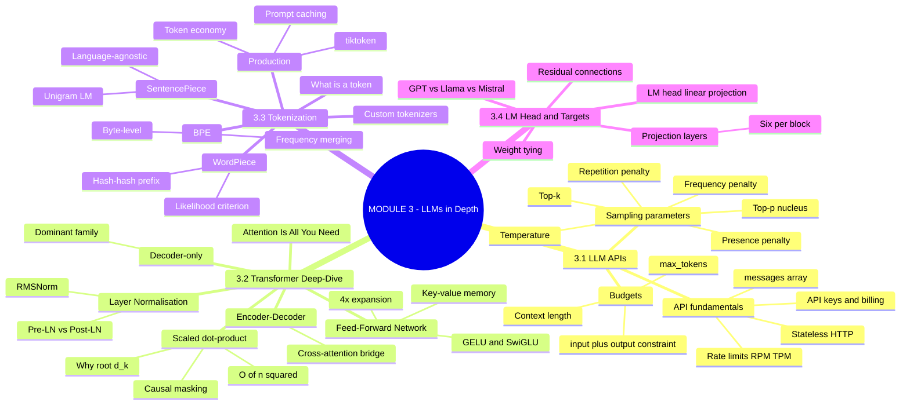
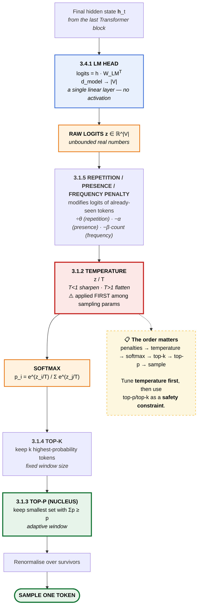
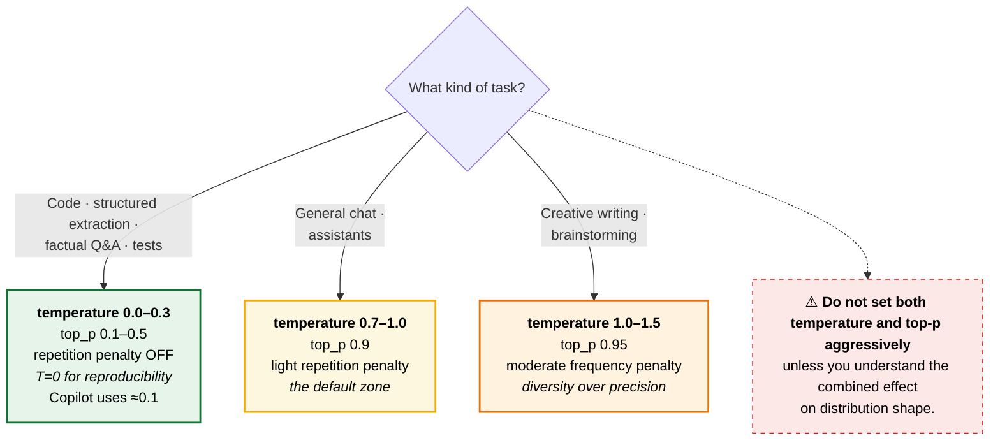
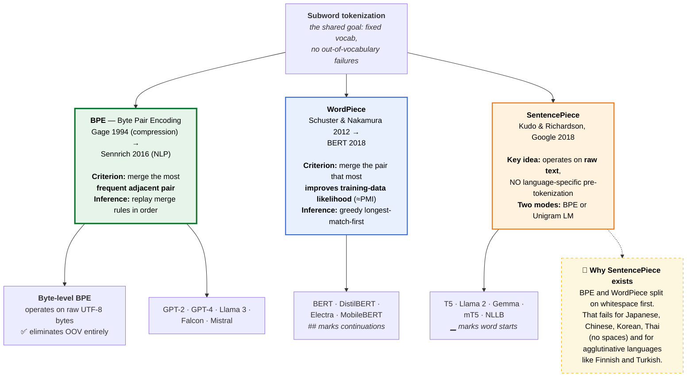
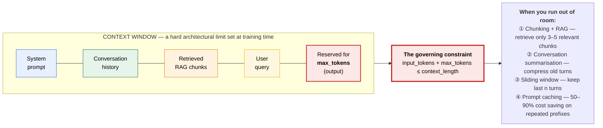
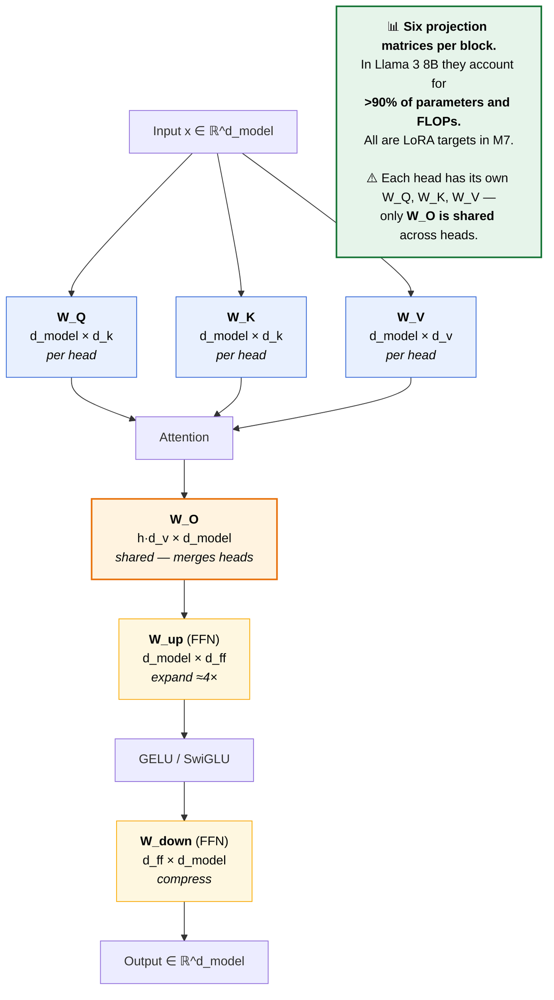
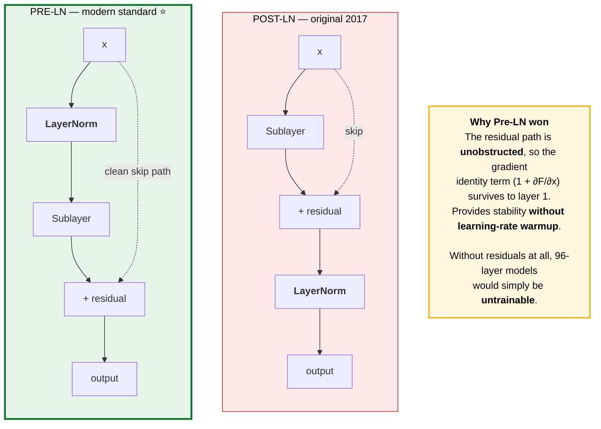
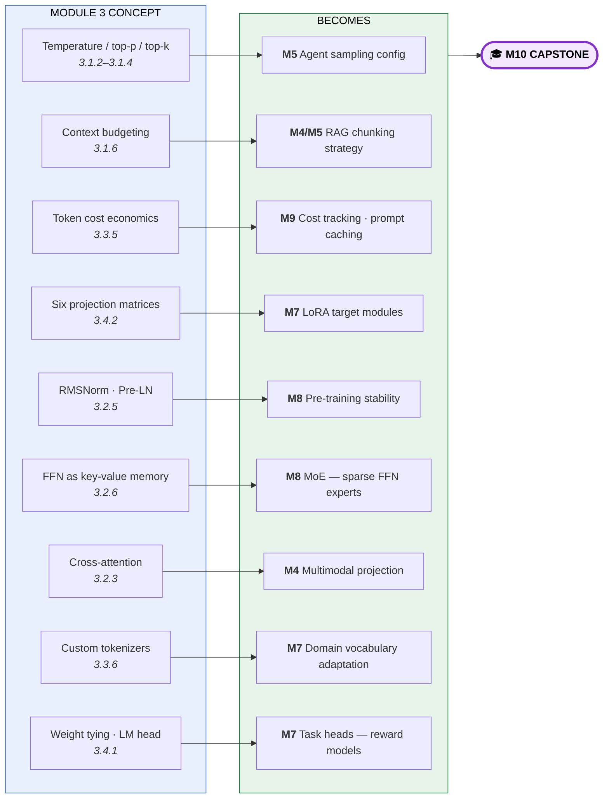

# Module 3 — Large Language Models: APIs, Architecture Deep-Dive & Tokenization · Study Notes

**Programme:** Advanced Certification in Agentic and Generative AI
**Institution:** IISc Bengaluru / TalentSprint · **Instructor:** Prof. Sashikumaar Ganesan
**Module duration:** 6 hours (Weeks 5–6) · **Prerequisite:** [Module 1](../M1/M1_Study_Notes.md), [Module 2](../M2/M2_Study_Notes.md)

> **What this module is really about.** Module 2 gave you the Transformer at a conceptual level and prompting as a craft. Module 3 makes both **operational**: every API parameter you will ever set (`temperature`, `top_p`, `top_k`, penalties, `max_tokens`) is derived from first principles here, the architecture is opened down to individual weight matrices, and **tokenization** — the layer that determines your bill — is finally examined properly.
>
> **The through-line:** *tokens are the unit of cost, context, and capability.* Section 3.3 is the most financially consequential material in the programme.

---

## Table of Contents

1. [Module map](#0-module-map)
2. [🗺️ Visual atlas](#-visual-atlas--mind-map--correlation-diagrams)
3. **3.1 Working with LLM APIs**
   - [3.1.1 API Fundamentals](#311--api-fundamentals-for-llms)
   - [3.1.2 Temperature](#312--temperature-parameter)
   - [3.1.3 Top-P (Nucleus Sampling)](#313--top-p-nucleus-sampling)
   - [3.1.4 Top-K Sampling](#314--top-k-sampling)
   - [3.1.5 Repetition Penalty](#315--repetition-penalty)
   - [3.1.6 Max Tokens & Context Length](#316--max-tokens-and-context-length)
4. **3.2 Transformer Deep-Dive**
   - [3.2.1 Attention Is All You Need](#321--attention-is-all-you-need)
   - [3.2.2 Scaled Dot-Product Attention](#322--scaled-dot-product-attention)
   - [3.2.3 Encoder-Decoder Architecture](#323--encoder-decoder-architecture)
   - [3.2.4 Decoder-Only Architecture](#324--decoder-only-architecture)
   - [3.2.5 Layer Normalisation](#325--layer-normalisation)
   - [3.2.6 Feed-Forward Networks](#326--feed-forward-networks-in-transformers)
5. **3.3 Tokenization**
   - [3.3.1 What is Tokenization?](#331--what-is-tokenization)
   - [3.3.2 Byte Pair Encoding (BPE)](#332--byte-pair-encoding-bpe)
   - [3.3.3 WordPiece](#333--wordpiece-tokenization)
   - [3.3.4 SentencePiece](#334--sentencepiece)
   - [3.3.5 Tokenization in Production](#335--tokenization-in-production)
   - [3.3.6 Building Custom Tokenizers](#336--building-custom-tokenizers)
6. **3.4 LM Head & Training Targets**
   - [3.4.1 Language Model Head](#341--language-model-head)
   - [3.4.2 Projection Layers](#342--projection-layers)
   - [3.4.3 Residual Connections](#343--residual-connections)
   - [3.4.4 Comparing LLM Architectures](#344--comparing-llm-architectures-gpt-llama-mistral)
7. [Assignment & Mini-Project 1](#assignment--mini-project-1)
8. [Master list of misconceptions](#master-list-of-misconceptions)
9. [Glossary](#glossary)
10. [References](#references-and-further-study)
11. [Self-check question bank](#self-check-question-bank)

---

## 0. Module map

| File | Concept ID | Content |
|---|---|---|
| `AI-LM-IN-TH-000001.pdf` | `AILMINTH000001` | **3.1.1** API Fundamentals for LLMs |
| `AI-LM-IN-TH-000002.pdf` | `AILMINTH000002` | **3.1.2** Temperature Parameter |
| `AI-LM-IN-TH-000003.pdf` | `AILMINTH000003` | **3.1.3** Top-P (Nucleus Sampling) |
| `AI-LM-IN-TH-000004.pdf` | — | **3.1.4** Top-K Sampling |
| `AI-LM-IN-TH-000005.pdf` | — | **3.1.5** Repetition Penalty |
| `AI-LM-IN-TH-000006.pdf` | — | **3.1.6** Max Tokens & Context Length |
| `AI-TR-IN-TH-000001.pdf` | — | **3.2.1** Attention Is All You Need |
| `AI-TR-IN-TH-000002.pdf` | — | **3.2.2** Scaled Dot-Product Attention |
| `AI-TR-IN-TH-000003.pdf` | — | **3.2.3** Encoder-Decoder Architecture |
| `AI-TR-IN-TH-000004.pdf` | — | **3.2.4** Decoder-Only Architecture |
| `AI-TR-IN-TH-000005.pdf` | — | **3.2.5** Layer Normalisation |
| `AI-TR-IN-TH-000006.pdf` | — | **3.2.6** Feed-Forward Networks |
| `AI-TK-FN-TH-000001.pdf` / `Tokenization.pdf` | `AITKFNTH000001` | **3.3.1** What is Tokenization? |
| `AI-TK-FN-TH-000002.pdf` / `Byte Pair Encoding BPE.pdf` | — | **3.3.2** BPE |
| `AI-TK-FN-TH-000003.pdf` / `WordPiece Tokenization.pdf` | — | **3.3.3** WordPiece |
| `AI-TK-FN-TH-000004.pdf` / `SentencePiece.pdf` | — | **3.3.4** SentencePiece |
| `AI-TK-FN-AI-000001.pdf` | — | **3.3.5** Tokenization in Production |
| `AI-TK-FN-CD-000001.pdf` | — | **3.3.6** Building Custom Tokenizers (coding) |
| `AI-LM-IN-TH-000007.pdf` | — | **3.4.1** Language Model Head |
| `AI-LM-IN-TH-000008.pdf` | — | **3.4.2** Projection Layers |
| `AI-LM-IN-TH-000009.pdf` | — | **3.4.3** Residual Connections |
| `AI-LM-IN-AI-000002.pdf` | — | **3.4.4** Comparing GPT / Llama / Mistral |
| `M3_AST_01_Model_Parameters.ipynb` | — | **Graded assignment** |
| `MP1_*_Spam_Classification*.ipynb` | — | **Mini-Project 1** (Parts A & B) |
| `Additional-NB-01/02-Transformer-Encoder/Decoder.ipynb` | — | Supplementary |
| `Supplementary_Notebook_Getting_Started_with_Groq_API_and_Ollama_Server.ipynb` | — | Supplementary |

---

# 🗺️ Visual atlas — mind map & correlation diagrams

## A. Module 3 mind map



## B. ⭐ The parameter pipeline — where every API knob acts

> **The most useful diagram in Module 3.** Every sampling parameter operates at a specific point. Knowing *where* explains *why* they interact the way they do.



## C. Choosing sampling parameters by task



## D. The tokenization family tree



## E. Context window budgeting



## F. Every projection matrix in one block



## G. Pre-LN vs Post-LN



## H. ⭐ Master correlation — M3 → later modules



---

# 3.1 Working with LLM APIs

## 3.1.1 — API Fundamentals for LLMs

> **Concept ID:** `AILMINTH000001` · Bloom **B2** · Prereq: What is a Language Model

> An **LLM API** is a web service exposing a hosted language model over HTTP. A client sends a structured request (prompt + parameters) and receives a structured response (generated text + metadata) — **without knowing anything about the underlying weights or infrastructure**.

**Why APIs instead of local models:** large models (GPT-4, Claude 3) require **hundreds of GB of GPU memory**; the provider handles serving, scaling, and updates.

### Request structure

| Element | Purpose |
|---|---|
| **Endpoint** | The provider URL |
| **Headers** | Authentication (API key), content type |
| **JSON body** | `model` + `messages` + parameters |

```python
{
  "model": "gpt-4o",
  "messages": [
    {"role": "system", "content": "You are a helpful assistant."},
    {"role": "user",   "content": "Explain attention."}
  ],
  "temperature": 0.7,
  "max_tokens": 500
}
```

> ### 🔑 The API is **stateless**
> The `messages` array with **system / user / assistant** roles is the **universal abstraction for conversation state**. There is no server-side memory — *you* resend the whole history every turn. This is why context management (3.1.6) is an architectural concern, not a convenience.

**Operational realities:**
- **API keys** authenticate requests **and determine billing** — ⚠️ never expose them in code or logs
- **Rate limits** (RPM = requests/minute, TPM = tokens/minute) require **backoff logic**
- **Token pricing rewards concise prompts**
- **Streaming** enables low-latency UX; **tool calling** enables agent loops — both build on the same core API

OpenAI, Anthropic, and Google expose **structurally similar** APIs, differing mainly in URL, auth headers, and model names.

---

## 3.1.2 — Temperature Parameter

> **Concept ID:** `AILMINTH000002`

### The problem it solves

Without adjustment, the raw model distribution may be **too peaked** (repetitive, conservative) or **too flat** (incoherent) for a given task. Temperature is a **single scalar knob** shifting the distribution toward determinism or diversity.

$$p_i = \frac{e^{z_i/T}}{\sum_j e^{z_j/T}}$$

| $T$ | Effect | Use for |
|---|---|---|
| **0.0** | Deterministic (greedy) | Testing, reproducibility |
| **0.0–0.3** | Sharp, conservative | **Code, facts, structured output** — Copilot uses ≈0.1 |
| **0.7–1.0** | Balanced | **Chat, assistants** |
| **1.0** | Raw model distribution | Default |
| **1.0–1.5** | Flat, diverse | **Creative writing, brainstorming** |

### ⚠️ Four myths

| Myth | Reality |
|---|---|
| "High temperature makes the model smarter" | It reshapes the distribution but **adds no new knowledge**. Increases diversity, not accuracy |
| "$T = 0$ always gives the best answer" | Greedy decoding can fall into **repetitive loops** and misses valid alternative phrasings |
| "Temperature affects only the last token" | It is applied at **every generation step**, shaping the entire sequence cumulatively |
| "Temperature and randomness are the same" | Temperature is a **specific operation on logits**. Randomness also depends on top-p, top-k, and the seed |

> ⭐ **Temperature is applied before top-p and top-k. Tune it first, then use nucleus/top-k as a safety constraint.**

---

## 3.1.3 — Top-P (Nucleus Sampling)

> **Concept ID:** `AILMINTH000003`

### The problem

- **Greedy** always picks the most likely token → repetitive, generic
- **Uniform sampling** over all tokens → incoherent
- **Top-k** uses a **fixed** window — 40 tokens may be **too wide when the model is confident** and **too narrow when uncertain**

### The core insight

> **Nucleus sampling restricts sampling to the smallest set of tokens whose cumulative probability ≥ $p$.**

**The nucleus is adaptive** — it **shrinks when the model is confident** and **expands when uncertain**. This is the defining advantage over top-k.

| Setting | Behaviour |
|---|---|
| `top_p = 0.9` | ⭐ Recommended default for most production applications |
| Lower (0.1–0.5) | Structured tasks |
| `top_p = 1.0` | No filtering |

**Order:** top-p is applied **after temperature scaling**, before the final sample.

> ⚠️ **Do not set both temperature and top-p aggressively** unless you understand their combined effect on distribution shape.

---

## 3.1.4 — Top-K Sampling

> **Top-K sampling** restricts generation to the $k$ highest-probability tokens at each step. All others are assigned **zero probability**; a token is sampled from the renormalised distribution over the $k$ candidates. **$k$ is a fixed integer.**

**Intuition:** a vocabulary of 100,000 tokens is mostly irrelevant at any position. Top-k creates a **shortlist**, preventing the model from ever accidentally sampling a bizarre out-of-distribution token.

> ⚠️ **The shortlist has the same size $k$ regardless of the model's confidence** — the defining property *and* key limitation.

### The algorithm

1. **Apply temperature** — compute $p_i(T)$ over all $V$ tokens
2. **Sort descending** by probability
3. **Keep top $k$**, zero the rest
4. **Renormalise** and sample

| $k$ | Use |
|---|---|
| 1 | Greedy |
| 40 | GPT-2 default |
| 50–100 | Creative tasks |

**Provider support:** Google Gemini and `llama.cpp` expose top-k prominently; **OpenAI omits it from the public Chat API in favour of top-p.**

### Top-K vs Top-P

| | **Top-K** | **Top-P** |
|---|---|---|
| Window | **Fixed count** | **Adaptive** to distribution shape |
| Cost | Simpler, cheaper | Slightly more computation |
| Principled? | Heuristic | More principled for general text |

> They are **complementary**: top-p adapts to shape; top-k enforces a hard count ceiling. Stacking both is valid.

---

## 3.1.5 — Repetition Penalty

### Why LLMs fall into repetition loops

> **The autoregressive feedback problem.** Once a phrase appears in the context, the model recognises that pattern as likely and assigns **high probability to repeating it**. The model repeats itself → which increases the probability of repeating again → **a positive feedback loop**.

Most common at **low temperature / greedy decoding**.

### Three distinct mechanisms

| Mechanism | How it works | Neutral value |
|---|---|---|
| **Repetition penalty** | **Divides** logits of seen tokens by $\theta \ge 1.0$ before softmax | **1.0** |
| **Presence penalty** | **Adds a fixed** additive bias against any previously seen token (**binary**: seen/unseen) | 0.0 |
| **Frequency penalty** | Penalises tokens **proportionally to their count** in context (**gradual accumulation**) | 0.0 |

### Task-matched settings

| Task | Setting |
|---|---|
| **Code, poetry** | ⚠️ **Off** — repetition is often correct (loops, refrains, variable names) |
| Chat | Light |
| Long-form, creative writing | Moderate |

> ⚠️ **Excessive penalty breaks grammar, proper nouns, and code.** Always validate outputs before deploying penalty settings.

---

## 3.1.6 — Max Tokens and Context Length

### Two different limits — do not conflate them

| | **Context length** (context window) | **max_tokens** |
|---|---|---|
| What | Max **total** tokens the model can process: **input + output combined** | Developer cap on **output length per request** |
| Set by | **Architecture, at training time** — a hard limit | You, per call |

> ### 🔑 The governing formula
> $$\texttt{input\_tokens} + \texttt{max\_tokens} \le \texttt{context\_length}$$

The context window holds **everything** the model can access: system prompt + history + retrieved docs + user query.

### Rule of thumb: 1 token ≈ 0.75 words (English)

| Content | Approx. tokens | Fits in 128K? |
|---|---|---|
| Short email (200 words) | ~260 | ✅ Easily |
| Blog post (1,000 words) | ~1,300 | ✅ |
| Academic paper (8,000 words) | ~10,400 | ✅ |
| Short novel (80,000 words) | ~104,000 | ✅ Tight |
| Long novel (200,000 words) | ~260,000 | ❌ Exceeds |
| Python codebase (50K LOC) | ~200,000 | Needs 200K (Claude) |

> ⭐ **Use the `tiktoken` library to count tokens exactly before an API call.** Never estimate in production.

### Five strategies for long contexts

1. **Chunking + RAG** — retrieve only the relevant 3–5 chunks per query
2. **Conversation summarisation** — periodically compress older turns, discard raw turns
3. **Sliding window** — keep only the most recent $n$ turns
4. **Prompt caching** — provider-level (Anthropic, OpenAI): **50–90% cost savings** on repeated prefixes
5. **Model selection** — 128K–1M contexts available in 2025

---

# 3.2 Transformer Architecture Deep-Dive

## 3.2.1 — Attention Is All You Need

> **Vaswani et al., 2017** · one of the most-cited papers in computer science history (100K+ citations)

**The three mechanisms it replaced with self-attention:** recurrence (RNN) · convolution (CNN) · the RNN-attention hybrid.

**Original architecture specification:** $N = 6$ encoder and decoder layers · **8-head** attention · $d_{model} = 512$ · $d_{ff} = 2048$.

**Three attention variants serve different roles:**
1. Encoder self-attention (bidirectional)
2. Masked decoder self-attention (causal)
3. Encoder–decoder cross-attention

**Its lasting impact:** established self-attention as the default sequence primitive · enabled the pre-train/fine-tune paradigm · created the foundation for GPT, BERT, T5, and every successor.

> ⚠️ **The paper did not introduce attention.** Attention was introduced by **Bahdanau et al. (2015)** for RNNs. The 2017 contribution was showing **attention *alone* is sufficient**.

**The design has since evolved:** Pre-LN, RoPE, GQA, RMSNorm, and SwiGLU are now standard — none were in the original paper.

---

## 3.2.2 — Scaled Dot-Product Attention

> Bloom **B3** · Difficulty **L3 (Advanced Intermediate)**

$$\text{Attention}(Q,K,V) = \text{softmax}\!\left(\frac{QK^\top}{\sqrt{d_k}}\right)V$$

### Why $\sqrt{d_k}$ is essential

For large $d_k$, dot products grow large in magnitude → **softmax saturates** → gradients vanish. Dividing by $\sqrt{d_k}$ keeps variance ≈ 1.

### Causal masking

Adds $-\infty$ to future positions **before** softmax → zero weight after. This enables **parallel training while preserving autoregressive generation at inference** — one of the most elegant tricks in the architecture.

### Complexity — the central engineering challenge

$O(n^2)$ in **both time and memory**.

> ⚠️ **Flash Attention solves memory but not time complexity.** This distinction matters when you reach Module 9.

### ⚠️ Three misconceptions

| Myth | Reality |
|---|---|
| "Attention weights tell us what the model is thinking" | They show **what positions influenced each output** — not importance or semantic salience. **Gradient-based methods are more reliable for interpretability** |
| "Larger attention scores mean more important tokens" | Pre-softmax scores are **unbounded**; only softmax-normalised weights have comparable magnitude |
| "Self-attention is $O(n)$ like an RNN" | Self-attention is $O(n^2)$ in time **and** memory. RNNs are $O(n)$ memory but $O(n)$ **sequentially** — very different trade-offs |

---

## 3.2.3 — Encoder-Decoder Architecture

**The encoder** processes the full source sequence **bidirectionally**, producing a contextual representation for **every source token**.

**The decoder** generates the target autoregressively using masked self-attention **and cross-attention to encoder outputs**.

> ### 🔑 Cross-attention is the bridge
> **Q from decoder, K/V from encoder** — enabling the decoder to "align" with relevant source positions.

**Production models:** **T5**, **BART**, **mT5**, **Whisper** (speech recognition).

### ⚠️ Two misconceptions worth flagging

| Myth | Reality |
|---|---|
| "The encoder produces a single context vector" | ⚠️ **No.** In a Transformer encoder-decoder, the encoder produces **one contextual vector per source token**. The single compressed vector was the **old RNN seq2seq** approach |
| "Encoder-decoder is standard for modern LLMs" | Most production LLMs are **decoder-only**. Encoder-decoder is preferred for seq2seq with a **clear source/target distinction** |

---

## 3.2.4 — Decoder-Only Architecture

> The dominant family: **GPT-4, Claude, Gemini, Llama, Mistral**

**Structure:** only **causal self-attention + FFN** per block. **No encoder, no cross-attention.**

**Causal masking** enforces the autoregressive property: token $i$ sees only tokens $1 \ldots i$; future positions masked to $-\infty$.

**Why it dominates:** excels at open-ended generation, **in-context learning**, and agentic tasks where **no explicit source/target split exists**.

### ⚠️ Subtle points

| Myth | Reality |
|---|---|
| "Decoder-only means no encoding happens" | Technically correct that there's no encoder **stack**, but the model still **encodes context within the same layers** via causal self-attention. The "encoder" function is **distributed across all layers** |
| "Decoder-only understands context worse than encoder-only" | For generation, decoder-only **matches or exceeds** encoder-only at equal scale. BERT-style models remain better for tasks needing **explicit full bidirectional representations** (classification, NER) |
| "All GPT models use the original 2017 decoder" | Modern GPT retains causal masking but uses **Pre-LN, RoPE, SwiGLU, GQA** — significant departures |

---

## 3.2.5 — Layer Normalisation

> Bloom **B3** · Difficulty **L3**

**LayerNorm** normalises activations across the **feature dimension for each token independently** — **no batch size dependency**. Normalises to zero mean and unit variance, then applies learned scale $\gamma$ and shift $\beta$.

### LayerNorm vs BatchNorm vs RMSNorm

| Property | **LayerNorm** | **RMSNorm** |
|---|---|---|
| Mean subtraction | Yes | **No** |
| Variance computation | Yes | No (uses RMS) |
| Learned parameters | $\gamma, \beta$ | **$\gamma$ only** |
| Operations per call | More | **~7% fewer** |

> **BatchNorm** normalises across the **batch** dimension (requires large batches). **LayerNorm** normalises across the **feature** dimension — works with **batch size 1**, which is essential for autoregressive inference.

### Pre-LN vs Post-LN

| | **Post-LN** (original 2017) | **Pre-LN** (modern standard ⭐) |
|---|---|---|
| Placement | LayerNorm **after** residual add | LayerNorm **inside** the residual branch |
| Stability | Requires learning-rate warmup | **Stable without warmup** |
| Status | Legacy | **All major production LLMs** |

> ⚠️ **Pre-LN and Post-LN converge to different quality points.** Pre-LN is consistently more stable and often better — this is not merely a stylistic choice.

**RMSNorm** is used by **Llama, Mistral, Gemma, PaLM**. Empirical results show it **matches or slightly exceeds** LayerNorm at the same parameter count — *the mean subtraction was simply unnecessary*. The 7–15% speedup is **meaningful at billion-token training scale**.

---

## 3.2.6 — Feed-Forward Networks in Transformers

**Structure:** a **two-layer position-wise MLP** applied **independently to each token**. It does **not** mix information across positions — that is attention's job.

$$\text{FFN}(x) = W_{down}\big(\text{activation}(W_{up}\,x)\big)$$

**Inner dimension $d_{ff} = 4 \times d_{model}$** creates an **expansion space** where richer feature representations form.

### Activations

| Activation | Used in |
|---|---|
| **ReLU** | Original Transformer |
| **GELU** | BERT, GPT-3 |
| **SwiGLU** ⭐ | **Llama 3, Mistral** — three-matrix *gated* formulation at ~3.5× inner dimension |

### ⭐ The FFN as key-value associative memory

> The FFN can be interpreted as a **key-value associative memory** storing factual associations and linguistic patterns in its weight matrices.

This is why the deck insists: **the FFN holds ~2/3 of model parameters and stores factual knowledge.** Ablation studies show removing FFN layers causes **more severe degradation than removing attention heads**.

**Mixture-of-Experts (MoE)** replaces the dense FFN with **sparse conditional experts**, scaling capacity without proportionally scaling compute — a more efficient path than simply increasing $d_{ff}$. → *Module 8*

---

# 3.3 Tokenization

## 3.3.1 — What is Tokenization?

> **Concept ID:** `AITKFNTH000001` · Bloom **B2** · Difficulty **L1**

### The core problem

A neural network processes **tensors of floating-point numbers**. Raw text is a sequence of **characters — strings, not numbers**.

> A **token** is the basic unit of text a language model processes. Tokens are **not always words** — they can be parts of words, punctuation, spaces, or individual characters. Each has a unique integer ID.
>
> ⭐ **The model never sees raw text — it sees only a sequence of token IDs.**

### The pipeline

```
Raw text  →  Tokenizer splits  →  Vocabulary lookup  →  Token IDs  →  Embedding layer
"Hello world"  →  ["Hello", " world"]  →  [15496, 995]  →  vectors
```

### Three strategies

| Strategy | Vocabulary | Sequence length | OOV handling |
|---|---|---|---|
| **Character** | ~100 (tiny) | ❌ Very long | ✅ Fine |
| **Word** | ❌ Millions | ✅ Shortest | ❌ `<UNK>` — meaning destroyed |
| **Subword** ⭐ | 32K–100K | Moderate | ✅ Decomposes |

### ⚠️ Four myths

| Myth | Reality |
|---|---|
| "One token = one word" | Common words are one token; **rare words may be 3–5 tokens** |
| "Tokenizers are the same across models" | **Each model family trains its own** |
| "Tokenization doesn't affect model intelligence" | It **directly shapes what patterns are learnable** |
| "Token limits are a hardware constraint" | They are primarily a **training sequence length constraint** |

**Edge cases that explain apparent model limitations:** numbers · code · non-English text. *(When an LLM miscounts letters in a word, tokenization is usually why.)*

---

## 3.3.2 — Byte Pair Encoding (BPE)

> Used by **GPT-2, GPT-4, Llama, Falcon, Mistral**

### Origin

- Invented **1994 by Philip Gage** as a **lossless data compression** technique — replace the most frequent byte pair with an unused byte, iterate
- **Sennrich et al. (2016)** adapted it for neural machine translation

> **The key insight from Sennrich:** BPE's merging logic naturally creates a vocabulary of frequent character sequences — which correspond **exactly to morphological units** (roots, suffixes, prefixes) that are linguistically meaningful.

### The algorithm

**Training:** initialise with characters → count adjacent pair frequencies → **merge the most frequent adjacent pair** → repeat until vocabulary size reached. Output: a **merge table** encoding the entire vocabulary construction history.

**Inference:** apply merge rules **in training order** to any input string.

### Byte-level BPE

Operates on **raw UTF-8 bytes** rather than Unicode characters → ✅ **eliminates out-of-vocabulary entirely**. Used by **GPT-2, Llama 3**.

### ⚠️ Myths

| Myth | Reality |
|---|---|
| "BPE merges the most frequent **words**" | It merges the most frequent **adjacent pairs**, which can be any sub-string fragment |
| "BPE is the same as WordPiece" | **Different scoring criteria** → different vocabularies |
| "A larger vocabulary is always better" | Larger vocabularies need **larger embedding matrices and more data** to learn each token well |
| "BPE produces consistent tokenizations across models" | Different merge tables produce **completely different** tokenizations of the same input |

---

## 3.3.3 — WordPiece Tokenization

> Used by **BERT, DistilBERT, Electra, MobileBERT** (30K vocabulary)

**Origin:** Google, 2012 (Schuster & Nakamura) for Japanese/Korean speech recognition → described in Google NMT (Wu et al. 2016) → popularised by **BERT (Devlin et al. 2018)**.

**The motivation:** BPE's raw frequency criterion **does not explicitly optimise language model quality**.

> ### 🔑 The key innovation
> Instead of merging the **most frequent** pair, WordPiece merges the pair that **most improves the likelihood of the training data** under a unigram language model — a score proportional to **PMI (pointwise mutual information)**, not raw frequency.

**The `##` prefix** marks continuation subword pieces, enabling **lossless word reconstruction**: `playing → ["play", "##ing"]`.

**Inference:** greedy **longest-match-first vocabulary scan** — *not* merge-rule replay. This is a genuine algorithmic difference from BPE.

### ⚠️ Myths

| Myth | Reality |
|---|---|
| "WordPiece is just BPE with different branding" | They differ **fundamentally in training objective and inference algorithm** |
| "`##` means the token is less important" | Purely a **reconstruction marker**, no semantic weight |
| "WordPiece handles unknown characters gracefully" | Characters not in vocabulary cause `[UNK]`; the fix is **byte-level extension** |
| "WordPiece is used in GPT" | **GPT uses BPE.** WordPiece is the BERT-family standard |

---

## 3.3.4 — SentencePiece

> Used by **T5, Llama 2, Gemma, mT5, NLLB**

### The pre-tokenization problem

BPE and WordPiece **split text on whitespace before applying their algorithms**. This works for English, French, German — but:
- ❌ **Fails for Japanese, Chinese, Korean, Thai** — no whitespace word boundaries
- ❌ **Fails for agglutinative languages** like Finnish and Turkish with extremely long compounds

> **SentencePiece** (Kudo & Richardson, Google, 2018) operates on **raw text with no language-specific pre-tokenization**, making it **universal**.

**Whitespace convention:** encoded as a leading **`▁`** on word-starting tokens. ⚠️ The `▁` marks the **start of a new word** (encoding the space *before* it) — it is not a "space token."

### Two algorithms in one library

| Mode | Behaviour |
|---|---|
| **BPE** | Deterministic merge, as in 3.3.2 |
| **Unigram LM** | **Probabilistic pruning** — starts with a large vocabulary and removes tokens that least hurt likelihood |

> **Unigram enables tokenization *sampling* during training**, acting as regularisation. ⚠️ But at **inference the deterministic (Viterbi) mode** is used, like BPE.

### ⚠️ Myths

| Myth | Reality |
|---|---|
| "SentencePiece is a single algorithm" | It is a **library implementing both** BPE and Unigram |
| "SentencePiece is only for non-English models" | **T5, Llama 2, and Gemma** — English-dominant — all use it |
| "Unigram is always better than BPE" | Sampling helps during training; deterministic mode is used at inference |

---

## 3.3.5 — Tokenization in Production

> Bloom **B3** · **The most financially consequential section in the module**

### The token economy

All commercial LLM APIs charge **by the token for both input and output**.

| Model (2025) | Input / M tokens | Output / M tokens |
|---|---|---|
| GPT-4o | $2.50 | $10 |
| Claude 3.7 Sonnet | $3 | $15 |
| Gemini 1.5 Pro | $1.25 (<128K) | $5 |

> ⭐ **At 100K requests/day with a 1K-token prompt, even a 100-token reduction saves ~$250/month.** Prompt length is a line item.

### Context budgeting is an architectural discipline

Budget explicitly: **system prompt + history + RAG chunks + reserved response**.

### ⚠️ RAG has **two** tokenization stages

> The **embedding model** (retrieval) and the **generation model** use **different tokenizers**. Counting tokens with one and calling the other is a real production bug.

### Key practices

- ⭐ **Always use the target model's tokenizer for counting** — never assume cross-provider compatibility
- **Prompt caching** (Anthropic, OpenAI) delivers **50–90% cost savings** on repeated prefixes
- **Observability tools** — LangSmith, LangFuse, Helicone — provide token-level telemetry

**Failure modes to monitor:** cost spikes · context overflow · output artifacts.

---

## 3.3.6 — Building Custom Tokenizers

> Coding session · `AI-TK-FN-CD-000001`

**A BPE tokenizer from scratch requires only three things:** a frequency dict, a pair counter, and a merge loop.

**HuggingFace `tokenizers`** provides the production-grade five-stage pipeline:

```
normalizer → pre-tokenizer → model → post-processor → decoder
```

**SentencePiece** trains on raw text files with a single API call: `model_type='bpe'` or `'unigram'`.

**Integration:** wrap custom tokenizers into `PreTrainedTokenizerFast` for full Transformers API compatibility.

### Why build one?

> Domain-specific tokenizers **reduce token fertility** (tokens per word), **cut API costs**, and **improve model performance** on specialised text (medical, legal, code, chemistry).

> ⚠️ **Always match the tokenizer to the model.** When adding new tokens for fine-tuning, you must **resize the embedding matrix** — otherwise the new IDs index out of bounds.

---

# 3.4 LM Head and Training Targets

## 3.4.1 — Language Model Head

### Where it lives

The final three layers of a decoder-only LLM:
1. Transformer body produces final hidden state $h_t \in \mathbb{R}^{d_{model}}$
2. A **final layer norm** stabilises activations
3. The **LM head**: a **single linear layer** mapping $d_{model} \to |V|$

$$\text{logits} = h\,W_{LM}^\top$$

> ⭐ **The LM head is the only component that "knows" about the vocabulary.**

### Weight tying

Sets the LM head matrix **equal to the input embedding matrix**, saving hundreds of millions of parameters. Empirically it **improves or matches quality in nearly all published ablations**.

### ⚠️ Myths

| Myth | Reality |
|---|---|
| "The LM head is a complex neural network" | It is a **single linear layer** (matrix multiply), **no activation function** |
| "Softmax is part of the LM head" | Softmax is a **separate post-processing step**; the head outputs **raw logits** |
| "Weight tying hurts quality" | Empirically it **improves or matches** |
| "The LM head is specific to generative models" | **Any** model producing a token distribution (masked LM, seq2seq) has one |

**Logit manipulation** (bias, masking, constrained decoding) enables fine-grained generation control. **Task-specific heads** (classification, regression, **reward**) replace the LM head for downstream tasks → *the reward model in Module 7 is exactly this*.

---

## 3.4.2 — Projection Layers

> A **projection layer** is a single linear (affine) transformation $y = xW + b$, mapping $d_{in} \to d_{out}$. **No activation function** — purely linear. In Transformers, usually **without bias**.

> ### ⭐ The scale fact
> Despite their simplicity, projection layers are the **most numerous and computationally intensive** components. In **Llama 3 8B they account for over 90% of total parameter count and FLOP cost.**

### The six projections per block

| Matrix | Shape | Role |
|---|---|---|
| $W_Q$ | $d_{model} \times d_k$ **per head** | Maps input to query space |
| $W_K$ | $d_{model} \times d_k$ **per head** | Maps input to key space |
| $W_V$ | $d_{model} \times d_v$ **per head** | Maps input to value space |
| $W_O$ | $h \cdot d_v \times d_{model}$ | **Shared** — merges all heads |
| $W_{up}$ (FFN) | $d_{model} \times d_{ff}$ | Expand |
| $W_{down}$ (FFN) | $d_{ff} \times d_{model}$ | Compress |

> ⚠️ **Each head has its own $W_Q, W_K, W_V$ — only $W_O$ is shared.**

**FFN pattern:** *expand → activate → compress*. SwiGLU adds a **third gate matrix** in modern models.

### ⚠️ Myths

| Myth | Reality |
|---|---|
| "Projection layers include activations" | Purely linear; activations belong to the next stage |
| "LoRA is only for attention" | **LoRA can be applied to FFN projections too**; some configs include **all six types** per layer |
| "Larger $d_{ff}$ always improves quality" | Optimal $d_{ff}/d_{model}$ depends on **data size**; wider FFNs **overfit on small datasets** |

**Multimodal projections** bridge vision and language spaces — a linear projection aligns ViT patch embeddings with the text embedding space. → *Module 4*

---

## 3.4.3 — Residual Connections

$$\boxed{x_{l+1} = x_l + F(x_l)}$$

**Origin:** **ResNet (He et al., 2016)**.

### Why it works — the gradient argument

Differentiating gives an **identity term**:

$$\frac{\partial x_{l+1}}{\partial x_l} = 1 + \frac{\partial F}{\partial x_l}$$

> ⭐ **The `1` guarantees the gradient never fully vanishes, regardless of depth.** Without residual connections, **96-layer GPT-4-scale models would be untrainable.**

### The residual stream

Enables **mechanistic interpretability**, **layer pruning**, and **incremental representation building** — each layer writes a *correction* into a shared stream rather than transforming from scratch.

### ⚠️ Myths

| Myth | Reality |
|---|---|
| "Residuals are only needed for very deep networks" | Even **6-layer** Transformers benefit: faster convergence, better final quality |
| "Residuals just copy the input and ignore the sub-layer" | **At initialisation, yes** — but trained sub-layers learn meaningful corrections $F_l(x_l)$ |
| "Pre-LN and Post-LN produce the same model" | They converge to **different quality points** |
| "RMSNorm is a negligible simplification" | The **7–15% speed improvement is meaningful at billion-token scale** |

---

## 3.4.4 — Comparing LLM Architectures: GPT, Llama, Mistral

### The shared foundation

All three are **decoder-only Transformers** with:
- Autoregressive generation, **causal (left-to-right) self-attention masking**
- **Next-token prediction** with cross-entropy loss over the full vocabulary
- **Subword tokenization** — tiktoken (GPT), SentencePiece BPE or tiktoken (Llama), SentencePiece (Mistral)

### What differs — engineering, not paradigm

| Feature | **GPT** | **Llama** | **Mistral** |
|---|---|---|---|
| Normalisation | LayerNorm | **RMSNorm** | **RMSNorm** |
| Positional encoding | Learned absolute → variants | **RoPE** | **RoPE** |
| Attention variant | MHA | **GQA** | **GQA + Sliding Window Attention** |
| Activation | GELU | **SwiGLU** | **SwiGLU** |
| Access | **API only** | **Open weights** | **Open weights** |

> **Llama's four contributions over GPT-2:** **RMSNorm, RoPE, SwiGLU, GQA** — each improving efficiency and quality.
>
> **Mistral added Sliding Window Attention** for memory-efficient long-context inference.

### ⚠️ Myths

| Myth | Reality |
|---|---|
| "GPT and Llama use fundamentally different architectures" | Both decoder-only with causal LM. **Llama adds engineering improvements, not a new paradigm** |
| "Open-weight models are free" | Weights are free; **GPU infrastructure, electricity, and engineering cost real money.** TCO depends heavily on scale |
| "Bigger parameter count = better quality" | **Llama 3 8B outperforms GPT-3 175B** on many benchmarks — better data quality and training recipes |
| "Mistral is just a smaller, worse Llama" | Sliding Window Attention makes it **uniquely suited to long-context, latency-sensitive** applications |

> **Benchmark convergence:** MMLU, HumanEval, GSM8K gaps narrow yearly. **Llama 3 70B approaches GPT-4 quality at zero API cost** (but non-zero infrastructure cost).

---

## Assignment & Mini-Project 1

| Item | Detail |
|---|---|
| **`M3_AST_01_Model_Parameters.ipynb`** | **Graded assignment** — model parameters (ties directly to 3.4.2's parameter accounting) |
| **Mini-Project 1: Spam Classification** | **Part A:** 15 Mar 2026, Sun 9:00–12:30 · **Part B:** 22 Mar 2026, Sun 9:00–12:30 |
| Part A notebooks | `MP1_Part_A_NB/SNB_Spam_Classification.ipynb` — classical approach |
| Part B notebooks | `MP1_Part_B_NB/SNB_LLM_Based_Spam_Classification_Gradio_Interface.ipynb` — **LLM-based + Gradio UI** |
| Supplementary | `Getting_Started_with_Groq_API_and_Ollama_Server.ipynb` · `Additional-NB-01/02-Transformer-Encoder/Decoder.ipynb` |

> 💡 **The MP1 A→B structure is the point:** Part A solves spam classification the classical (analytical) way; Part B solves it with an LLM. Comparing them is the whole lesson of Module 1.1's analytical-vs-generative distinction, made concrete.

---

## Master list of misconceptions

| ❌ Myth | ✅ Reality |
|---|---|
| "High temperature makes the model smarter" | Reshapes the distribution; **adds no knowledge** |
| "T = 0 always gives the best answer" | Greedy can loop repetitively and miss valid phrasings |
| "Temperature affects only the last token" | Applied at **every** step, cumulatively |
| "Temperature = randomness" | Randomness also depends on top-p, top-k, seed |
| "Top-k and top-p are interchangeable" | **Top-k is a fixed window; top-p is adaptive** to confidence |
| "Repetition penalty is always good" | ⚠️ **Breaks code, proper nouns, poetry.** Off for code |
| "Context length and max_tokens are the same" | Context = **input + output total**, fixed at training. max_tokens = **output cap only** |
| "1 token = 1 word" | ≈ **0.75 words** in English; rare words are 3–5 tokens |
| "Tokenizers are interchangeable across models" | **Never assume compatibility.** Each family trains its own |
| "Tokenization doesn't affect intelligence" | It **shapes what patterns are learnable** |
| "The paper introduced attention" | **Bahdanau et al. 2015** did. The 2017 paper showed attention **alone** suffices |
| "All modern LLMs are encoder-decoder" | Most are **decoder-only** |
| "The encoder produces a single context vector" | **One vector per source token.** Single vector = old RNN seq2seq |
| "Attention weights show what the model is thinking" | They show **positional influence**; use gradient methods for interpretability |
| "Self-attention is O(n) like an RNN" | $O(n^2)$ in **time and memory** |
| "Flash Attention fixes the complexity problem" | ⚠️ It fixes **memory**, not **time** complexity |
| "LayerNorm = BatchNorm" | LayerNorm normalises **features** (batch-size independent); BatchNorm normalises **the batch** |
| "RMSNorm sacrifices quality for speed" | **Matches or exceeds** LayerNorm — mean subtraction was unnecessary |
| "LayerNorm prevents all training instability" | It addresses covariate shift, **not** LR warmup, gradient clipping, or data-quality issues |
| "The FFN is unimportant compared to attention" | ~**2/3 of parameters**; ablation shows **worse degradation than removing attention heads** |
| "The FFN operates on the whole sequence" | **Position-wise** — no interaction between positions |
| "The LM head is a complex network" | **A single linear layer**, no activation |
| "Softmax is part of the LM head" | Separate step; the head emits **raw logits** |
| "Projection layers include activations" | Purely linear |
| "LoRA is only for attention" | Can target **FFN projections too** |
| "All attention heads share projection matrices" | Each head has its own $W_Q, W_K, W_V$; **only $W_O$ is shared** |
| "Residuals just copy the input" | True **at initialisation only**; trained sub-layers learn corrections |
| "GPT and Llama are architecturally different" | Both decoder-only; Llama adds **engineering** improvements |
| "Open-weight models are free" | Weights are; **infrastructure is not** |
| "BPE merges the most frequent words" | The most frequent **adjacent pairs** |
| "WordPiece is BPE rebranded" | **Different objective (likelihood/PMI) and different inference algorithm** |
| "`##` means the token is less important" | Pure **reconstruction marker** |
| "SentencePiece is one algorithm" | A **library** offering BPE **and** Unigram |
| "SentencePiece is only for non-English" | **T5, Llama 2, Gemma** all use it |

---

## Glossary

| Term | Definition |
|---|---|
| **ALiBi / RoPE** | Positional encoding schemes (see M2 §2.2.4) |
| **BPE** | Byte Pair Encoding — merge most frequent adjacent pairs |
| **Byte-level BPE** | BPE over raw UTF-8 bytes; eliminates OOV |
| **Context length** | Max total tokens (input + output), fixed at training |
| **Cross-attention** | Q from decoder, K/V from encoder |
| **Frequency penalty** | Penalises tokens proportionally to their count in context |
| **GQA** | Grouped-Query Attention |
| **LM head** | Single linear layer mapping $d_{model} \to \|V\|$ |
| **`max_tokens`** | Developer cap on output length per request |
| **MoE** | Mixture of Experts — sparse conditional FFN |
| **Nucleus sampling** | Top-p — smallest token set with cumulative probability ≥ p |
| **PMI** | Pointwise mutual information — WordPiece's merge criterion basis |
| **Pre-LN / Post-LN** | LayerNorm placement relative to the residual branch |
| **Presence penalty** | Fixed additive bias against any previously seen token (binary) |
| **Projection layer** | Linear map $y = xW$; no activation |
| **Prompt caching** | Provider feature reusing computation on repeated prefixes (50–90% savings) |
| **Repetition penalty** | Divides logits of seen tokens by $\theta \ge 1$ |
| **RMSNorm** | LayerNorm without mean subtraction; ~7% faster |
| **RPM / TPM** | Requests per minute / tokens per minute — rate limits |
| **SentencePiece** | Language-agnostic tokenizer library (BPE + Unigram modes) |
| **Sliding Window Attention** | Mistral's memory-efficient long-context attention |
| **SwiGLU** | Gated activation with three matrices; Llama 3, Mistral |
| **`tiktoken`** | OpenAI's token-counting library |
| **Token fertility** | Average tokens per word — lower is cheaper |
| **Top-k** | Keep the $k$ highest-probability tokens (fixed window) |
| **Unigram LM** | SentencePiece's probabilistic pruning algorithm |
| **Weight tying** | Reusing the embedding matrix as the LM head |
| **WordPiece** | Likelihood-based subword tokenizer; `##` continuations |

---

## References and further study

### 📕 Core books — M3 chapters

| Book | Read for Module 3 |
|---|---|
| **Build a Large Language Model (From Scratch)** — Raschka | ⭐ **Ch. 2 (tokenization/BPE from scratch), Ch. 3–4 (attention, full architecture)** |
| **Speech and Language Processing** — Jurafsky & Martin | **Ch. 2 (tokenization), Ch. 7–9 (LLMs)**. [Free](https://web.stanford.edu/~jurafsky/slp3) |
| **Hands-On Large Language Models** — Alammar & Grootendorst | Visual tokenizer and architecture chapters |
| **Foundations of Large Language Models** — Xiao & Zhu (open access) | Mathematical depth on training objectives |
| **AI Engineering** — Chip Huyen | API-layer practice, cost, evaluation |

### 🔗 Online

| Resource | Link | Supports |
|---|---|---|
| **Tiktokenizer** (live tokenizer visualiser) | [tiktokenizer.vercel.app](https://tiktokenizer.vercel.app/) | ⭐ **3.3.** Paste text, see tokens instantly |
| **Let's build the GPT Tokenizer** — Karpathy | [YouTube](https://www.youtube.com/watch?v=zduSFxRajkE) | ⭐ **3.3.1–3.3.2.** 2h, BPE from scratch |
| **HuggingFace Tokenizers docs** | [huggingface.co/docs/tokenizers](https://huggingface.co/docs/tokenizers) | **3.3.6** |
| **SentencePiece repo** | [github.com/google/sentencepiece](https://github.com/google/sentencepiece) | **3.3.4** |
| **The Annotated Transformer** | [nlp.seas.harvard.edu](https://nlp.seas.harvard.edu/annotated-transformer/) | **3.2** |
| **LLM Visualization** | [bbycroft.net/llm](https://bbycroft.net/llm) | **3.2, 3.4** |
| **OpenAI API reference** | [platform.openai.com/docs](https://platform.openai.com/docs/api-reference) | **3.1** |
| **Anthropic API docs** | [docs.anthropic.com](https://docs.anthropic.com/en/api) | **3.1** |
| **`tiktoken`** | [github.com/openai/tiktoken](https://github.com/openai/tiktoken) | ⭐ **3.1.6, 3.3.5** |

### 📄 Papers

| Paper | Link | Section |
|---|---|---|
| **Attention Is All You Need** (Vaswani 2017) | [arXiv:1706.03762](https://arxiv.org/abs/1706.03762) | 3.2.1–3.2.3 |
| **Neural MT of Rare Words with Subword Units** (Sennrich 2016) | [arXiv:1508.07909](https://arxiv.org/abs/1508.07909) | ⭐ **3.3.2 — BPE for NLP** |
| **Google NMT** (Wu 2016) | [arXiv:1609.08144](https://arxiv.org/abs/1609.08144) | 3.3.3 — WordPiece |
| **SentencePiece** (Kudo & Richardson 2018) | [arXiv:1808.06226](https://arxiv.org/abs/1808.06226) | 3.3.4 |
| **Subword Regularization / Unigram LM** (Kudo 2018) | [arXiv:1804.10959](https://arxiv.org/abs/1804.10959) | 3.3.4 |
| **The Curious Case of Neural Text Degeneration** (Holtzman 2020) | [arXiv:1904.09751](https://arxiv.org/abs/1904.09751) | ⭐ **3.1.3 — the nucleus sampling paper** |
| **Deep Residual Learning** (He 2016) | [arXiv:1512.03385](https://arxiv.org/abs/1512.03385) | 3.4.3 |
| **Root Mean Square Layer Normalization** (Zhang & Sennrich 2019) | [arXiv:1910.07467](https://arxiv.org/abs/1910.07467) | 3.2.5 |
| **On Layer Normalization in the Transformer** (Xiong 2020) | [arXiv:2002.04745](https://arxiv.org/abs/2002.04745) | 3.2.5 — Pre-LN vs Post-LN |
| **GLU Variants Improve Transformer** (Shazeer 2020) | [arXiv:2002.05202](https://arxiv.org/abs/2002.05202) | 3.2.6 — SwiGLU |
| **Transformer FFN Layers Are Key-Value Memories** (Geva 2021) | [arXiv:2012.14913](https://arxiv.org/abs/2012.14913) | ⭐ **3.2.6** |
| **Mistral 7B** (Jiang 2023) | [arXiv:2310.06825](https://arxiv.org/abs/2310.06825) | 3.4.4 — Sliding Window Attention |

### 📌 Study strategy for Weeks 5–6

1. **Open [tiktokenizer.vercel.app](https://tiktokenizer.vercel.app/) first.** Paste English, code, Hindi, and a long number. The edge cases in 3.3.1 stop being abstract in 60 seconds
2. Work **Karpathy's tokenizer video** alongside 3.3.1–3.3.2
3. **Do the parameter arithmetic by hand** for Llama 3 8B before the assignment — 3.4.2 gives you every number you need
4. In an API playground, run **the same prompt at T = 0, 0.7, 1.5** and at **top_p = 0.1 vs 0.95**. Feel the difference before memorising the theory
5. Count the tokens in one of your real prompts with `tiktoken`, then compute the monthly cost at 10K calls/day

---

## Self-check question bank

### 3.1 APIs
1. Why is an LLM API described as *stateless*? What follows from that?
2. Write the governing formula relating `input_tokens`, `max_tokens`, and `context_length`.
3. In what order are penalties, temperature, softmax, top-k, and top-p applied?
4. What does temperature do mathematically, and what does it *not* do?
5. Distinguish repetition, presence, and frequency penalty precisely.
6. For which task type should you turn repetition penalty **off**, and why?
7. Top-k vs top-p: which adapts to model confidence, and why does that matter?
8. What is `top_p = 0.9` doing, concretely?
9. Why does OpenAI omit top-k from the public Chat API?
10. Roughly how many tokens is 1,000 English words? What library gives the exact count?
11. Name four strategies for handling context overflow.

### 3.2 Architecture
12. What three mechanisms did the 2017 paper replace with self-attention?
13. Who actually introduced attention, and in what year?
14. State the original Transformer's $N$, head count, and $d_{model}$.
15. Why does $\sqrt{d_k}$ scaling matter? What breaks without it?
16. Does Flash Attention fix time complexity, memory complexity, or both?
17. In encoder-decoder models, does the encoder emit one vector or one per token?
18. Where does cross-attention draw Q from, and K/V from?
19. Why is Pre-LN preferred over Post-LN?
20. What exactly does RMSNorm remove, and what does that buy?
21. Why can LayerNorm work with batch size 1 but BatchNorm cannot?
22. Why is $d_{ff} = 4 \times d_{model}$? Which activation replaced GELU in Llama 3?
23. In what sense is the FFN a "key-value memory"?

### 3.3 Tokenization
24. Why can't a neural network read raw text?
25. Compare character, word, and subword tokenization on vocabulary size, sequence length, and OOV.
26. What was BPE originally invented for, and by whom?
27. State BPE's merge criterion. State WordPiece's. How do they differ?
28. What does the `##` prefix mean? What does `▁` mean?
29. Why was SentencePiece created? Name two language families that break BPE/WordPiece.
30. Name SentencePiece's two algorithms and when each is used.
31. Which tokenizer does GPT-4 use? BERT? Llama 2? T5?
32. Why does byte-level BPE eliminate OOV entirely?
33. Why does RAG involve *two* tokenizers, and what bug does forgetting this cause?
34. What cost saving does prompt caching provide?
35. What must you do to the embedding matrix after adding tokens for fine-tuning?

### 3.4 LM head & comparison
36. How many layers is the LM head? Does it have an activation?
37. What is weight tying and what does it save?
38. List the six projection matrices in one Transformer block.
39. Which of the six is shared across heads?
40. What fraction of Llama 3 8B's parameters and FLOPs are projection layers?
41. Write the residual formula and explain the gradient identity term.
42. Name Llama's four architectural improvements over GPT-2.
43. What did Mistral add on top of Llama's design?
44. Is "open weights" the same as "free"? Justify.

---

*Study notes compiled from the Module 3 source decks. Concept IDs preserved for cross-referencing.*
*Series: [M1](../M1/M1_Study_Notes.md) · [M2](../M2/M2_Study_Notes.md) · **M3** · M4 · M5 · M6 · M7 · M8 · M9 · M10*
