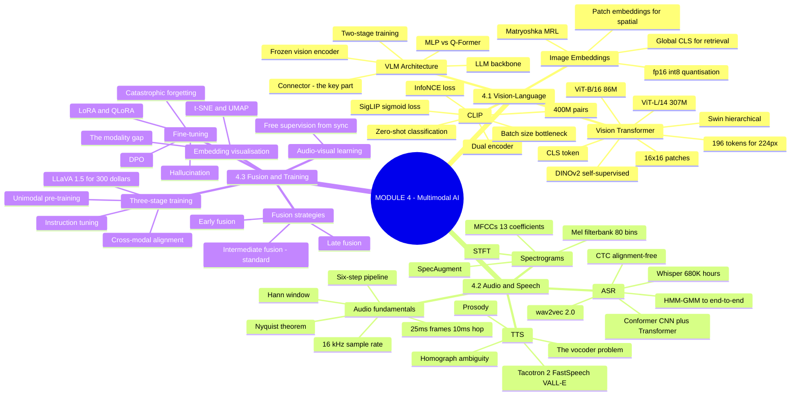
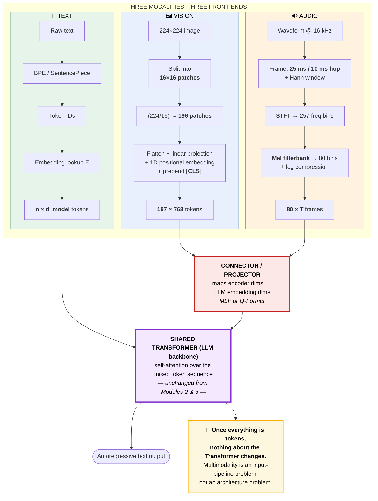
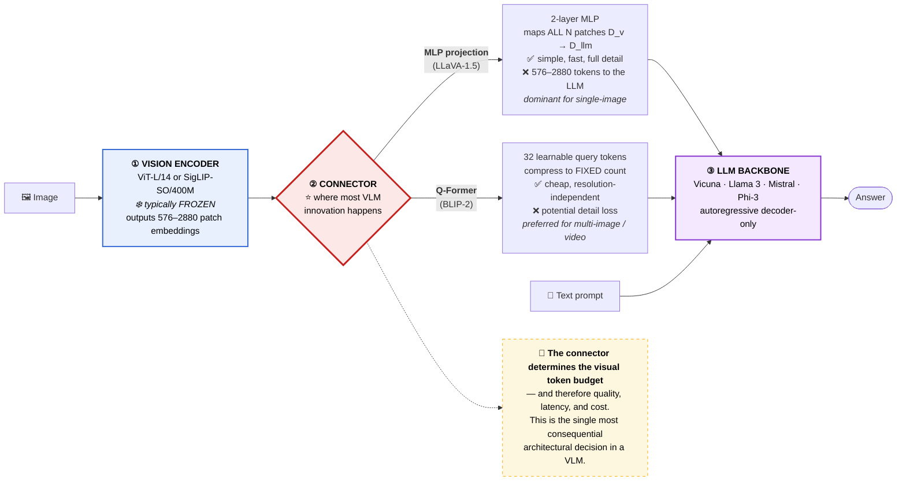
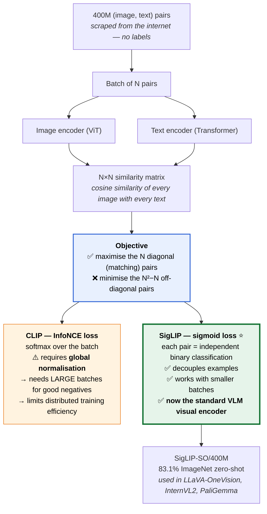
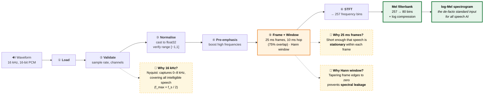
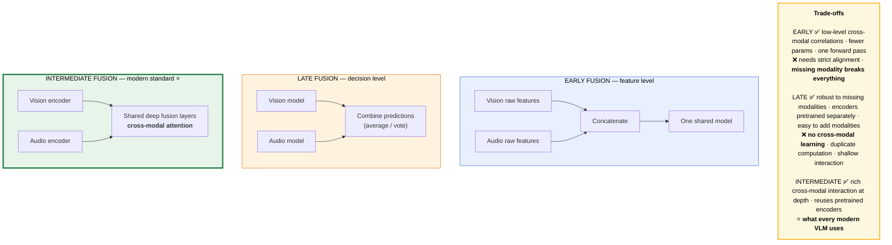
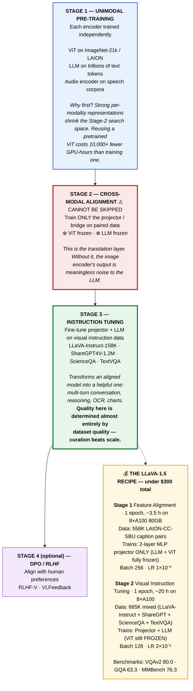
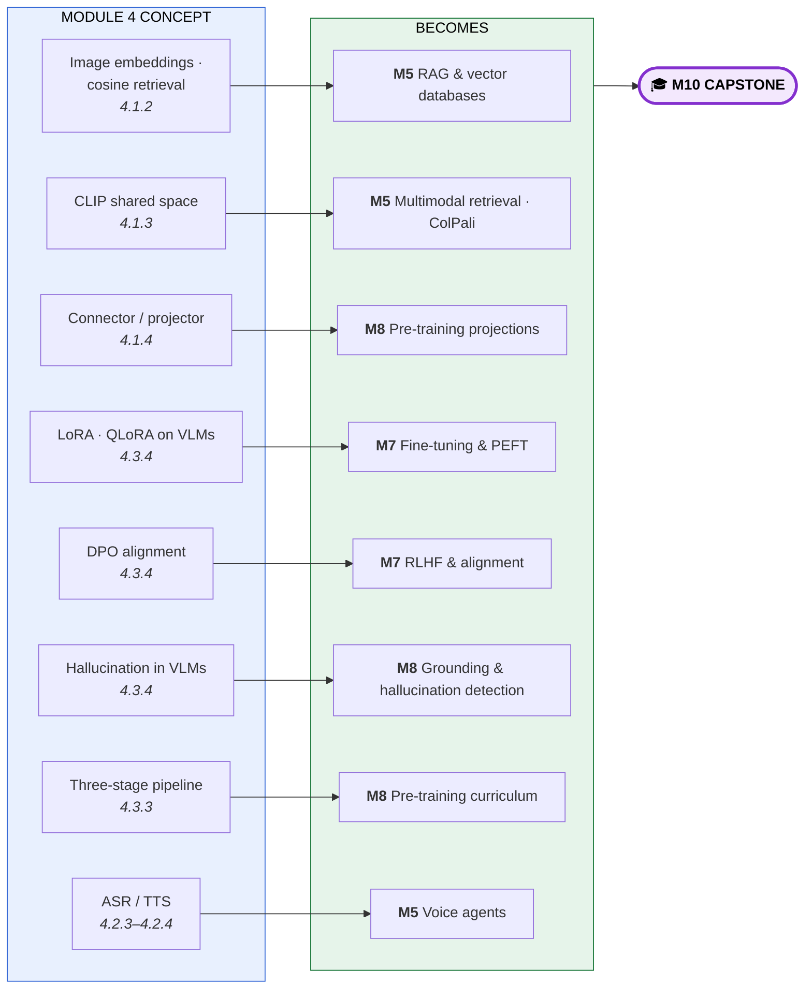

# Module 4 — Multimodal AI: Vision, Audio & Fusion · Study Notes

**Programme:** Advanced Certification in Agentic and Generative AI
**Institution:** IISc Bengaluru / TalentSprint · **Instructor:** Prof. Sashikumaar Ganesan
**Module duration:** 6 hours (Weeks 7–8) · **Prerequisite:** [M1](../M1/M1_Study_Notes.md) · [M2](../M2/M2_Study_Notes.md) · [M3](../M3/M3_Study_Notes.md)

> **What this module is really about.** Everything so far has been text. Module 4 asks: *how do images and audio enter the same Transformer?* The answer is startlingly simple and is the single idea to carry out of this module:
>
> ### 🔑 **Every modality becomes a sequence of tokens in a shared embedding space.**
> An image becomes 196 patch tokens. Audio becomes 80-bin Mel spectrogram frames. Once they are tokens, **the machinery from Modules 2 and 3 applies unchanged.** Multimodal AI is not a new architecture — it is a new *input pipeline* feeding the same architecture.

---

## Table of Contents

1. [Module map](#0-module-map)
2. [🗺️ Visual atlas](#-visual-atlas--mind-map--correlation-diagrams)
3. **4.1 Vision-Language Models**
   - [4.1.1 Vision Transformers (ViT)](#411--vision-transformers-vit)
   - [4.1.2 Image Embeddings](#412--image-embeddings)
   - [4.1.3 CLIP and Contrastive Learning](#413--clip-and-contrastive-learning)
   - [4.1.4 Vision-Language Model Architecture](#414--vision-language-model-architecture)
4. **4.2 Audio and Speech Models**
   - [4.2.1 Audio Processing Fundamentals](#421--audio-processing-fundamentals)
   - [4.2.2 Spectrogram and Audio Features](#422--spectrogram-and-audio-features)
   - [4.2.3 ASR — Automatic Speech Recognition](#423--asr--automatic-speech-recognition)
   - [4.2.4 TTS — Text-to-Speech](#424--tts--text-to-speech)
5. **4.3 Multimodal Fusion and Training**
   - [4.3.1 Multimodal Fusion Strategies](#431--multimodal-fusion-strategies)
   - [4.3.2 Audio-Visual Learning](#432--audio-visual-learning)
   - [4.3.3 Training Multimodal Systems](#433--training-multimodal-systems)
   - [4.3.4 Multimodal Fine-Tuning](#434--multimodal-fine-tuning)
   - [4.3.5 Multimodal Embedding Space Visualisation](#435--multimodal-embedding-space-visualisation)
6. [Assignment & Mini-Project 2](#assignment--mini-project-2)
7. [Master list of misconceptions](#master-list-of-misconceptions)
8. [Glossary](#glossary)
9. [References](#references-and-further-study)
10. [Self-check question bank](#self-check-question-bank)

---

## 0. Module map

| File | Concept ID | Content |
|---|---|---|
| `AI-MM-IN-TH-000002.pdf` | `AIMMINTH000002` | **4.1.1** Vision Transformers (ViT) |
| `AI-MM-IN-TH-000003.pdf` | — | **4.1.2** Image Embeddings |
| `AI-MM-IN-TH-000005.pdf` | — | **4.1.3** CLIP and Contrastive Learning |
| `AI-MM-IN-TH-000004.pdf` | — | **4.1.4** Vision-Language Model Architecture |
| `AI-MM-IN-TH-000006.pdf` | — | **4.2.1** Audio Processing Fundamentals |
| `AI-MM-IN-TH-000007.pdf` | — | **4.2.2** Spectrogram and Audio Features |
| `AI-MM-IN-TH-000008.pdf` | — | **4.2.3** ASR Models |
| `AI-MM-IN-TH-000009.pdf` | — | **4.2.4** TTS Systems |
| `AI-MM-IN-TH-000010.pdf` | — | **4.3.1** Multimodal Fusion Strategies |
| `AI-MM-IN-TH-000011.pdf` | — | **4.3.2** Audio-Visual Learning |
| `AI-MM-IN-TH-000012.pdf` | — | **4.3.3** Training Multimodal Systems |
| `AI-MM-IN-TH-000013.pdf` | — | **4.3.4** Multimodal Fine-Tuning |
| `AI-MM-IN-VZ-000001.pdf` | — | **4.3.5** Embedding Space Visualisation |
| `Topic1–Topic5_*.pdf` | — | **Session recaps** (M1.2, M2.2, M4.1, M3.1) |
| `Closing_The_Chain_Forward.pdf` | — | **Consolidation lecture** |
| `M4_AST_01_AI_Powered_Customer_Review_Insights_Pipeline.ipynb` | — | **Graded assignment** |
| `MP2_*_AI_Based_Incident_Management_System.ipynb` | — | **Mini-Project 2** |
| `M4-Additional-NB-01/02-Multimodal-Models-*.ipynb` | — | With / without OpenAI API |

> ℹ️ `AI-MM-IN-TH-000007` … `000013` also appear in the **M5** folder — they are the M4/M5 boundary decks. `Topic1`–`Topic5` are **recap decks** of earlier modules (probability & token prediction, autoregressive generation, self-attention, LLM APIs), not new content.

---

# 🗺️ Visual atlas — mind map & correlation diagrams

## A. Module 4 mind map



## B. ⭐ The master diagram — how every modality becomes tokens

> **The single idea of Module 4.** Three different physical signals, three different front-ends, one shared token space, one Transformer.



## C. VLM anatomy — three components, one critical choice



## D. Contrastive learning — CLIP vs SigLIP



## E. The audio pipeline — six universal steps



## F. Fusion strategies



## G. ⭐ The universal three-stage training pipeline



## H. ⭐ Master correlation — M4 → later modules



---

# 4.1 Vision-Language Models

## 4.1.1 — Vision Transformers (ViT)

> **Concept ID:** `AIMMINTH000002` · Paper: **"An Image is Worth 16×16 Words"** (Dosovitskiy et al., 2020)

### The core idea

> **Treat an image as a sequence of fixed-size patches, exactly as NLP treats text as a sequence of tokens.**

**The mechanics, step by step:**

| Step | Detail |
|---|---|
| **Patch size** | Typically **16×16 pixels**. A 224×224 image → $(224/16)^2 = $ **196 patches** |
| **Linear projection** | Each patch flattened (16×16×3 = 768-dim) then linearly projected to the embedding dimension |
| **`[CLS]` token** | A **learnable token prepended** to the sequence; serves as the **global image representation** |
| **Positional encoding** | **1D learnable** positional embeddings added to encode spatial order |

> ⭐ **This simple reframing allows any standard Transformer encoder to process images.** No convolutions required.

### The workhorse models

| Model | Patch | Params | Layers | $d$ | Output |
|---|---|---|---|---|---|
| **ViT-B/16** | 16×16 | 86M | 12 | 768 | 197 × 768 (196 + CLS) |
| **ViT-L/14** | 14×14 | 307M | 24 | 1024 | **257 × 1024** (256 + CLS) |

> The **"/14" suffix means 14×14 pixel patches** — finer granularity, **more tokens**, higher compute.

### Variants worth knowing

| Model | Innovation | Use for |
|---|---|---|
| **Swin Transformer** | ⚠️ ViT's global attention over 196 patches is $O(N^2)$ — expensive at high resolution. Swin uses **local window attention (7×7 patches) + shifted windows** for cross-window communication, producing **hierarchical multi-scale feature maps** like a CNN | Dense prediction (segmentation, detection) |
| **DINO / DINOv2** | **Self-supervised** — learns universal visual features without labels | Visual similarity |
| **SigLIP** | Contrastive (see 4.1.3) | ⭐ **VLM backbones** |
| **CLIP** | Contrastive | Text-image retrieval |

### Practical API pattern

```python
from transformers import CLIPVisionModel
# openai/clip-vit-large-patch14
out = model(pixel_values)          # last_hidden_state: [batch, 257, 1024]
global_emb = out.pooler_output     # CLS token → 1024-dim, for retrieval/classification
patch_emb  = out.last_hidden_state[:, 1:]   # 256 patches, for VQA / grounding
```

> `CLIPVisionModel` for **features only**; `CLIPModel` for **joint text-image scoring**.

> ⭐ **Visual token count is the key engineering variable:** more tokens = better detail but higher memory and latency. This trade-off drives every connector design decision in 4.1.4.

---

## 4.1.2 — Image Embeddings

> **Image embeddings are dense vectors in a learned semantic space — geometric distance encodes visual and semantic similarity.**

### Two types, two purposes

| Type | What | Use for |
|---|---|---|
| **Global** (`[CLS]` token) | One vector per image | **Retrieval, classification** |
| **Patch embeddings** | One vector per patch | **Spatial reasoning** in VLMs, VQA, grounding |

### Training objectives determine what the embedding is good at

| Objective | Method | Best for |
|---|---|---|
| **Supervised** | Cross-entropy on labels | Classification |
| **Contrastive** | CLIP / SigLIP | **Cross-modal retrieval** |
| **Self-supervised** | DINO / MAE | **Visual similarity** |

> ### 📌 The production selection rule (stated three times across the M4 decks)
> **SigLIP** for VLM backbones · **DINOv2** for visual similarity · **CLIP** for cross-modal retrieval.

### Storage engineering — scaling to billions of images

- **fp16** — halves storage
- **int8 quantisation** — 4× reduction
- **MRL (Matryoshka Representation Learning)** — use **sub-dimensions** of the same embedding, trading accuracy for size at query time

### ColPali — a notable application

> **ColPali eliminates the need for OCR preprocessing** — the vision encoder directly produces retrievable representations from **rendered page images**.

This is a genuinely different approach to document RAG: instead of OCR → text → embed, you embed the *page image itself*. → *relevant to Module 5*

### Domain-specific embeddings

⚠️ General-purpose CLIP/DINOv2 embeddings are **not optimal for medical images** — they were trained on natural photos, not X-rays or pathology slides.

| Model | Domain |
|---|---|
| **BioViL-T** (Microsoft, 2023) | ViT fine-tuned on chest X-ray ↔ radiology report pairs; zero-shot pneumonia detection |
| **CheXzero** | Chest X-ray |
| **UNI** (2024) | Pathology foundation model — 100k+ whole-slide images, ViT-L, 1B training patches |

> **The engineer's task is small:** replace the CLIP ViT with a domain-specific ViT in the embedding pipeline. **The rest of the stack (vector DB, retrieval) is identical.** Fine-tuning on ~50k domain pairs consistently outperforms general-purpose models.

---

## 4.1.3 — CLIP and Contrastive Learning

> **Contrastive learning** trains a model by comparing **positive pairs** (matching items) against **negative pairs** (non-matching) — **maximising similarity of matches, minimising similarity of non-matches.**
>
> ⭐ **No labels needed, at internet scale.** This is the training recipe behind CLIP, DINOv2, SimCLR, and MoCo.

### CLIP (Radford et al., 2021)

**Architecture:** a **dual encoder**
- **Image encoder:** ViT-B/32, ViT-B/16, or ViT-L/14 → one $D$-dim vector per image (via CLS)
- **Text encoder:** Transformer → one $D$-dim vector per caption
- **Training data:** **400M (image, text) pairs**

**The mechanism:** for a batch of $N$ pairs, compute the $N \times N$ cosine similarity matrix. The **$N$ diagonal entries are the true matches**; the $N^2 - N$ off-diagonal entries are negatives.

### InfoNCE loss — and why batch size became a bottleneck

**InfoNCE** (Noise Contrastive Estimation) is a **cross-entropy loss over the batch**, treating negatives as $N-1$ "distractor" classes.

> ⚠️ **The batch-size effect:** larger batches provide **more negatives per positive** → better representations. But InfoNCE requires **global normalisation over all $N$ pairs**, forcing very large batches and **limiting distributed training efficiency**.

### SigLIP — the fix (Zhai et al., 2023, Google)

> **Replace softmax normalisation with a sigmoid** — treat each (image, text) pair as an **independent binary classification** (match / no match).

| | **InfoNCE (CLIP)** | **Sigmoid (SigLIP)** |
|---|---|---|
| Normalisation | Global, over the batch | **Per-pair, independent** |
| Batch size | Must be large | **Works with small batches** |
| Distributed training | Constrained | Efficient |

> ⭐ **SigLIP-SO/400M has replaced CLIP ViT-L/14 as the preferred VLM visual encoder** in most new open-source VLMs — LLaVA-OneVision, InternVL2, PaliGemma.

### The CLIP family

| Model | Data | Loss | ImageNet 0-shot | Note |
|---|---|---|---|---|
| CLIP (OpenAI) | 400M | InfoNCE | 75.3% | Original, ViT-L/14 |
| OpenCLIP | LAION-2B | InfoNCE | 79.2% | Open-source |
| ALIGN (Google) | 1.8B | InfoNCE | 76.4% | Noisy data, EfficientNet |
| **SigLIP-SO/400M** | WebLI | **Sigmoid** | **83.1%** | ⭐ Current VLM standard |
| EVA-CLIP-18B | Merged | InfoNCE | 83.4% | Largest CLIP, ViT-G |
| MetaCLIP | CommonPool | InfoNCE | 80.5% | Data curation recipe |

> ⭐ **MetaCLIP (Meta, 2023) showed data curation is as important as scale** — a *balanced* 400M subset outperforms a *random* 400M by **6%** on ImageNet zero-shot.

### Zero-shot classification — how it actually works

1. Encode the image → image embedding
2. Encode candidate class names as text prompts: *"a photo of a {class}"*
3. Find the **text embedding nearest to the image embedding** by cosine similarity

> 💡 **Practical tip from the deck:** always compare zero-shot CLIP against a **fine-tuned linear probe** before deploying. A linear probe adds only ~1 hour of training and **often improves accuracy by 10–15%**.

---

## 4.1.4 — Vision-Language Model Architecture

> **VLM = Vision Encoder + Connector + Language Model**

| Component | Detail |
|---|---|
| **① Vision encoder** | Converts pixels to patch embeddings. **Typically ❄️ frozen** during VLM training. Default: **SigLIP-SO/400M** or **CLIP ViT-L/14** |
| **② Connector / projection** | The **bridge** mapping vision-encoder output dimensions into the LLM's embedding space |
| **③ LLM backbone** | Autoregressive decoder-only — Vicuna, Llama 3, Mistral, Phi-3 |

> ### 🔑 **The connector is the most critical and variable component.**
> It determines **how much visual information is preserved, how many tokens are used, and the training cost.** This is where most VLM architectural innovation occurs.

### Two connector designs

| | **MLP projection** (LLaVA-1.5) | **Q-Former** (BLIP-2) |
|---|---|---|
| Mechanism | 2-layer MLP maps **all $N$ patch embeddings** from $D_v \to D_{llm}$ | Lightweight Transformer with **$N_q = 32$ learnable query tokens** |
| Token count | **576–2880** visual tokens passed to the LLM | **Fixed 32 tokens**, regardless of image resolution |
| Pros | Simple, fast, **no compression → full detail** | **Cheap**, resolution-independent |
| Cons | High token cost → high latency and memory | **Potential detail loss** |
| Preferred for | ⭐ **Single-image tasks** (currently dominant) | **Multi-image and video** |

**BLIP-2's Q-Former training:** Stage 1 trains the Q-Former with a frozen ViT on **three simultaneous losses** — image-text matching, image-text contrastive, and image-grounded text generation. Stage 2 connects the 32 output tokens to a frozen LLM (FlanT5-XXL or OPT-66B) via a linear projection.

**LLaVA-1.5 (2023):** CLIP ViT-L/14@336 + 2-layer MLP + Vicuna-13B — state-of-the-art on 11/12 benchmarks at the time, **demonstrating that a simple MLP connector is sufficient**.

### Two-stage training (see Diagram G for the full recipe)

| Stage | What trains | Data | Cost |
|---|---|---|---|
| **1 — Modality alignment** | ⭐ **Connector ONLY** (❄️ ViT and LLM frozen) | LAION-CC-SBU, ShareCaptioner (~600K) | Hours on 8 GPUs — inexpensive |
| **2 — Instruction tuning** | Connector + LLM (ViT usually still frozen) | LLaVA-665K, ShareGPT4V | The expensive stage |
| **3 — DPO/RLHF** (optional) | Preference alignment | RLHF-V, VLFeedback | — |

> ⚠️ **Stage 2 quality is determined almost entirely by instruction dataset quality — curation matters more than scale.**

### Deployment

| Need | Stack |
|---|---|
| On-premise | **vLLM + InternVL2** |
| Managed | OpenAI / Anthropic APIs |
| Local development | **Ollama + LLaVA** |

**High-value applications:** document intelligence · chart extraction · visual QA · manufacturing quality control.

---

# 4.2 Audio and Speech Models

## 4.2.1 — Audio Processing Fundamentals

### The five facts that matter

| # | Fact | Why |
|---|---|---|
| **1** | **Sample rate determines frequency range.** **16 kHz is the speech AI standard** | **Nyquist:** $f_{max} = f_s / 2$ → captures 0–8 kHz, covering all intelligible speech |
| **2** | **Bit depth determines dynamic range.** 32-bit float internally, **16-bit PCM on disk** | ⚠️ **Always cast to float32 on load and verify range** |
| **3** | **Framing solves non-stationarity.** **25 ms frames, 10 ms hop (75% overlap)** | Short enough for speech to be **stationary within each frame** |
| **4** | **Hann window eliminates spectral leakage** | Tapering frame edges to zero prevents energy from one frequency **bleeding into adjacent bins** |
| **5** | **The 6-step pipeline is universal** | Load → Validate → Normalise → Pre-emphasis → Frame+Window → STFT |

> ⭐ **Every audio AI system — from Whisper to wav2vec — applies this exact chain.**

---

## 4.2.2 — Spectrogram and Audio Features

### The six essential points

| Concept | Detail |
|---|---|
| **STFT** | Windowed FFT over overlapping 25 ms frames → complex matrix (**257 frequency bins**). **Spectrogram = \|STFT\|²** |
| **Mel filterbank** | **257 linear bins → 80 Mel bins** via triangular filters, then **log compression** → **log-Mel spectrogram**, the de-facto standard for speech AI |
| **MFCCs** | Mel energies → log → **DCT** → **13 coefficients**. Adds a **decorrelation** step. Used for **edge/embedded systems** where memory is critical. **MFCCs + Δ + ΔΔ = 39-dim vector per frame** |
| **SpecAugment** | Mask random **frequency and time bands** directly on the Mel spectrogram. Reduces WER significantly. **Used in all modern ASR training pipelines** |
| **Whisper's template** | **80 Mel bins, 25 ms / 10 ms, 30-second chunks** |

> ### ⚠️ The Mel spectrogram IS the model contract
> **The feature extraction parameters must match exactly between training and inference.** A mismatch in sample rate, hop length, or Mel bin count silently destroys accuracy. This is the most common production bug in speech AI.

---

## 4.2.3 — ASR: Automatic Speech Recognition

### The formal problem

$$W^* = \arg\max_W P(W \mid X)$$

Find the word sequence maximising the posterior probability given audio. **Bayes' theorem** decomposes this into **acoustic model × language model**.

### 50 years of evolution

> **HMM-GMM → end-to-end deep learning.** Each era eliminated more hand-engineering. **Today's SOTA treats ASR as sequence modelling — the same architecture family as GPT for text.**

### The four key technologies

| Technology | Innovation |
|---|---|
| **CTC** (Connectionist Temporal Classification) | ⭐ **Alignment-free training.** A **blank token** + marginalising over all valid alignments means **no frame-level labels are needed**. Essential for streaming (Conformer-Transducer) |
| **Conformer** | **CNN + Transformer** — local acoustic patterns (CNN) + global context (Transformer). **Industry standard for production ASR**; **15.9% relative WER improvement** vs pure Transformer |
| **Whisper** | **Weak supervision at scale** — **680K hours** + weak labels = near-human WER on **99 languages with zero fine-tuning**. *Data scale beat data quality* |
| **wav2vec 2.0** | **Self-supervised for low-resource languages** — **10 minutes of labelled data → <5% WER**. Enables ASR for languages without large datasets |

> **WER (Word Error Rate)** is the standard metric.

---

## 4.2.4 — TTS: Text-to-Speech

### The four core challenges

| Challenge | What it means |
|---|---|
| **Homograph ambiguity** | *"read"* (present) vs *"read"* (past); *"lead"* the metal vs *"lead"* the verb |
| **Prosody inference** | Rhythm, stress, intonation — **not present in the text** |
| **Naturalness gap** | The residual perceptual distance from human speech |
| **The vocoder problem** | ⭐ Converting a Mel spectrogram back into a **waveform** is itself a hard generative task |

**The architectural lineage:** **Tacotron 2** (attention-based seq2seq) → **FastSpeech 2** (non-autoregressive, faster) → **VALL-E** (neural codec language model, **zero-shot voice cloning** from seconds of audio).

> Each generation of TTS architecture attacked one of the four challenges.

---

# 4.3 Multimodal Fusion and Training

## 4.3.1 — Multimodal Fusion Strategies

> **Fusion** is how AI combines modalities — the **explicit representation merging** of vision, audio, and language into a unified understanding.

### Early fusion (feature level)

Concatenates or combines **raw feature representations** from all modalities **before** any shared processing.

| ✅ Advantages | ❌ Disadvantages |
|---|---|
| Captures low-level cross-modal correlations **from the first layer** | Requires **strict temporal and spatial alignment** |
| Single shared model — **fewer parameters** | ⚠️ **A missing modality at inference breaks the entire model** |
| Works well when modalities are **tightly aligned** (synchronised audio-video) | |
| **Real-time**: one forward pass, one model | |

*Example: early audio-visual models (2016–2018) concatenating visual and audio embeddings before a shared classifier.*

### Late fusion (decision level)

Train a **separate model per modality**; combine **final predictions** with a lightweight fusion layer (average, vote, small network).

| ✅ | ❌ |
|---|---|
| **Robust to missing modalities** at inference | **No cross-modal learning** — misses interactions |
| Each modality model **pretrained separately** | **Duplicate computation** for shared semantics |
| Easy to add/remove modalities | **Shallow** interaction only |

### Intermediate fusion ⭐ (modern standard)

Process each modality through **dedicated encoders** to extract rich representations, then **combine those representations in a shared deep fusion stage** — typically **cross-modal attention**.

> **This is what every modern VLM does.** It gets the pretrained-encoder benefit of late fusion *and* the deep interaction benefit of early fusion.

---

## 4.3.2 — Audio-Visual Learning

> ### 🔑 Free supervision from video synchrony
> **Physical causality** — a visual event causes an audio event — provides **virtually unlimited training signal** with no human labels. A door closing *looks* and *sounds* like a door closing, and the two are automatically time-aligned in any video.

**Key models:** **AV-HuBERT** (audio-visual speech representation) · **AudioCLIP** (extends CLIP to audio). Techniques: **contrastive self-supervised learning** with **temporal alignment**.

---

## 4.3.3 — Training Multimodal Systems

> **The three-stage pipeline is universal.** GPT-4o, Gemini, and LLaVA all follow it. *(See Diagram G for the full picture and the LLaVA-1.5 recipe.)*

### Stage 1 — Unimodal pre-training

Each encoder pre-trained **independently**: ViT on ImageNet-21k/LAION; LLM on trillions of text tokens; audio encoder on speech corpora.

> **Why start unimodal?** Strong per-modality representations **reduce the search space** for Stage 2. Reusing a pretrained encoder costs **10,000× fewer GPU-hours** than training a ViT from scratch.

### Stage 2 — Cross-modal alignment ⚠️

**What trains:** the projector/bridge only. **What is frozen:** both encoders.

> ⚠️ **Stage 2 cannot be skipped.** Without cross-modal alignment, the image encoder's output is **meaningless tokens to the LLM**. Stage 2 *is* the translation layer.

### Stage 3 — Instruction tuning

**Goal:** transform an *aligned* model into a *helpful* one.

| Dataset | What it provides |
|---|---|
| **LLaVA-Instruct-158K** | GPT-4-generated instruction data from COCO images: conversations, detailed descriptions, complex reasoning |
| **ShareGPT4V-1.2M** | 1.2M **GPT-4V-generated** image-text pairs — higher caption quality than LLaVA-Instruct. Used in LLaVA-1.5, InternVL |
| **ScienceQA + TextVQA** | Multimodal reasoning over scientific figures, diagrams, charts, text-in-image |

**Curriculum learning:** present training data in **increasing difficulty** — Phase 1 simple image-text pairs with clear correspondence (single objects, short captions, high CLIP score) → later phases with complex scenes and reasoning.

---

## 4.3.4 — Multimodal Fine-Tuning

### Why pre-trained VLMs fail on domain data

| Domain | Failure |
|---|---|
| **Manufacturing** | Cannot identify defects — no exposure during pre-training |
| **Scientific figures** | Misinterprets chemical structures, biological diagrams, research plots |
| **Legal / financial documents** | No exposure to contract language or financial table structures. **Hallucination rate is very high on structured documents** |

> ### 💰 The ROI
> Domain fine-tuning routinely **reduces task error rates by 30–60%** versus the out-of-box model. **Even 1,000 domain-specific (image, QA) pairs can yield significant improvement.** The cost is often **<$50** for LoRA.

### LoRA — Low-Rank Adaptation

$$W' = W + \Delta W = W + \frac{\alpha}{r}\,B\!\cdot\!A \qquad A \in \mathbb{R}^{d \times r},\; B \in \mathbb{R}^{r \times d},\; r \ll d$$

**Why low-rank works:** pre-training updates to $W$ have **low intrinsic dimensionality**. The effective rank of fine-tuning updates is empirically **much smaller than $d$**. A 4096×4096 matrix (16M params) is well approximated by rank-16 $BA$ (**128K params**).

> ⭐ **Key implementation detail: initialise $B = 0$** so $\Delta W = 0$ at start — fine-tuning begins from the pretrained model **without disruption**. $A$ is randomly initialised from a normal distribution. The $\alpha/r$ scaling prevents the effective learning rate from changing with rank.

**Trains only 1–3% of parameters while retaining 98%+ of general capability.**

### QLoRA (Dettmers et al., 2023)

**4-bit NormalFloat (NF4) quantisation + LoRA adapters = 75% GPU memory reduction.**

- Base model **frozen and quantised to 4-bit NF4** (optimal for normally distributed weights)
- **LoRA adapters trained in bfloat16**
- **Double quantisation** (quantising the quantisation constants) saves more

| LLaVA-13B (r=16) | Hardware | Cost/epoch | Performance |
|---|---|---|---|
| **Full fine-tuning** | 4×80GB A100 | ~$500 | baseline |
| **QLoRA** | **1×24GB RTX 3090** | **~$30** | **typically <2% difference** on standard VQA |

> ⭐ **This democratises multimodal fine-tuning for academics and small teams.**

### DPO vs RLHF for alignment

| **RLHF** (3-stage, complex) | **DPO** ⭐ (preferred) |
|---|---|
| ① Collect human preference pairs | Same preference data |
| ② Train a **separate reward model** | ❌ **No reward model needed** |
| ③ **PPO** optimisation against the reward model | ❌ **No PPO training loop** |
| Unstable, many moving parts | **Simpler, more stable** |

$$\mathcal{L}_{DPO} = -\mathbb{E}\Big[\log \sigma\Big(\beta \log \tfrac{\pi_\theta(y_w|x)}{\pi_{ref}(y_w|x)} - \beta \log \tfrac{\pi_\theta(y_l|x)}{\pi_{ref}(y_l|x)}\Big)\Big]$$

where $y_w$ = preferred response, $y_l$ = rejected response. → *Module 7 covers this in full*

### Two failure modes to manage

- **Hallucination** — VLMs describing objects not present in the image. Mitigated by DPO on preference data (RLHF-V) and grounding
- **Catastrophic forgetting** — domain fine-tuning erasing general capability. **LoRA mitigates this by isolation** — the base weights are untouched

---

## 4.3.5 — Multimodal Embedding Space Visualisation

1. A **multimodal embedding space** maps images, text, and audio to the **same high-dimensional space**, enabling cross-modal comparison
2. **t-SNE** and **UMAP** reduce embeddings to 2D/3D while preserving **neighbourhood structure**
3. In a well-aligned space, **semantic clusters span modalities** — an image of a cat and the word "cat" appear near each other
4. ⚠️ **The modality gap:** even CLIP keeps image and text embeddings in **separate regions** of the space — a known limitation under active research
5. **Nearest-neighbour retrieval and Recall@K** provide **quantitative** validation of alignment quality (don't trust the picture alone)
6. **Tools:** TensorBoard Projector · Nomic Atlas · Renumics Spotlight

> ⭐ **The modality gap is worth internalising.** "Shared embedding space" is an idealisation — in practice the modalities occupy adjacent but distinct cones. This is why cross-modal retrieval works but is imperfect.

---

## Assignment & Mini-Project 2

| Item | Detail |
|---|---|
| **`M4_AST_01_AI_Powered_Customer_Review_Insights_Pipeline.ipynb`** | **Graded assignment** |
| **Mini-Project 2: AI-based Incident Management System** | **Part A:** 12 Apr 2026, Sun 9:00–12:30 · **Part B:** 19 Apr 2026, Sun 9:00–12:30 |
| `MP2_SNB_/_Updated__MP2_NB_AI_Based_Incident_Management_System.ipynb` | Project notebooks |
| `M4-Additional-NB-01-Multimodal-Models-Without-OpenAI-API.ipynb` | ⭐ Run VLMs without a paid API |
| `M4-Additional-NB-02-Multimodal-Models-With-OpenAI-API.ipynb` | API version |
| `Supplementary_Notebook_-_Building_a_Simple_Real-time_Dashboard_using_Gradio.ipynb` | Gradio UI |
| `Additional_NB_01_Prompt_Engineering.ipynb` (+ solution) · `Additional_NB_02_LangChain_Basics.ipynb` | M2 follow-ons |

> 💡 **Note the "with / without OpenAI API" pairing.** Do the *without* version — running LLaVA locally via Ollama teaches you far more about the connector and token budget than an API call does.

---

## Master list of misconceptions

| ❌ Myth | ✅ Reality |
|---|---|
| "Multimodal models need a fundamentally new architecture" | ⭐ **No** — every modality becomes tokens; the **Transformer is unchanged**. Multimodality is an input-pipeline problem |
| "ViT needs convolutions" | ViT is **pure Transformer** — patches replace convolutional feature extraction entirely |
| "More visual tokens is always better" | More detail **but** higher memory and latency. The connector choice is a genuine trade-off |
| "The vision encoder is trained with the VLM" | It is **typically frozen** in both training stages |
| "CLIP and SigLIP differ in architecture" | They differ in the **loss function** — softmax/InfoNCE vs sigmoid |
| "Bigger CLIP training data is always better" | **MetaCLIP:** a *balanced* 400M subset beat a *random* 400M by **6%**. Curation ≈ scale |
| "Zero-shot CLIP is as good as it gets" | A **linear probe** adds ~1 hour and often **+10–15% accuracy** |
| "Stage 2 alignment can be skipped if the LLM is strong" | ⚠️ **It cannot.** Without it the visual tokens are meaningless noise to the LLM |
| "Instruction-tuning quality scales with dataset size" | **Curation matters more than scale** |
| "Early fusion is simplest so it's safest" | ⚠️ **A missing modality at inference breaks the entire model** |
| "Late fusion is a reasonable modern default" | It has **no cross-modal learning**. Intermediate fusion is the standard |
| "A shared embedding space means images and text overlap" | ⚠️ **The modality gap** — even CLIP keeps them in **separate regions** |
| "t-SNE plots prove your embeddings are aligned" | Use **Recall@K / nearest-neighbour retrieval** for quantitative proof |
| "Fine-tuning a VLM requires a GPU cluster" | **QLoRA fine-tunes a 13B VLM on one 24GB GPU for ~$30/epoch** |
| "LoRA rank should be as high as possible" | Updates have **low intrinsic dimensionality**; rank 16 approximates a 4096² matrix well |
| "DPO is just a simpler RLHF" | It **eliminates the reward model and the PPO loop entirely** — structurally different |
| "General VLMs work fine on medical/industrial images" | Hallucination rates are **very high** on out-of-domain structured content |
| "Any sample rate works for speech" | **16 kHz is the standard** — Nyquist gives 0–8 kHz, covering intelligible speech |
| "Feature extraction parameters are a detail" | ⚠️ **The Mel spectrogram is the model contract.** Mismatched params silently destroy accuracy |
| "ASR needs frame-level labels" | **CTC is alignment-free** — that was its whole point |
| "Whisper is good because of clean data" | **Whisper used *weak* labels at 680K hours.** Data *scale* beat data *quality* |
| "TTS is solved once you generate a spectrogram" | ⚠️ **The vocoder problem** — spectrogram → waveform is itself a hard generative task |

---

## Glossary

| Term | Definition |
|---|---|
| **ALIGN** | Google's noisy-data CLIP variant (1.8B pairs) |
| **ASR** | Automatic Speech Recognition |
| **AV-HuBERT** | Audio-visual self-supervised speech model |
| **BLIP-2** | VLM using a Q-Former connector |
| **CLIP** | Contrastive Language-Image Pre-training; dual encoder, InfoNCE, 400M pairs |
| **`[CLS]` token** | Learnable token prepended to patches; serves as global image representation |
| **ColPali** | Document retrieval directly from rendered page images — no OCR |
| **Conformer** | CNN + Transformer ASR architecture; industry standard |
| **Connector / projector** | The bridge mapping vision-encoder output into the LLM embedding space |
| **CTC** | Connectionist Temporal Classification — alignment-free ASR training |
| **DINO / DINOv2** | Self-supervised visual feature learning |
| **DPO** | Direct Preference Optimisation — alignment without a reward model or PPO |
| **Early / late / intermediate fusion** | Feature-level / decision-level / representation-level modality combination |
| **Hann window** | Tapering function preventing spectral leakage |
| **InfoNCE** | Contrastive loss requiring global batch normalisation |
| **LLaVA** | Open VLM family; LLaVA-1.5 trained for <$300 |
| **Mel filterbank** | Triangular filters compressing 257 linear bins to 80 perceptual bins |
| **MFCC** | Mel-Frequency Cepstral Coefficients — Mel → log → DCT → 13 coefficients |
| **Modality gap** | Images and text occupy separate regions even in a "shared" space |
| **MRL** | Matryoshka Representation Learning — usable embedding sub-dimensions |
| **NF4** | 4-bit NormalFloat quantisation used by QLoRA |
| **Nyquist theorem** | $f_{max} = f_s/2$ — why 16 kHz captures speech |
| **Q-Former** | BLIP-2 connector compressing to 32 fixed query tokens |
| **QLoRA** | 4-bit quantisation + LoRA; 13B VLM on a 24GB GPU |
| **Recall@K** | Quantitative retrieval metric for embedding alignment |
| **SigLIP** | Sigmoid-loss CLIP variant; current VLM encoder standard |
| **SpecAugment** | Masking frequency/time bands on the Mel spectrogram for augmentation |
| **STFT** | Short-Time Fourier Transform |
| **Swin Transformer** | Hierarchical ViT with shifted local window attention |
| **t-SNE / UMAP** | Dimensionality reduction for embedding visualisation |
| **TTS** | Text-to-Speech |
| **VALL-E** | Neural codec TTS with zero-shot voice cloning |
| **ViT-B/16, ViT-L/14** | Vision Transformer variants (patch size / scale) |
| **VLM** | Vision-Language Model |
| **Vocoder problem** | Converting a spectrogram back to a waveform |
| **wav2vec 2.0** | Self-supervised ASR; 10 min labelled data → <5% WER |
| **WER** | Word Error Rate — the ASR metric |
| **Whisper** | OpenAI ASR; 680K hours weak supervision, 99 languages |

---

## References and further study

### 📕 Books

| Book | Read for Module 4 |
|---|---|
| **Speech and Language Processing** — Jurafsky & Martin | ⭐ **Ch. 15–16: ASR (Whisper) and TTS (EnCodec, VALL-E)** — the course reading list maps M4 here explicitly. [Free](https://web.stanford.edu/~jurafsky/slp3) |
| **Hands-On Large Language Models** — Alammar & Grootendorst | Multimodal and embedding chapters |
| **AI Engineering** — Chip Huyen | Multimodal application patterns |

### 📄 Papers — the M4 canon

| Paper | Link | Section |
|---|---|---|
| ⭐ **An Image is Worth 16×16 Words (ViT)** — Dosovitskiy 2020 | [arXiv:2010.11929](https://arxiv.org/abs/2010.11929) | 4.1.1 |
| **Swin Transformer** — Liu 2021 | [arXiv:2103.14030](https://arxiv.org/abs/2103.14030) | 4.1.1 |
| **DINOv2** — Oquab 2023 | [arXiv:2304.07193](https://arxiv.org/abs/2304.07193) | 4.1.1–4.1.2 |
| ⭐ **CLIP** — Radford 2021 | [arXiv:2103.00020](https://arxiv.org/abs/2103.00020) | 4.1.3 |
| ⭐ **SigLIP** — Zhai 2023 | [arXiv:2303.15343](https://arxiv.org/abs/2303.15343) | 4.1.3 |
| **MetaCLIP** — Xu 2023 | [arXiv:2309.16671](https://arxiv.org/abs/2309.16671) | 4.1.3 — data curation |
| ⭐ **LLaVA / Visual Instruction Tuning** — Liu 2023 | [arXiv:2304.08485](https://arxiv.org/abs/2304.08485) | 4.1.4, 4.3.3 |
| **LLaVA-1.5** — Liu 2023 | [arXiv:2310.03744](https://arxiv.org/abs/2310.03744) | ⭐ **The $300 recipe** |
| **BLIP-2 / Q-Former** — Li 2023 | [arXiv:2301.12597](https://arxiv.org/abs/2301.12597) | 4.1.4 |
| **Flamingo** — Alayrac 2022 | [arXiv:2204.14198](https://arxiv.org/abs/2204.14198) | 4.1.4 |
| ⭐ **Whisper** — Radford 2022 | [arXiv:2212.04356](https://arxiv.org/abs/2212.04356) | 4.2.3 |
| **wav2vec 2.0** — Baevski 2020 | [arXiv:2006.11477](https://arxiv.org/abs/2006.11477) | 4.2.3 |
| **Conformer** — Gulati 2020 | [arXiv:2005.08100](https://arxiv.org/abs/2005.08100) | 4.2.3 |
| **CTC** — Graves 2006 | [ICML](https://www.cs.toronto.edu/~graves/icml_2006.pdf) | 4.2.3 |
| **Tacotron 2** — Shen 2018 | [arXiv:1712.05884](https://arxiv.org/abs/1712.05884) | 4.2.4 |
| **VALL-E** — Wang 2023 | [arXiv:2301.02111](https://arxiv.org/abs/2301.02111) | 4.2.4 |
| **SpecAugment** — Park 2019 | [arXiv:1904.08779](https://arxiv.org/abs/1904.08779) | 4.2.2 |
| ⭐ **LoRA** — Hu 2021 | [arXiv:2106.09685](https://arxiv.org/abs/2106.09685) | 4.3.4 |
| ⭐ **QLoRA** — Dettmers 2023 | [arXiv:2305.14314](https://arxiv.org/abs/2305.14314) | 4.3.4 |
| **DPO** — Rafailov 2023 | [arXiv:2305.18290](https://arxiv.org/abs/2305.18290) | 4.3.4 |
| **The Modality Gap** — Liang 2022 | [arXiv:2203.02053](https://arxiv.org/abs/2203.02053) | 4.3.5 |
| **ColPali** — Faysse 2024 | [arXiv:2407.01449](https://arxiv.org/abs/2407.01449) | 4.1.2 |

### 🔗 Tools & docs

| Resource | Link | For |
|---|---|---|
| **HuggingFace Transformers — VLMs** | [huggingface.co/docs/transformers](https://huggingface.co/docs/transformers/model_doc/llava) | 4.1.4 |
| **Ollama** (run LLaVA locally) | [ollama.com](https://ollama.com/) | ⭐ 4.1.4 |
| **OpenCLIP** | [github.com/mlfoundations/open_clip](https://github.com/mlfoundations/open_clip) | 4.1.3 |
| **librosa** (audio processing) | [librosa.org](https://librosa.org/) | ⭐ 4.2.1–4.2.2 |
| **HuggingFace Audio Course** | [huggingface.co/learn/audio-course](https://huggingface.co/learn/audio-course) | ⭐ **All of 4.2** |
| **TensorBoard Projector** | [projector.tensorflow.org](https://projector.tensorflow.org/) | 4.3.5 |
| **Nomic Atlas** | [atlas.nomic.ai](https://atlas.nomic.ai/) | 4.3.5 |
| **PEFT (LoRA/QLoRA)** | [huggingface.co/docs/peft](https://huggingface.co/docs/peft) | 4.3.4 |
| **vLLM** | [docs.vllm.ai](https://docs.vllm.ai/) | 4.1.4 deployment |

### 📌 Study strategy for Weeks 7–8

1. **Run `ollama run llava` and feed it an image.** Before any theory — see the thing work
2. Load a ViT in HuggingFace and **print `last_hidden_state.shape`**. Confirm 197 or 257 with your own eyes
3. With `librosa`: load a WAV, plot the waveform, plot the **Mel spectrogram**. The 4.2 material becomes obvious in ten minutes
4. Run **CLIP zero-shot classification** on five of your own photos with class names you invent
5. Read the **LLaVA-1.5 paper's training section** alongside Diagram G — the numbers in the diagram are from that paper
6. If you have any GPU access, **do a QLoRA fine-tune**. The $30 figure is real

---

## Self-check question bank

### 4.1 Vision
1. State the single idea that makes multimodal AI work.
2. A 224×224 image with 16×16 patches produces how many patches? How many tokens reach the encoder?
3. What is the `[CLS]` token for, and where does it come from?
4. ViT-B/16 vs ViT-L/14 — parameters, patch size, output shape?
5. What problem does Swin Transformer solve, and how?
6. Which encoder for VLM backbones? For visual similarity? For cross-modal retrieval?
7. When would you use patch embeddings rather than the global CLS embedding?
8. Explain contrastive learning in one sentence. Why does it need no labels?
9. What exactly does InfoNCE require that forces large batches?
10. How does SigLIP fix that, and what did it become?
11. What did MetaCLIP demonstrate about data?
12. How does CLIP zero-shot classification actually work, step by step?
13. Name the three VLM components. Which is usually frozen?
14. MLP connector vs Q-Former: token counts, pros, cons, when to use each.
15. What does the connector determine?

### 4.2 Audio
16. Why 16 kHz? Cite the theorem.
17. Why 25 ms frames with 10 ms hop?
18. What does the Hann window prevent?
19. List the six steps of the universal audio pipeline.
20. STFT gives how many frequency bins? Mel filterbank reduces to how many?
21. What extra step do MFCCs add, and when would you use them over log-Mel?
22. What is SpecAugment and where is it applied?
23. What does "the Mel spectrogram is the model contract" mean in practice?
24. Write the formal ASR objective. How does Bayes decompose it?
25. What problem does CTC solve? What is the blank token for?
26. What is a Conformer, and what WER improvement did it show?
27. Whisper: how many hours, what supervision quality, how many languages?
28. wav2vec 2.0: how much labelled data for <5% WER?
29. Name the four core TTS challenges.
30. What is the vocoder problem?

### 4.3 Fusion & training
31. Compare early, late, and intermediate fusion on cross-modal learning and robustness to a missing modality.
32. Which fusion strategy do modern VLMs use?
33. Where does "free supervision" in audio-visual learning come from?
34. Name the three universal training stages. Which one cannot be skipped, and why?
35. What trains in Stage 1 of LLaVA? What is frozen?
36. Roughly what did LLaVA-1.5 cost, and on what hardware?
37. Write the LoRA update formula. Why initialise $B = 0$?
38. Why does low-rank adaptation work at all?
39. QLoRA: what quantisation, what GPU, what cost, what performance delta?
40. How does DPO differ structurally from RLHF?
41. What is catastrophic forgetting, and how does LoRA mitigate it?
42. What is the modality gap, and why does it matter?
43. Why shouldn't you trust a t-SNE plot alone to prove alignment?

---

*Study notes compiled from the Module 4 source decks. Concept IDs preserved for cross-referencing.*
*Series: [M1](../M1/M1_Study_Notes.md) · [M2](../M2/M2_Study_Notes.md) · [M3](../M3/M3_Study_Notes.md) · **M4** · M5 · M6 · M7 · M8 · M9 · M10*
