# Module 5 — Agentic AI: Agents, ReAct, Planning & RAG · Study Notes

**Programme:** Advanced Certification in Agentic and Generative AI
**Institution:** IISc Bengaluru / TalentSprint · **Instructor:** Prof. Sashikumaar Ganesan
**Module duration:** 6 hours (Weeks 9–10) · **Prerequisite:** M1–M4

> **What this module is really about.** Everything before this produced *text*. Module 5 produces *actions*. The pivot is one sentence from the very first deck:
>
> ### 🔑 **A chatbot responds. An agent solves. The loop is what makes the difference.**
>
> This is the module the whole programme is named after, and it is where the course's economics get real: nearly every deck quotes a **cost per query**. Agentic AI is an engineering discipline with a P&L, not a research demo.

---

## Table of Contents

1. [Module map](#0-module-map)
2. [🗺️ Visual atlas](#-visual-atlas--mind-map--correlation-diagrams)
3. **5.1 Agent Fundamentals**
   - [5.1.1 What is an AI Agent?](#511--what-is-an-ai-agent)
   - [5.1.2 Agent Anatomy](#512--agent-anatomy-perception-decision-action)
   - [5.1.3 Simple Reactive Agents](#513--simple-reactive-agents)
   - [5.1.4 Agents with Memory](#514--agents-with-memory)
   - [5.1.5 Agent Goals and Objectives](#515--agent-goals-and-objectives)
   - [5.1.6 LLMs as Agent Brains](#516--llms-as-agent-brains)
   - [5.1.7 SLMs as Lightweight Agent Engines](#517--slms-as-lightweight-agent-engines)
   - [5.1.8 Building a Simple Agent (lab)](#518--building-a-simple-agent-coding-lab)
4. **5.2 The ReAct Framework**
   - [5.2.1 ReAct: Reasoning + Acting](#521--react-reasoning--acting)
   - [5.2.2 The Thought-Action-Observation Loop](#522--the-thought-action-observation-loop)
   - [5.2.3 Tool Use and Function Calling](#523--tool-use-and-function-calling)
   - [5.2.4 ReAct Loop Visualisation](#524--react-loop-visualisation)
   - [5.2.5 When to Reason vs. Act](#525--when-to-reason-vs-act)
   - [5.2.6 Self-Reflection (Reflexion)](#526--self-reflection-and-iterative-refinement)
   - [5.2.7 Implementing ReAct (lab)](#527--implementing-react-agents-coding-lab)
5. **5.3 Planning and Decomposition**
   - [5.3.1 Classical Planning](#531--classical-planning)
   - [5.3.2 LLM-Based Planning](#532--llm-based-planning)
   - [5.3.3 Hybrid Planning](#533--hybrid-planning-approaches)
   - [5.3.4 Task Decomposition](#534--task-decomposition)
   - [5.3.5 Goal-Directed Behaviour](#535--goal-directed-behaviour)
   - [5.3.6 Cognitive Architectures](#536--cognitive-architectures-loops-to-state-graphs)
   - [5.3.7 Planning System Implementation (lab)](#537--planning-system-implementation-coding-lab)
6. [5.4 RAG — Retrieval-Augmented Generation](#54--rag--retrieval-augmented-generation)
7. [Assignments & application](#assignments--application)
8. [Master list of misconceptions](#master-list-of-misconceptions)
9. [Glossary](#glossary)
10. [References](#references-and-further-study)
11. [Self-check question bank](#self-check-question-bank)

---

## 0. Module map

| File | Concept ID | Content |
|---|---|---|
| `C01_What_Is_An_AI_Agent.pdf` | `AIAGFNTH000001` | **5.1.1** What is an AI Agent? |
| `C02_Agent_Anatomy.pdf` | `AIAGFNTH000002` | **5.1.2** Agent Anatomy |
| `C03_Simple_Reactive_Agents.pdf` | `AIAGFNTH000003` | **5.1.3** Simple Reactive Agents |
| `C04_Agents_With_Memory.pdf` | `AIAGFNTH000004` | **5.1.4** Agents with Memory |
| `C05_Agent_Goals.pdf` | `AIAGFNTH000005` | **5.1.5** Agent Goals and Objectives |
| `C06_LLMs_As_Agent_Brains.pdf` | `AIAGFNTH000006` | **5.1.6** LLMs as Agent Brains |
| `C07_SLMs_Agent_Engines.pdf` | `AIAGFNTH000019` | **5.1.7** SLMs as Lightweight Agent Engines |
| `C08_Building_Simple_Agent.pdf` | `AIAGFNCD000001` | **5.1.8** Building a Simple Agent — **lab** |
| `C09_ReAct_Framework.pdf` | `AIAGINTH000001` | **5.2.1** ReAct Framework |
| `C10_TAO_Loop.pdf` | `AIAGINTH000002` | **5.2.2** Thought-Action-Observation Loop |
| `C11_Tool_Use.pdf` | `AIAGINTH000003` | **5.2.3** Tool Use and Function Calling |
| `C12_ReAct_Visualization.pdf` | `AIAGINVZ000001` | **5.2.4** ReAct Loop Visualisation |
| `C13_Reason_vs_Act.pdf` | `AIAGINTH000004` | **5.2.5** When to Reason vs. Act |
| `C14_Self_Reflection.pdf` | `AIAGINTH000019` | **5.2.6** Self-Reflection (Reflexion) |
| `C15_Implementing_ReAct.pdf` | `AIAGINCD000001` | **5.2.7** Implementing ReAct — **lab** |
| `C16_Classical_Planning.pdf` | `AIAGINTH000005` | **5.3.1** Classical Planning |
| `C17_LLM_Planning.pdf` | `AIAGINTH000006` | **5.3.2** LLM-Based Planning |
| `C18_Hybrid_Planning.pdf` | `AIAGINTH000007` | **5.3.3** Hybrid Planning |
| `C19_Task_Decomposition.pdf` | `AIAGINTH000008` | **5.3.4** Task Decomposition |
| `C20_Goal_Directed.pdf` | `AIAGINTH000009` | **5.3.5** Goal-Directed Behaviour |
| `C21_Cognitive_Arch.pdf` | `AIAGINTH000020` | **5.3.6** Cognitive Architectures |
| `C22_Planning_Implementation.pdf` | `AIAGINCD000002` | **5.3.7** Planning Implementation — **lab** |
| `M5_1_Agent_Fundamentals.pdf` | — | Consolidated 5.1 deck |
| `RAG_Content_covered_by_Mentor.zip` | — | **RAG session material** |
| `M5_AST_01_Leveraging_LLMs_for_Querying_Insights.ipynb` | — | **Assignment 1** |
| `M5_AST_02_Building_Agents_using_LangGraph_*.ipynb` | — | **Assignment 2** (with / without OpenAI API) |
| `M5_Additional_NB_01_Tool_Calling.ipynb` | — | Tool calling lab |
| `M5_Additional_NB_02_Building_Agent_using_LangChain.ipynb` | — | LangChain agent lab |
| `M5_Additional_NB_01/02_Building_RAG_Pipeline_using_LangChain_*.ipynb` | — | **RAG pipeline labs** |
| `Steps_for_Stock_Prices_Insights_Generation_Application.pdf` | — | Application walkthrough |
| `Application.zip` · `Session_Objectives.pdf` | — | Tutorial (18 Apr) |

> ℹ️ `AI-MM-IN-TH-000007`…`000013` in this folder are **duplicates of the M4 multimodal decks** — see [M4 notes](../M4/M4_Study_Notes.md).

---

# 🗺️ Visual atlas — mind map & correlation diagrams

## A. Module 5 mind map

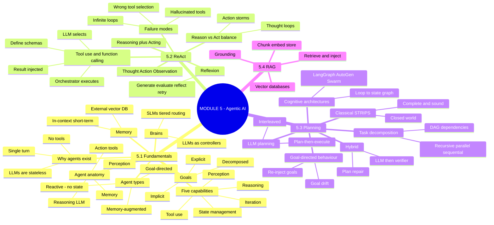

## B. ⭐ Why agents exist — the three limitations

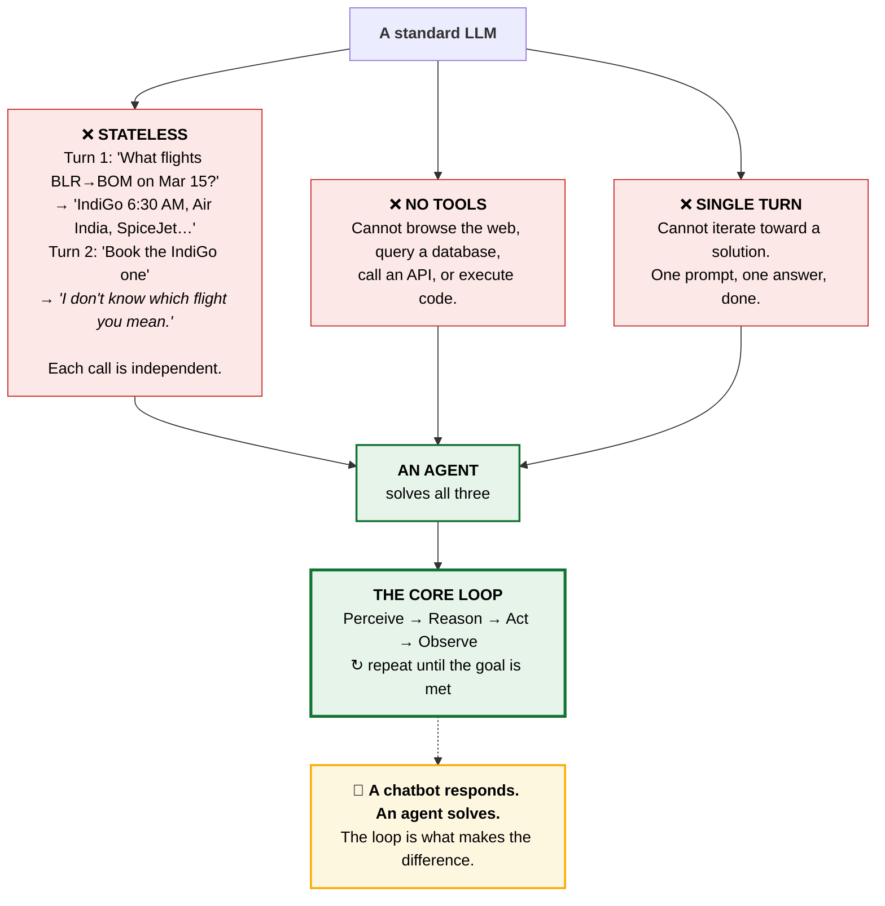

## C. Agent anatomy — the four-component loop

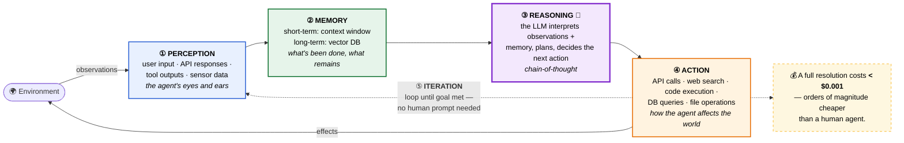

## D. ⭐ The ReAct trace — annotated

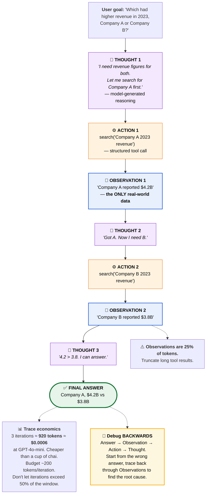

## E. The three ReAct failure modes

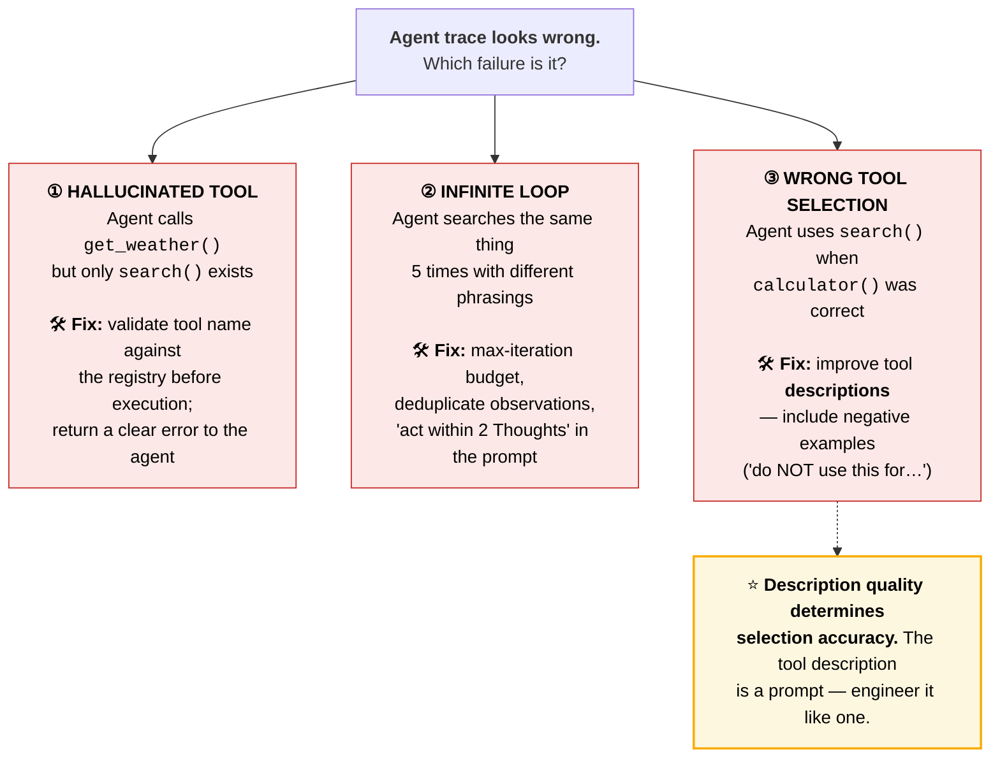

## F. Reason vs. Act — the meta-cognitive balance

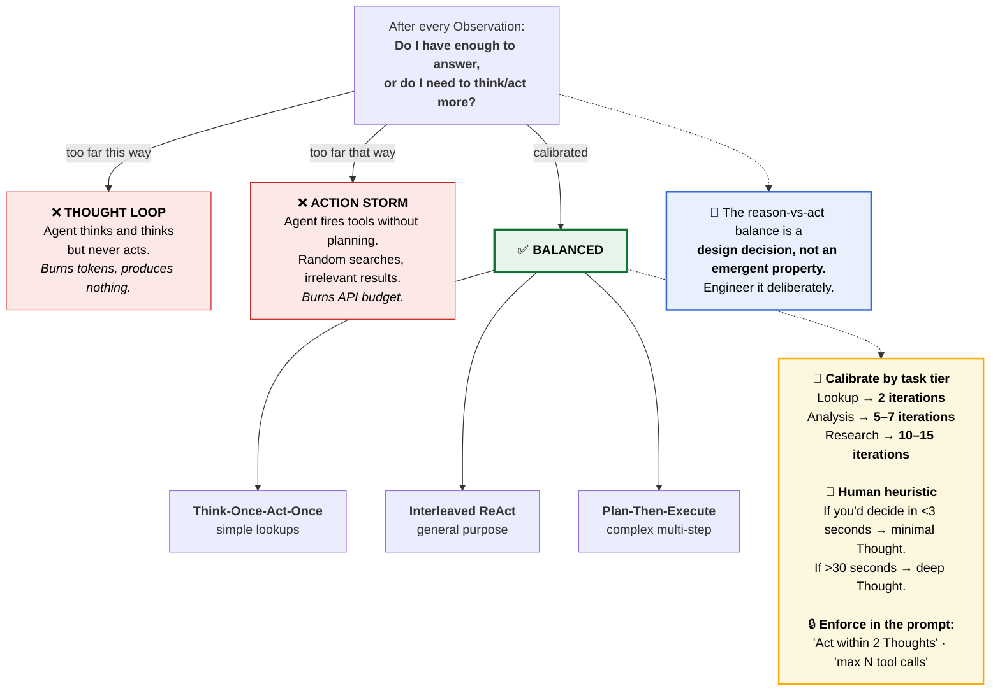

## G. Reflexion — adding self-correction to ReAct

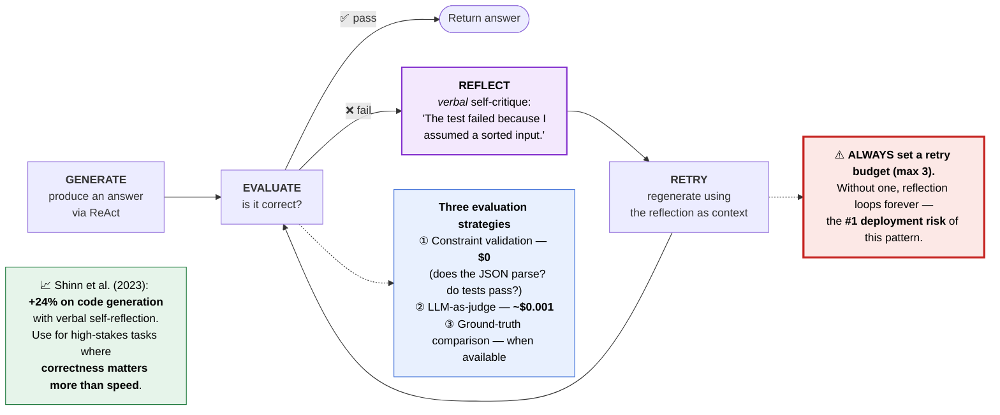

## H. Planning — three approaches

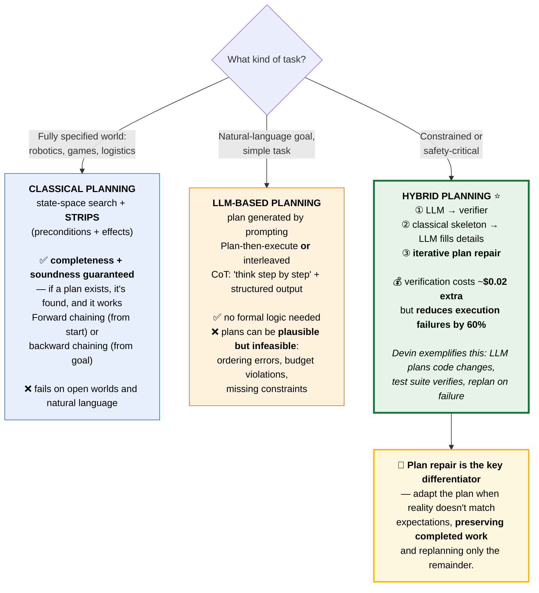

## I. Cognitive architecture evolution

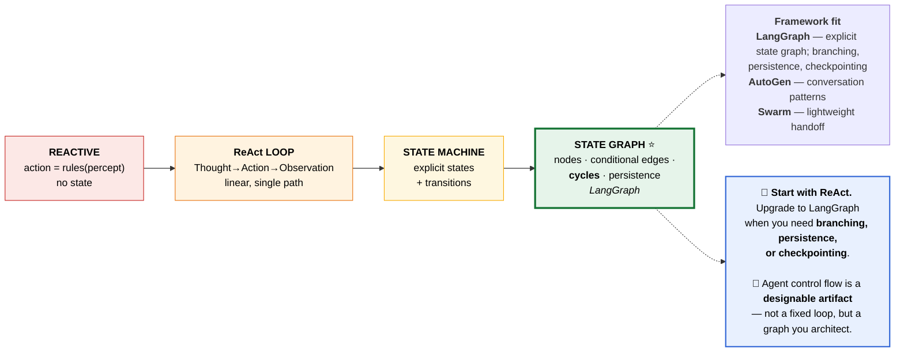

## J. ⭐ Tiered model routing — the cost architecture

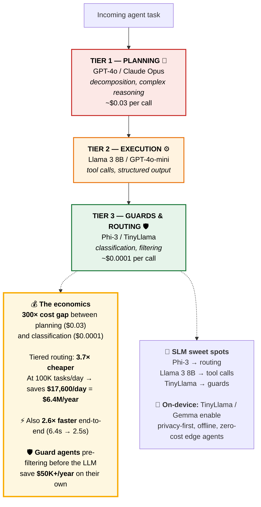

## K. ⭐ Master correlation — M5 → later modules

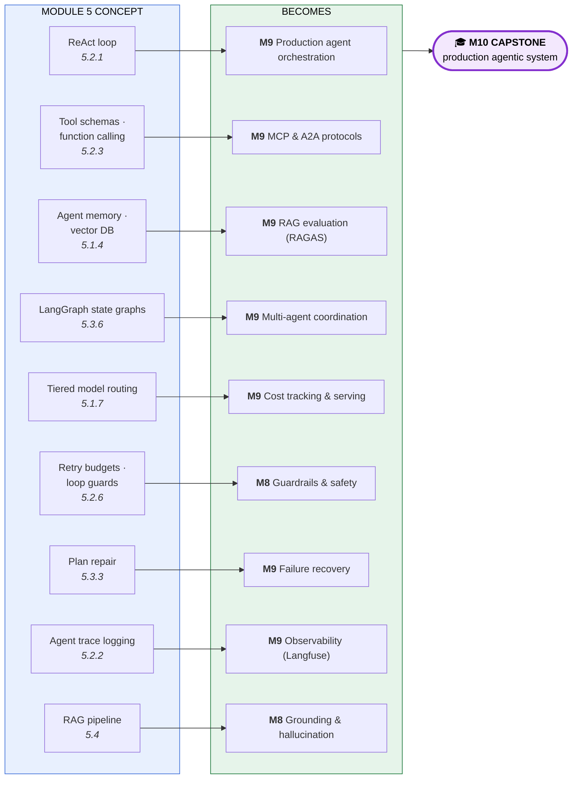

---

# 5.1 Agent Fundamentals

## 5.1.1 — What is an AI Agent?

> **Concept ID:** `AIAGFNTH000001` · Bloom **B2** · Prereq: M1–M4

### The three limitations agents solve

| # | Limitation | Concrete failure |
|---|---|---|
| **1** | **Stateless** | *Turn 1:* "What flights BLR→BOM on Mar 15?" → "IndiGo 6:30 AM…" · *Turn 2:* "Book the IndiGo one" → **"I don't know which flight you're referring to."** Each call is independent |
| **2** | **No tools** | Cannot browse the web, query databases, call APIs, or execute code |
| **3** | **Single turn** | Cannot iterate toward a solution |

### The definition

> An **AI Agent** is a software system that uses an **LLM as its reasoning engine** to **perceive inputs, reason about them, act via tools, and observe results** — looping until a goal is met.

### The core loop

$$\textbf{Perceive} \to \textbf{Reason} \to \textbf{Act} \to \textbf{Observe} \;\circlearrowleft\; \text{repeat until goal met}$$

> ### 🔑 **A chatbot responds. An agent solves. The loop is what makes the difference.**

### Five capabilities — remove any one and it degrades to a chatbot

| # | Capability | What it provides |
|---|---|---|
| **1** | **Perception** | Receives observations: user input, API responses, tool outputs, sensor data |
| **2** | **State management** | Maintains information across steps — what's done, what remains, what changed |
| **3** | **Reasoning** | Uses the LLM to interpret observations, plan next steps, decide actions via CoT |
| **4** | **Tool use** | Executes actions: API calls, web search, code execution, DB queries, file operations |
| **5** | **Iteration** | Loops **without waiting for a human prompt at each step** — autonomy |

### Chatbot vs Agent

| Dimension | **Chatbot** | **AI Agent** |
|---|---|---|
| Turns | Single turn | **Multi-step loop** |
| Tools | None | Web, DB, APIs, code |
| Memory | Context only | **Context + persistent store** |
| Autonomy | Responds | **Solves** |

### The agent spectrum

**Level 0** (raw LLMs) → **Level 1** (tool use) → **Level 2** (memory) → **Level 3** (planning) → **Level 4** (multi-agent). Each level adds capability.

**Deployed at scale today:** **Devin** (coding) · **Klarna** (customer support) · **Elicit** (research) · **Claude Code** (terminal).

---

## 5.1.2 — Agent Anatomy: Perception, Decision, Action

Every agent — from a thermostat to Devin — has **four components**:

| Component | Role | Example (GitHub Copilot Workspace) |
|---|---|---|
| **Perception** | Observations in — *eyes and ears* | Issue description + codebase |
| **Memory** | Short-term (context window) + long-term (vector DB) | File AST index |
| **Reasoning** | The LLM interprets observations + memory, decides the next action — *the brain* | LLM plans the change |
| **Action** | Tool calls, file writes, API calls, output generation | Edits files, runs tests |

> **The loop is iterative:** each action produces an observation that **feeds back into perception**.

**Token budget reality:** a full agent resolution costs **< $0.001** — orders of magnitude cheaper than a human agent. *This is the economic argument for agentic systems in one line.*

---

## 5.1.3 — Simple Reactive Agents

> **Definition:** a reactive agent selects actions based **solely on the current percept**. No internal state.

$$\text{action} = \text{rules}(\text{percept})$$

**The rule table is static.** It does not learn, adapt, or remember. **First match wins.**

```python
# Smart thermostat — runs every 30 seconds
if sensor.temp > 25:   turn_on(AC)
elif sensor.temp < 20: turn_on(heater)
else:                  standby()
# No memory of how long AC has been on. No weather forecast.

# Email priority filter
if "urgent" in email.subject:  flag_priority("high")
elif sender in VIP_list:       flag_priority("medium")
# Keyword match only. Can't understand context or detect sarcasm.

# Intent router
if classify(msg) == "refund": route_to(refund_agent)
elif classify(msg) == "track": route_to(tracking_agent)
```

### Five limitations

**No memory** · **no planning** · **brittle** · **no learning** · **no composability**.

### ⭐ But still valuable in production

> **Guard agents, IoT, routing, spam filters — fast and free.**
>
> **Guard agents save $50K+/year** by pre-filtering *before* the LLM is invoked.

**Use reactive when:** fixed categories · single-step · speed-critical · **$0 cost target**.

---

## 5.1.4 — Agents with Memory

### Two memory types

| | **In-context (short-term)** | **External (long-term)** |
|---|---|---|
| Where | The context window | Vector DB / KV store |
| Speed | **Fast** | Slight latency |
| Capacity | **Bounded** | **Scalable** |
| Persistence | **Ephemeral** | **Persistent** |

> ⭐ **External memory is ~2,000× cheaper than stuffing everything in-context at scale.**

**What memory enables:** **personalisation** · **progress tracking** · **cross-session learning**.

**Production stack:** **Pinecone / Weaviate** for vectors + **Redis** for key-value + the **context window** for immediate state.

### ⚠️ Four failure modes to watch

**Stale data** · **retrieval misses** · **context overflow** · **privacy leakage**.

---

## 5.1.5 — Agent Goals and Objectives

### Three goal types

| Type | Source |
|---|---|
| **Explicit** | User-provided |
| **Implicit** | System prompt |
| **Decomposed** | **Agent-generated sub-goals** |

> **Success criteria define when to stop.** Without them, agents **loop forever or quit too early**.

### ⚠️ Goal drift — the #1 failure mode

> **Goal drift is the number one failure mode in long-running agents.** The fix: **re-inject the goal every N steps.**

**Sobering benchmark:** complex decomposed goals achieve only **~65% completion** — *the hardest frontier in agentic AI.*

**Task-completion vs open-ended** service require **different goal architectures** — one-off jobs vs continuous operation.

---

## 5.1.6 — LLMs as Agent Brains

### Four capabilities that make LLMs work as controllers

1. **Natural language understanding**
2. **Structured tool calls**
3. **Chain-of-thought reasoning**
4. **Context management**

> ### ⚠️ The framing that matters
> **LLMs are controllers, not thinkers** — remarkably effective **pattern matchers, not comprehenders**.

**Tool calling is native** in GPT-4, Claude, Llama 3.1+, Mistral, Gemini — **no fine-tuning needed**.

**Model choice matters:** a **300× cost gap** between planning ($0.03) and classification ($0.0001).

**Real limitations to design around:** **hallucination** · **context limits** · **no learning between runs**.

---

## 5.1.7 — SLMs as Lightweight Agent Engines

> **The industry trend: big brain for planning, small brains for execution.**

### Tiered routing

| Tier | Model | Job |
|---|---|---|
| **1** | GPT-4o / Claude Opus | **Planning**, decomposition, complex reasoning |
| **2** | Llama 3 8B / GPT-4o-mini | **Execution** — tool calls, structured output |
| **3** | Phi-3 / TinyLlama | **Guards and routing** — classification, filtering |

### The numbers

| Metric | Impact |
|---|---|
| **Cost** | **3.7× cheaper**. At 100K tasks/day: **$17,600/day saved = $6.4M/year** |
| **Latency** | **2.6× faster** end-to-end (6.4s → 2.5s) |

**SLM sweet spots:** **Phi-3** for routing · **Llama 3 8B** for tool calls · **TinyLlama** for guards.

**On-device agents:** TinyLlama / Gemma enable **privacy-first, offline, zero-cost** edge deployment.

---

## 5.1.8 — Building a Simple Agent (coding lab)

**Three components to code:**

| Component | LangChain class | Maps to theory |
|---|---|---|
| **Tools** | `Tool` | **Action** |
| **Brain** | `ChatOpenAI` | **Reasoning** |
| **Loop** | `create_react_agent` | **Iteration** |

> **Theory → code mapping is direct:** Perception = tool results · Reasoning = LLM · Action = tool calls.

⭐ **The agent trace is your debugging tool** — every Thought/Action/Observation is logged and inspectable.

**Cost per query: ~$0.0004** for a multi-step reasoning task with GPT-4o-mini.

> **This coding pattern is the foundation for everything in 5.2–5.7 and Module 9.**

---

# 5.2 The ReAct Framework

## 5.2.1 — ReAct: Reasoning + Acting

> **ReAct interleaves Chain-of-Thought reasoning with tool actions in one context window.** It is **the dominant agent architecture**.

### Why interleave?

| Alone | Problem |
|---|---|
| **Reasoning-only** (pure CoT) | **Hallucinates** — no grounding in real data |
| **Acting-only** (pure tool use) | **Opaque** — no visible rationale, no error diagnosis |
| **ReAct** | ✅ **Solves both** |

**Yao et al. (2022) proved it:** **+6% accuracy on HotpotQA**, **+26% on ALFWorld**.

**Every major framework uses ReAct:** LangChain · OpenAI Assistants · Claude · LangGraph.

**Three failure modes:** hallucinated tools · infinite loops · wrong tool selection *(see Diagram E)*.

---

## 5.2.2 — The Thought-Action-Observation Loop

### Four steps per iteration

| Step | What |
|---|---|
| **Thought** | Reason aloud — model-generated |
| **Action** | A structured tool call |
| **Observation** | The result — ⭐ **the only real-world data in the trace** |
| **Repeat or Answer** | Decide whether to continue |

> ### 🔑 The symmetry
> **Thoughts make actions intentional; Observations make thoughts grounded.** Both are logged.

### Trace economics

- **3-iteration trace ≈ 920 tokens ≈ $0.0006** at GPT-4o-mini
- **Budget ~200 tokens per iteration**
- ⚠️ **Don't let iterations consume >50% of the context window**
- **Observations are ~25% of tokens** — truncate long tool results

### ⭐ Debug backwards

> **Start from the wrong answer and trace back through Observations to find the root cause.** Forward debugging wastes time; the error almost always entered at an Observation or a tool selection.

---

## 5.2.3 — Tool Use and Function Calling

> **Tools transform LLMs from text generators into agents that can act in the real world.**

### The four-step pipeline

```
① Define schemas → ② LLM selects → ③ Orchestrator executes → ④ Result injected back into context
```

> ⚠️ **Note step ③: the *orchestrator* executes, not the LLM.** The model only emits a structured request. This separation is the entire security boundary of an agent system.

### ⭐ Description quality determines selection accuracy

> Write tool descriptions like prompts. **Be specific and include negative examples** ("do NOT use this for…").

### Always validate before execution

Check: **tool name** (exists in registry) · **parameter types** · **bounds** · **permissions**.

**All major LLMs support tool calling natively** — GPT-4, Claude, Llama 3.1+, Mistral, Gemini.

---

## 5.2.4 — ReAct Loop Visualisation

- **Visualisation makes agent behaviour tangible** — you see the branching, looping, and decision points
- **Observations (blue) are the only real-world data** — everything else is model-generated
- **Debug backwards:** Answer → Observation → Action → Thought
- **Context token distribution matters:** Observations ≈ 25% of tokens

---

## 5.2.5 — When to Reason vs. Act

> **The meta-cognitive question:** after every Observation, does the agent have enough to answer, or does it need to think/act more?

### Getting it wrong is costly in both directions

| Failure | Cost |
|---|---|
| **Thought loop** — thinks and thinks, never acts | Burns tokens, produces nothing |
| **Action storm** — fires tools without planning | Random searches, irrelevant results, burns API budget |

### Reasoning depth heuristics

| Task complexity | Thought depth |
|---|---|
| Simple lookup | **Minimal** (1 sentence) |
| Analysis | Moderate |
| Multi-constraint research | **Deep** |

> ### 📏 The human heuristic
> **If you'd spend <3 seconds deciding as a human → minimal Thought. >30 seconds → deep Thought.**

### Three design patterns

**Think-Once-Act-Once** · **Interleaved ReAct** · **Plan-Then-Execute**

### Calibration by task tier

| Tier | Iterations |
|---|---|
| Lookup | **2** |
| Analysis | **5–7** |
| Research | **10–15** |

**Enforce in the prompt:** *"Act within 2 Thoughts"* and *"max N tool calls."*

> 🔑 **The reason-vs-act balance is a design decision, not an emergent property. Engineer it deliberately.**

---

## 5.2.6 — Self-Reflection and Iterative Refinement

> **Basic ReAct doesn't self-check.** The **Reflexion** pattern adds: **generate → evaluate → reflect → retry.**

**Shinn et al. (2023): +24% on code generation** with *verbal* self-reflection.

### Three evaluation strategies

| Strategy | Cost | When |
|---|---|---|
| **Constraint validation** | **$0** | Does the JSON parse? Do tests pass? |
| **LLM-as-judge** | ~$0.001 | Open-ended quality |
| **Ground-truth comparison** | — | When references exist |

> ### ⚠️ Always set retry budgets (max 3)
> **Without them, reflection loops forever — the #1 deployment risk of this pattern.**

**Use Reflexion for high-stakes tasks where correctness matters more than speed.**

---

## 5.2.7 — Implementing ReAct Agents (coding lab)

Same three components as 5.1.8 — `Tool`, `ChatOpenAI`, `create_react_agent` — now with search and calculator tools.

**Cost per query ~$0.0004.** This pattern is the foundation for Sub-Modules 5.3–5.7 and Module 9.

---

# 5.3 Planning and Decomposition

## 5.3.1 — Classical Planning

> **Classical planning = state-space search with STRIPS actions** (preconditions + effects).

| Property | Detail |
|---|---|
| **Completeness** | If a plan exists, the planner **finds it** |
| **Soundness** | The plan **will work** |
| **Forward chaining** | Search from the start state |
| **Backward chaining** | Search from the goal |

> ⚠️ **Fails on open worlds and natural language** — real tasks break the **closed-world assumption**.

**Still thriving in:** robotics · games · logistics — anywhere the world is **fully specified**.

---

## 5.3.2 — LLM-Based Planning

> LLMs generate plans **from natural language goals — no formal logic needed**.

### Two strategies

| | **Plan-then-execute** | **Interleaved** |
|---|---|---|
| When the plan is made | Full plan up front | One step at a time |
| Adaptability | Lower | Higher |
| Predictability | Higher | Lower |

**CoT planning is the simplest technique** — *"think step by step"* with **structured output**.

### ⚠️ The characteristic failure

> **LLM plans can be plausible but infeasible:** ordering errors, budget violations, missing constraints.

**The fix:** **verification prompts catch many errors** — one extra LLM call before execution saves wasted work.

---

## 5.3.3 — Hybrid Planning Approaches

> **Combining classical structure with LLM flexibility.**

### Three hybrid patterns

1. **LLM → verifier** — LLM plans, a checker validates
2. **Classical skeleton → LLM details** — formal structure, natural-language filling
3. **Iterative plan repair** ⭐

> ### 🔑 Plan repair is the key differentiator
> **Adapt the plan when reality doesn't match expectations** — preserving completed work and replanning only the remaining steps from the current state.

**Economics:** verification costs **~$0.02 extra** but **reduces execution failures by 60%**.

### Match strategy to task

| Task | Approach |
|---|---|
| Simple | Pure LLM |
| Constrained | Hybrid |
| **Safety-critical** | **Full verification** |

**Devin exemplifies hybrid planning:** LLM plans code changes → test suite verifies → replan on failure.

---

## 5.3.4 — Task Decomposition

> **Decomposition = breaking complex goals into atomic sub-tasks** (one tool call each).

### Three types

| Type | Structure |
|---|---|
| **Recursive** | Tree |
| **Parallel** | Independent branches |
| **Sequential** | Dependent chain |

**DAG structure tracks dependencies** — determines what can parallelise and identifies the **critical path**.

> ### 🎯 The sweet spot: **5–8 sub-tasks**
> Too shallow fails to simplify; too deep adds overhead.

**LLM decomposition prompts work well** when you specify **output format + an atomicity rule**.

---

## 5.3.5 — Goal-Directed Behaviour

### Three components

**Persistence** · **progress tracking** · **adaptation**.

### What causes goal drift

**Context overflow** · **attention decay** · **tangential observations** · **vague goals**.

### The prevention toolkit

| Tool | Detail |
|---|---|
| **Re-inject goals** | Restate the objective every N steps |
| **Scope boundaries** | Explicit out-of-scope statements |
| **Step budgets** | Hard iteration caps |
| **Progress checklists** | Explicit state of what's done |

> **Alignment checks every 5 steps cost ~40 tokens but save 5–10 wasted steps.** One of the best ROI decisions in agent design.

**Track progress explicitly** — a context checklist for short tasks, an **external store** for long ones.

---

## 5.3.6 — Cognitive Architectures: Loops to State Graphs

> ### 🔑 **Agent control flow is a designable artifact** — not just a fixed loop, but a **graph you architect**.

**The evolution:** reactive → ReAct → state machine → **state graph**. Each adds control capability.

| Framework | Model | Fit |
|---|---|---|
| **LangGraph** ⭐ | Explicit **state graph**: nodes, **conditional edges**, **cycles**, **persistence** | Branching, checkpointing, durable agents |
| **AutoGen** | **Conversation patterns** | Multi-agent dialogue |
| **Swarm** | **Lightweight handoff** | Simple agent-to-agent routing |

> **Start with ReAct. Upgrade to LangGraph when you need branching, persistence, or checkpointing.**

---

## 5.3.7 — Planning System Implementation (coding lab)

**Build a plan-and-execute agent:**

- **Planner (GPT-4o) + Executor (mini)** — ⭐ tiered routing saves cost while maintaining plan quality
- **Structured planning prompts** with **JSON output + atomicity rules** produce reliable plans
- **Execution loop:** iterate steps → check dependencies → execute with ReAct → handle failures
- ⭐ **Plan repair preserves completed work** — only replans remaining steps from the current state

> **This pattern is the foundation for all production planning agents in Module 9 (LLMOps).**

---

# 5.4 — RAG: Retrieval-Augmented Generation

> Covered in the mentor session (`RAG_Content_covered_by_Mentor.zip`) and two lab notebooks (with / without OpenAI API).

### Why RAG belongs in the agent module

An agent's **memory** (5.1.4) and an agent's **knowledge grounding** are the same mechanism: **retrieve relevant context, inject it into the prompt.** RAG is the retrieval half of agent memory.

### The pipeline

```
Documents → Chunk → Embed → Store in vector DB
                                    ↓
User query → Embed → Similarity search → Top-k chunks → Inject into prompt → LLM → Grounded answer
```

### What RAG changes — and what it doesn't

> ⭐ **RAG does not change the model's weights. It changes the context that drives prediction.** *(Established back in M1 §1.2.2: without retrieval $P(\text{"1969"}) \approx 0.6$; with a NASA document in context, $\approx 0.97$.)*

**What it solves:** knowledge cutoff · hallucination · proprietary/private data · citability.

### Design decisions that matter

| Decision | Consequence |
|---|---|
| **Chunk size** | Too small loses context; too large dilutes relevance |
| **Chunk overlap** | Prevents splitting a fact across a boundary |
| **Embedding model** | ⚠️ Must match between indexing and query time |
| **Top-k** | More chunks = better recall, more tokens, more cost |
| **Chunk ordering** | ⚠️ **Lost-in-the-middle** (M2 §2.2.4) — put the most important chunks **first or last** |

**Stack:** LangChain / LlamaIndex for orchestration · **FAISS, Pinecone, Weaviate, Qdrant, ChromaDB** for vectors.

**Evaluation:** **RAGAS** — faithfulness · answer relevance · context precision · context recall (M2 §2.3.10). → *deepened in Module 9*

---

## Assignments & application

| Item | Detail |
|---|---|
| **`M5_AST_01_Leveraging_LLMs_for_Querying_Insights.ipynb`** | Assignment 1 |
| **`M5_AST_02_Building_Agents_using_LangGraph_(With/Without_OpenAI_API).ipynb`** | ⭐ Assignment 2 — **LangGraph**, ties directly to 5.3.6 |
| `M5_Additional_NB_01_Tool_Calling.ipynb` | Pairs with 5.2.3 |
| `M5_Additional_NB_02_Building_Agent_using_LangChain.ipynb` | Pairs with 5.1.8 / 5.2.7 |
| `M5_Additional_NB_01/02_Building_RAG_Pipeline_using_LangChain_*.ipynb` | Pairs with 5.4 |
| **Stock Prices Insights Generation Application** | `Steps_for_...pdf` + `Application.zip` — end-to-end build |
| `Session_Objectives.pdf` | Tutorial session, 18 Apr 2026 |

> 💡 **Do the "Without OpenAI API" variants.** Running agents on Groq/Ollama forces you to confront tool-calling format differences — which is exactly the lesson of 5.2.3.

---

## Master list of misconceptions

| ❌ Myth | ✅ Reality |
|---|---|
| "An agent is just a chatbot with tools" | ⭐ **A chatbot responds; an agent solves.** The **loop** — autonomous iteration — is the difference |
| "Agents need a special model" | **Tool calling is native** in GPT-4, Claude, Llama 3.1+, Mistral, Gemini. **No fine-tuning needed** |
| "The LLM executes the tool" | ⚠️ **No** — the LLM emits a structured *request*; the **orchestrator executes**. This separation is the security boundary |
| "Reactive agents are obsolete" | **Guard agents save $50K+/year** by pre-filtering before the LLM. Fast, free, still deployed |
| "Put everything in the context window" | **External memory is ~2,000× cheaper at scale** |
| "LLMs think" | ⭐ **LLMs are controllers, not thinkers** — effective pattern matchers, not comprehenders |
| "Use the biggest model for everything" | **300× cost gap** between planning and classification. **Tiered routing is 3.7× cheaper and 2.6× faster** |
| "More reasoning is always better" | **Thought loops** burn tokens and produce nothing. Calibrate by task tier |
| "More tool calls means a more thorough agent" | **Action storms** burn API budget on irrelevant results |
| "ReAct agents self-correct" | ⚠️ **Basic ReAct does not self-check.** You must add **Reflexion** explicitly |
| "Reflexion is strictly better" | Without a **retry budget (max 3)** it loops forever — **the #1 deployment risk** |
| "Agents will stay on task" | ⚠️ **Goal drift is the #1 failure mode** in long-running agents. Re-inject goals every N steps |
| "Agents complete complex goals reliably" | Complex **decomposed goals: ~65% completion**. This is the frontier, not a solved problem |
| "Classical planning is obsolete" | **Completeness and soundness are guaranteed** — still dominant in robotics, games, logistics |
| "An LLM plan that reads well will work" | ⚠️ Plans are often **plausible but infeasible**: ordering errors, budget violations, missing constraints |
| "Verification is an unnecessary cost" | **~$0.02 extra reduces execution failures by 60%** |
| "Deeper decomposition is better" | **Sweet spot is 5–8 sub-tasks.** Too deep adds overhead |
| "When a plan fails, start over" | ⭐ **Plan repair preserves completed work** — replan only the remainder |
| "Use LangGraph from the start" | **Start with ReAct.** Upgrade when you need branching, persistence, or checkpointing |
| "RAG changes what the model knows" | ⚠️ **RAG does not change weights — it changes the context** that drives prediction |
| "Chunk order in RAG doesn't matter" | **Lost-in-the-middle** — put critical chunks **first or last** |

---

## Glossary

| Term | Definition |
|---|---|
| **Action storm** | Failure mode: firing tools without planning |
| **Agent** | System using an LLM as reasoning engine in a perceive→reason→act→observe loop |
| **AutoGen** | Multi-agent framework based on conversation patterns |
| **Backward chaining** | Classical planning search from the goal |
| **Cognitive architecture** | The designed control flow of an agent |
| **DAG** | Directed acyclic graph — tracks sub-task dependencies |
| **Goal drift** | Agent losing focus on the original objective — #1 long-run failure |
| **Guard agent** | Cheap reactive filter running before the LLM |
| **Hallucinated tool** | Agent calling a tool that doesn't exist |
| **LangGraph** | State-graph agent framework with cycles and persistence |
| **Observation** | The tool result — the only real-world data in a ReAct trace |
| **Plan repair** | Replanning only the remaining steps, preserving completed work |
| **Plan-then-execute** | Generate the full plan before acting |
| **ReAct** | Reasoning + Acting — interleaved CoT and tool use (Yao et al. 2022) |
| **Reactive agent** | `action = rules(percept)`; no state |
| **Reflexion** | generate → evaluate → reflect → retry (Shinn et al. 2023) |
| **Retry budget** | Hard cap on reflection retries (max 3) |
| **SLM** | Small Language Model used for execution/guard tiers |
| **STRIPS** | Classical planning formalism: preconditions + effects |
| **Swarm** | Lightweight agent handoff framework |
| **TAO loop** | Thought-Action-Observation |
| **Thought loop** | Failure mode: reasoning without ever acting |
| **Tiered routing** | Matching model size to task tier for cost/latency |
| **Tool schema** | Structured definition (name, description, parameters) the LLM selects from |

---

## References and further study

### 📕 Books

| Book | For Module 5 |
|---|---|
| ⭐ **AI Engineering** — Chip Huyen, O'Reilly 2025 | **The course's designated M5 reference** — agents, RAG, MCP, agentic patterns |
| **Building LLMs for Production** — Bouchard & Peters | LangChain, LlamaIndex, agents, advanced RAG |
| **Hands-On Large Language Models** — Alammar & Grootendorst | RAG and semantic search chapters |

### 📄 Papers — the M5 canon

| Paper | Link | Section |
|---|---|---|
| ⭐ **ReAct: Synergizing Reasoning and Acting** — Yao 2022 | [arXiv:2210.03629](https://arxiv.org/abs/2210.03629) | **5.2.1 — required reading** |
| ⭐ **Reflexion** — Shinn 2023 | [arXiv:2303.11366](https://arxiv.org/abs/2303.11366) | 5.2.6 |
| **Toolformer** — Schick 2023 | [arXiv:2302.04761](https://arxiv.org/abs/2302.04761) | 5.2.3 |
| **Tree of Thoughts** — Yao 2023 | [arXiv:2305.10601](https://arxiv.org/abs/2305.10601) | 5.3 |
| **Plan-and-Solve Prompting** — Wang 2023 | [arXiv:2305.04091](https://arxiv.org/abs/2305.04091) | 5.3.2 |
| **RAG** — Lewis 2020 | [arXiv:2005.11401](https://arxiv.org/abs/2005.11401) | 5.4 |
| **Lost in the Middle** — Liu 2023 | [arXiv:2307.03172](https://arxiv.org/abs/2307.03172) | 5.4 chunk ordering |
| **Generative Agents** — Park 2023 | [arXiv:2304.03442](https://arxiv.org/abs/2304.03442) | 5.1.4 memory architecture |

### 🔗 Docs & guides

| Resource | Link | For |
|---|---|---|
| ⭐ **Building Effective Agents** — Anthropic | [anthropic.com/research](https://www.anthropic.com/research/building-effective-agents) | **Required reading alongside M5** |
| ⭐ **Model Context Protocol (MCP)** | [modelcontextprotocol.io](https://modelcontextprotocol.io/) | Agent–tool interoperability → M9 |
| **LangGraph docs** | [langchain-ai.github.io/langgraph](https://langchain-ai.github.io/langgraph/) | ⭐ 5.3.6, Assignment 2 |
| **LangChain Conceptual Guides** | [python.langchain.com/docs/concepts](https://python.langchain.com/docs/concepts) | 5.1.8, 5.2.7 |
| **LlamaIndex docs** | [docs.llamaindex.ai](https://docs.llamaindex.ai/) | 5.4 RAG |
| **OpenAI Guide to Building Agents** | [platform.openai.com/docs/guides/agents](https://platform.openai.com/docs/guides/agents) | 5.1–5.2 |
| **Berkeley LLM Agents MOOC** | 11 lectures, Berkeley RDI | ⭐ **Directly supports M5** |
| **AutoGen** | [microsoft.github.io/autogen](https://microsoft.github.io/autogen/) | 5.3.6 |

### 📌 Study strategy for Weeks 9–10

1. **Read the ReAct paper first** — it is short and the entire module is downstream of it
2. Build the **5.1.8 simple agent** before reading 5.2. Watching a real trace print makes the TAO loop obvious
3. **Deliberately break your agent:** give it a tool with a vague description, then a good one. Observe selection accuracy change. That is 5.2.3 in one experiment
4. **Add a max-iteration cap and watch it save you** — you will hit an infinite loop within the first hour
5. Do **Assignment 2 (LangGraph)** only after the LangChain agent works. The upgrade path in 5.3.6 is real advice
6. Read **Anthropic's "Building Effective Agents"** — it is the best short industry counterweight to framework marketing

---

## Self-check question bank

### 5.1 Fundamentals
1. Name the three limitations of standalone LLMs that agents solve.
2. Write the core agent loop.
3. State the one-sentence distinction between a chatbot and an agent.
4. Name the five capabilities that define an agent. What happens if you remove one?
5. Name the four anatomy components and give a real system that maps to each.
6. Write the reactive-agent equation. Name three production uses where it is still correct.
7. Name the five limitations of reactive agents.
8. Compare in-context vs external memory on speed, capacity, persistence, and cost.
9. Name the four memory failure modes.
10. Name the three goal types.
11. What is goal drift, and what is the standard mitigation?
12. What completion rate do complex decomposed goals achieve?
13. Why are LLMs described as "controllers, not thinkers"?
14. What is the cost gap between planning and classification calls?
15. Describe the three routing tiers and name a model for each.
16. What does tiered routing save at 100K tasks/day?

### 5.2 ReAct
17. What does reasoning-only fail at? Acting-only? How does ReAct fix both?
18. What gains did Yao et al. (2022) report, on which benchmarks?
19. Name the four steps of one ReAct iteration.
20. Which element of a trace is the only real-world data?
21. Roughly how many tokens and dollars is a 3-iteration trace?
22. In which direction should you debug an agent trace, and why?
23. Name the three ReAct failure modes and one fix each.
24. Write the four-step tool-calling pipeline. Who executes the tool?
25. What four things should you validate before executing a tool call?
26. What determines tool selection accuracy?
27. Contrast the thought loop and the action storm.
28. Give the human heuristic for reasoning depth.
29. How many iterations for a lookup? An analysis? A research task?
30. Name the three reason/act design patterns.
31. Write the Reflexion cycle. What gain did Shinn et al. report?
32. Name the three evaluation strategies and their costs.
33. What is the #1 deployment risk of Reflexion, and the fix?

### 5.3 Planning
34. What two guarantees does classical planning provide?
35. What assumption does classical planning make that breaks on real tasks?
36. Contrast forward and backward chaining.
37. Contrast plan-then-execute with interleaved planning.
38. What is the characteristic failure of LLM-generated plans?
39. Name the three hybrid planning patterns.
40. What does verification cost, and what does it buy?
41. What is plan repair, and why does it matter more than replanning from scratch?
42. Name the three decomposition types. What is the sweet-spot sub-task count?
43. What does a DAG give you in decomposition?
44. Name four causes of goal drift and four prevention tools.
45. What does an alignment check cost and save?
46. Trace the cognitive architecture evolution in four steps.
47. When should you upgrade from ReAct to LangGraph?
48. Compare LangGraph, AutoGen, and Swarm.

### 5.4 RAG
49. Does RAG change model weights? What does it change?
50. Name five RAG design decisions and their consequences.
51. Why does chunk ordering matter?
52. Name the four RAGAS metrics.

---

*Study notes compiled from the Module 5 source decks. Concept IDs preserved for cross-referencing.*
*Series: [M1](../M1/M1_Study_Notes.md) · [M2](../M2/M2_Study_Notes.md) · [M3](../M3/M3_Study_Notes.md) · [M4](../M4/M4_Study_Notes.md) · **M5** · M6 · M7 · M8 · M9 · M10*
