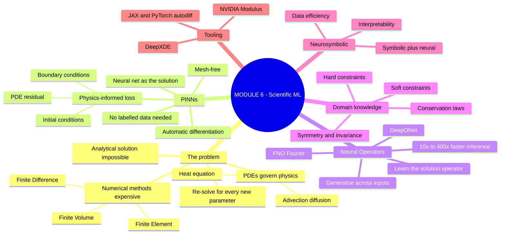
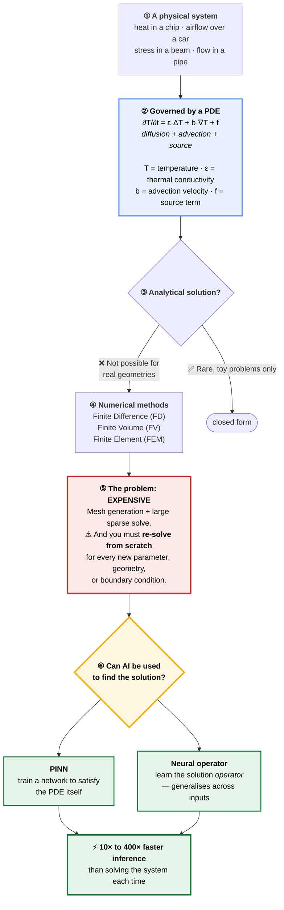
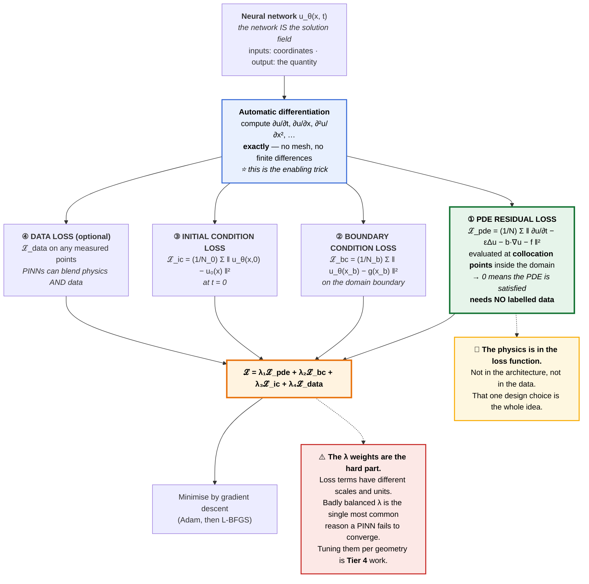
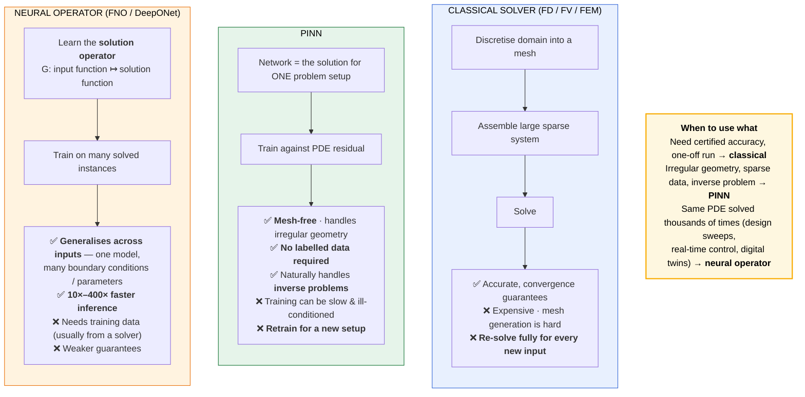
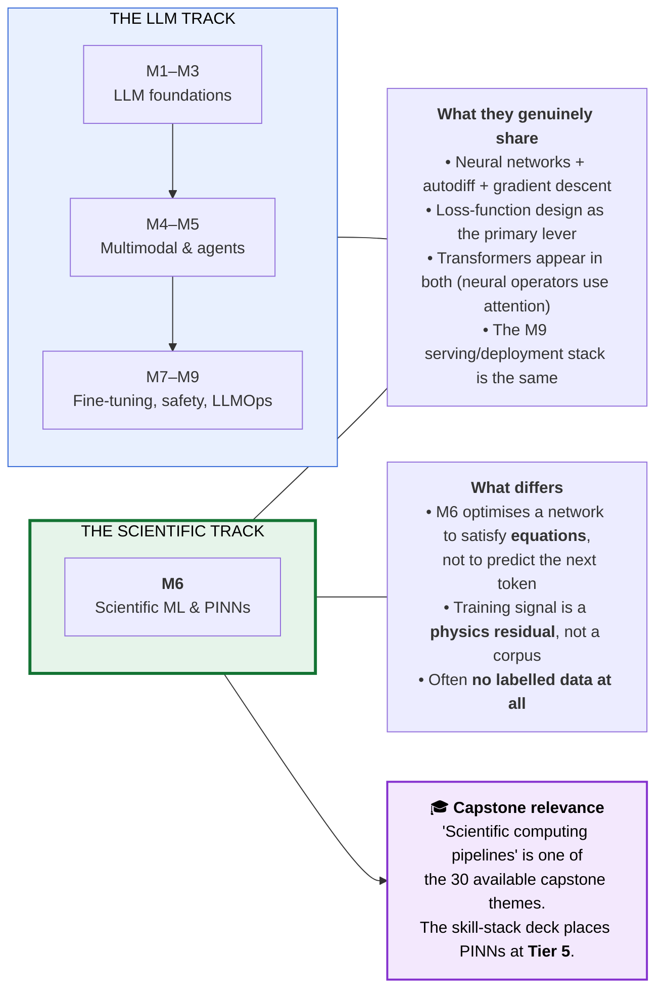

# Module 6 — Scientific Machine Learning & Physics-Informed AI · Study Notes

**Programme:** Advanced Certification in Agentic and Generative AI
**Institution:** IISc Bengaluru / TalentSprint · **Instructor:** Prof. Sashikumaar Ganesan
**Module duration:** 6 hours (Weeks 11–12) · **Prerequisite:** M1–M5, basic calculus & PDEs

---

## ⚠️ Provenance note — read this first

> **This module's folder contains only one file:** `Note_30_May_2026.pdf` — a scan of **handwritten lecture notes**. It has no extractable slide text; what survives OCR is fragments of LaTeX-rendered equations.
>
> **These notes are therefore assembled from three sources, and each section is labelled:**
>
> | Marker | Source |
> |---|---|
> | 📝 **[from lecture notes]** | Decoded from `Note_30_May_2026.pdf` and `SCIML.pdf` (in the M5 folder) — **this is genuine course content** |
> | 📋 **[from curriculum spec]** | The M6 syllabus stated in `AI-genai_lecture_intro.pdf` and the M1 reading list |
> | 📚 **[standard reference]** | Filled in from the course's own designated M6 reference (Karniadakis et al., DeepXDE, the PINN paper) — **verify against the live lecture** |
>
> **Treat the 📚 sections as scaffolding, not as a record of what was taught.** Once you have the actual M6 slides, this file should be revised. Everything marked 📝 is solid.

---

## Table of Contents

1. [What the curriculum specifies](#0-what-the-curriculum-specifies)
2. [🗺️ Visual atlas](#-visual-atlas)
3. [6.1 What is Scientific Machine Learning?](#61--what-is-scientific-machine-learning)
4. [6.2 The motivating problem — from the lecture notes](#62--the-motivating-problem--from-the-lecture-notes-)
5. [6.3 Physics-Informed Neural Networks (PINNs)](#63--physics-informed-neural-networks-pinns)
6. [6.4 Neural Operators (FNO / DeepONet)](#64--neural-operators-fno--deeponet)
7. [6.5 Domain knowledge & constraint incorporation](#65--domain-knowledge--constraint-incorporation)
8. [6.6 Neurosymbolic and hybrid approaches](#66--neurosymbolic-and-hybrid-approaches)
9. [Where M6 sits in the programme](#where-m6-sits-in-the-programme)
10. [Glossary](#glossary)
11. [References](#references-and-further-study)
12. [Self-check question bank](#self-check-question-bank)

---

## 0. What the curriculum specifies

📋 **[from curriculum spec]** — the course overview lists Module 6 coverage as:

- What is Scientific Machine Learning
- **Physics-Informed Neural Networks (PINNs)**
- **Domain knowledge integration and constraint incorporation**
- **Neurosymbolic systems and hybrid approaches**

> *"This module brings together **scientific computing and deep learning** — a growing area where AI models respect **physical laws and conservation principles**. This bridges the gap between traditional numerical methods and modern neural network approaches."*

**Designated reference:** *Physics-Informed Machine Learning* (Karniadakis et al., Cambridge University Press, 2023) — described in the reading list as *"No substitute exists at this depth for scientific computing with ML."* Companion: **DeepXDE** documentation.

**In the Progressive Skill Stack (M1 §1.3), PINNs occupy Tier 5 — Innovate.** The skill-stack deck notes M6 requires Tier 1 (loss landscapes), Tier 3 (integrating PDE solvers with training loops), and Tier 4 (tuning PINN loss weights per geometry).

**Deliverable:** Mini-Project 6 — a scientific ML application.

---

# 🗺️ Visual atlas

## A. Module 6 mind map

## B. ⭐ Why Scientific ML exists — the motivating chain

> 📝 **[from lecture notes]** — this chain is exactly what the handwritten notes lay out.

## C. ⭐ The PINN loss — where the physics enters

> 📝 **[from lecture notes]** — the residual-loss structure is legible in the scan.
> 📚 **[standard reference]** — the three-term decomposition follows Raissi et al. (2019).

## D. Classical solver vs PINN vs Neural Operator

## E. Where M6 sits — the odd module out, and why

---

## 6.1 — What is Scientific Machine Learning?

📋 **[from curriculum spec]** + 📚 **[standard reference]**

> **Scientific Machine Learning (SciML)** is the field combining **scientific computing** (numerical methods for physical systems) with **machine learning**, producing models that **respect physical laws and conservation principles** rather than learning purely from data.

**The distinction that defines the field:**

| **Pure ML** | **Scientific ML** |
|---|---|
| Learns patterns **from data alone** | Learns subject to **known physical constraints** |
| Needs large labelled datasets | Can work with **little or no labelled data** |
| Can violate conservation laws | **Enforces** conservation, symmetry, boundary conditions |
| Extrapolates poorly | Physics constraints improve extrapolation |
| Black box | Constraint structure aids interpretability |

📝 **[from lecture notes]** The notes explicitly contrast **"2025 NN/AI"** with **"Classical N[umerical]"** methods and pose the framing question directly: **"Can AI be used to find the solution?"**

---

## 6.2 — The motivating problem — from the lecture notes 📝

> 📝 **[from lecture notes]** — this section is decoded directly from `Note_30_May_2026.pdf` and `SCIML.pdf`. It is the most reliable content in this file.

### The governing equation

The lecture works from a **heat / advection-diffusion equation**:

$$\frac{\partial T}{\partial t} = \varepsilon \,\Delta T + \mathbf{b}\cdot\nabla T + f$$

| Symbol | Meaning |
|---|---|
| $T$ | **Temperature** (the unknown field) |
| $\varepsilon$ | **Thermal conductivity / diffusion coefficient** |
| $\Delta$ | **Laplacian** — $\frac{\partial^2}{\partial x^2} + \frac{\partial^2}{\partial y^2}$ |
| $\mathbf{b}\cdot\nabla T$ | **Advection** term |
| $f$ | **Source** term |

**Named application domains in the notes:** heat in a **chip**, and in a **car** — i.e. electronics cooling and automotive thermal management. The **Poisson equation** also appears as a reference case.

**Steady state:** when $\frac{\partial T}{\partial t} = 0$, the problem reduces to the steady-state form (the notes mark this explicitly).

### The three-step argument

📝 The notes lay out the motivation as a numbered chain:

1. **Analytical solution is not possible** for realistic geometries
2. **Numerical methods** — **FD** (finite difference), **FV** (finite volume), **FEM** (finite element) — are available but **expensive**
3. **"Can AI be used to find the solution?"** ← the module's central question

### The data setup

📝 The notes sketch training data as $(x_i, y_i, f_i)$ for $i = 1 \ldots 1000$ — **collocation points** over the domain, with the loss written in the form:

$$\mathcal{L}(\omega, t) = \frac{1}{1000}\sum_{i=1}^{1000} \big(f_i - \Delta \tau_i\big)^2 \;\simeq\; 0$$

> ⭐ **This is the PINN residual loss.** The network is trained so that the **PDE residual goes to zero at sampled points** — not so that it matches labelled outputs.

**Architectures mentioned:** **DNN**, **CNN**, **Transformers**.

### The payoff claim

📝 The notes record the headline result:

> ### ⚡ **10× to 400× faster inference than solving the system each time**

📝 They also name the two method families the module targets: **PINNs** and **FNO** (Fourier Neural Operator), with a note distinguishing **generic vs specific applications**.

---

## 6.3 — Physics-Informed Neural Networks (PINNs)

📚 **[standard reference]** — Raissi, Perdikaris & Karniadakis (2019); the PINN paper the reading list designates for M6 is [arXiv:1711.10561](https://arxiv.org/abs/1711.10561).

### The core idea

> **The neural network *is* the solution field.** $u_\theta(x,t)$ takes coordinates as input and returns the physical quantity. It is trained not against labelled outputs but against **the PDE itself**.

### The enabling trick: automatic differentiation

Because $u_\theta$ is a differentiable computation graph, **autodiff gives you $\partial u/\partial t$, $\partial u/\partial x$, $\partial^2 u/\partial x^2$ exactly** — no mesh, no finite-difference stencil, no discretisation error in the derivatives.

> ⭐ **This is why PINNs are possible at all.** The same machinery that computes gradients for backpropagation computes the derivatives that appear in the PDE.

### The composite loss

$$\mathcal{L} = \lambda_1 \mathcal{L}_{\text{pde}} + \lambda_2 \mathcal{L}_{\text{bc}} + \lambda_3 \mathcal{L}_{\text{ic}} + \lambda_4 \mathcal{L}_{\text{data}}$$

| Term | What it enforces | Needs labels? |
|---|---|---|
| $\mathcal{L}_{\text{pde}}$ | The PDE residual at **collocation points** inside the domain | ❌ **No** |
| $\mathcal{L}_{\text{bc}}$ | Boundary conditions | Boundary values only |
| $\mathcal{L}_{\text{ic}}$ | Initial conditions | $t=0$ values only |
| $\mathcal{L}_{\text{data}}$ | Any measured data (optional) | Yes, if available |

> ### 🔑 **The physics lives in the loss function** — not in the architecture, not in the data.

### Strengths and weaknesses

| ✅ Strengths | ❌ Weaknesses |
|---|---|
| **Mesh-free** — handles irregular geometry | **Training can be slow** and ill-conditioned |
| **No labelled data required** for the forward problem | ⚠️ **Loss-weight ($\lambda$) balancing is genuinely hard** — different terms have different scales and units |
| Naturally handles **inverse problems** (infer $\varepsilon$ from observations) | **Retraining needed** for a new setup |
| Blends physics **and** sparse measurements | Struggles with stiff / high-frequency / multi-scale problems |
| Continuous solution — query anywhere | Weaker convergence guarantees than FEM |

> ⚠️ **The most common PINN failure mode is not a bug — it's badly balanced $\lambda$ weights.** The M1 skill-stack deck specifically flags *"Tier 4 domain adaptation tunes PINN loss weights for specific geometries"* as real work.

### Inverse problems — the underrated strength

Classical solvers go **parameters → solution**. PINNs can go **observations → parameters**: add the unknown coefficient (e.g. $\varepsilon$) as a *trainable variable* and let the same loss recover it from sparse measurements. This is difficult with classical methods and nearly free with PINNs.

---

## 6.4 — Neural Operators (FNO / DeepONet)

📝 **[from lecture notes]** — FNO is named explicitly.
📚 **[standard reference]** — Li et al. (FNO, 2020); Lu et al. (DeepONet, 2019).

### The limitation PINNs have

> A trained PINN solves **one problem instance**. Change the boundary condition, the source term, or the geometry, and **you retrain**.

### The idea

> **Neural operators learn the *solution operator* itself** — a mapping between **function spaces**:
> $$G: a(x) \;\longmapsto\; u(x)$$
> from an input function (initial condition, source, coefficient field) to the solution function.

Once trained, evaluating $G$ on a **new** input function is a single forward pass.

| Model | Mechanism |
|---|---|
| **FNO** (Fourier Neural Operator) | Performs the global convolution **in Fourier space** — parameterises the kernel by its Fourier modes. **Resolution-invariant**: train at low resolution, evaluate at high |
| **DeepONet** | Two networks — a **branch net** encoding the input function and a **trunk net** encoding the query location; their inner product gives the solution |

### Why this is the commercially interesting one

📝 The **10×–400× inference speedup** from the lecture notes belongs here. It matters when the same PDE is solved **thousands of times**:

- **Design sweeps and optimisation** — try 10,000 geometries
- **Real-time control** — a solver in the loop at millisecond latency
- **Digital twins** — continuously updated simulation of a physical asset
- **Uncertainty quantification** — Monte Carlo over parameter distributions

> ⚠️ **The trade-off:** neural operators need **training data**, usually generated by running a classical solver many times. You pay the classical cost **once, offline**, to buy cheap inference **forever**.

---

## 6.5 — Domain knowledge & constraint incorporation

📋 **[from curriculum spec]** — listed explicitly as M6 coverage.
📚 **[standard reference]**

### Hard vs soft constraints

| | **Soft constraint** | **Hard constraint** |
|---|---|---|
| How | Add a **penalty term** to the loss | Build it into the **architecture** or output transform |
| Guarantee | Approximate — satisfied *approximately* | **Exact by construction** |
| Example | $\mathcal{L}_{bc}$ penalty on boundary error | Output ansatz $u_\theta = g(x) + B(x)\cdot\mathcal{N}_\theta(x)$ where $B$ vanishes on the boundary |
| Trade-off | Easy, flexible, needs $\lambda$ tuning | Harder to construct, no $\lambda$ needed |

> ⭐ **Where you can encode a constraint architecturally rather than as a penalty, do it** — it removes a $\lambda$ from the balancing problem and guarantees satisfaction.

### Kinds of physical knowledge to encode

| Knowledge | How to impose it |
|---|---|
| **Governing PDE** | Residual loss (PINN) |
| **Boundary / initial conditions** | Penalty or hard ansatz |
| **Conservation laws** (mass, energy, momentum) | Divergence-free architectures, symplectic integrators |
| **Symmetry / invariance** (rotation, translation) | Equivariant network layers |
| **Monotonicity / positivity** | Output activation (e.g. softplus for a positive quantity) |
| **Known asymptotic behaviour** | Structured output form |

---

## 6.6 — Neurosymbolic and hybrid approaches

📋 **[from curriculum spec]** — listed explicitly as M6 coverage.
📚 **[standard reference]**

> **Neurosymbolic systems** combine **neural** components (learned, differentiable, good at perception and approximation) with **symbolic** components (explicit rules, equations, logic — interpretable and verifiable).

### Why this belongs beside PINNs

A PINN is already a hybrid: the **symbolic** part is the PDE written down by a human; the **neural** part is the function approximator. Generalising that pattern:

| Pattern | Neural part | Symbolic part |
|---|---|---|
| **PINN** | Solution field $u_\theta$ | The PDE |
| **Symbolic regression** | Search over expressions | The discovered equation itself |
| **Hybrid solver** | Learned closure/subgrid model | Classical numerical scheme |
| **Neural + constraint solver** | Proposal generator | Verifier that checks feasibility |

> 🔗 **The connection back to agents (M5).** Hybrid planning in M5 §5.3.3 — *LLM proposes, verifier checks, repair on failure* — is **structurally the same pattern** as a neurosymbolic system. The neural component proposes; the symbolic component guarantees. Both modules are teaching the same architectural instinct in different domains.

### What the hybrid buys you

**Interpretability** (the symbolic part is readable) · **data efficiency** (structure replaces examples) · **guarantees** (the symbolic part can be verified) · **extrapolation** (physics holds outside the training distribution).

---

## Where M6 sits in the programme

| Question | Answer |
|---|---|
| **Why is this module here at all?** | It is IISc's distinctive contribution — Prof. Ganesan's own research area is computational science. The intro deck calls it *"Unique to This Program."* |
| **What does it share with the LLM track?** | Neural networks, autodiff, gradient descent, **loss-function design as the primary lever**, and the M9 deployment stack |
| **What is genuinely different?** | The network is optimised to satisfy **equations**, not to predict tokens. The training signal is a **physics residual**. Often there is **no labelled data at all** |
| **Skill-stack tier** | **Tier 5 — Innovate** (M1 §1.3) |
| **Capstone relevance** | *"Scientific computing pipelines"* is one of the 30 capstone themes |
| **Does it require the LLM modules?** | Not technically — but the skill stack notes it needs Tier 1 (loss landscapes), Tier 3 (integrating solvers with training loops), Tier 4 (weight tuning) |

---

## Glossary

| Term | Definition |
|---|---|
| **Advection** | Transport of a quantity by bulk motion — the $\mathbf{b}\cdot\nabla T$ term |
| **Automatic differentiation** | Exact derivative computation through a computation graph — what makes PINNs possible |
| **Boundary condition (BC)** | Constraint on the solution at the domain boundary |
| **Collocation points** | Sampled points inside the domain where the PDE residual is evaluated |
| **DeepONet** | Neural operator with branch (input function) and trunk (query location) networks |
| **DeepXDE** | The reference PINN/SciML library named in the course reading list |
| **Diffusion** | Spreading driven by gradients — the $\varepsilon\Delta T$ term |
| **Digital twin** | Continuously updated simulation of a physical asset |
| **FD / FV / FEM** | Finite Difference / Finite Volume / Finite Element — classical numerical methods |
| **FNO** | Fourier Neural Operator — learns the kernel in Fourier space; resolution-invariant |
| **Forward problem** | Given parameters, find the solution |
| **Hard constraint** | Physics built into the architecture — satisfied exactly |
| **Initial condition (IC)** | The solution at $t = 0$ |
| **Inverse problem** | Given observations, infer parameters — a PINN strength |
| **Laplacian ($\Delta$)** | $\partial^2/\partial x^2 + \partial^2/\partial y^2$ |
| **Mesh-free** | Requiring no spatial discretisation grid |
| **Neural operator** | A network learning a mapping between function spaces |
| **Neurosymbolic** | Combining learned neural components with explicit symbolic ones |
| **PDE residual** | How much the network's output fails to satisfy the equation |
| **PINN** | Physics-Informed Neural Network |
| **Poisson equation** | $\Delta u = f$ — the canonical elliptic PDE |
| **SciML** | Scientific Machine Learning |
| **Soft constraint** | Physics imposed as a loss penalty — satisfied approximately |
| **Steady state** | $\partial T/\partial t = 0$ |
| **Surrogate model** | A fast approximation replacing an expensive simulation |
| **$\lambda$ weights** | Loss-term balancing coefficients — the main PINN tuning difficulty |

---

## References and further study

### 📕 The designated M6 reference

> **Physics-Informed Machine Learning** — Karniadakis et al., **Cambridge University Press, 2023**
> The course reading list states: *"Primary reference for M6; covers PINNs, neural operators, surrogate modelling, uncertainty quantification, and domain knowledge integration. **No substitute exists at this depth** for scientific computing with ML."*

### 📄 Papers

| Paper | Link | Section |
|---|---|---|
| ⭐ **Physics-Informed Deep Learning (PINNs)** — Raissi, Perdikaris, Karniadakis 2017/2019 | [arXiv:1711.10561](https://arxiv.org/abs/1711.10561) | **6.3 — the paper the reading list names for M6** |
| **Fourier Neural Operator** — Li et al. 2020 | [arXiv:2010.08895](https://arxiv.org/abs/2010.08895) | 6.4 |
| **DeepONet** — Lu et al. 2019 | [arXiv:1910.03193](https://arxiv.org/abs/1910.03193) | 6.4 |
| **Physics-informed machine learning** (Nature Reviews Physics) — Karniadakis et al. 2021 | [Nature](https://www.nature.com/articles/s42254-021-00314-5) | 6.1 — best single overview |
| **Understanding and Mitigating Gradient Pathologies in PINNs** — Wang et al. 2020 | [arXiv:2001.04536](https://arxiv.org/abs/2001.04536) | ⭐ **6.3 — the $\lambda$-weighting problem** |
| **Neural Operator: Learning Maps Between Function Spaces** — Kovachki et al. 2021 | [arXiv:2108.08481](https://arxiv.org/abs/2108.08481) | 6.4 |

### 🔗 Tools

| Resource | Link | For |
|---|---|---|
| ⭐ **DeepXDE** | [deepxde.readthedocs.io](https://deepxde.readthedocs.io/) | **The course's designated companion library** |
| **NVIDIA Modulus** | [developer.nvidia.com/modulus](https://developer.nvidia.com/modulus) | Production SciML framework |
| **neuraloperator** (FNO reference impl.) | [github.com/neuraloperator/neuraloperator](https://github.com/neuraloperator/neuraloperator) | 6.4 |
| **JAX** | [jax.readthedocs.io](https://jax.readthedocs.io/) | Autodiff-first scientific computing |
| **SciML.ai** (Julia ecosystem) | [sciml.ai](https://sciml.ai/) | Broader SciML landscape |

### 📌 Study strategy for Weeks 11–12

1. **Read the Nature Reviews Physics overview first** (Karniadakis 2021) — one paper, the whole landscape
2. **Do the DeepXDE 1-D heat equation tutorial before the lecture.** Seeing a PINN converge takes ~30 lines and makes §6.3 concrete
3. **Then deliberately unbalance the $\lambda$ weights and watch it fail.** This teaches more than any explanation of the difficulty
4. **Solve the same problem with a classical solver** (SciPy / FEniCS) and compare accuracy and runtime honestly. The 10–400× figure applies to *inference*, not training
5. **Try an inverse problem** — hide a coefficient and recover it from sparse data. This is where PINNs beat classical methods outright
6. ⚠️ **Replace the 📚 sections of this file once you have the actual M6 slides**

---

## Self-check question bank

*(Questions marked 📝 are answerable from the genuine lecture notes.)*

1. 📝 Write the governing PDE from the lecture notes and name every term.
2. 📝 What two application domains does the lecture name for this equation?
3. 📝 State the three-step motivating argument for using AI on PDEs.
4. 📝 Name the three classical numerical method families.
5. 📝 What speedup figure does the lecture claim, and — carefully — **for what**?
6. 📝 What two method families does the lecture name as the module's targets?
7. 📝 Write the residual loss form from the notes. What does it approach, and why?
8. What makes SciML different from pure ML on three axes?
9. In a PINN, what does the neural network *represent*?
10. What single technique makes PINNs possible, and why?
11. Write the four-term PINN loss. Which terms require labelled data?
12. Where does "the physics" actually live in a PINN?
13. What is the most common reason a PINN fails to converge?
14. What is an inverse problem, and why are PINNs unusually good at it?
15. What limitation of PINNs do neural operators remove?
16. What does a neural operator learn, formally?
17. How does FNO differ from DeepONet mechanically?
18. Why is FNO called resolution-invariant?
19. Name four scenarios where a neural operator's speedup actually pays off.
20. What is the hidden cost of a neural operator?
21. Contrast hard and soft constraints. When would you prefer a hard one?
22. Name four kinds of physical knowledge and how each is imposed.
23. Define a neurosymbolic system. In what sense is a PINN already one?
24. What structural pattern do M5's hybrid planning and M6's neurosymbolic systems share?
25. Which skill-stack tier does the course assign to PINNs, and what prerequisites does it list?

---

*Assembled from `Note_30_May_2026.pdf` (handwritten, OCR-decoded), `SCIML.pdf`, the course curriculum specification, and the programme's designated M6 references.*
*⚠️ **Revise the 📚-marked sections once the full M6 slide deck is available.***
*Series: [M1](../M1/M1_Study_Notes.md) · [M2](../M2/M2_Study_Notes.md) · [M3](../M3/M3_Study_Notes.md) · [M4](../M4/M4_Study_Notes.md) · [M5](../M5/M5_Study_Notes.md) · **M6** · M7 · M8 · M9 · M10*
