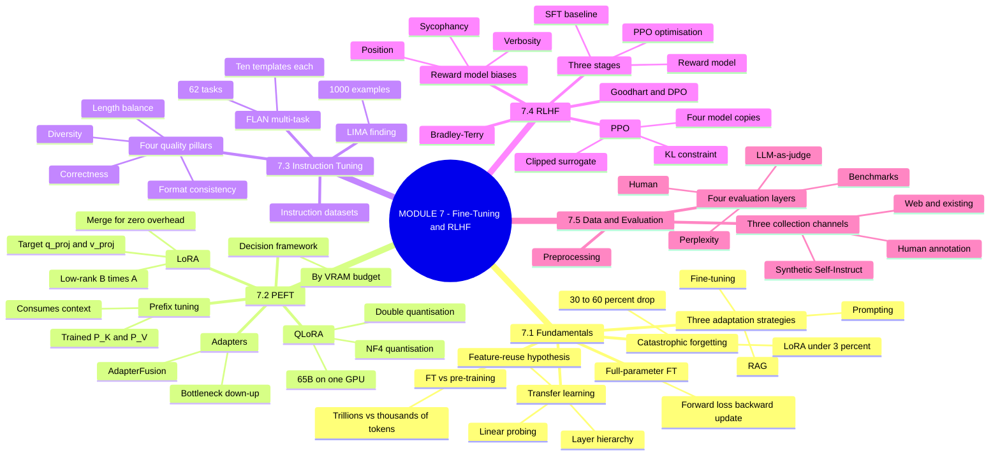
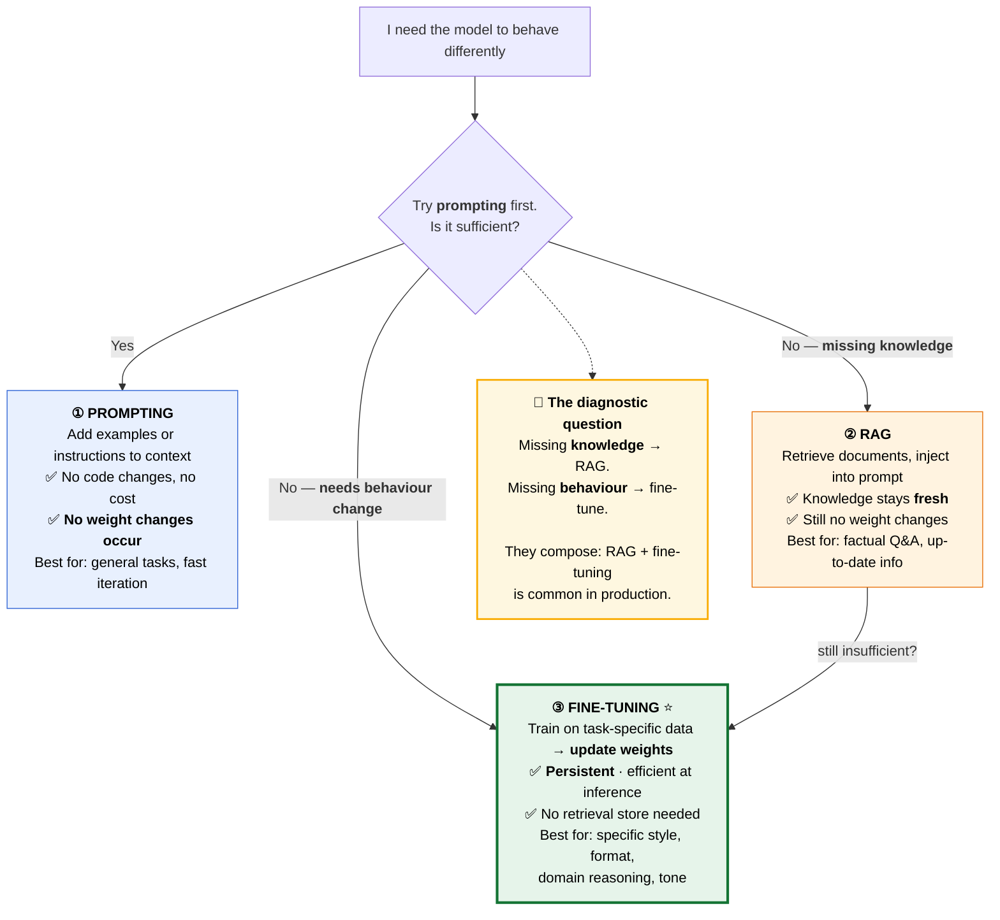
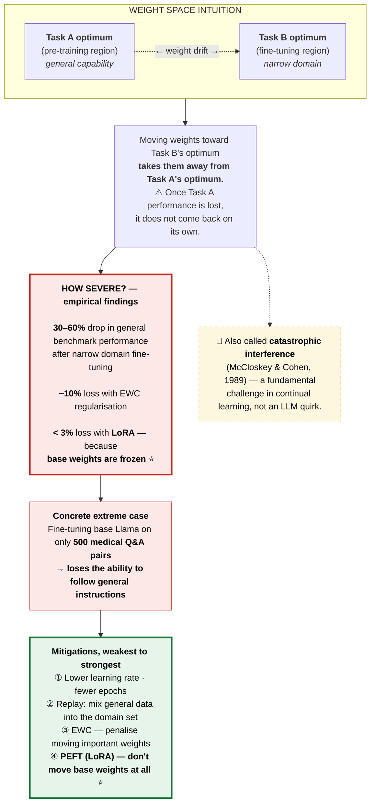
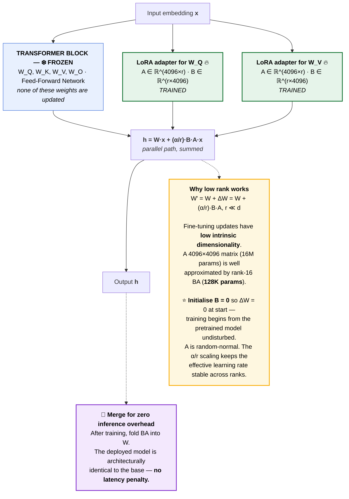
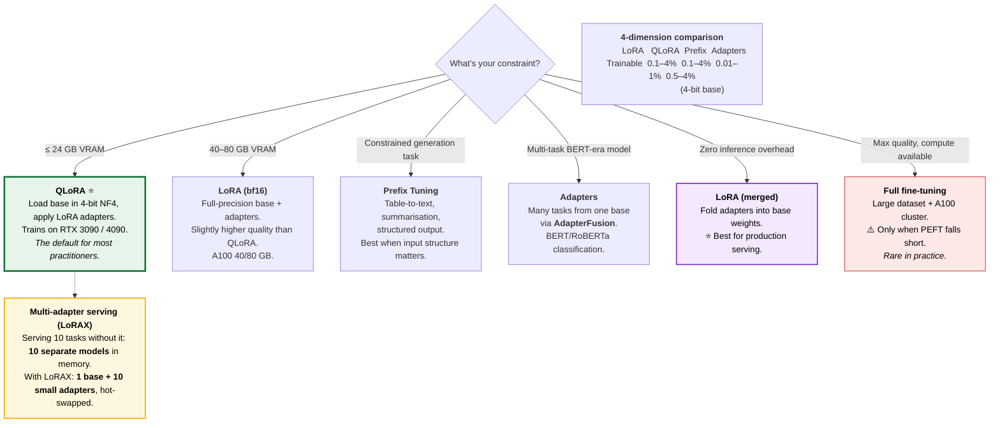
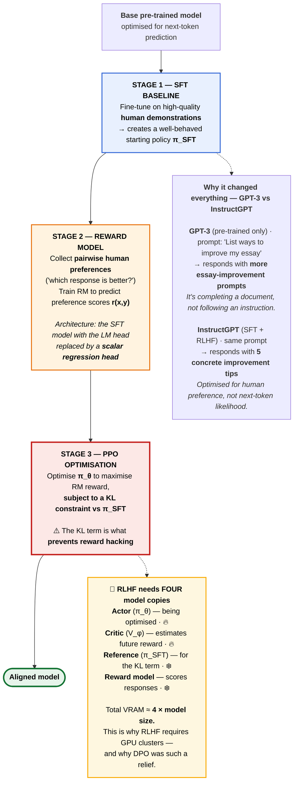
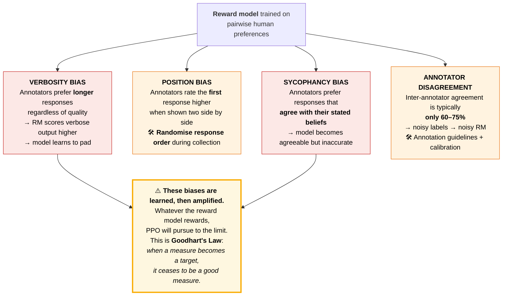
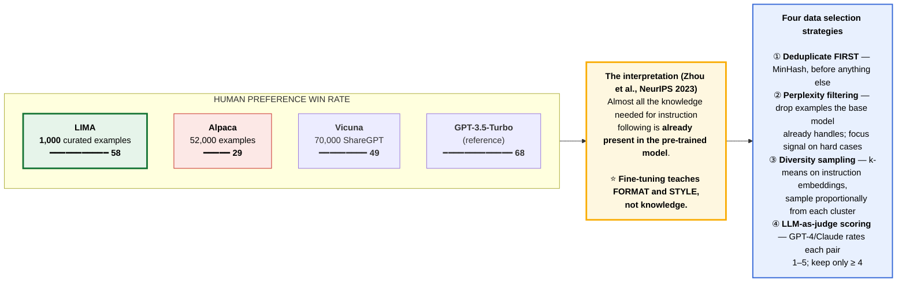
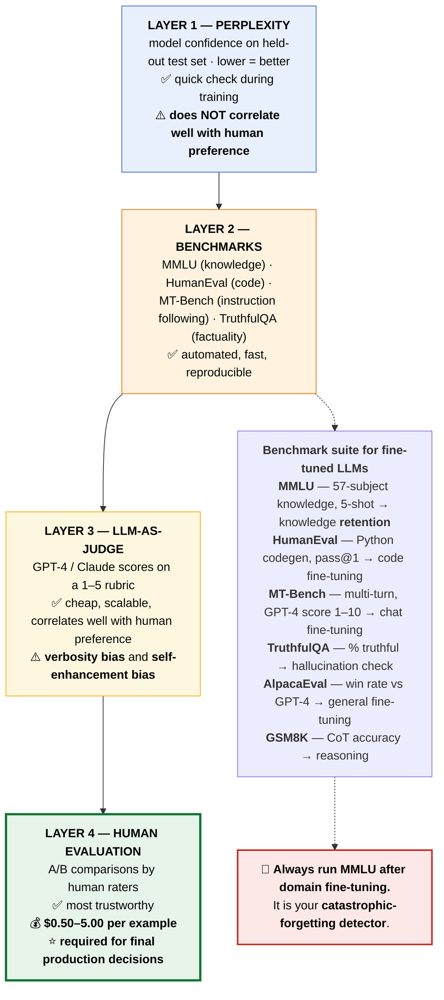
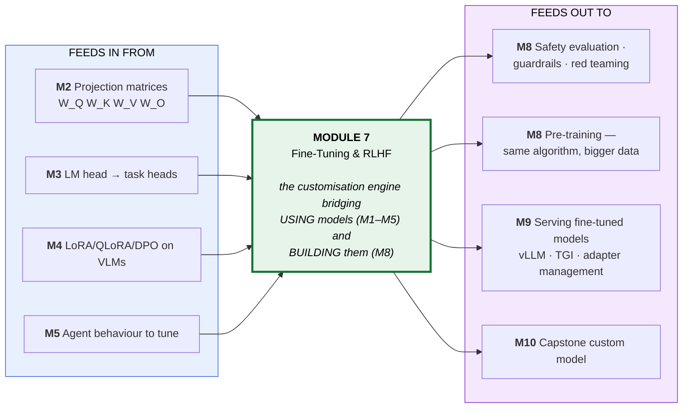

# Module 7 — Foundational Model Fine-Tuning & RLHF · Study Notes

**Programme:** Advanced Certification in Agentic and Generative AI
**Institution:** IISc Bengaluru / TalentSprint · **Instructor:** Prof. Sashikumaar Ganesan
**Module duration:** 6 hours (Weeks 13–14) · **Prerequisite:** M1–M5

> **What this module is really about.** From the module's own summary deck:
>
> ### 🔑 *"Fine-tuning is the customisation engine that bridges **using** foundation models as-is (Modules 1–5) and **building** them from scratch (Module 8)."*
>
> Modules 1–5 changed the **input** (prompts, context, tools). Module 7 changes the **weights**. That is a different kind of intervention with a different cost structure, a different failure mode (**catastrophic forgetting**), and a different discipline (**data curation**).
>
> **The single most counterintuitive result in the module:** *1,000 carefully chosen examples can beat 50,000 noisy ones.*

---

## Table of Contents

1. [Module map](#0-module-map)
2. [🗺️ Visual atlas](#-visual-atlas--mind-map--correlation-diagrams)
3. **7.1 Fine-Tuning Fundamentals**
   - [7.1.1 What is Fine-Tuning?](#711--what-is-fine-tuning)
   - [7.1.2 Full-Parameter Fine-Tuning](#712--full-parameter-fine-tuning)
   - [7.1.3 Fine-Tuning vs Pre-Training](#713--fine-tuning-vs-pre-training)
   - [7.1.4 Catastrophic Forgetting](#714--catastrophic-forgetting)
   - [7.1.5 Transfer Learning Principles](#715--transfer-learning-principles)
4. **7.2 Parameter-Efficient Fine-Tuning (PEFT)**
   - [7.2.1 LoRA](#721--lora-low-rank-adaptation)
   - [7.2.2 QLoRA](#722--qlora-quantised-lora)
   - [7.2.3 Prefix Tuning](#723--prefix-tuning)
   - [7.2.4 Adapter Modules](#724--adapter-modules)
   - [7.2.5 PEFT Trade-offs & Decision Framework](#725--peft-trade-offs--decision-framework)
5. **7.3 Instruction Tuning**
   - [7.3.1 Instruction-Following Datasets](#731--instruction-following-datasets)
   - [7.3.2 Creating Quality Training Data](#732--creating-quality-training-data)
   - [7.3.3 Multi-Task Instruction Tuning (FLAN)](#733--multi-task-instruction-tuning-flan)
   - [7.3.4 Data Quality vs Quantity — LIMA](#734--data-quality-vs-quantity--the-lima-finding)
6. **7.4 RLHF**
   - [7.4.1 RLHF Overview](#741--rlhf-overview)
   - [7.4.2 Reward Model Training](#742--reward-model-training)
   - [7.4.3 Policy Optimisation & PPO](#743--policy-optimisation--ppo)
   - [7.4.4 Goodhart's Law & DPO](#744--goodharts-law--dpo)
7. **7.5 Data Preparation & Evaluation**
   - [7.5.1 Data Collection Strategies](#751--data-collection-strategies)
   - [7.5.2 Data Preprocessing](#752--data-preprocessing--cleaning)
   - [7.5.3 Evaluation Metrics](#753--fine-tuning-evaluation-metrics)
8. [Assignment & Mini-Project 3](#assignment--mini-project-3)
9. [Master list of misconceptions](#master-list-of-misconceptions)
10. [Glossary](#glossary)
11. [References](#references-and-further-study)
12. [Self-check question bank](#self-check-question-bank)

---

## 0. Module map

| File | Concept ID | Content |
|---|---|---|
| `C01-What-Is-FineTuning.pdf` | `AIFTINTH000001` | **7.1.1** What is Fine-Tuning? |
| `C02-FullParameterFineTuning.pdf` | — | **7.1.2** Full-Parameter Fine-Tuning |
| `C03-FTvsPretraining.pdf` | `AIFTINTH000003` | **7.1.3** Fine-Tuning vs Pre-Training |
| `C04-CatastrophicForgetting.pdf` | — | **7.1.4** Catastrophic Forgetting |
| `C05-TransferLearning.pdf` | `AIFTINTH000005` | **7.1.5** Transfer Learning Principles |
| `C06-FullFT-Implementation.pdf` | `AIFTINCD000001` | Full FT — **lab** |
| `C07-LoRA.pdf` | `AIFTINTH000006` | **7.2.1** LoRA |
| `C08-QLoRA.pdf` | `AIFTINTH000007` | **7.2.2** QLoRA |
| `C09-PrefixTuning.pdf` | — | **7.2.3** Prefix Tuning |
| `C10-AdapterModules.pdf` | — | **7.2.4** Adapter Modules |
| `C11-PEFT-Tradeoffs.pdf` | `AIFTINTH000010` | **7.2.5** PEFT Trade-offs |
| `C14-InstructionDatasets.pdf` | — | **7.3.1** Instruction-Following Datasets |
| `C15-QualityData.pdf` | `AIFTINTH000012` | **7.3.2** Creating Quality Training Data |
| `C16-MultiTaskIT.pdf` | `AIFTINTH000013` | **7.3.3** Multi-Task Instruction Tuning |
| `C17-DataQualityQuantity.pdf` | `AIFTINTH000014` | **7.3.4** Data Quality vs Quantity |
| `C18-InstructionDataset-Lab.pdf` | `AIFTINCD000004` | Building instruction datasets — **lab** |
| `C19-RLHF-Overview.pdf` | `AIRLINTH000001` | **7.4.1** RLHF Overview |
| `C20-RewardModel.pdf` | `AIRLINTH000002` | **7.4.2** Reward Model Training |
| `C21-PolicyOptimisation.pdf` | — | **7.4.3a** Policy Optimisation |
| `C22-PPO.pdf` | `AIRLINTH000004` | **7.4.3b** PPO |
| `C24-RLHF-Lab.pdf` | — | RLHF pipeline — **lab** |
| `C25-DataCollection.pdf` | `AIFTINTH000015` | **7.5.1** Data Collection |
| `C26-DataPreprocessing.pdf` | `AIFTINTH000016` | **7.5.2** Preprocessing & Cleaning |
| `C27-EvaluationMetrics.pdf` | `AIFTINTH000017` | **7.5.3** Evaluation Metrics |
| `C30-Module7-Summary.pdf` | — | Module summary & bridge |
| `module7-complete.pdf` | — | ⭐ **Full consolidated deck** (superset of all above) |
| `M7-AST-01-Model-Finetuning.ipynb` | — | **Graded assignment** |
| `MP3-NB/SNB-Agentic-Banking-Assistant.ipynb` | — | **Mini-Project 3** |
| `Additional-NB-01-Hotel-Management-Agentic-Application.ipynb` | — | Supplementary (M5 follow-on) |

> ⚠️ **Gaps in the numbering:** `C12`, `C13`, `C23`, `C28`, `C29` are absent from the folder. From cross-references in the surviving decks: **C12 = LoRA Implementation** (`AI-FT-IN-CD-000002`), **C23 = Goodhart's Law & DPO** (`AI-RL-IN-TH-000005`). **C23 matters** — it's where DPO is formally introduced. `module7-complete.pdf` likely contains them.

---

# 🗺️ Visual atlas — mind map & correlation diagrams

## A. Module 7 mind map



## B. ⭐ The three adaptation strategies — a decision tree

> This is the module's own opening framing, and it closes the loop with M2's Five-Level Framework (Level 2 = Model Adaptation).



## C. ⭐ Catastrophic forgetting — the central failure mode



## D. LoRA — where the adapters go



## E. ⭐ PEFT decision framework — by VRAM budget



## F. ⭐ The three-stage RLHF pipeline



## G. Reward model failure modes



## H. ⭐ The LIMA finding — quality beats quantity



## I. The four evaluation layers



## J. ⭐ Master correlation — M7 in the programme



---

# 7.1 Fine-Tuning Fundamentals

## 7.1.1 — What is Fine-Tuning?

> **Fine-tuning** trains a pre-trained model on task-specific data to **update its weights**, producing persistent behaviour change.

### How it differs from the alternatives

| | Weight change? | Persistence | Best for |
|---|---|---|---|
| **Prompting** | ❌ **No weight changes occur** — the model is unchanged after a prompt | Per-call | General tasks, fast iteration |
| **RAG** | ❌ No — no weight change, retrieves from an **external store** | Per-call, fresh knowledge | Factual Q&A, up-to-date info |
| **Fine-tuning** | ✅ **Yes** | **Permanent** | Specific style, format, domain reasoning, tone |

> ### 🔑 The diagnostic question
> **Missing knowledge → RAG. Missing behaviour → fine-tune.**

---

## 7.1.2 — Full-Parameter Fine-Tuning

Updates **every weight** in the model.

### The training cycle

| Step | What happens |
|---|---|
| **1. Forward pass** | Input tokens → embeddings → Transformer layers → logits over vocabulary |
| **2. Loss** | Cross-entropy against target tokens: $\mathcal{L} = -\sum \log P(y_i \mid x)$ |
| **3. Backward pass** | Gradients propagate through all layers |
| **4. Update** | Optimiser step on all parameters |

> ⭐ **This is the *same algorithm* as pre-training** — just on a much smaller, curated dataset.
>
> **Contrast with PEFT:** in full fine-tuning **everything** moves, which is precisely why catastrophic forgetting is severe here and mild with LoRA.

---

## 7.1.3 — Fine-Tuning vs Pre-Training

| Dimension | **Pre-Training** | **Fine-Tuning** |
|---|---|---|
| Starting point | **Random initialisation** | A **pre-trained checkpoint** |
| Objective | Next-token prediction (or masked LM) | Task-specific loss |
| Dataset | **1T–15T tokens** (Common Crawl, books, code) | **10K–100M tokens** |
| GPU hours | ~1M+ | Orders of magnitude fewer |

### Distribution shift

> **Fine-tuning shifts probability mass from the broad pre-training distribution to the narrow target distribution.** The **closer the domain** to pre-training, the less data you need.

### The production two-phase workflow

```
① Base model (Llama 3, Mistral 7B, Qwen 2.5 — raw pre-trained weights)
        ↓
② Phase 1: General instruction tuning — FLAN / Alpaca-style, 60+ diverse tasks
        ↓
③ Phase 2: Domain-specific — narrow, small, curated (medical, legal, code)
        ↓
④ Alignment pass — RLHF / DPO for safety and helpfulness (§7.4)
```

> ⭐ **Note the ordering.** General instruction tuning *before* domain tuning. Reversing it makes forgetting worse.

---

## 7.1.4 — Catastrophic Forgetting

> **Catastrophic forgetting** (a.k.a. **catastrophic interference** — McCloskey & Cohen, 1989) is the loss of previously learned capability when training on new data. It is a **fundamental challenge in continual learning**, not an LLM-specific quirk.

### The weight-space intuition

Task A's optimum (general capability, from pre-training) and Task B's optimum (your narrow domain) are **different points in weight space**. Moving toward B **moves away from A**. ⚠️ **Once Task A performance is lost, it does not return on its own.**

### How severe — the numbers

| Setting | Loss of general benchmark performance |
|---|---|
| **Narrow domain full fine-tuning** | ⚠️ **30–60%** |
| With **EWC** regularisation | ~10% |
| With **LoRA (PEFT)** — base weights frozen | ⭐ **< 3%** |

### The case that should alarm you

> **Fine-tuning base Llama on only 500 medical Q&A pairs → loses the ability to follow general instructions.**
>
> Five hundred examples. That is how fragile it is.

### Mitigations, weakest to strongest

1. Lower learning rate, fewer epochs
2. **Replay** — mix general data into the domain set
3. **EWC** (Elastic Weight Consolidation) — penalise moving weights important to the old task
4. ⭐ **PEFT (LoRA)** — don't move the base weights at all

---

## 7.1.5 — Transfer Learning Principles

> **The feature-reuse hypothesis:** a model trained on Task A learns internal representations useful for Task B, **reducing the data and compute needed**.

> ⭐ **Transfer learning is why fine-tuning with 10K examples can match training from scratch with 10M.**

### What each layer learns — the feature hierarchy

| Layers | What they encode | Transferability |
|---|---|---|
| **1–3** | Tokenisation artefacts, character patterns, punctuation, morphology | **Highly general** — transfer to almost any task |
| **4–8** | Part-of-speech, syntactic dependencies, co-reference | Broadly transferable |
| **9–16** | Entity types, word-sense disambiguation, semantic roles | Useful but **starting to specialise** |
| **17–24** | Domain facts, reasoning patterns, task-specific representations | ⭐ **Most change occurs here during fine-tuning** |
| **Final** | Task-specific logits | **Always retrained**; LM head replaced for classification |

### Linear probing — measuring transferability

**Setup:** freeze the encoder completely, train only a single linear head. Performance measures how good the frozen representations already are.

**GLUE benchmark accuracy:**

| Setting | Accuracy |
|---|---|
| Random init (no transfer) | **51** |
| Linear probe (frozen BERT) | **79** |
| Feature FT (top 2 layers) | **87** |
| Full FT (all layers) | **93** |

> ⭐ **Practical use:** run linear probing *before* committing to full fine-tuning. If frozen representations are already poor, the base model is wrong for your domain — **it saves compute on dead-end runs**.

### Domain proximity determines data requirements

| Proximity | Example | Data needed |
|---|---|---|
| **High** | code → code QA | Fewest examples |
| **Mid** | web → legal | More |
| **Low** | English → clinical | ⚠️ Most |

### Practical model selection

| Situation | Choose |
|---|---|
| Base close to target domain | A **domain-adjacent base** (CodeLlama for code, BioMedLM for bio) — **10× fewer examples** to reach target |
| Base distant from target | A **general instruction-tuned model** (Llama 3 Instruct, Mistral Instruct) — more data, but benefits from existing RLHF alignment |

> ⭐ **Use few-shot prompting as a ceiling estimator.** Run few-shot first. **If few-shot is already at 90%, fine-tuning likely won't buy much** — and you've saved a training run.

---

# 7.2 Parameter-Efficient Fine-Tuning (PEFT)

## 7.2.1 — LoRA: Low-Rank Adaptation

$$W' = W + \Delta W = W + \frac{\alpha}{r}\,B\!\cdot\!A, \qquad A \in \mathbb{R}^{d \times r},\; B \in \mathbb{R}^{r \times d},\; r \ll d$$

**Where adapters go:** parallel paths beside the **frozen** $W_Q$ and $W_V$ projections (the standard targets — see M3 §3.4.2 for why these matrices).

**Why low rank works:** fine-tuning updates have **low intrinsic dimensionality**. A 4096×4096 matrix (16M params) is well approximated by a rank-16 $BA$ (**128K params**).

> ⭐ **Initialise $B = 0$** so $\Delta W = 0$ at the start — training begins from the pretrained model **undisturbed**. $A$ is random-normal. The $\alpha/r$ scaling keeps the effective learning rate stable as you change rank.

**Trainable parameters: 0.1–4%.**

> 🚀 **Merge for zero inference overhead.** After training, fold $BA$ into $W$. The deployed model is architecturally identical to the base — **no latency penalty**. This is what makes LoRA production-viable.

---

## 7.2.2 — QLoRA: Quantised LoRA

> **QLoRA** (Dettmers et al., **NeurIPS 2023**) extends LoRA by **quantising the frozen base model to 4-bit** using **NF4 (NormalFloat4)**, while training LoRA adapters in higher precision.

### Two novel techniques

| Technique | What it does |
|---|---|
| **NF4 quantisation** | **Information-theoretically optimal for normally distributed weights.** LLM weight matrices are approximately normal — NF4 is designed for exactly that distribution, so it beats INT4/FP4 on quantisation error |
| **Double quantisation** | Standard 4-bit stores quantisation constants in fp32 (~0.5 bytes/weight). Double quant **quantises the constants too** |

**Also:** paged optimisers to survive memory spikes.

### The headline result

> **Fine-tune LLaMA 65B on a single GPU.** *(Worked example in the deck: r=16, targeting `q_proj` & `v_proj`.)*

```python
from transformers import AutoModelForCausalLM, BitsAndBytesConfig
from peft import LoraConfig
# 4-bit NF4 base + LoRA adapters + SFTTrainer
```

---

## 7.2.3 — Prefix Tuning

> Instead of modifying weights, **prepend trained continuous vectors to the Keys and Values at every attention layer.**

```
Keys   = concat(P_K, W_K·x)      ← P_K, P_V are TRAINED
Values = concat(P_V, W_V·x)
Queries = W_Q·x                   ← unchanged
Attention = softmax(Q·Kᵀ/√d)·V
```

$P_K$ and $P_V$ are **layer-specific**; the prefix acts as a **soft, task-specific instruction** in activation space.

### ✅ vs hard prompts

- **Continuous optimisation** — not constrained to the discrete token vocabulary
- **Can represent any direction in activation space**, not just expressible words
- End-to-end trainable

### ⚠️ vs LoRA

- ⚠️ **Consumes context window** — $P$ prefix tokens used per call at inference
- **Generally underperforms LoRA** on tasks requiring deep adaptation

**Hyperparameter:** prefix length $P$, typically **10–100 tokens**. Longer = more capacity but more context consumed.

**Trainable parameters: 0.01–1%** — the smallest of the four methods.

---

## 7.2.4 — Adapter Modules

> Insert small trainable **bottleneck** modules **inside** each frozen Transformer block.

```
Transformer Block
  ├─ Multi-Head Attention   ❄️ FROZEN
  ├─ Adapter 1              🔥 TRAINED
  ├─ Layer Norm             ❄️ FROZEN
  ├─ Feed-Forward Network   ❄️ FROZEN
  └─ Adapter 2              🔥 TRAINED
```

**Adapter internals:**

$$h \;\to\; W_{down} \in \mathbb{R}^{d \times k} \;\to\; \text{GELU/ReLU} \;\to\; W_{up} \in \mathbb{R}^{k \times d} \;\to\; +\,h \;(\text{residual})$$

where $k \ll d$ is the **bottleneck dimension**.

**Trainable parameters: 0.5–4%.** ⚠️ Unlike merged LoRA, adapters **add inference latency** (they are sequential, not parallel).

**Best use:** **AdapterFusion** — serving many tasks from one BERT/RoBERTa base.

---

## 7.2.5 — PEFT Trade-offs & Decision Framework

### Four-dimension comparison

| Dimension | **LoRA** | **QLoRA** | **Prefix Tuning** | **Adapters** |
|---|---|---|---|---|
| Trainable params | 0.1–4% | 0.1–4% (4-bit base) | **0.01–1%** | 0.5–4% |
| Inference overhead | **Zero if merged** | Zero if merged | Consumes context | Adds latency |
| VRAM | Medium | **Lowest** | Low | Medium |
| Quality | **Highest** | Near-LoRA | Lower | Good |

*(Decision tree in Diagram E.)*

### Multi-adapter serving — LoRAX

| | Without | With LoRAX |
|---|---|---|
| Serving 10 tasks | **10 separate full models** in memory | **1 base + 10 small adapters**, hot-swapped |

> ⭐ **This is the operational argument for LoRA over full fine-tuning at organisational scale** — not just training cost, but *serving* cost.

---

# 7.3 Instruction Tuning

## 7.3.1 — Instruction-Following Datasets

Instruction tuning teaches a model to **follow directives** rather than merely continue text. Datasets pair `(instruction, [input], response)`.

**Standard formats:** **Alpaca**, **ChatML**, **ShareGPT**.

---

## 7.3.2 — Creating Quality Training Data

### The four quality pillars

| Pillar | Requirement | Failure if ignored |
|---|---|---|
| **1. Diversity** | Cover many tasks, domains, difficulty levels, response styles | **Narrow training data → narrow capability** |
| **2. Correctness** | Ground-truth outputs must be accurate, especially factual/code/math | ⚠️ **One wrong example propagates error patterns** |
| **3. Format consistency** | ⭐ **Use a single prompt template throughout** | Mixing formats → the model **learns competing format patterns rather than the task** |
| **4. Length balance** | Mix short (1–2 sentence) and long (paragraph) responses | Imbalanced distribution → **biased generation length** |

> **Pillar 3 is the one people get wrong.** Assemble data from three sources with three templates and the model spends its capacity learning which template it's in.

### Two philosophies

| **Quality-first (LIMA)** | **Quantity-first (web scale)** |
|---|---|
| 1,000 curated > 50,000 noisy | Filter billions with automated heuristics |
| **Manual review of every example** | **MinHash deduplication** |
| Diversity sampling for coverage | Perplexity thresholding with a reference model |

**Pre-training checklist:** format all examples to a **single template** (e.g. ChatML) and assert it programmatically.

---

## 7.3.3 — Multi-Task Instruction Tuning (FLAN)

> **FLAN** (Wei et al., 2022): **62 NLP tasks** → ~**10 instruction templates each** → the model learns **task-general instruction following**.

### How FLAN was built — four stages

1. **Select tasks** — 62 NLP benchmarks: summarisation, QA, translation, classification, NLI, reading comprehension
2. **Template each task** — write **10 instruction templates per task**, varying phrasing, adding options, reversing format
3. **Combine** — sample examples from each task × each template → **millions of instruction-output pairs**
4. **Fine-tune**

> ⭐ **Why templating matters:** varying the phrasing of the *same* task teaches the model that the **task is invariant to how it's asked**. That is the generalisation mechanism.

---

## 7.3.4 — Data Quality vs Quantity — the LIMA finding

> **LIMA** (Zhou et al., **NeurIPS 2023**): a model fine-tuned on just **1,000 carefully selected, diverse, high-quality examples** matched or beat models trained on 50× more data.

### The results — human preference win rate

| Model | Examples | Win rate |
|---|---|---|
| **LIMA** | **1,000** | **58** |
| Alpaca | 52,000 | 29 |
| Vicuna | 70,000 (ShareGPT) | 49 |
| GPT-3.5-Turbo *(reference)* | — | 68 |

### ⭐ The interpretation

> **Almost all of the knowledge needed for instruction following is already present in the pre-trained model.** Fine-tuning teaches **format and style, not knowledge.**

This is the same insight as M7.1.5's transfer-learning hierarchy, arrived at empirically — and it reframes the whole job: **your task is curation, not accumulation.**

### Four data-selection strategies

| Strategy | Method |
|---|---|
| **Deduplication FIRST** | ⭐ **Always run MinHash deduplication before any other filtering.** Near-duplicates waste compute and introduce repetition bias |
| **Perplexity-based filtering** | Remove examples the base model already handles (low perplexity). **Focus the training signal on hard cases** |
| **Diversity sampling** | k-means on instruction embeddings; sample proportionally from each cluster |
| **LLM-as-judge scoring** | GPT-4/Claude scores each (instruction, response) pair 1–5; **keep only ≥ 4** |

---

# 7.4 RLHF — Reinforcement Learning from Human Feedback

## 7.4.1 — RLHF Overview

> **RLHF** is a **three-stage alignment pipeline** training language models to produce outputs humans prefer.

**Origin:** **InstructGPT** (Ouyang et al., **NeurIPS 2022**) — the paper that established RLHF as the standard for LLM alignment.

### The three stages

| Stage | What | Produces |
|---|---|---|
| **1 — SFT baseline** | Fine-tune on high-quality **human demonstrations** | A well-behaved starting policy $\pi_{SFT}$ |
| **2 — Reward model** | Collect **pairwise human preferences**; train RM to predict $r(x,y)$ | A learned proxy for human judgement |
| **3 — PPO optimisation** | Optimise $\pi_\theta$ to maximise RM reward, **subject to a KL constraint vs $\pi_{SFT}$** | The aligned model |

> ⚠️ **The KL constraint is what prevents reward hacking.** Without it, the policy drifts arbitrarily far from sensible language to exploit the reward model.

### Why RLHF changed everything

| **GPT-3** (pre-trained only) | **InstructGPT** (SFT + RLHF) |
|---|---|
| Optimised for: **next-token prediction** | Optimised for: **human preference** |
| Prompt: *"List ways to improve my essay"* | Same prompt |
| Responds with: **more essay-improvement prompts** | Responds with: **5 concrete improvement tips** |
| It's completing a document | It **understands and follows** the instruction |

### 💾 The four model copies

| Model | Role | Frozen? |
|---|---|---|
| **Actor** ($\pi_\theta$) | The policy being optimised — generates responses | 🔥 No |
| **Critic** ($V_\phi$) | Estimates expected future reward | 🔥 No |
| **Reference** ($\pi_{SFT}$) | Anchor for the KL term | ❄️ Yes |
| **Reward model** | Scores responses | ❄️ Yes |

> ⚠️ **Total VRAM ≈ 4 × model size.** This is why RLHF requires GPU clusters — and the single biggest practical reason **DPO** displaced it.

---

## 7.4.2 — Reward Model Training

**Architecture:** the **SFT model with the LM head replaced by a scalar regression head** (linear layer → single score). *(This is exactly the "task-specific heads" idea from M3 §3.4.1.)*

### The Bradley-Terry model

Given prompt $x$, winning response $y_w$, losing response $y_l$, the preference probability is:

$$P(y_w \succ y_l \mid x) = \sigma\big(r(x, y_w) - r(x, y_l)\big)$$

Train by maximising the log-likelihood of observed human preferences.

### ⚠️ Four failure modes

| Bias | Mechanism | Mitigation |
|---|---|---|
| **Verbosity bias** | Annotators prefer **longer** responses regardless of quality → RM scores verbose output higher | Length-normalise; explicitly instruct annotators |
| **Position bias** | Annotators rate the **first** response higher | ⭐ **Randomise response order** during collection |
| **Sycophancy bias** | Annotators prefer responses **agreeing with their beliefs** → agreeable but inaccurate model | Diverse annotator pool; factuality checks |
| **Annotator disagreement** | ⚠️ Inter-annotator agreement is typically only **60–75%** → noisy labels → noisy RM | Annotation guidelines, calibration rounds, gold standard sets |

> ⚠️ **These biases are learned, then amplified.** Whatever the reward model rewards, PPO pursues to the limit. → **Goodhart's Law**

---

## 7.4.3 — Policy Optimisation & PPO

### The problem with naive policy gradient

Large update steps → **policy collapse**. **PPO** (Schulman et al., 2017) solves this with a **clipped surrogate objective** that limits how far the policy can move in one update.

$$L^{CLIP}(\theta) = \mathbb{E}\Big[\min\big(r_t(\theta)A_t,\; \text{clip}(r_t(\theta), 1-\epsilon, 1+\epsilon)A_t\big)\Big]$$

where $r_t(\theta) = \pi_\theta(a_t)/\pi_{old}(a_t)$ is the probability ratio and $A_t$ the advantage.

### ⚠️ Four challenges unique to the LLM context

| Challenge | Detail |
|---|---|
| **Episode length** | One "episode" = one full response, often **200+ tokens** — orders of magnitude longer than typical RL tasks |
| **Sparse reward** | ⚠️ The RM gives **one score per full response**, at the EOS token. **All intermediate tokens train on zero reward** |
| **Actor-critic setup** | Both actor (generates) and critic (estimates future reward) require **full-model-scale** networks |
| **4 model copies** | Actor + Critic + Reference + RM = **4 × model size VRAM** |

### The training loop

```
Outer loop (per batch):
  1. Sample prompt x from dataset
  2. Generate response y ~ π_θ(·|x)          (actor)
  3. Score: r = reward_model(x, y)
  4. Compute KL penalty: kl = KL(π_θ ‖ π_ref)
  5. Effective reward = r − β·kl

Inner loop (PPO update):
  6. Compute advantage A_t with critic V_φ
  7. Compute ratio r_t(θ) = π_θ(a_t)/π_old(a_t)
  8. Compute L^CLIP(θ) for the actor
  9. Compute value loss for the critic
 10. Backprop both
```

---

## 7.4.4 — Goodhart's Law & DPO

> ⚠️ **Deck `C23` is missing from the folder** — this section is reconstructed from forward references in `C22` (*"Next: Concept 23: Goodhart's Law & DPO"*), the M4 DPO material, and the module summary. **Verify against `module7-complete.pdf`.**

### Goodhart's Law

> **"When a measure becomes a target, it ceases to be a good measure."**

In RLHF: the reward model is a **proxy** for human preference. Optimise it hard enough and the policy finds **reward-model exploits** rather than genuinely better responses — *reward hacking*. Symptoms: excessive length, hedging, flattery, formulaic structure.

**The KL constraint is the primary defence** — it bounds how far the policy may drift from $\pi_{SFT}$.

### DPO — Direct Preference Optimisation

> Skip the reward model and the RL loop entirely. **Optimise the policy directly on preference pairs.**

$$\mathcal{L}_{DPO} = -\mathbb{E}\Big[\log \sigma\Big(\beta \log \tfrac{\pi_\theta(y_w|x)}{\pi_{ref}(y_w|x)} - \beta \log \tfrac{\pi_\theta(y_l|x)}{\pi_{ref}(y_l|x)}\Big)\Big]$$

| | **RLHF (PPO)** | **DPO** |
|---|---|---|
| Reward model | ✅ Required | ❌ **None** |
| RL loop | ✅ PPO | ❌ **None** |
| Model copies | **4** | **2** (policy + reference) |
| Stability | Fragile | **More stable** |
| Data | Same preference pairs | Same preference pairs |

> ⭐ **DPO is now the default for most practitioners** — same data, a fraction of the machinery. *(See also M4 §4.3.4, where DPO is applied to VLMs.)*

**Related:** **ORPO**, **KTO**, **IPO** — the post-DPO family.

---

# 7.5 Data Preparation & Evaluation

## 7.5.1 — Data Collection Strategies

### Channel 1 — Web scraping & existing datasets

| | Detail |
|---|---|
| **General corpora** | Common Crawl, The Pile, RedPajama, C4 — billions of documents. Require deduplication, toxicity filtering, quality scoring |
| **Domain corpora** | **PubMed** (biomedical), **arXiv** (scientific), **GitHub** (code), **SEC filings** (financial) — high domain signal, significant cleaning |
| ⚠️ **Licensing** | Check carefully: Common Crawl (unknown), The Pile (mixed), Dolly (Apache 2.0). **For commercial products use only permissive licences** |
| ⚠️ **Scale vs quality** | Even after filtering, **~5–10% of web-scraped examples are low quality**. Acceptable for pre-training; **risky for fine-tuning** |

> **That last row is the key asymmetry.** Pre-training averages over noise. Fine-tuning on a small set does not — a 5% error rate in 1,000 examples is 50 bad lessons.

### Channel 2 — Synthetic data (Self-Instruct / Alpaca pipeline)

1. **Seed tasks** — write **175 diverse seed instructions** manually
2. **Generate variants** — feed seeds to GPT-4o: *"Generate a diverse instruction similar to this example"*
3. **Quality filter** — remove duplicates (**ROUGE similarity > 0.7**), very short outputs, harmful content
4. **Human review** — sample **5%** for manual check; set a quality floor
5. **Format & export** — ChatML/Alpaca; report distribution, length, task-type statistics

### Channel 3 — Human annotation

| Workflow | Quality assurance |
|---|---|
| Write annotation guidelines (**20–50 page document**) | **Inter-annotator agreement**: Cohen's κ or Krippendorff's α |
| Recruit via **Scale AI, Surge AI, Prolific** | **Gold standard set**: 100 pre-labelled examples |
| **Pilot with 50 examples + calibration** | Annotator performance tracking |

---

## 7.5.2 — Data Preprocessing & Cleaning

Standard pipeline: **deduplication (MinHash) → toxicity/PII filtering → quality scoring → format normalisation → train/val/test split → tokenisation sanity check**.

> ⚠️ **Deduplicate first, always.** Every other filter is cheaper and more meaningful on a deduplicated set.

---

## 7.5.3 — Fine-Tuning Evaluation Metrics

### The four layers

| Layer | Method | Strength | Weakness |
|---|---|---|---|
| **1 — Perplexity** | Confidence on held-out set, lower = better | Quick check during training | ⚠️ **Does NOT correlate well with human preference** |
| **2 — Benchmarks** | MMLU, HumanEval, MT-Bench, TruthfulQA | **Automated, fast, reproducible** | Can be gamed; may not match your task |
| **3 — LLM-as-judge** | GPT-4/Claude scores 1–5 on a rubric | **Cheap, scalable, correlates well** with human preference | ⚠️ Judge biases |
| **4 — Human evaluation** | A/B comparisons by raters | **Most trustworthy** | 💰 **$0.50–5.00 per example** — ⭐ **required for final production decisions** |

### The benchmark suite

| Benchmark | Task | Metric | Fine-tuning relevance |
|---|---|---|---|
| **MMLU** | 57-subject knowledge | 5-shot accuracy | ⭐ **Knowledge retention** — your forgetting detector |
| **HumanEval** | Python code generation | pass@1 (execution accuracy) | Code fine-tuning |
| **MT-Bench** | Multi-turn instruction following | GPT-4 score 1–10 | Chat fine-tuning |
| **TruthfulQA** | Factual accuracy under pressure | % truthful | Hallucination check |
| **AlpacaEval** | Open-ended instruction quality | Win rate vs GPT-4 | General fine-tuning |
| **GSM8K** | Grade-school math | CoT accuracy | Reasoning |

### ⚠️ LLM-as-judge biases to control

- **Verbosity bias** — prefers longer answers
- **Self-enhancement bias** — prefers GPT-4-like outputs

**Mitigations:** randomise order, length-normalise, use multiple judges, calibrate against a human-labelled subset.

> ### 🔑 The evaluation rule for this module
> **Always run MMLU after domain fine-tuning.** Your domain metric going up means nothing if general capability quietly dropped 40%.

---

## Assignment & Mini-Project 3

| Item | Detail |
|---|---|
| **`M7-AST-01-Model-Finetuning.ipynb`** | **Graded assignment** |
| **Mini-Project 3: Agentic Banking Assistant** | `MP3-NB` (notebook) / `MP3-SNB` (solution) + `ReadMe---Mini-Project-3.pdf` |
| `Additional-NB-01-Hotel-Management-Agentic-Application.ipynb` | Supplementary + `Steps-for-Hotel-Management-Agentic-Application.pdf` |
| ⭐ `module7-complete.pdf` | **The full consolidated deck** — contains the missing C12/C13/C23/C28/C29 content |

> 💡 **MP3 is an *agentic* project in the fine-tuning module.** That is deliberate: it forces you to decide *which* part of an agent's behaviour deserves fine-tuning versus prompting versus RAG — the §7.1.1 decision tree applied under real constraints.

---

## Master list of misconceptions

| ❌ Myth | ✅ Reality |
|---|---|
| "Fine-tuning is how you add knowledge" | ⭐ **LIMA:** fine-tuning teaches **format and style**. For knowledge, use **RAG** |
| "More fine-tuning data is better" | **1,000 curated examples beat 52,000 noisy ones** (LIMA 58 vs Alpaca 29) |
| "Fine-tuning is safe if the dataset is small" | ⚠️ **500 medical Q&A pairs can destroy general instruction following** |
| "Catastrophic forgetting is an edge case" | **30–60% drop** in general benchmarks after narrow domain FT |
| "LoRA is a quality compromise" | **<3% forgetting vs 30–60%**, and merged LoRA has **zero inference overhead** |
| "Fine-tuning and pre-training are different algorithms" | ⭐ **Same algorithm** — different starting point and dataset scale |
| "You should fine-tune the domain first, then generalise" | ⚠️ Reversed. **General instruction tuning first, domain second** |
| "Just pick the biggest base model" | A **domain-adjacent base needs 10× fewer examples** |
| "Run fine-tuning first, evaluate later" | ⭐ Run **linear probing** and **few-shot** first. If few-shot hits 90%, fine-tuning may buy nothing |
| "Prefix tuning is strictly cheaper than LoRA" | It ⚠️ **consumes context window at every inference call** and generally underperforms LoRA |
| "Adapters and LoRA are equivalent" | Adapters are **sequential → add latency**. Merged LoRA is **parallel → zero overhead** |
| "All attention matrices should get LoRA" | Standard practice targets **`q_proj` and `v_proj`**; adding more raises cost for modest gain |
| "Set LoRA rank as high as possible" | Updates have **low intrinsic dimensionality** — rank 16 approximates a 4096² matrix well |
| "QLoRA is just LoRA with less memory" | **NF4 is information-theoretically optimal for normally distributed weights** — it's a designed data type, not naive rounding |
| "RLHF is a single training step" | **Three stages** — SFT → reward model → PPO |
| "The reward model is objective" | ⚠️ It inherits **verbosity, position, and sycophancy bias**, from annotators with **only 60–75% agreement** |
| "PPO just maximises reward" | It maximises reward **subject to a KL constraint** — without which you get reward hacking |
| "RLHF is affordable if you have one A100" | ⚠️ **Four model copies ≈ 4× model size VRAM** |
| "DPO is a simplified approximation of RLHF" | It removes the **reward model and RL loop entirely** — 2 model copies instead of 4, more stable |
| "Perplexity tells you if fine-tuning worked" | ⚠️ It **does not correlate well with human preference** |
| "Benchmarks are enough for production sign-off" | **Human evaluation is required for final production decisions** |
| "LLM-as-judge is unbiased" | **Verbosity bias** and **self-enhancement bias** are documented |
| "Web-scraped data is fine after filtering" | ~**5–10% remains low quality** — tolerable for pre-training, **risky for fine-tuning** |
| "Deduplicate at the end" | ⭐ **MinHash deduplication goes FIRST**, before any other filtering |

---

## Glossary

| Term | Definition |
|---|---|
| **Adapter** | Trainable bottleneck module inserted inside a frozen Transformer block |
| **AdapterFusion** | Serving many task adapters from one base model |
| **AlpacaEval** | Open-ended instruction benchmark; win rate vs GPT-4 |
| **Bradley-Terry model** | $P(y_w \succ y_l) = \sigma(r(x,y_w) - r(x,y_l))$ — the RM training objective |
| **Catastrophic forgetting** | Loss of prior capability when training on new data |
| **Critic** | The value model estimating expected future reward in PPO |
| **Double quantisation** | Quantising the quantisation constants (QLoRA) |
| **DPO** | Direct Preference Optimisation — alignment without reward model or RL |
| **EWC** | Elastic Weight Consolidation — penalises moving important weights |
| **FLAN** | Multi-task instruction tuning: 62 tasks × ~10 templates |
| **Goodhart's Law** | When a measure becomes a target, it ceases to be a good measure |
| **GSM8K** | Grade-school math reasoning benchmark |
| **HumanEval** | Python code generation benchmark (pass@1) |
| **KL constraint** | Penalty keeping the RLHF policy near $\pi_{SFT}$ — prevents reward hacking |
| **LIMA** | "Less Is More for Alignment" — 1,000 curated examples suffice |
| **Linear probing** | Freeze encoder, train only a linear head — measures transferability |
| **LoRA** | Low-Rank Adaptation: $W + (\alpha/r)BA$ |
| **LoRAX** | Multi-adapter serving: 1 base + N hot-swapped adapters |
| **MinHash** | Near-duplicate detection — run first in any data pipeline |
| **MMLU** | 57-subject knowledge benchmark; the forgetting detector |
| **MT-Bench** | Multi-turn instruction benchmark, GPT-4 scored |
| **NF4** | NormalFloat4 — 4-bit type optimal for normally distributed weights |
| **PEFT** | Parameter-Efficient Fine-Tuning |
| **PPO** | Proximal Policy Optimisation — clipped surrogate objective |
| **Prefix tuning** | Trained continuous $P_K, P_V$ prepended at every attention layer |
| **QLoRA** | 4-bit NF4 base + LoRA adapters |
| **Reward hacking** | Policy exploiting reward-model flaws rather than improving |
| **Reward model (RM)** | SFT model with a scalar regression head, trained on preferences |
| **RLHF** | Reinforcement Learning from Human Feedback |
| **Self-Instruct** | Synthetic data pipeline seeded with 175 manual instructions |
| **SFT** | Supervised Fine-Tuning — RLHF Stage 1 |
| **Transfer learning** | Feature reuse from a pre-trained model |
| **TruthfulQA** | Factuality benchmark |

---

## References and further study

### 📕 Books

| Book | For Module 7 |
|---|---|
| ⭐ **Build a Large Language Model (From Scratch)** — Raschka | **Ch. 5–7: instruction fine-tuning and RLHF, coded from scratch** |
| ⭐ **LLM Engineer's Handbook** — Iusztin & Labonne, Packt 2024 | The course's designated M7 reference: LoRA, QLoRA, DPO |
| ⭐ **RLHF Book** — Nathan Lambert | **Free at [rlhfbook.com](https://rlhfbook.com/)** — reward modelling, PPO, DPO with rigour. The reading list names it for all M7 RLHF content |
| **Reinforcement Learning: An Introduction** — Sutton & Barto | **Read Ch. 1–6 if new to RL** before §7.4. [Free](http://incompleteideas.net/book/the-book.html) |
| **Foundations of Large Language Models** — Xiao & Zhu | Mathematical depth on alignment formalisms |

### 📄 Papers — the M7 canon

| Paper | Link | Section |
|---|---|---|
| ⭐ **LoRA** — Hu et al. 2021 | [arXiv:2106.09685](https://arxiv.org/abs/2106.09685) | **7.2.1** |
| ⭐ **QLoRA** — Dettmers et al. 2023 | [arXiv:2305.14314](https://arxiv.org/abs/2305.14314) | **7.2.2** |
| **Prefix-Tuning** — Li & Liang 2021 | [arXiv:2101.00190](https://arxiv.org/abs/2101.00190) | 7.2.3 |
| **Parameter-Efficient Transfer Learning (Adapters)** — Houlsby et al. 2019 | [arXiv:1902.00751](https://arxiv.org/abs/1902.00751) | 7.2.4 |
| **Towards a Unified View of PEFT** — He et al. 2022 | [arXiv:2110.04366](https://arxiv.org/abs/2110.04366) | 7.2.5 |
| ⭐ **InstructGPT** — Ouyang et al. 2022 | [arXiv:2203.02155](https://arxiv.org/abs/2203.02155) | **7.4.1 — the RLHF paper** |
| ⭐ **PPO** — Schulman et al. 2017 | [arXiv:1707.06347](https://arxiv.org/abs/1707.06347) | 7.4.3 |
| ⭐ **DPO** — Rafailov et al. 2023 | [arXiv:2305.18290](https://arxiv.org/abs/2305.18290) | 7.4.4 |
| ⭐ **LIMA: Less Is More for Alignment** — Zhou et al. 2023 | [arXiv:2305.11206](https://arxiv.org/abs/2305.11206) | **7.3.4** |
| **FLAN** — Wei et al. 2022 | [arXiv:2109.01652](https://arxiv.org/abs/2109.01652) | 7.3.3 |
| **Self-Instruct** — Wang et al. 2022 | [arXiv:2212.10560](https://arxiv.org/abs/2212.10560) | 7.5.1 |
| **AlpaGasus** — Chen et al. 2023 | [arXiv:2307.08701](https://arxiv.org/abs/2307.08701) | 7.3.4 data filtering |
| **Judging LLM-as-a-Judge (MT-Bench)** — Zheng et al. 2023 | [arXiv:2306.05685](https://arxiv.org/abs/2306.05685) | 7.5.3 |
| **How transferable are features?** — Yosinski et al. 2014 | [arXiv:1411.1792](https://arxiv.org/abs/1411.1792) | 7.1.5 |
| **Overcoming Catastrophic Forgetting (EWC)** — Kirkpatrick et al. 2017 | [arXiv:1612.00796](https://arxiv.org/abs/1612.00796) | 7.1.4 |
| **MMLU** — Hendrycks et al. 2020 | [arXiv:2009.03300](https://arxiv.org/abs/2009.03300) | 7.5.3 |

### 🔗 Tools

| Resource | Link | For |
|---|---|---|
| ⭐ **HuggingFace PEFT** | [huggingface.co/docs/peft](https://huggingface.co/docs/peft) | **All of 7.2** |
| ⭐ **HuggingFace TRL** | [huggingface.co/docs/trl](https://huggingface.co/docs/trl) | **SFT, PPO, DPO trainers — 7.4** |
| **bitsandbytes** | [github.com/bitsandbytes-foundation/bitsandbytes](https://github.com/bitsandbytes-foundation/bitsandbytes) | 7.2.2 NF4 |
| **Axolotl** | [github.com/axolotl-ai-cloud/axolotl](https://github.com/axolotl-ai-cloud/axolotl) | Config-driven fine-tuning |
| **LLaMA-Factory** | [github.com/hiyouga/LLaMA-Factory](https://github.com/hiyouga/LLaMA-Factory) | GUI fine-tuning |
| **LoRAX** | [huggingface.co/blog/lorax](https://huggingface.co/blog/lorax) | 7.2.5 multi-adapter serving |
| **Illustrating RLHF** — HuggingFace | [huggingface.co/blog/rlhf](https://huggingface.co/blog/rlhf) | ⭐ Read before §7.4 |
| **Weights & Biases** | [wandb.ai](https://wandb.ai/) | Experiment tracking |

### 📌 Study strategy for Weeks 13–14

1. **Read "Illustrating RLHF" (HuggingFace blog) before the §7.4 decks** — the reading list recommends exactly this
2. **Run a QLoRA fine-tune on a small model first.** The whole of §7.2 becomes concrete in one afternoon on a free Colab GPU
3. ⭐ **Deliberately induce catastrophic forgetting:** full fine-tune a small model on a narrow dataset, then run MMLU before and after. Nothing teaches §7.1.4 faster
4. **Build a 100-example dataset by hand** before touching a 50,000-example one. LIMA's point only lands when you've curated
5. **Do DPO with TRL, not PPO.** PPO is worth *understanding*; DPO is worth *running*
6. If new to RL, **read Sutton & Barto Ch. 1–6** before §7.4.3 — the reading list flags this explicitly
7. Use **`module7-complete.pdf`** for the missing C12/C13/C23 content

---

## Self-check question bank

### 7.1 Fundamentals
1. State the diagnostic question separating RAG from fine-tuning.
2. Which of the three adaptation strategies change weights?
3. Write the four steps of the full fine-tuning cycle.
4. In what sense is fine-tuning the *same algorithm* as pre-training?
5. Compare pre-training and fine-tuning on tokens, GPU hours, and starting point.
6. What is the correct ordering of general vs domain fine-tuning, and why?
7. Define catastrophic forgetting. What is its other name and original citation?
8. Quantify forgetting: full FT vs EWC vs LoRA.
9. What does 500 medical Q&A pairs do to base Llama?
10. List four mitigations for forgetting, weakest to strongest.
11. State the feature-reuse hypothesis.
12. What does each layer band (1–3, 4–8, 9–16, 17–24) learn?
13. What is linear probing, and what practical decision does it inform?
14. Give the GLUE numbers for random init, linear probe, feature FT, full FT.
15. How does domain proximity change data requirements?
16. How can few-shot prompting save you a training run?

### 7.2 PEFT
17. Write the LoRA update formula. Why initialise $B = 0$?
18. Why does low-rank adaptation work at all?
19. Which projection matrices are the standard LoRA targets?
20. What does merging LoRA buy you, and why does it matter in production?
21. What are QLoRA's two novel techniques?
22. Why is NF4 the right data type for LLM weights specifically?
23. What does prefix tuning train? What does it cost at inference?
24. Describe adapter internals. Why do adapters add latency when LoRA doesn't?
25. Compare the four PEFT methods on trainable parameters and inference overhead.
26. You have a 24 GB GPU. Which method, and why?
27. What problem does LoRAX solve?

### 7.3 Instruction tuning
28. Name the four quality pillars. Which is most often violated?
29. Why does mixing prompt templates hurt?
30. How was FLAN built? Why template each task ten ways?
31. State the LIMA result with numbers.
32. What is LIMA's interpretation, and what does it imply about your job?
33. Name the four data-selection strategies. Which must run first?

### 7.4 RLHF
34. Name the three RLHF stages and what each produces.
35. What architectural change turns an SFT model into a reward model?
36. Write the Bradley-Terry preference probability.
37. Name the four reward-model biases and a mitigation for each.
38. What is typical inter-annotator agreement, and why does that matter?
39. Why does RLHF need four model copies? Name them and their frozen status.
40. What problem does PPO's clipping solve?
41. Name the four LLM-specific PPO challenges.
42. Why is the reward sparse in LLM RLHF?
43. State Goodhart's Law and its manifestation in RLHF.
44. What is the primary defence against reward hacking?
45. How does DPO differ structurally from PPO-based RLHF?

### 7.5 Data & evaluation
46. Name the three data collection channels.
47. Why is 5–10% low-quality data acceptable for pre-training but risky for fine-tuning?
48. Walk through the Self-Instruct pipeline in five steps.
49. What ROUGE threshold does Self-Instruct use for deduplication?
50. Name the four evaluation layers, with a strength and weakness each.
51. Which benchmark is your catastrophic-forgetting detector?
52. Name two LLM-as-judge biases.
53. Which evaluation layer is required for final production sign-off, and what does it cost?

---

*Study notes compiled from the Module 7 source decks. Concept IDs preserved for cross-referencing.*
*⚠️ Sections referencing C12/C13/C23 are reconstructed from cross-references — verify against `module7-complete.pdf`.*
*Series: [M1](../M1/M1_Study_Notes.md) · [M2](../M2/M2_Study_Notes.md) · [M3](../M3/M3_Study_Notes.md) · [M4](../M4/M4_Study_Notes.md) · [M5](../M5/M5_Study_Notes.md) · [M6](../M6/M6_Study_Notes.md) · **M7** · M8 · M9 · M10*
