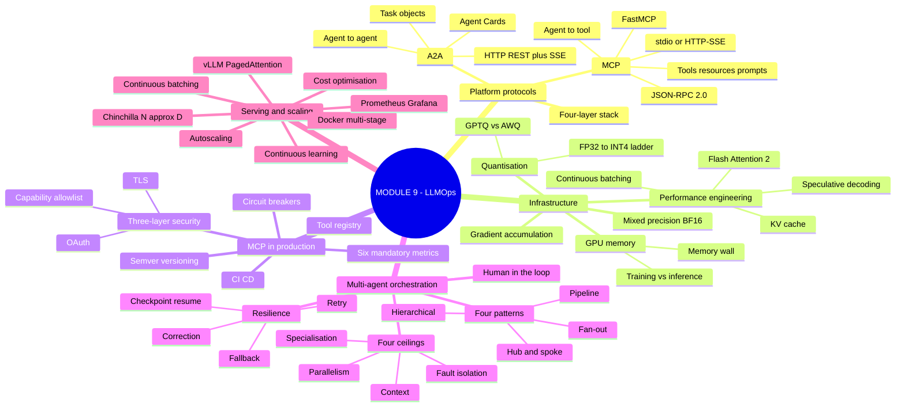
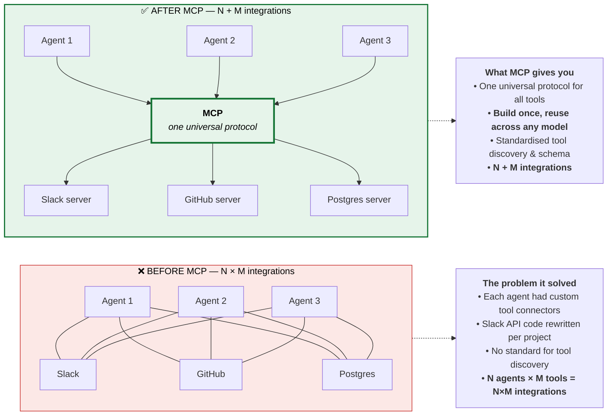
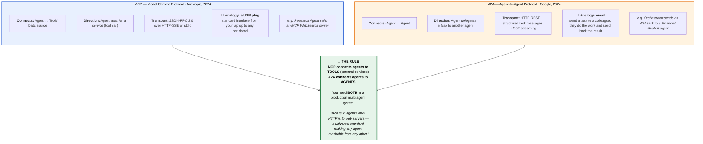
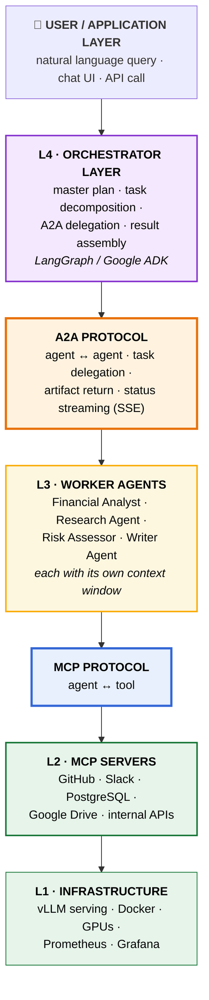
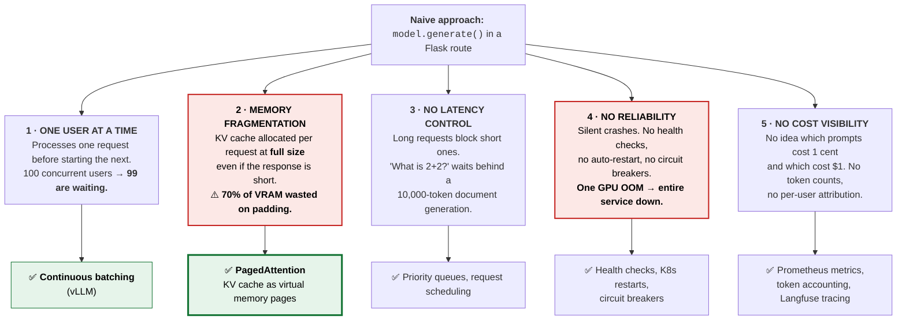
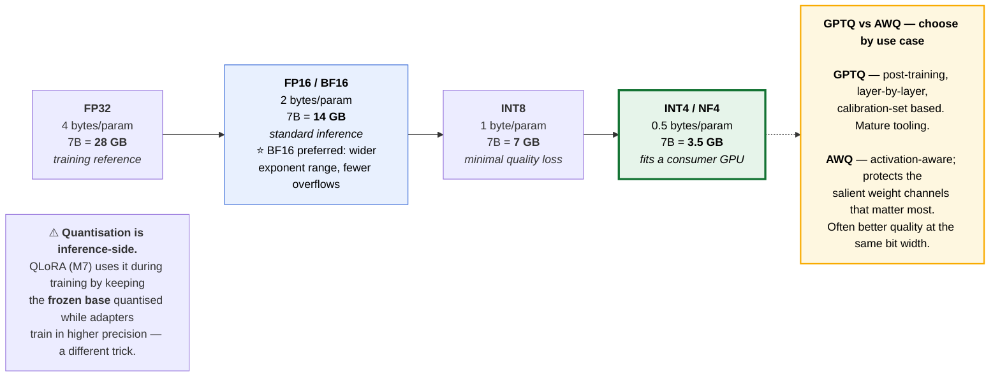
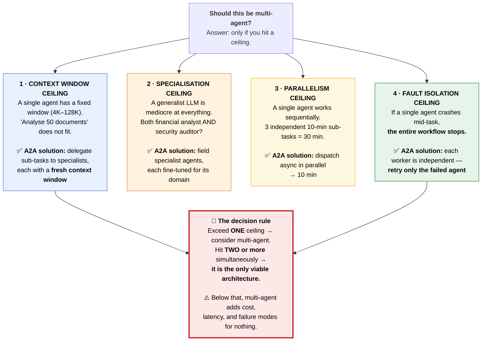
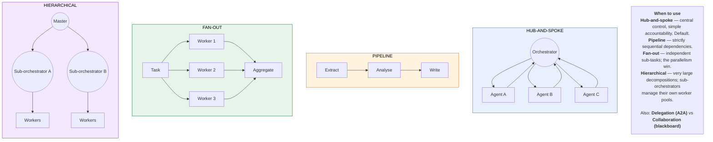
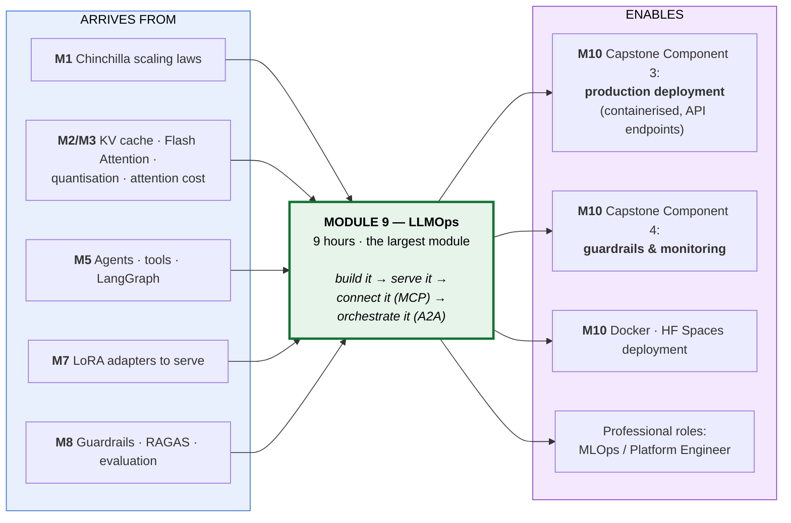

# Module 9 — LLMOps: Infrastructure, MCP, A2A & Production Serving · Study Notes

**Programme:** Advanced Certification in Agentic and Generative AI
**Institution:** IISc Bengaluru / TalentSprint · **Instructor:** Prof. Sashikumaar Ganesan
**Module duration:** 9 hours (Weeks 17–19) — **the largest single module** · **Prerequisite:** M1–M8

> **What this module is really about.** Everything so far worked *on your machine*. Module 9 asks: **does it work at 3 a.m. for 10,000 concurrent users at a cost you can defend?**
>
> The module has two distinct halves that people often conflate:
>
> | Half | Question | Protocol/tool |
> |---|---|---|
> | **Infrastructure & serving** | How do I run a model **fast and cheap**? | vLLM, quantisation, Docker, Prometheus |
> | **Multi-agent platform** | How do agents **talk to tools and to each other**? | **MCP** and **A2A** |
>
> ### 🔑 The one line to remember
> **MCP connects agents to tools. A2A connects agents to agents. You need both.**

---

## Table of Contents

1. [Module map](#0-module-map)
2. [🗺️ Visual atlas](#-visual-atlas--mind-map--correlation-diagrams)
3. **9.1 Multi-Agent Platform Overview (Part A)**
   - [9.1.1 The N×M tool integration problem](#911--the-nm-tool-integration-problem)
   - [9.1.2 MCP architecture](#912--mcp-architecture)
   - [9.1.3 MCP vs A2A](#913--mcp-vs-a2a)
   - [9.1.4 The 4-layer platform stack](#914--the-4-layer-multi-agent-platform-stack)
4. **9.2 Infrastructure and Scale (Part B)**
   - [9.2.1 LLM Infrastructure Requirements](#921--llm-infrastructure-requirements)
   - [9.2.2 Quantisation & Compression](#922--quantisation--compression)
   - [9.2.3 Performance Engineering](#923--performance-engineering)
   - [9.2.4 Mixed Precision Training](#924--mixed-precision-training)
   - [9.2.5 Gradient Accumulation](#925--gradient-accumulation)
5. **9.5 MCP in Production (Part C)**
   - [9.5.1 FastMCP & transports](#951--fastmcp--transport-modes)
   - [9.5.2 Server lifecycle & tool registry](#952--server-lifecycle--tool-registry)
   - [9.5.3 The 3-layer security model](#953--the-3-layer-security-model)
   - [9.5.4 Observability & CI/CD](#954--observability--cicd)
6. **9.6 A2A & Multi-Agent Orchestration (Part D)**
   - [9.6.1 Why multi-agent — the four ceilings](#961--why-multi-agent--the-four-ceilings)
   - [9.6.2 Task objects & Agent Cards](#962--task-objects--agent-cards)
   - [9.6.3 The four coordination patterns](#963--the-four-coordination-patterns)
   - [9.6.4 Resilience & failure handling](#964--resilience--failure-handling)
   - [9.6.5 Framework landscape](#965--framework-landscape)
7. **9.3–9.4 Serving, Deployment & Scaling Laws (Part E)**
   - [9.7.1 Why LLM serving is hard](#971--why-llm-serving-is-hard)
   - [9.7.2 The tooling landscape](#972--the-tooling-landscape)
   - [9.7.3 Docker & horizontal scaling](#973--docker--horizontal-scaling)
   - [9.7.4 Observability stack](#974--the-observability-stack)
   - [9.7.5 Scaling laws for practitioners](#975--scaling-laws-for-practitioners)
   - [9.7.6 Cost optimisation](#976--cost-optimisation)
   - [9.7.7 Continuous learning](#977--continuous-learning)
8. [Assignment & Mini-Project 4](#assignment--mini-project-4)
9. [Master list of misconceptions](#master-list-of-misconceptions)
10. [Glossary](#glossary)
11. [References](#references-and-further-study)
12. [Self-check question bank](#self-check-question-bank)

---

## 0. Module map

| File | Content |
|---|---|
| `PartA-MCP-A2A-Platform.pdf` | **9.1** Multi-agent platform with MCP & A2A — overview |
| `PartB-a-Infrastructure-Scale.pdf` | **9.2** Infrastructure & Scale (75 min, 6 concepts C7–C12) |
| `PartC-MCP-Production.pdf` | **9.5** MCP deep dive & production operations (Lecture 2) |
| `PartD-A2A-MultiAgent.pdf` | **9.6** A2A deep dive & multi-agent orchestration (Lecture 3) |
| `PartE-Serving-ScalingLaws.pdf` | **9.3–9.4** Serving, deployment & scaling laws (Lecture 4) |
| `agent-demo.pdf` | Agent demonstration walkthrough |
| `01-Probability-Token-Prediction.pdf` | M1 recap deck |
| `M9-AST-01-LLMOps.ipynb` | **Graded assignment** |
| `Implement-Tracing-using-Langfuse.ipynb` | ⭐ Observability lab |
| `Implement-RAG-Evaluation-using-RAGAS.ipynb` | ⭐ RAG evaluation lab |
| `GitHub-Codespace-Langfuse-Files.zip` | Langfuse environment |
| `MP4-NB-AI-Powered-Airline-Customer-Support-System.ipynb` | **Mini-Project 4** |
| `ReadMe---Mini-Project-4.pdf` | MP4 brief |

### The module's own journey framing

> **L2** MCP Deep Dive → **L3** A2A & Multi-Agent → **L4** Serving & Scaling
>
> *"After Lecture 4 you have the complete Module 9 picture: **build it → serve it (L4) → connect it to agents via MCP (L2) → orchestrate them via A2A (L3)**."*

---

# 🗺️ Visual atlas — mind map & correlation diagrams

## A. Module 9 mind map



## B. ⭐ The N×M problem — why MCP exists



## C. ⭐ MCP vs A2A — the distinction students get wrong



## D. The four-layer multi-agent platform stack



## E. ⭐ Why LLM serving is hard — five failure modes



## F. The quantisation ladder



## G. ⭐ The four ceilings — when you actually need multi-agent



## H. The four coordination patterns



## I. ⭐ Master correlation — M9 pulls everything together



---

# 9.1 Multi-Agent Platform Overview (Part A)

## 9.1.1 — The N×M tool integration problem

> **Before MCP:** each agent had **custom tool connectors**. Slack API code was rewritten per project. There was **no standard for tool discovery**. **N agents × M tools = N×M integrations.**
>
> **After MCP:** one universal protocol. **Build once, reuse across any model.** Standardised discovery and schema. **N + M integrations.**

### What a multi-agent platform is

> A system where **multiple specialised AI agents**, each with their own context and tools, **collaborate under an orchestrator**.

| Capability | Single agent | Multi-agent platform |
|---|---|---|
| **Context window** | Hard limit — one model | **Distributed across agents** |
| **Specialisation** | Generalist only | **Specialist per domain** |
| **Parallelism** | Sequential | **Concurrent** |
| **Fault isolation** | All-or-nothing | **Per-agent retry** |

---

## 9.1.2 — MCP architecture

> **Model Context Protocol** — Anthropic, 2024 · **JSON-RPC 2.0** over **HTTP-SSE or stdio** · standardised since late 2024.

```
MCP CLIENT — the LLM application (Claude, GPT-4o, Gemini)
             connects to servers, invokes tools, reads resources
                              ↕
PROTOCOL LAYER — JSON-RPC 2.0 · capability negotiation · sampling · logging
                              ↕
MCP SERVER(S) — expose tools() · resources() · prompts()
                GitHub, Slack, PostgreSQL, Google Drive, custom internal APIs
```

### The three primitives

> **Every MCP server is composed from these building blocks** — and every open-source server (GitHub, Slack, Postgres…) implements them.

| Primitive | What | Examples | Semantics |
|---|---|---|---|
| ⚙️ **TOOLS** | Executable functions the model can call | `search_database(query)` · `send_email(to, subject, body)` · `create_github_issue(title, labels)` | **Model decides when** → server executes → result returned to context |
| 📄 **RESOURCES** | Read-only data sources | `file:///docs/api-spec.md` · `db://users/schema` · `https://internal-wiki/page` | **Passive injection · no side effects · cached by client** |
| 📝 **PROMPTS** | Reusable prompt templates exposed by the server | `summarize_ticket(ticket_id)` · `explain_code(language)` · `draft_reply(thread_id)` | Standardise workflows · version-controlled · **cross-agent reuse** |

> ⭐ **The `resources` vs `tools` distinction matters for security:** resources have **no side effects**. If your integration only reads, expose it as a resource — you have then made a whole class of attacks impossible.
>
> *(Part C also references two further primitives — **roots** and **sampling** — making five in the full spec.)*

---

## 9.1.3 — MCP vs A2A

> **A2A** (Google, 2024) is an open protocol enabling agents built on **different frameworks** (LangGraph, ADK, Agents SDK) to **discover, delegate to, and receive results from** one another.

| Dimension | **MCP** | **A2A** |
|---|---|---|
| **Connects** | Agent ↔ **Tool / data source** | Agent ↔ **Agent** |
| **Direction** | Agent **asks for a service** (tool call) | Agent **delegates a task** |
| **Transport** | JSON-RPC 2.0 over HTTP-SSE or stdio | HTTP REST + structured task messages + SSE streaming |
| **Analogy** | 🔌 **USB plug** — standard interface to any peripheral | 📧 **Email** — send a task to a colleague, get the result back |
| **Example** | Research Agent calls an MCP WebSearch server | Orchestrator sends a task to a Financial Analyst agent |

**Without A2A:** a LangGraph orchestrator can only call agents it **directly imports**. A Google ADK agent **cannot delegate to an AutoGen agent** — no shared standard.

**With A2A:** any orchestrator can delegate to any worker agent over a standard HTTP message.

> ### 🔑 *"A2A is to agents what HTTP is to web servers."*

---

## 9.1.4 — The 4-layer multi-agent platform stack

| Layer | Contents |
|---|---|
| **L4 · Orchestrator** | Master plan · task decomposition · A2A delegation · result assembly |
| **L3 · Worker agents** | Financial Analyst · Research · Risk Assessor · Writer — each with its own context |
| **L2 · MCP servers** | Tool and data access |
| **L1 · Infrastructure** | vLLM · Docker · GPUs · Prometheus · Grafana |

---

# 9.2 Infrastructure and Scale (Part B)

> **Sub-Module 9.2** · 75 min · Bloom **B2–B3** · Difficulty **L3** · **6 concepts (C7–C12)**

**Concept flow:** C7 Infrastructure Requirements → C8 Quantisation & Compression → C9 Performance Engineering → C10 Mixed Precision → C11 Gradient Accumulation → **C12 Training Infrastructure (lab)**

## 9.2.1 — LLM Infrastructure Requirements

**Topics:** hardware landscape · GPU memory · interconnects · **the memory wall**.

### Training vs inference memory — the asymmetry that surprises people

| | Memory needed |
|---|---|
| **Inference** | Weights + KV cache |
| **Training** | Weights + **gradients** + **optimizer states** (Adam: 2 extra copies) + activations |

> ⚠️ **Training a 7B model in FP32 with Adam needs roughly 4× the weight memory before you count activations.** This is why full fine-tuning is so much more expensive than inference — and why PEFT (M7) exists.

**The memory wall:** GPU compute has grown far faster than memory bandwidth. Modern LLM inference is **memory-bandwidth-bound, not compute-bound** — which is why quantisation (fewer bytes moved) speeds things up even when arithmetic is unchanged.

**Interconnects:** NVLink (intra-node) vs PCIe vs InfiniBand (inter-node) — the constraint on multi-GPU scaling.

---

## 9.2.2 — Quantisation & Compression

### The precision ladder

| Precision | Bytes/param | 7B model | Notes |
|---|---|---|---|
| **FP32** | 4 | **28 GB** | Training reference |
| **FP16 / BF16** | 2 | **14 GB** | Standard inference. ⭐ **BF16 preferred** — wider exponent range, fewer overflows |
| **INT8** | 1 | **7 GB** | Minimal quality loss |
| **INT4 / NF4** | 0.5 | **3.5 GB** | Fits a consumer GPU |

### GPTQ vs AWQ

| | **GPTQ** | **AWQ** |
|---|---|---|
| Method | Post-training, **layer-by-layer**, calibration-set based | **Activation-aware** — protects salient weight channels |
| Strength | Mature tooling, widely supported | Often **better quality at the same bit width** |

> **Selection is by use case**, per the learning objective — not a universal winner.

---

## 9.2.3 — Performance Engineering

> Four techniques, each with a known speedup factor.

| Technique | What it does | Where you met it |
|---|---|---|
| **KV cache** | Reuse past keys/values across generation steps — $O(n^2) \to O(n)$ per new token | **M2 §2.2.2, M3** |
| **Flash Attention 2** | Tiled recomputation → attention memory $O(n^2) \to O(n)$ | **M2 §2.2.2** |
| **Speculative decoding** | A small draft model proposes tokens; the large model **verifies several at once** | **M1 §1.2.3** |
| **Continuous batching** | New requests join the batch **as slots free up**, rather than waiting for the whole batch to finish | **New here** |

> ⭐ **Continuous batching is the single biggest throughput win in serving** — and the reason vLLM exists. Static batching wastes the GPU whenever one sequence in the batch finishes early.

---

## 9.2.4 — Mixed Precision Training

**Automatic Mixed Precision (AMP) with BF16:** keep a master copy of weights in FP32, run forward/backward in BF16, with loss scaling to prevent gradient underflow.

**Result:** roughly **halved activation memory** and faster matmuls on tensor cores, with negligible quality impact. The learning objective asks you to **quantify the saving on a 7B model**.

> **Why BF16 over FP16:** BF16 has the **same exponent range as FP32** (8 bits) with fewer mantissa bits. It trades precision for range — and range is what prevents training-destroying overflows.

---

## 9.2.5 — Gradient Accumulation

> **The problem:** you want an effective batch size of 256, but only 8 samples fit in VRAM.

**The technique:** run 32 micro-batches of 8, **accumulate gradients without stepping the optimiser**, then step once.

$$\text{effective batch} = \text{micro-batch} \times \text{accumulation steps}$$

**Trade-off:** identical gradient to a large batch, but **32× the wall-clock time** for that step. You are buying batch size with time rather than memory.

**C12 (lab):** set up a complete **QLoRA fine-tuning environment** with experiment tracking and checkpoint saving — tying M7's PEFT to M9's infrastructure.

---

# 9.5 MCP in Production (Part C)

> *"Knowing the protocol ≠ running it reliably for real users."*

### The gap that kills projects

| Missing | Consequence |
|---|---|
| **No health checks** | **Silent failures nobody knows about** |
| **No versioning** | A tool schema change **breaks all agents overnight** |
| **No security model** | **Any agent can call any tool on any data** |
| **No metrics** | You can't tell if it's slow, expensive, or wrong |

## 9.5.1 — FastMCP & transport modes

**FastMCP internals — the tool lifecycle:**

$$\text{decorator} \to \text{auto-schema generation} \to \textbf{REGISTER} \to \textbf{SCHEMA GEN} \to \textbf{DISCOVER} \to \textbf{INVOKE}$$

### Transport selection

| | **stdio** | **HTTP-SSE** |
|---|---|---|
| Use when | Local process, desktop client, single-user | **Networked, multi-client, production** |
| Deployment | Subprocess | Containerised service |

**A production MCP server needs:** tools · a **manifest** · a **health endpoint** · **Prometheus metrics**.

---

## 9.5.2 — Server lifecycle & tool registry

**Lifecycle states:** `STARTING → HEALTHY → DEGRADED → SHUTDOWN`, under container orchestration.

### The tool registry pattern

| Element | Purpose |
|---|---|
| **Runtime discovery** | Agents find tools at session start, not at compile time |
| **Semver versioning** | ⭐ Prevents the "schema change breaks every agent overnight" failure |
| **Circuit breakers** | Stop calling a failing tool rather than retrying into a cascade |
| **Fallback tools** | Degrade gracefully to a lesser capability |

---

## 9.5.3 — The 3-layer security model

```
① TLS                    — transport encryption
② OAuth                  — authentication: WHO is calling
③ Capability allowlist   — authorisation: WHAT they may call
```

> ⭐ **Layer 3 is the one people skip and the one that matters most.** Without a capability allowlist, authentication only tells you *which* agent is exfiltrating your database.

The lecture also **traces a prompt injection attack** through an MCP deployment — connecting directly to **M8 §8.3.1** (indirect injection) and **OWASP LLM08 Excessive Agency**.

---

## 9.5.4 — Observability & CI/CD

**The six mandatory metrics** *(the deck specifies six; typical LLM-serving set)*: request rate · latency (p50/p95/p99) · error rate · token throughput · cost per request · tool invocation counts.

**CI/CD for MCP servers:** schema-compatibility tests, contract tests against consuming agents, staged rollout.

### Ecosystem decision

> **When to reuse reference servers vs build internal wrappers for proprietary data.** Reuse GitHub/Slack/Postgres servers; wrap your own internal APIs.

---

# 9.6 A2A & Multi-Agent Orchestration (Part D)

## 9.6.1 — Why multi-agent — the four ceilings

*(Full detail in Diagram G.)*

| Ceiling | Problem | A2A solution |
|---|---|---|
| **1 · Context window** | Fixed 4K–128K; "analyse 50 documents" doesn't fit | Delegate to specialists, **each with a fresh window** |
| **2 · Specialisation** | A generalist is mediocre at everything | Field **fine-tuned specialists** per domain |
| **3 · Parallelism** | Sequential: 3 × 10-min tasks = 30 min | **Async dispatch → 10 min** |
| **4 · Fault isolation** | One crash halts the entire workflow | Each worker independent — **retry only the failed one** |

> ### 🔑 The decision rule
> **Exceed one ceiling → consider multi-agent. Hit two or more → it is the only viable architecture.**
>
> Below that threshold, multi-agent adds cost, latency, and failure modes for no benefit. *This is the most useful architectural guardrail in the module.*

---

## 9.6.2 — Task objects & Agent Cards

### The A2A task object

Fields: **`id`** · **`status`** · **`artifacts`** · **`metadata`**.

**Two modes:** **synchronous** (block for the result) vs **asynchronous with SSE streaming** (subscribe to status updates).

### Agent Cards — capability discovery

A published description of what an agent can do, enabling the **6-step capability discovery flow**:

```
Orchestrator → Registry (query capabilities) → Agent Card returned
            → Orchestrator selects worker → A2A task dispatched → artifacts returned
```

> **Agent Cards are to A2A what `tools/list` is to MCP** — the discovery mechanism that removes hard-coded coupling.

### LangGraph state graphs

Design with: **typed state** · **nodes as A2A calls** · **conditional edges** · **checkpointing**. *(Building directly on M5 §5.3.6.)*

---

## 9.6.3 — The four coordination patterns

| Pattern | Structure | Use when |
|---|---|---|
| **Hub-and-spoke** | Central orchestrator ↔ each worker | Central control, simple accountability — **the default** |
| **Pipeline** | A → B → C | Strictly **sequential dependencies** |
| **Fan-out** | One task → N workers → aggregate | **Independent sub-tasks** — this is where the parallelism win lives |
| **Hierarchical** | Master → sub-orchestrators → worker pools | **Very large decompositions** |

### Delegation vs collaboration

| **Delegation (A2A)** | **Collaboration (blackboard)** |
|---|---|
| Orchestrator assigns a task to a specific agent | Agents read/write a **shared workspace** |
| Clear ownership | Emergent coordination |

**Also covered:** task allocation mechanisms and **conflict resolution**.

---

## 9.6.4 — Resilience & failure handling

**Four failure scenarios, four responses:**

| Response | When |
|---|---|
| **Retry** | Transient failure (timeout, rate limit) |
| **Correction** | Output failed validation — send back with feedback |
| **Fallback** | Worker unavailable — degrade to a lesser agent or cached result |
| **Checkpoint-resume** | Long workflow interrupted — **resume from the last checkpoint**, preserving completed work |

> ⭐ **Checkpoint-resume is the multi-agent analogue of M5's plan repair** — don't throw away work that succeeded.

### Emergent behaviours

**Positive:** unexpected effective task divisions, useful specialisation.
⚠️ **Negative:** loops between agents, responsibility diffusion, cost explosions, mutual hallucination reinforcement.

**Mitigation: human-in-the-loop design patterns** — approval gates on irreversible actions, budget caps, escalation paths.

---

## 9.6.5 — Framework landscape

| Framework | Model | Best for |
|---|---|---|
| **LangGraph** | Explicit **state graph** — nodes, conditional edges, cycles, persistence | ⭐ Branching, checkpointing, durable workflows |
| **AutoGen** | **Conversation patterns** | Multi-agent dialogue |
| **CrewAI** | **Role-based crews** | Quick role/task orchestration |
| **Google ADK** | Agent Development Kit, A2A-native | Google ecosystem |
| **OpenAI Agents SDK** | Lightweight handoffs | OpenAI ecosystem |

---

# 9.3–9.4 Serving, Deployment & Scaling Laws (Part E)

## 9.7.1 — Why LLM serving is hard

> **LLM serving:** running a trained LLM as a **network service** that accepts requests, generates tokens, and returns results — **reliably, cheaply, at scale**.

*(The five failure modes are in Diagram E.)*

## 9.7.2 — The tooling landscape

> Beginners encounter many names and conflate them. Here is what each **actually is**:

| Tool | What it actually is |
|---|---|
| ⚡ **vLLM** | **Inference engine.** NOT a company — a **UC Berkeley research project**, now widely adopted. Provides **PagedAttention** and **continuous batching** |
| 🌐 **FastAPI** | **Web framework** — general Python REST, **not LLM-specific** |
| 🤗 **HuggingFace Transformers** | **Model library** — the standard for accessing open-weight models |
| 🐳 **Docker** | **Container runtime** — packages app + dependencies, **not LLM-specific** |
| 📊 **Prometheus + Grafana** | **Observability stack** — metrics collector + dashboard visualiser |
| 🧪 **ClearML** | **ML experiment tracker** — training runs, model versions, deployments |

> ### 🔑 How they compose in production
> **vLLM handles the inference · Docker packages it · FastAPI adds business logic · Prometheus observes it · ClearML tracks it.**

### PagedAttention

Manages the KV cache as **virtual memory pages** rather than contiguous per-request allocations — directly attacking failure mode 2 (**70% VRAM wasted on padding**).

---

## 9.7.3 — Docker & horizontal scaling

**LLM-specific Docker deployment:**
- **Multi-stage build** — keep the runtime image small
- **CUDA base image** — matched to your driver version
- **Health check** — so orchestrators can restart on failure
- ⭐ **Volume-mounted weights** — never bake multi-GB weights into the image

**Horizontal scaling:** load balancing with **nginx** or **Traefik**; **autoscaling triggers** on queue depth, GPU utilisation, or p95 latency.

> ⚠️ **LLM autoscaling is slower than web autoscaling** — a new replica must load tens of GB of weights before serving. Scale on **leading indicators** (queue depth), not lagging ones (latency).

---

## 9.7.4 — The observability stack

$$\textbf{Prometheus metrics} \to \textbf{Grafana dashboards} \to \textbf{ClearML experiment tracking}$$

Plus, from the labs: **Langfuse** for **LLM-specific tracing** (prompt, completion, token counts, cost, latency, per-span) and **RAGAS** for **RAG quality** (faithfulness, answer relevance, context precision/recall).

> ⭐ **This is the concrete answer to M8 §8.6.2's warning** that standard infrastructure monitoring cannot detect hallucinations. Prometheus tells you the service is *up*; **RAGAS tells you the answers are *grounded***. You need both.

---

## 9.7.5 — Scaling laws for practitioners

> **A scaling law** is a mathematical relationship between model size ($N$), training data ($D$), compute ($C$), and quality.

### Three things scaling laws tell you

| Finding | Source | Limitation |
|---|---|---|
| **Bigger models = better quality** | Kaplan et al., 2020 (GPT-3 era) | ⚠️ **Ignored the data side. GPT-3 was severely undertrained** |
| **Data matters as much as model size** — for a fixed budget, balance $N$ and $D$ (**$N \approx D$**) | **Chinchilla**, Hoffmann et al., 2022 | ⚠️ **Compute-optimal is optimal for TRAINING cost, not SERVING cost.** Inference-optimal is a separate calculation |
| **You can predict exact training cost** — $C \approx 6ND$ | Chinchilla + FLOPs formula | ⚠️ The 6× coefficient is approximate and architecture-dependent. **A planning estimate, not an invoice** |

**Worked example:** given an **A100 at 312 TFLOPS**, compute A100-hours and dollar cost for a 7B training run.

> ### 🔑 The practitioner's framing from the deck
> *"You will not pre-train a frontier model. But you **WILL** choose between model sizes, negotiate training budgets, and decide when self-hosting beats an API."*

> ⭐ **The inference-optimal caveat is the genuinely new idea here.** Chinchilla optimises training cost. If you will serve a model billions of times, you should **overtrain a smaller model** past the Chinchilla point — trading training cost for permanently lower serving cost. This is why Llama-3-8B saw 15T tokens.

---

## 9.7.6 — Cost optimisation

**The decision tree:**

| Lever | Action |
|---|---|
| **Model selection** | Smallest model that passes your evals — see the tiered routing from M5 §5.1.7 |
| **Quantisation** | INT8/INT4 — fewer bytes moved, cheaper hardware |
| **Semantic caching** | ⭐ Cache by **embedding similarity**, not exact string match — catches paraphrased repeats |
| **Tiered routing** | Big model plans, small model executes (M5) |
| **Prompt caching** | Provider-level, 50–90% saving on repeated prefixes (M3 §3.1.6) |

---

## 9.7.7 — Continuous learning

$$\textbf{drift detection} \to \textbf{data collection} \to \textbf{incremental LoRA} \to \textbf{blue-green deployment}$$

| Stage | Detail |
|---|---|
| **Drift detection** | Input distribution or quality metrics moving away from baseline |
| **Data collection** | Capture production traces — with consent and PII scrubbing (**M8 §8.5.1**) |
| **Incremental LoRA** | ⭐ Cheap adapter retraining rather than full fine-tuning (**M7 §7.2**) |
| **Blue-green deployment** | Run old and new side by side; shift traffic gradually; **roll back instantly** |

> ⭐ **This closes the loop of the entire programme.** Production data feeds fine-tuning; fine-tuning produces a new adapter; the adapter is deployed safely; monitoring detects the next drift. M7, M8 and M9 become one cycle.

---

## Assignment & Mini-Project 4

| Item | Detail |
|---|---|
| **`M9-AST-01-LLMOps.ipynb`** | **Graded assignment** |
| ⭐ **`Implement-Tracing-using-Langfuse.ipynb`** | LLM observability lab (+ `GitHub-Codespace-Langfuse-Files.zip`) |
| ⭐ **`Implement-RAG-Evaluation-using-RAGAS.ipynb`** | RAG quality lab |
| **Mini-Project 4: AI-Powered Airline Customer Support System** | **Graded team activity — 10 points.** Released **6 Jun 2026**; sessions **7 Jun** and **14 Jun 2026**, 9:00 am–12:30 pm |
| `agent-demo.pdf` | Agent demonstration walkthrough |

> 💡 **MP4 is a team project and it is worth 10 points — the largest single graded item before the capstone.** An airline support system is the ideal M9 exercise: it needs tools (MCP), specialists (A2A), guardrails (M8), serving (vLLM), and observability (Langfuse) all at once.

---

## Master list of misconceptions

| ❌ Myth | ✅ Reality |
|---|---|
| "MCP and A2A do similar things" | ⭐ **MCP = agent↔tool. A2A = agent↔agent.** Completely different problems. **You need both** |
| "MCP is just a tool-calling API" | It solves **N×M → N+M** integration explosion via a universal protocol with standardised discovery |
| "MCP servers only expose tools" | **Three primitives: tools, resources, prompts** (five with roots and sampling). **Resources have no side effects** |
| "Knowing the MCP protocol means you can run it" | ⚠️ *"Knowing the protocol ≠ running it reliably."* Without health checks, versioning, security, and metrics, projects die |
| "Tool schema changes are backwards compatible" | ⚠️ **A schema change breaks all agents overnight.** Use **semver** and a tool registry |
| "TLS + OAuth is enough security" | ⭐ You still need a **capability allowlist**. Auth tells you *who* is calling, not *what they may call* |
| "Multi-agent is the modern architecture" | ⚠️ Only justified when you **hit one of four ceilings**. Two or more → it's the only option. Below that it adds pure cost |
| "More agents means more capability" | Emergent negatives: **inter-agent loops, responsibility diffusion, cost explosions, mutual hallucination reinforcement** |
| "vLLM is a company / a model" | It is an **inference engine** — a UC Berkeley research project |
| "FastAPI is an LLM serving framework" | It's a **general web framework**. vLLM does inference; FastAPI adds business logic |
| "`model.generate()` in Flask is a serving stack" | Five failure modes: one-at-a-time, **70% VRAM wasted**, no latency control, no reliability, no cost visibility |
| "Batching means waiting for a full batch" | ⭐ **Continuous batching** lets new requests join as slots free — the biggest throughput win |
| "Bake the model weights into the Docker image" | ⚠️ **Volume-mount them.** Multi-GB images are slow to pull and impossible to iterate |
| "Autoscale LLMs on latency like a web service" | ⚠️ A new replica must **load tens of GB** first. Scale on **leading indicators** like queue depth |
| "Quantisation only saves memory" | It also **speeds inference** — modern LLM serving is **memory-bandwidth-bound**, so moving fewer bytes is faster |
| "FP16 and BF16 are interchangeable" | ⭐ **BF16 has FP32's exponent range** — fewer overflows. Preferred for training |
| "Gradient accumulation saves compute" | It saves **memory**, at the cost of **wall-clock time**. Same gradient, more steps |
| "Chinchilla tells you the best model to deploy" | ⚠️ **Compute-optimal is optimal for TRAINING cost, not SERVING cost.** If you serve billions of times, **overtrain a smaller model** |
| "C ≈ 6ND gives you your bill" | The 6× coefficient is **approximate and architecture-dependent** — a planning estimate |
| "Prometheus will tell me if the model is hallucinating" | ⚠️ **It cannot.** You need **RAGAS/Langfuse-level semantic tracing** (M8 §8.6.2) |
| "Exact-match caching is enough" | ⭐ **Semantic caching** on embedding similarity catches paraphrased repeats |
| "Retraining means a full fine-tune" | **Incremental LoRA** + **blue-green deployment** is the production loop |

---

## Glossary

| Term | Definition |
|---|---|
| **A2A** | Agent-to-Agent Protocol (Google, 2024) — agent ↔ agent delegation |
| **Agent Card** | Published capability description enabling A2A discovery |
| **AMP** | Automatic Mixed Precision |
| **AWQ** | Activation-aware Weight Quantisation |
| **BF16** | Brain Float 16 — FP32 exponent range, reduced mantissa |
| **Blue-green deployment** | Run old and new versions side by side; shift traffic gradually |
| **Capability allowlist** | Authorisation layer restricting which tools an agent may call |
| **Circuit breaker** | Stop calling a failing dependency to prevent cascade |
| **ClearML** | ML experiment and model lifecycle tracker |
| **Continuous batching** | New requests join the running batch as slots free |
| **Fan-out** | Coordination pattern: one task → N parallel workers → aggregate |
| **FastMCP** | Python framework for building MCP servers via decorators |
| **Flash Attention 2** | Memory-efficient tiled attention |
| **GPTQ** | Post-training layer-by-layer quantisation |
| **Gradient accumulation** | Accumulate gradients over micro-batches before stepping |
| **Hub-and-spoke** | Central orchestrator coordinating workers — the default pattern |
| **JSON-RPC 2.0** | MCP's message format |
| **Langfuse** | LLM-specific tracing and observability |
| **MCP** | Model Context Protocol (Anthropic, 2024) — agent ↔ tool |
| **Memory wall** | Compute growing faster than memory bandwidth |
| **PagedAttention** | KV cache managed as virtual memory pages (vLLM) |
| **Prompts (MCP primitive)** | Reusable, version-controlled prompt templates from a server |
| **RAGAS** | RAG evaluation: faithfulness, relevance, context precision/recall |
| **Resources (MCP primitive)** | Read-only data sources, no side effects |
| **Semantic caching** | Cache keyed on embedding similarity, not exact string |
| **Semver** | Semantic versioning — critical for tool schema stability |
| **Speculative decoding** | Draft model proposes, large model verifies in parallel |
| **SSE** | Server-Sent Events — streaming transport for MCP and A2A |
| **stdio transport** | MCP over standard input/output for local processes |
| **Task object** | A2A unit of work: id, status, artifacts, metadata |
| **Tool registry** | Runtime tool discovery with versioning and fallbacks |
| **vLLM** | Open-source inference engine (UC Berkeley) |

---

## References and further study

### 📕 Books

| Book | For Module 9 |
|---|---|
| ⭐ **LLM Engineer's Handbook** — Iusztin & Labonne | The course's designated M9 reference — **LLMOps, monitoring, deployment** |
| **AI Engineering** — Chip Huyen | Production serving, cost, evaluation |

### 🔗 Essential online resources

| Resource | Link | For |
|---|---|---|
| ⭐ **How to Scale Your Model** | [jax-ml.github.io/scaling-book](https://jax-ml.github.io/scaling-book/) | **The reading list calls this "the single most important systems-level online resource for M9"** — roofline analysis, GPU internals, transformer math, sharding |
| ⭐ **The Ultra-Scale Playbook** | [huggingface.co/spaces/nanotron/ultrascale-playbook](https://huggingface.co/spaces/nanotron/ultrascale-playbook) | Data/tensor/pipeline parallelism, ZeRO |
| ⭐ **Model Context Protocol** | [modelcontextprotocol.io](https://modelcontextprotocol.io/) | **9.1, 9.5 — the spec** |
| ⭐ **A2A Protocol** | [google.github.io/A2A](https://google.github.io/A2A/) | **9.6 — the spec** |
| **FastMCP** | [github.com/jlowin/fastmcp](https://github.com/jlowin/fastmcp) | 9.5.1 |
| ⭐ **vLLM docs** | [docs.vllm.ai](https://docs.vllm.ai/) | 9.7 |
| **LangGraph** | [langchain-ai.github.io/langgraph](https://langchain-ai.github.io/langgraph/) | 9.6.2 |
| **Langfuse** | [langfuse.com/docs](https://langfuse.com/docs) | ⭐ Tracing lab |
| **RAGAS** | [docs.ragas.io](https://docs.ragas.io/) | ⭐ Evaluation lab |
| **Prometheus** / **Grafana** | [prometheus.io](https://prometheus.io/) · [grafana.com](https://grafana.com/) | 9.7.4 |
| **LLM Course** — mlabonne | [github.com/mlabonne/llm-course](https://github.com/mlabonne/llm-course) | Quantisation, deployment |

### 📄 Papers

| Paper | Link | Section |
|---|---|---|
| ⭐ **Efficient Memory Management for LLM Serving (PagedAttention / vLLM)** — Kwon 2023 | [arXiv:2309.06180](https://arxiv.org/abs/2309.06180) | **9.7.2** |
| **FlashAttention-2** — Dao 2023 | [arXiv:2307.08691](https://arxiv.org/abs/2307.08691) | 9.2.3 |
| **Speculative Decoding** — Leviathan 2023 | [arXiv:2211.17192](https://arxiv.org/abs/2211.17192) | 9.2.3 |
| **GPTQ** — Frantar 2022 | [arXiv:2210.17323](https://arxiv.org/abs/2210.17323) | 9.2.2 |
| **AWQ** — Lin 2023 | [arXiv:2306.00978](https://arxiv.org/abs/2306.00978) | 9.2.2 |
| ⭐ **Chinchilla** — Hoffmann 2022 | [arXiv:2203.15556](https://arxiv.org/abs/2203.15556) | **9.7.5** |
| **Kaplan Scaling Laws** — 2020 | [arXiv:2001.08361](https://arxiv.org/abs/2001.08361) | 9.7.5 |
| **ZeRO** — Rajbhandari 2019 | [arXiv:1910.02054](https://arxiv.org/abs/1910.02054) | 9.2 |
| **Mixed Precision Training** — Micikevicius 2017 | [arXiv:1710.03740](https://arxiv.org/abs/1710.03740) | 9.2.4 |

### 📌 Study strategy for Weeks 17–19

1. ⭐ **Build one MCP server before the lectures.** FastMCP + three tools takes under an hour. Everything in Part C is then about *operating* something you already understand
2. **Serve a small model with vLLM and hammer it** with 50 concurrent requests. Then do the same with naive `model.generate()`. The continuous-batching argument becomes visceral
3. **Run the Langfuse lab early** and wire it into your M5 agent. Seeing per-span cost changes how you design agents
4. **Do the RAGAS lab against your M5 RAG pipeline** and find a genuinely ungrounded answer
5. **Work the FLOPs cost example by hand** — $C \approx 6ND$, A100 at 312 TFLOPS. It's the calculation you'll be asked for in any real budget conversation
6. **Read "How to Scale Your Model"** — the reading list singles it out for M9 and it is worth the time
7. **Prepare for MP4 before 6 June.** It's a 10-point team activity and needs M5 + M8 + M9 working together

---

## Self-check question bank

### 9.1 Platform & protocols
1. State the N×M problem and what MCP reduces it to.
2. What transport and message format does MCP use?
3. Name MCP's three primitives and what distinguishes resources from tools.
4. Why does the tools/resources distinction matter for security?
5. State the one-line rule separating MCP from A2A.
6. Give the analogy for each protocol.
7. What can't a LangGraph orchestrator do without A2A?
8. Name the four layers of the multi-agent platform stack.

### 9.2 Infrastructure
9. Why does training need far more memory than inference? Name the components.
10. What is the memory wall, and why does it make quantisation a *speed* optimisation?
11. Give the precision ladder with bytes/param and 7B sizes for all four levels.
12. Contrast GPTQ and AWQ.
13. Name the four performance engineering techniques and what each fixes.
14. Which one is new in M9, and why is it the biggest serving win?
15. Why is BF16 preferred over FP16 for training?
16. What does gradient accumulation buy, and what does it cost?

### 9.5 MCP in production
17. Name the four "gaps that kill projects."
18. Write the FastMCP tool lifecycle.
19. When would you choose stdio over HTTP-SSE?
20. Name the four MCP server lifecycle states.
21. What four elements make up the tool registry pattern?
22. Name the three security layers. Which is most often skipped, and why does it matter?
23. What must a production MCP server expose besides tools?

### 9.6 A2A & orchestration
24. Name the four ceilings. State the decision rule for when multi-agent is justified.
25. What fields does an A2A task object carry?
26. What is an Agent Card, and what is its MCP analogue?
27. Name the four coordination patterns and when to use each.
28. Contrast delegation with collaboration.
29. Name the four failure responses. Which is the analogue of M5's plan repair?
30. Name three negative emergent behaviours in multi-agent systems.
31. Compare LangGraph, AutoGen, CrewAI, ADK, and the OpenAI Agents SDK.

### 9.7 Serving & scaling
32. Name the five reasons naive LLM serving fails.
33. How much VRAM does KV-cache fragmentation waste?
34. What is vLLM, actually? What is FastAPI, actually?
35. How do vLLM, Docker, FastAPI, Prometheus, and ClearML compose?
36. What does PagedAttention do, and which failure mode does it fix?
37. Name four requirements of an LLM Docker deployment. Which one do people get wrong?
38. Why must LLM autoscaling use leading indicators?
39. State the Chinchilla result. State its critical limitation for practitioners.
40. Write the FLOPs formula. What caveat applies to the coefficient?
41. Why might you deliberately train *past* the Chinchilla point?
42. Name five cost-optimisation levers.
43. Why is semantic caching better than exact-match caching?
44. Write the four stages of a continuous learning system.
45. How do M7, M8, and M9 form a single loop?

---

*Study notes compiled from the Module 9 source decks. Lecture structure preserved (Parts A–E).*
*Series: [M1](../M1/M1_Study_Notes.md) · [M2](../M2/M2_Study_Notes.md) · [M3](../M3/M3_Study_Notes.md) · [M4](../M4/M4_Study_Notes.md) · [M5](../M5/M5_Study_Notes.md) · [M6](../M6/M6_Study_Notes.md) · [M7](../M7/M7_Study_Notes.md) · [M8](../M8/M8_Study_Notes.md) · **M9** · M10*
